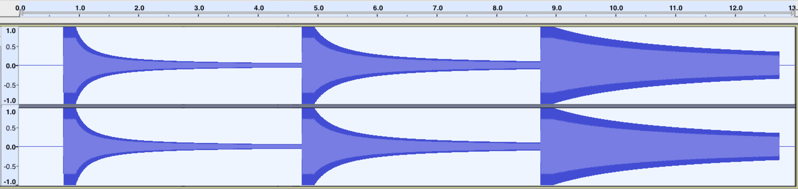

{{ APIRef("Web Audio API") }}

The <code>rolloffFactor</code> property of the {{ domxref("PannerNode") }} interface is a double value describing how quickly the volume is reduced as the source moves away from the listener. This value is used by all distance models.The <code>rolloffFactor</code> property's default value is <code>1</code>.

<h2 id="Syntax">Syntax</h2>

<pre class="brush: js">var audioCtx = new AudioContext();
var panner = audioCtx.createPanner();
panner.rolloffFactor = 1;</pre>

<h3 id="Value">Value</h3>

A number whose range depends on the {{ domxref("PannerNode.distanceModel", "distanceModel") }} of the panner as follows (negative values are not allowed):

<dl>
 <dt>"<code>linear</code>"</dt>
 <dd>
 
The range is 0 to 1.

 </dd>
 <dt>"<code>inverse</code>"</dt>
 <dd>
 
The range is 0 to <code>Infinity</code>.

 </dd>
 <dt>"<code>exponential</code>"</dt>
 <dd>
 
The range is 0 to <code>Infinity</code>.

 </dd>
</dl>

<h3 id="Exceptions">Exceptions</h3>

<dl>
 <dt><code>RangeError</code></dt>
 <dd>The property has been given a value that is outside the accepted range.</dd>
</dl>

<h2 id="Example">Example</h2>

This example demonstrates how different {{ domxref("PannerNode.rolloffFactor", "rolloffFactor") }} values affect how the volume of the test tone decreases with increasing distance from the listener:

<pre class="brush: js">const context = new AudioContext();
// all our test tones will last this many seconds
const NOTE_LENGTH = 4;
// this is how far we'll move the sound
const Z_DISTANCE = 20;

// this function creates a graph for the test tone with a given rolloffFactor
// and schedules it to move away from the listener along the Z (depth-wise) axis
// at the given start time, resulting in a decrease in volume (decay)
const scheduleTestTone = (rolloffFactor, startTime) =&gt; {
  const osc = new OscillatorNode(context);

  const panner = new PannerNode(context);
  panner.rolloffFactor = rolloffFactor;

  // set the initial Z position, then schedule the ramp
  panner.positionZ.setValueAtTime(0, startTime);
  panner.positionZ.linearRampToValueAtTime(Z_DISTANCE, startTime + NOTE_LENGTH);

  osc.connect(panner)
     .connect(context.destination);

  osc.start(startTime);
  osc.stop(startTime + NOTE_LENGTH);
};

// this tone should decay fairly quickly
scheduleTestTone(1, context.currentTime);
// this tone should decay slower than the previous one
scheduleTestTone(0.5, context.currentTime + NOTE_LENGTH);
// this tone should decay only slightly
scheduleTestTone(0.1, context.currentTime + NOTE_LENGTH * 2);</pre>

After running this code, the resulting waveforms should look something like this:

<h2 id="Specifications">Specifications</h2>

{{Specifications}}

<h2 id="Browser_compatibility">Browser compatibility</h2>

{{Compat}}

<h2 id="See_also">See also</h2>

<ul>
 <li><a href="/en-US/docs/Web/API/Web_Audio_API/Using_Web_Audio_API">Using the Web Audio API</a></li>
 <li><a href="/en-US/docs/Web/API/Web_Audio_API/Web_audio_spatialization_basics">Web Audio spatialisation basics</a></li>
</ul>
