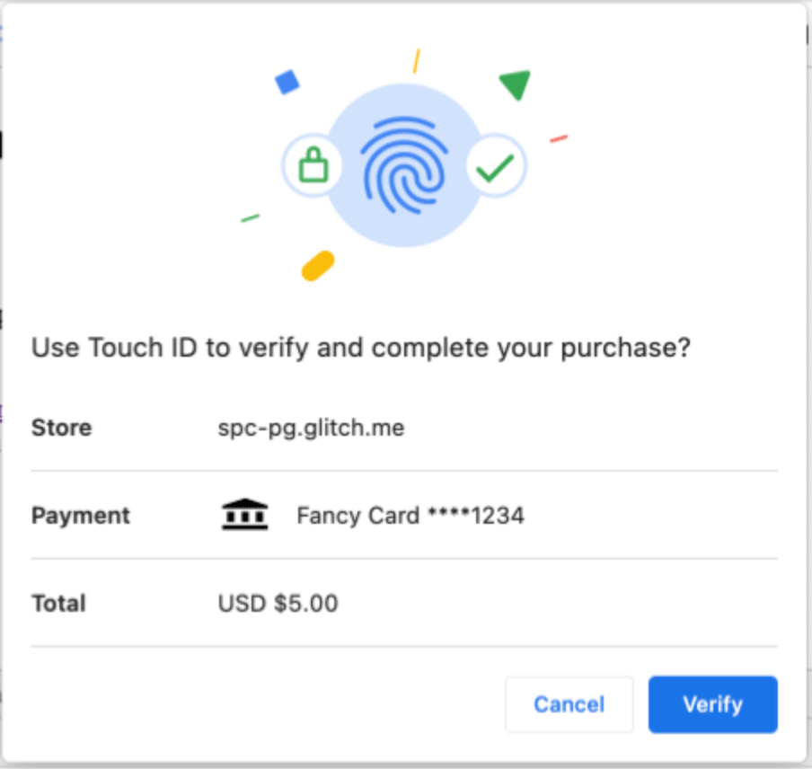

{{DefaultAPISidebar("Payment Request API")}}

Secure Payment Confirmation (SPC), available through the Payment Request API, provides a mechanism for strong customer authentication during checkout, thereby protecting against online payment fraud.

## Overview

To protect against online payment fraud, it is common to authenticate the account holder. Strong authentication lowers the risk of fraud, but increases the likelihood that friction during checkout will lead to shopping cart abandonment. Banks, merchants, payment services providers, and other entities in a payments ecosystem therefore consider a number of factors when deciding what type and strength of authentication to use for each transaction, including the amount, the items being purchased, the user's payment history, which party bears liability in the case of fraud, and regulatory requirements (such as [European Payment Services Directive 2](<https://en.wikipedia.org/wiki/Payment_Services_Directive#Revised_Directive_on_Payment_Services_(PSD2)>) requirements for strong customer authentication and evidence of user consent).

A number of mechanisms are used in combination for strong authentication, including passwords, one-time SMS codes, mobile applications, and Web Authentication. Each one has its advantages and disadvantages. For example, one-time SMS codes are now familiar to users but can involve usability issues (such as device unavailability) and security vulnerabilities. Web Authentication offers better security and is available in all major browsers and all modern mobile devices and computers. However, Web Authentication alone does not provide evidence of user consent to make a payment.

SPC is designed to enable streamlined strong customer authentication (SCA) in a variety of payment systems, and to provide cryptographic evidence that the user has consented to the terms of a transaction. When the API is called, the browser displays elements of the transaction in a dialog box: the name of the merchant, payment instrument, and amount and currency of payment. For example, here is the Chrome browser (version M118) transaction dialog for SPC:



Selecting "Verify" initiates a Web Authentication flow. When the user successfully authenticates (e.g., using biometric authenticators on their phone or laptop), the browser passes the data displayed in the dialog to the authenticator, which signs it and returns it as part of the resulting Web Authentication assertion. The assertion can then be passed to the Relying Party for validation. Because the browser passes the displayed data directly to the authenticator (with no JavaScript code able to alter the data), the Relying Party can have high confidence that the user consented to the displayed transaction data.

Thus, SPC builds on Web Authentication to enable sites to perform streamlined strong authentication and provide evidence of user consent. SPC will typically be used as part of the authentication framework of a given payment system. For example, SPC is supported by both EMV® 3-D Secure (version 2.3.1) and EMV® Secure Remote Commerce (version 1.3) but is designed to work with a wide variety of payment types, including "push payments" like direct credit transfers and wallet payments.

## Payment request method

Secure Payment Confirmation leverages underlying capabilities of the Payment Request API. The standardized payment method identifier for the Secure Payment Confirmation payment handler is [`"secure-payment-confirmation"`](/en-US/docs/Web/API/Payment_Request_API/Concepts#secure-payment-confirmation).

## Web authentication extension

Secure Payment Confirmation defines a [Web Authentication extension](/en-US/docs/Web/API/Web_Authentication_API/WebAuthn_extensions), [`payment`](/en-US/docs/Web/API/Web_Authentication_API/WebAuthn_extensions#payment), which adds three payments-specific capabilities on top of traditional Web Authentication:

1. When the Relying Party opts in, allows entities other than the Relying Party to initiate a payments authentication ceremony with the Relying Party's credentials. SPC decouples the authentication ceremony from validation of the authentication results. This allows merchants (or their payment service providers in a cross-origin iframe) to retain control over the user experience of authentication, without forwarding the user (via a redirect) to another Website or mobile app. If the Relying Party is the bank, for example, this enables a merchant to manage the user experience of authentication, while the bank can still validate the results of the authentication. Communication between parties (of credentials and authentication results) typically happens over payment system-specific rails such as EMV® 3-D Secure.
2. Enforces that the User Agent appropriately communicates to the user that they are authenticating a transaction and the transaction details. Those details are then included in the assertion signed by the authenticator.
3. Allows calling navigator.credentials.create in a cross-origin iframe, as long as a "payment" permission policy is set on the iframe.
   Note: This ability is now part of WebAuthn Level 3, where it uses the "publickey-credential-create" permission policy instead. Developers are encouraged to use that where available, instead of relying on SPC's "payment" permission.

## Examples

### Creating a credential

Creating a credential in Secure Payment Confirmation is done by the same {{domxref("CredentialsContainer.create()", "navigator.credentials.create()")}} call as with Web Authentication, but with a `payment` extension specified.

```js
const publicKey = {
  challenge: Uint8Array.from(randomStringFromServer, (c) => c.charCodeAt(0)),
  rp: {
    name: "Fancy Bank",
  },
  user: {
    // Assuming that userId is ASCII-only
    id: Uint8Array.from(userId, (c) => c.charCodeAt(0)),
    name: "jane.doe@example.org",
    displayName: "Jane Doe",
  },
  pubKeyCredParams: [
    {
      type: "public-key",
      alg: -7, // "ES256"
    },
    {
      type: "public-key",
      alg: -257, // "RS256"
    },
  ],
  authenticatorSelection: {
    userVerification: "required",
    residentKey: "required",
    authenticatorAttachment: "platform",
  },
  timeout: 60000, // 1 minute
  extensions: {
    payment: {
      isPayment: true,
    },
  },
};
navigator.credentials
  .create({ publicKey })
  .then((newCredentialInfo) => {
    // Send new credential info to server for verification and registration.
  })
  .catch((err) => {
    // No acceptable authenticator or user refused consent. Handle appropriately.
  });
```

### Creating a credential in a cross-origin iframe

SPC allows a credential to be created in a cross-origin iframe (e.g., if `merchant.com` embeds an iframe from `bank.com`).

In this flow, as part of a transaction, the Relying Party (e.g., a bank) authenticates the account holder through some mechanism other than SPC (e.g., by using a one-time passcode or some other mechanism). The Relying Party then offers the user the option of registering an SPC credential to streamline future transactions. The user registers an SPC credential with the Relying Party.
In order for these steps to happen in the merchant context (that is, without a redirect), the cross-origin iframe must have the [`payment`](/en-US/docs/Web/HTTP/Reference/Headers/Permissions-Policy/payment) permission policy set.

For example:

```html
<!-- Assume parent origin is merchant.com -->
<!-- Inside this cross-origin iframe, script would be allowed to create a SPC credential for example.org -->
<iframe src="https://example.org" allow="payment"></iframe>
```

### Authenticating a payment

An origin may invoke the Payment Request API with the `"secure-payment-confirmation"` payment method to prompt the user to verify a Secure Payment Confirmation credential created by any other origin. The browser will display a native user interface (the "transaction dialog") with transaction details (e.g., the payment currency and amount and the payee origin).

> [!NOTE]
> Per the Payment Request API, if `PaymentRequest` is used within a cross-origin iframe (e.g., if `merchant.com` embeds an iframe from `psp.com`, and `psp.com` wishes to use `PaymentRequest`), that iframe must have the `payment` permission policy set.

```js
const request = new PaymentRequest(
  [
    {
      supportedMethods: "secure-payment-confirmation",
      data: {
        // List of credential IDs obtained from the Account Provider.
        credentialIds,
        // The challenge is also obtained from the Account Provider.
        challenge: new Uint8Array(randomStringFromServer, (c) =>
          c.charCodeAt(0),
        ),
        instrument: {
          displayName: "Fancy Card ****1234",
          icon: "https://fancybank.com/card-art.png",
        },
        payeeOrigin: "https://merchant.com",
        timeout: 60000, // 1 minute
      },
    },
  ],
  {
    total: {
      label: "Total",
      amount: {
        currency: "USD",
        value: "5.00",
      },
    },
  },
);
try {
  // NOTE: canMakePayment() checks only public information for whether the SPC
  // call is valid. To preserve user privacy, it does not check whether any
  // passed credentials match the current device.
  const canMakePayment = await request.canMakePayment();
  if (!canMakePayment) {
    throw new Error("Cannot make payment");
  }
  const response = await request.show();
  await response.complete("success");
  // response.details is a PublicKeyCredential, with a clientDataJSON that
  // contains the transaction data for verification by the issuing bank.
  // send response.details to the issuing bank for verification
} catch (err) {
  // SPC cannot be used; merchant should fallback to traditional flows
}
```

Before starting a payment flow, you can determine whether SPC is available by calling the {{domxref('PaymentRequest.securePaymentConfirmationAvailability_static', 'PaymentRequest.securePaymentConfirmationAvailability()')}} static method. For example:

```js
async function spcSupport() {
  const support = await PaymentRequest.securePaymentConfirmationAvailability();
  if (support === "available") {
    // Commence SPC payment flow
  } else {
    // Fallback to traditional flows
  }
}
```

## Specifications

{{Specifications}}

## See also

- [Payment Request API](/en-US/docs/Web/API/Payment_Request_API)
- [Payment Method Identifiers](/en-US/docs/Web/API/Payment_Request_API/Concepts#payment_method_identifiers)
- [Web Authentication](/en-US/docs/Web/API/Web_Authentication_API)
- [Secure Payment Confirmation Explainer](https://github.com/w3c/secure-payment-confirmation/blob/main/explainer.md)
- [Secure Payment Confirmation Scope](https://github.com/w3c/secure-payment-confirmation/blob/main/scope.md)
- General [flow diagram for SPC during a payment](https://github.com/w3c/wpsig/blob/gh-pages/spc-general.png)
- [Secure Payment Confirmation Test Suite](https://wpt.fyi/results/secure-payment-confirmation?label=master&label=experimental&aligned)
- [Chrome developer documentation for SPC](https://developer.chrome.com/docs/payments/secure-payment-confirmation)
- [EMV® 3-D Secure (version 2.3)](https://www.emvco.com/emv-technologies/3-d-secure/)
- [EMV® Secure Remote Commerce (version 1.3)](https://www.emvco.com/emv-technologies/secure-remote-commerce/)
