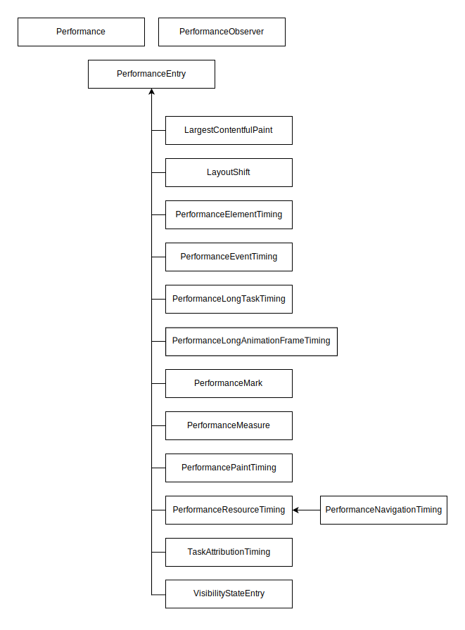

{{DefaultAPISidebar("Performance API")}}{{AvailableInWorkers}}

The Performance API is a group of standards used to measure the performance of web applications.

## Concepts and usage

To ensure web applications are fast, it's important to measure and analyze various performance metrics. The Performance API provides important built-in metrics and the ability to add your own measurements to the browser's performance timeline. The performance timeline contains high precision timestamps and can be displayed in developer tools. You can also send its data to analytics end points to record performance metrics over time.

Each performance metric is represented by a single {{domxref("PerformanceEntry")}}. A performance entry has a `name`, a `duration`, a `startTime`, and a `type`. All performance metrics extend the `PerformanceEntry` interface and qualify it further.

Most of the performance entries are recorded for you without you having to do anything, and are then accessible either through {{domxref("Performance.getEntries()")}} or (preferably) through {{domxref("PerformanceObserver")}}. For example, {{domxref("PerformanceEventTiming")}} entries are recorded for events that take longer than a set threshold. But the Performance API also enables you to define and record your own custom events, using the {{domxref("PerformanceMark")}} and {{domxref("PerformanceMeasure")}} interfaces.

The main {{domxref("Performance")}} interface is available in both {{domxref("Window.performance", "Window")}} and {{domxref("WorkerGlobalScope.performance", "Worker")}} global scopes, and enables you to add custom performance entries, to clear performance entries, and to retrieve performance entries.

The {{domxref("PerformanceObserver")}} interface enables you to listen for various types of performance entry as they are recorded.

For more conceptual information, see the [Performance API guides](#guides) below.

## Reference

The following interfaces are present in the Performance API:

- {{domxref("EventCounts")}}
  - : A read-only map returned by {{domxref("performance.eventCounts")}} containing the number of events which have been dispatched per event type.
- {{domxref("LargestContentfulPaint")}}
  - : Measures the render time of the largest image or text block visible within the viewport, recorded from when the page first begins to load.
- {{domxref("LayoutShift")}}
  - : Provides insights into the layout stability of web pages based on movements of the elements on the page.
- {{domxref("LayoutShiftAttribution")}}
  - : Provides debugging information about elements which have shifted.
- {{domxref("NotRestoredReasonDetails")}}
  - : Represents a single reason why a navigated page was blocked from using the back/forward cache ({{Glossary("bfcache")}}).
- {{domxref("NotRestoredReasons")}}
  - : Provides report data containing reasons why the current document was blocked from using the back/forward cache ({{Glossary("bfcache")}}) on navigation.
- {{domxref("Performance")}}
  - : Main interface to access performance measurements. Available to window and worker contexts using {{domxref("Window.performance")}} or {{domxref("WorkerGlobalScope.performance")}}.
- {{domxref("PerformanceElementTiming")}}
  - : Measures rendering timestamps of specific elements.
- {{domxref("PerformanceEntry")}}
  - : An entry on the performance timeline encapsulating a single performance metric. All performance metrics inherit from this interface.
- {{domxref("PerformanceEventTiming")}}
  - : Measures latency of events and {{Glossary("Interaction to Next Paint")}} (INP).
- {{domxref("PerformanceLongAnimationFrameTiming")}}
  - : Provides metrics on [long animation frames (LoAFs)](/en-US/docs/Web/API/Performance_API/Long_animation_frame_timing#what_is_a_long_animation_frame) that occupy rendering and block other tasks from being executed.
- {{domxref("PerformanceLongTaskTiming")}}
  - : Provides metrics on [long tasks](/en-US/docs/Glossary/Long_task) that occupy rendering and block other tasks from being executed.
- {{domxref("PerformanceMark")}}
  - : Custom marker for your own entry on the performance timeline.
- {{domxref("PerformanceMeasure")}}
  - : Custom time measurement between two performance entries.
- {{domxref("PerformanceNavigationTiming")}}
  - : Measures document navigation events, like how much time it takes to load a document.
- {{domxref("PerformanceObserver")}}
  - : Listens for new performance entries as they are recorded in the performance timeline.
- {{domxref("PerformanceObserverEntryList")}}
  - : List of entries that were observed in a performance observer.
- {{domxref("PerformancePaintTiming")}}
  - : Measures render operations during web page construction.
- {{domxref("PerformanceResourceTiming")}}
  - : Measures network loading metrics such as redirect start and end times, fetch start, DNS lookup start and end times, response start and end times for resources such as images, scripts, fetch calls, etc.
- {{domxref("PerformanceScriptTiming")}}
  - : Provides metrics on individual scripts causing [long animation frames (LoAFs)](/en-US/docs/Web/API/Performance_API/Long_animation_frame_timing#what_is_a_long_animation_frame).
- {{domxref("PerformanceServerTiming")}}
  - : Surfaces server metrics that are sent with the response in the {{HTTPHeader("Server-Timing")}} HTTP header.
- {{domxref("TaskAttributionTiming")}}
  - : Identifies the type of task and the container that is responsible for the long task.
- {{domxref("VisibilityStateEntry")}}
  - : Measures the timing of page visibility state changes, i.e., when a tab changes from the foreground to the background or vice versa.

## Guides

The following guides help you to understand key concepts of the Performance API and provide an overview about its abilities:

- [Performance data](/en-US/docs/Web/API/Performance_API/Performance_data): Collecting, accessing, and working with performance data.
- [High precision timing](/en-US/docs/Web/API/Performance_API/High_precision_timing): Measuring with high precision time and monotonic clocks.
- [Resource timing](/en-US/docs/Web/API/Performance_API/Resource_timing): Measuring network timing for fetched resources, such as images, CSS, and JavaScript.
- [Navigation timing](/en-US/docs/Web/API/Performance_API/Navigation_timing): Measuring navigation timing of a document.
- [User timing](/en-US/docs/Web/API/Performance_API/User_timing): Measuring and recording performance data custom to your application.
- [Server timing](/en-US/docs/Web/API/Performance_API/Server_timing): Collecting server-side metrics.
- [Long animation frame timing](/en-US/docs/Web/API/Performance_API/Long_animation_frame_timing): Collecting metrics on long animation frames (LoAFs) and their causes.
- [Monitoring bfcache blocking reasons](/en-US/docs/Web/API/Performance_API/Monitoring_bfcache_blocking_reasons): Reporting on why the current document was blocked from using the back/forward cache ({{Glossary("bfcache")}}).

## Specifications

{{Specifications}}

## See also

- [Web performance](/en-US/docs/Web/Performance)
- [Learn: Web performance](/en-US/docs/Learn_web_development/Extensions/Performance)
