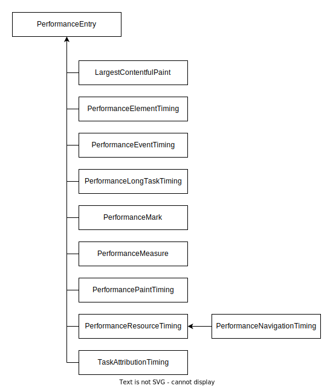

{{APIRef("Performance API")}} {{AvailableInWorkers}}

The **`PerformanceEntry`** object encapsulates a single performance metric that is part of the browser's performance timeline.

A performance entry can be created by calling the {{domxref("Performance.mark()")}} or {{domxref("Performance.measure()")}} methods at an explicit point in an application. This allows you to add your own metrics to the performance timeline.

The Performance API also offers important built-in metrics which are specialized sub classes of `PerformanceEntry`. This includes entries for resource loading, event timing, or {{Glossary("first input delay")}} (FID), and more.

The `PerformanceEntry` instances will always be one of the following subtypes:

<div class="index">

- {{domxref("LargestContentfulPaint")}}
- {{domxref("PerformanceEventTiming")}}
- {{domxref("PerformanceLongTaskTiming")}}
- {{domxref("PerformanceMark")}}
- {{domxref("PerformanceMeasure")}}
- {{domxref("PerformanceNavigationTiming")}}
- {{domxref("PerformancePaintTiming")}}
- {{domxref("PerformanceResourceTiming")}}
- {{domxref("PerformanceServerTiming")}}
- {{domxref("TaskAttributionTiming")}}

</div>



## Instance properties

- {{domxref("PerformanceEntry.name")}} {{ReadOnlyInline}}
  - : A string representing the name for a performance entry. The value depends on the subtype.
- {{domxref("PerformanceEntry.entryType")}} {{ReadOnlyInline}}
  - : A string representing the type of performance metric. For example, "`mark`" when {{domxref("PerformanceMark")}} is used.
- {{domxref("PerformanceEntry.startTime")}} {{ReadOnlyInline}}
  - : A {{domxref("DOMHighResTimeStamp")}} representing the starting time for the performance metric.
- {{domxref("PerformanceEntry.duration")}} {{ReadOnlyInline}}
  - : A {{domxref("DOMHighResTimeStamp")}} representing the duration of the performance entry. Might be 0.

## Instance methods

- {{domxref("PerformanceEntry.toJSON","PerformanceEntry.toJSON()")}}
  - : Returns a JSON representation of the `PerformanceEntry` object.

## Example

### Working with performance entries

The following example creates `PerformanceEntry` objects that are of the types {{domxref("PerformanceMark")}} and {{domxref("PerformanceMeasure")}}.
The mark and measure subtypes inherit the `duration`, `entryType`, `name`, and `starTime` properties from `PerformanceEntry` and give them their respective meaning.

```js
// Place at a location in the code that starts login 
performance.mark("login-started");

// Place at a location in the code that finishes login 
performance.mark("login-finished");

// Measure login duration
const loginMeasure = performance.measure(
  "login-duration",
  "login-started",
  "login-finished"
);

function perfObserver(list, observer) {
  list.getEntries().forEach((entry) =>  {
    if (entry.entryType === "mark") {
      console.log(`${entry.name}'s startTime: ${entry.startTime}`);
    };
    if (entry.entryType === "measure") {
      console.log(`${entry.name}'s duration: ${entry.duration}`);
    };
  });
}
const observer = new PerformanceObserver(perfObserver);
observer.observe({ entryTypes: ["measure", "mark"] });
````

## Specifications

{{Specifications}}

## Browser compatibility

{{Compat}}
