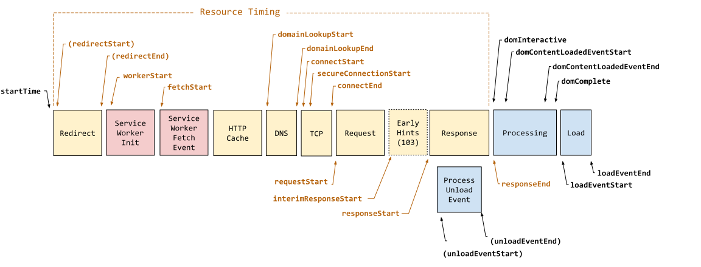

{{APIRef("Performance API")}}

The **`PerformanceNavigationTiming`** interface provides methods and properties to store and retrieve metrics regarding the browser's document navigation events. For example, this interface can be used to determine how much time it takes to load or unload a document.

Only the current document is included in the performance timeline, so there is only one `PerformanceNavigationTiming` object in the performance timeline. It inherits all of the properties and methods of {{domxref("PerformanceResourceTiming")}} and {{domxref("PerformanceEntry")}}.

{{InheritanceDiagram}}

The following diagram shows all of the timestamp properties defined in `PerformanceNavigationTiming`.

## Instance properties

This interface extends the following {{domxref('PerformanceEntry')}} properties by qualifying and constraining them as follows:

- {{domxref("PerformanceEntry.entryType")}} {{ReadOnlyInline}}
  - : Returns `"navigation"`.
- {{domxref("PerformanceEntry.name")}} {{ReadOnlyInline}}
  - : Returns the [document's URL](/en-US/docs/Web/API/Document/URL).
- {{domxref("PerformanceEntry.startTime")}} {{ReadOnlyInline}}
  - : Returns a {{domxref("DOMHighResTimeStamp")}} with a value of "`0`".
- {{domxref("PerformanceEntry.duration")}} {{ReadOnlyInline}}
  - : Returns a {{domxref("DOMHighResTimeStamp","timestamp")}} that is the difference between the {{domxref("PerformanceNavigationTiming.loadEventEnd")}} and {{domxref("PerformanceEntry.startTime")}} properties.

This interface also extends the following {{domxref('PerformanceResourceTiming')}} properties by qualifying and constraining them as follows:

- {{domxref('PerformanceResourceTiming.initiatorType')}} {{ReadOnlyInline}}
  - : Returns `"navigation"`.

The interface also supports the following properties:

- {{domxref('PerformanceNavigationTiming.domComplete')}} {{ReadOnlyInline}}
  - : A {{domxref("DOMHighResTimeStamp")}} representing the time immediately before the user agent sets the document's [`readyState`](/en-US/docs/Web/API/Document/readyState) to `"complete"`.
- {{domxref('PerformanceNavigationTiming.domContentLoadedEventEnd')}} {{ReadOnlyInline}}
  - : A {{domxref("DOMHighResTimeStamp")}} representing the time immediately after the current document's [`DOMContentLoaded`](/en-US/docs/Web/API/Document/DOMContentLoaded_event) event handler completes.
- {{domxref('PerformanceNavigationTiming.domContentLoadedEventStart')}} {{ReadOnlyInline}}
  - : A {{domxref("DOMHighResTimeStamp")}} representing the time immediately before the current document's [`DOMContentLoaded`](/en-US/docs/Web/API/Document/DOMContentLoaded_event) event handler starts.
- {{domxref('PerformanceNavigationTiming.domInteractive')}} {{ReadOnlyInline}}
  - : A {{domxref("DOMHighResTimeStamp")}} representing the time immediately before the user agent sets the document's [`readyState`](/en-US/docs/Web/API/Document/readyState) to `"interactive"`.
- {{domxref('PerformanceNavigationTiming.loadEventEnd')}} {{ReadOnlyInline}}
  - : A {{domxref("DOMHighResTimeStamp")}} representing the time immediately after the current document's [`load`](/en-US/docs/Web/API/Window/load_event) event handler completes.
- {{domxref('PerformanceNavigationTiming.loadEventStart')}} {{ReadOnlyInline}}
  - : A {{domxref("DOMHighResTimeStamp")}} representing the time immediately before the current document's [`load`](/en-US/docs/Web/API/Window/load_event) event handler starts.
- {{domxref('PerformanceNavigationTiming.redirectCount')}} {{ReadOnlyInline}}
  - : A number representing the number of redirects since the last non-redirect navigation in the current browsing context.
- {{domxref('PerformanceNavigationTiming.type')}} {{ReadOnlyInline}}
  - : A string representing the navigation type. Either `"navigate"`, `"reload"`, `"back_forward"` or `"prerender"`.
- {{domxref('PerformanceNavigationTiming.unloadEventEnd')}} {{ReadOnlyInline}}
  - : A {{domxref("DOMHighResTimeStamp")}} representing the time immediately after the current document's [`unload`](/en-US/docs/Web/API/Window/unload_event) event handler completes.
- {{domxref('PerformanceNavigationTiming.unloadEventStart')}} {{ReadOnlyInline}}
  - : A {{domxref("DOMHighResTimeStamp")}} representing the time immediately before the current document's [`unload`](/en-US/docs/Web/API/Window/unload_event) event handler starts.

## Instance methods

- {{domxref("PerformanceNavigationTiming.toJSON()")}}
  - : Returns a JSON representation of the `PerformanceNavigationTiming` object.

## Specifications

{{Specifications}}

## Browser compatibility

{{Compat}}

## See also

- {{domxref("Performance.navigation")}}
- {{domxref("PerformanceNavigation")}}
