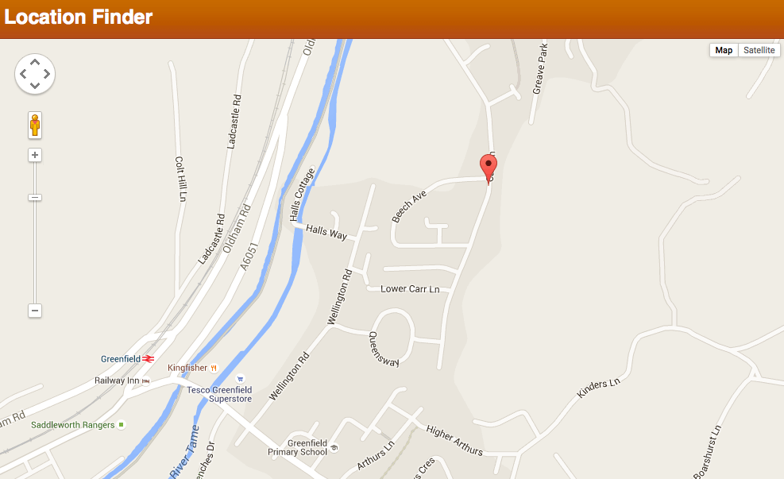

{{DefaultAPISidebar("Permissions API")}}

This article provides a basic guide to using the W3C [Permissions API](/en-US/docs/Web/API/Permissions_API), which provides a programmatic way to query the status of API permissions attributed to the current context.

## The trouble with asking for permission…

Permissions on the Web are a necessary evil, but they are not much fun to deal with as developers.

Historically, different APIs handle their own permissions inconsistently — for example the [Notifications API](/en-US/docs/Web/API/Notifications_API) had its own methods for checking the permission status and requesting permission, whereas the [Geolocation API](/en-US/docs/Web/API/Geolocation_API) did not.

The [Permissions API](/en-US/docs/Web/API/Permissions_API) provides a consistent approach for developers, and allows them to implement a better user experience as far as permissions are concerned.
Specifically, developers can use {{domxref("Permissions.query()")}} to check whether permission to use a particular API in the current context is granted, denied, or requires specific user permission via a prompt.
Querying permissions in the main thread is [broadly supported](/en-US/docs/Web/API/Permissions_API#api.navigator.permissions), and also in [Workers](/en-US/docs/Web/API/Permissions_API#api.workernavigator.permissions) (with a notable exception).

Many APIs now enable permission querying, such as the [Clipboard API](/en-US/docs/Web/API/Clipboard_API), [Notifications API](/en-US/docs/Web/API/Notifications_API), [Push API](/en-US/docs/Web/API/Push_API), and [Web MIDI API](/en-US/docs/Web/API/Web_MIDI_API). A list of many permission enabled APIs is provided in the [API Overview](/en-US/docs/Web/API/Permissions_API#permission-aware_apis), and you can get a sense of browser support in the [compatibility table here](/en-US/docs/Web/API/Permissions_API#api.permissions).

{{domxref("Permissions")}} has other methods to specifically request permission to use an API, and to revoke permission, but these are deprecated (non-standard, and/or not broadly supported).

## A simple example

For this article, we have put together a simple demo called Location Finder. It uses Geolocation to query the user's current location and plot it out on a Google Map:



You can [run the example live](https://chrisdavidmills.github.io/location-finder-permissions-api/), or [view the source code on GitHub](https://github.com/chrisdavidmills/location-finder-permissions-api/tree/gh-pages). Most of the code is simple and unremarkable — below we'll just be walking through the Permissions API-related code, so check the code yourself if you want to study any of the other parts.

### Accessing the Permissions API

The {{domxref("Navigator.permissions")}} property has been added to the browser to allow access to the global {{domxref("Permissions")}} object. This object will eventually include methods for querying, requesting, and revoking permissions, although currently it only contains {{domxref("Permissions.query()")}}; see below.

### Querying permission state

In our example, the Permissions functionality is handled by one function — `handlePermission()`. This starts off by querying the permission status using {{domxref("Permissions.query()")}}. Depending on the value of the {{domxref("PermissionStatus.state", "state")}} property of the {{domxref("PermissionStatus")}} object returned when the promise resolves, it reacts differently:

- `"granted"`
  - : The "Enable Geolocation" button is hidden, as it isn't needed if Geolocation is already active.
- `"prompt"`
  - : The "Enable Geolocation" button is hidden, as it isn't needed if the user will be prompted to grant permission for Geolocation. The {{domxref("Geolocation.getCurrentPosition()")}} function is then run, which prompts the user for permission; it runs the `revealPosition()` function if permission is granted (which shows the map), or the `positionDenied()` function if permission is denied (which makes the "Enable Geolocation" button appear).
- `"denied"`
  - : The "Enable Geolocation" button is revealed (this code needs to be here too, in case the permission state is already set to denied for this origin when the page is first loaded).

```js
function handlePermission() {
  navigator.permissions.query({ name: "geolocation" }).then((result) => {
    if (result.state === "granted") {
      report(result.state);
      geoBtn.style.display = "none";
    } else if (result.state === "prompt") {
      report(result.state);
      geoBtn.style.display = "none";
      navigator.geolocation.getCurrentPosition(
        revealPosition,
        positionDenied,
        geoSettings,
      );
    } else if (result.state === "denied") {
      report(result.state);
      geoBtn.style.display = "inline";
    }
    result.addEventListener("change", () => {
      report(result.state);
    });
  });
}

function report(state) {
  console.log(`Permission ${state}`);
}

handlePermission();
```

### Permission descriptors

The {{domxref("Permissions.query()")}} method takes a `PermissionDescriptor` dictionary as a parameter — this contains the name of the API you are interested in. Some APIs have more complex `PermissionDescriptor`s containing additional information, which inherit from the default `PermissionDescriptor`. For example, the `PushPermissionDescriptor` should also contain a Boolean that specifies if [`userVisibleOnly`](/en-US/docs/Web/API/PushManager/subscribe#parameters) is `true` or `false`.

### Responding to permission state changes

You'll notice that we're listening to the {{domxref("PermissionStatus.change_event", "change")}} event in the code above, attached to the {{domxref("PermissionStatus")}} object — this allows us to respond to any changes in the permission status for the API we are interested in. At the moment we are just reporting the change in state.

## Conclusion and future work

At the moment this doesn't offer much more than what we had already. If we choose to never share our location from the permission prompt (deny permission), then we can't get back to the permission prompt without using the browser menu options:

- **Firefox**: _Tools > Page Info > Permissions > Access Your Location_. Select _Always Ask_.
- **Chrome**: _Hamburger Menu > Settings > Show advanced settings_. In the _Privacy_ section, click _Content Settings_. In the resulting dialog, find the _Location_ section and select _Ask when a site tries to…_. Finally, click _Manage Exceptions_ and remove the permissions you granted to the sites you are interested in.

There are proposals to add the ability for sites to imperatively [request](https://github.com/WICG/permissions-request) and [revoke](https://github.com/WICG/permissions-revoke) permissions, but there has not been much progress as the use case is unclear and they have faced opposition from browser vendors. See the discussions to [remove `permissions.request()`](https://github.com/w3c/permissions/issues/83) and [remove `permissions.revoke()`](https://github.com/w3c/permissions/issues/46) from the main specification.
