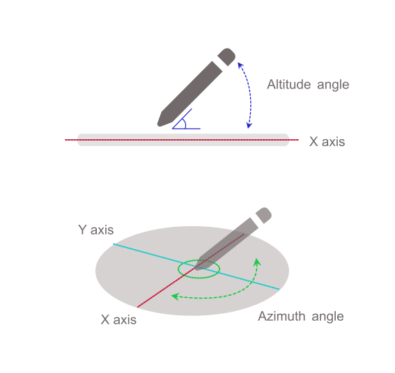

{{ APIRef("Pointer Events") }}{{SeeCompatTable}}

The **`altitude angle`** read-only property of the {{domxref("PointerEvent")}} interface represents the angle between a transducer (a pointer or stylus) axis and the X-Y plane of a device screen.
The altitude angle describes whether the transducer is perpendicular to the screen, parallel, or at some angle in between.

Depending on the specific hardware and platform, user agents will likely only receive one set of values for the transducer orientation relative to the screen plane — either {{domxref("PointerEvent.tiltx", "tiltX")}} and {{domxref("PointerEvent.tilty", "tiltY")}} or `altitudeAngle` and {{domxref("PointerEvent.azimuthAngle", "azimuthAngle")}}.



For an additional illustration of this property, see [Figure 4 in the specification](https://w3c.github.io/pointerevents/#figure_altitudeAngle).

## Value

An angle in radians between `0` and `π/2` where `0` is parallel to the device surface (X-Y plane), and `π/2` is perpendicular to the surface.
Defaults to `π/2` (perpendicular to the surface) which differs from the [`altitudeAngle` in touch events](https://w3c.github.io/touch-events/#dom-touch-altitudeangle) which defaults to `0` (parallel to the surface).
For hardware and platforms that do not report tilt or angle, the value is `π/2`.

## Example

```js
someElement.addEventListener(
  "pointerdown",
  (event) => {
    process_angles(event.altitudeAngle, event.azimuthAngle);
  },
  false,
);
```

## Specifications

{{Specifications}}

## Browser compatibility

{{Compat}}

## See also

- {{ domxref("PointerEvent.azimuthAngle") }}
- {{ domxref("PointerEvent.tiltX") }}
- {{ domxref("PointerEvent.tiltY") }}
