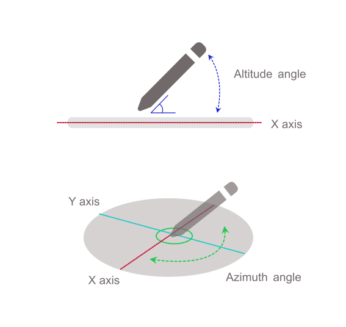

{{ APIRef("Pointer Events") }}

The **`azimuthAngle`** read-only property of the {{domxref("PointerEvent")}} interface represents the angle between the Y-Z plane and the plane containing both the transducer (pointer or stylus) axis and the Y axis.

Depending on the specific hardware and platform, user agents will likely only receive one set of values for the transducer orientation relative to the screen plane — either {{domxref("PointerEvent.tiltX", "tiltX")}} and {{domxref("PointerEvent.tiltY", "tiltY")}} or {{domxref("PointerEvent.altitudeAngle", "altitudeAngle")}} and `azimuthAngle`.



For an additional illustration of this property, see [Figure 5 in the specification](https://w3c.github.io/pointerevents/#figure_azimuthAngle).

## Value

An angle in radians between `0` and `2π` where `0` represents a transducer whose cap is pointing in the direction of increasing X values (point to "3 o'clock" if looking straight down) on the X-Y plane, and the values progressively increase when going clockwise (`π/2` at "6 o'clock", `π` at "9 o'clock", `3π/2` at "12 o'clock").

When the transducer is perpendicular to the surface ({{domxref("PointerEvent.altitudeAngle", "altitudeAngle")}} of `π/2`), the value is 0.
For hardware and platforms that do not report tilt or angle, the value is `0`.

## Example

```js
someElement.addEventListener(
  "pointerdown",
  (event) => {
    process_angles(event.altitudeAngle, event.azimuthAngle);
  },
  false,
);
```

## Specifications

{{Specifications}}

## Browser compatibility

{{Compat}}

## See also

- {{ domxref("PointerEvent.altitudeAngle") }}
- {{ domxref("PointerEvent.tiltX") }}
- {{ domxref("PointerEvent.tiltY") }}
