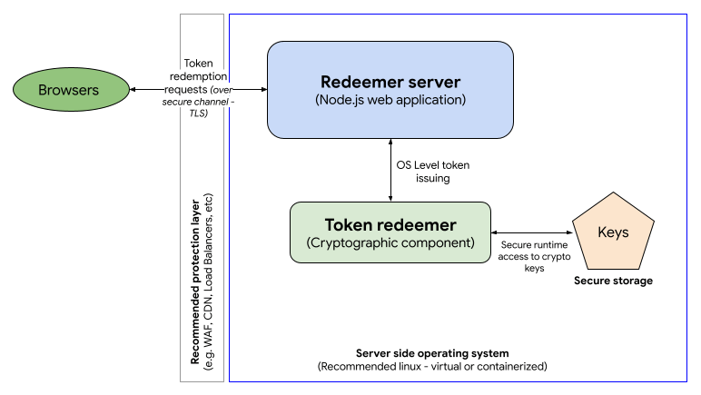

{{DefaultAPISidebar("Private State Token API")}}

This page explains how to use the Private State Tokens API to conveying trust in a user's authenticity from one browsing context to another.

## High-level overview

The process by which private state tokens are used can be split up into three phases:

1. Issuing tokens
2. Redeeming tokens
3. Redemption record usage

This section summarizes those phases. We will look at the these in more detail in subsequent sections.

Private state tokens use the [Privacy Pass protocol](https://privacypass.github.io/) in the background to handle the issuing and transport of tokens, etc.

### Issuing tokens

1. Let's say a user visits a website, `issuer.example`.
2. `issuer.example` can take steps to _establish_ trust in the user. This can be done using a method such as a [CAPTCHA](https://en.wikipedia.org/wiki/CAPTCHA), verifying their email address, keeping a record of the user making legitimate purchases, or a combination of multiple such methods.
   > [!NOTE]
   > Private state tokens are not a replacement for CAPTCHAs or other trust establishing mechanisms. Private state tokens provide a way to _convey_ trust in a user, not _establish_ trust in a user.
3. Once trust has been established, `issuer.example` can make a request to a server to issue a **private state token** — a cryptographic token that represents trust in the verified user. In this context, `issuer.example` is called an **issuer**. The server is called an **issuer server**.
4. If the request is successful, the token is then stored securely by the user's browser.

### Redeeming tokens

If another website wants to establish trust in the same user, it can do so by redeeming a private state token issued to the user's browser by another website, rather than having to go through the process of establishing trust from scratch.

1. Let's say the user visits a different website, `redeemer.example`.
2. `redeemer.example` can make a request to a server to redeem a token for that specific user and device.
3. The browser checks to see whether it has a token stored for that user and device. If it does, and the token is good to use (it has not already been redeemed, and it has not expired), it sends the token to a server to be redeemed. In this context, `redeemer.example` is called an **redeemer**. The server is called an **redeemer server**.
4. If the token is redeemed successfully, the redeemer server sends a **redemption record** to the browser to verify the user trust.

### Redemption record usage

Once the browser has received the redemption record, it can use it as a trust signal for the current user in various contexts, for example when letting them perform a sensitive action like signing in, purchasing a product, or posting a comment. This trust signal can also be forwarded to other parties to convey trust.

## Example implementation

You can find an example private state tokens implementation at [Private State Token Demo Issuer](https://privatetokens.dev/) (see the [source code](https://github.com/GoogleChromeLabs/private-state-token-demo/)).

## Issuing tokens

This section takes you through the process of setting up an issuer server and issuing tokens via the issuer website.

### Signing up to become an issuer

If you want to become an issuer, and have your website issue private state tokens, you first need to register by completing the [Issuer registration process](https://github.com/GoogleChrome/private-tokens/blob/main/PST-Registration.md). Open a new [issue](https://github.com/GoogleChrome/private-tokens/issues/new) on the [Google private-tokens GitHub repository](https://github.com/GoogleChrome/private-tokens) using the "New PST Issuer" template. Follow the guidance on the repository to fill out the issue. Once an endpoint has been verified, it will be merged into this repository and Chrome server-side infrastructure will begin fetching those keys.

> [!NOTE]
> This process is run by Google and controls token issuance via Chromium browsers; other implementations may choose to use a different process.

### Creating an issuer server

To implement the token issuer server you will need to build your own server side application exposing HTTP endpoints. The issuer component is composed of two main modules:

1. The issuer app
2. The token issuer


In the example implementation:

1. The issuer app is a [Node.js server that uses the Express framework](/en-US/docs/Learn_web_development/Extensions/Server-side/Express_Nodejs) to host the issuer HTTP endpoints. Check out the [app sample code](https://github.com/GoogleChromeLabs/private-state-token-demo/blob/main/src/index.js).
2. The token issuer cryptographic component doesn't require any specific language but due to the performance requirements of this component, we're providing a C implementation as an example, which uses the [Boring SSL](https://boringssl.googlesource.com/boringssl/) library to manage tokens. Check out the [cryptographic component code example and more information about the installation](https://github.com/GoogleChromeLabs/private-state-token-demo/tree/main?tab=readme-ov-file#private-state-token-demo).
3. The token issuer component uses custom EC keys to encrypt tokens. These keys must be protected and stored in secure storage.

#### Issuer server technical requirements

As per the Privacy Pass protocol, you will need to implement at least two HTTP endpoints in your issuer server:

- Key commitment: This endpoint is where your encryption public key details will be available to browsers to confirm that your server is legitimate. This endpoint must be inside a well-known directory located at the [eTLD+1](https://web.dev/articles/same-site-same-origin#site) of the issuer server at `/.well-known/private-state-token/key-commitment`. Check out the [Key-commitment endpoint example](https://github.com/GoogleChromeLabs/private-state-token-demo/blob/bf173919620f2b8203a628c3a1094c8846e6aff1/src/index.js#L55).
- Token issuance: The token issuing endpoint is where all token requests will be handled. This endpoint will be the integration point for the token issuer component. It must be located on the issuer server at `/.well-known/private-state-token/issuance`. Check out the [Token issuance endpoint example](https://github.com/GoogleChromeLabs/private-state-token-demo/blob/bf173919620f2b8203a628c3a1094c8846e6aff1/src/index.js#L81).

Due to the high traffic expected on such a server, we recommend you deploy it using a scalable infrastructure (for example, in a cloud environment) to be able to adjust your backend based on a variable demand.

### Issuing a token via your server

With the issuer server set up, your issuer website can now issue a new token by making a fetch request to your token issuance endpoint. The fetch request needs to include a `privateToken` object, the mandatory properties of which are:

- `version`
  - : The version of the cryptographic protocol you wish to use when generating the token. Currently this is always set to `1`, which is the only version that the specification supports.
- `operation`
  - : The token operation you are trying to complete. In this case, we set it to `token-request`.

You can handle this using a {{domxref("fetch()")}} call with the `method` set to `POST`, and a `privateToken` option specified:

```js
const hasToken = await Document.hasPrivateToken(`issuer.example`);
if (hasToken) {
  await fetch("/.well-known/private-state-token/issuance", {
    method: "POST",
    privateToken: {
      version: 1,
      operation: "token-request",
    },
  });
}
```

> [!NOTE]
> You can also issue token operation requests using:
>
> - {{domxref("XMLHttpRequest")}} with the `privateToken` specified inside an {{domxref("XMLHttpRequest.setPrivateToken()")}} call
> - {{htmlelement("iframe")}} elements with the `privateToken` included as a string inside the [`privateToken`](/en-US/docs/Web/HTML/Reference/Elements/iframe#privatetoken) attribute.

Behind the scenes, the browser generates a set of nonces needed to generate the token, blinds then, and sends them to the issuer server in a {{httpheader("Sec-Private-State-Token")}} request header as part of the fetch request. In addition, the version of the cryptographic protocol used to generate the nonces is sent to the issuer server in a {{httpheader("Sec-Private-State-Token-Crypto-Version")}} request header. At the time of writing, there is only one version supported, but this mechanism makes it possible to support multiple versions in the future.

Note how you can use the {{domxref("Document.hasPrivateToken()")}} method to check whether the browser already has a token stored from our issuer, before attempting to request another one.

If the token request is successful, the response will include a {{httpheader("Sec-Private-State-Token")}} response header containing blind signatures. The browser unblinds them and stores them along with the original unblinded nonces in a secure token store. This pairing of signatures and nonces constitutes a private state token, which can be redeemed later on. The raw tokens are not accessible to JavaScript.

### Token issue limitations

Each device can store up to 500 tokens per top-level website and issuer. The maximum number of issuers per top level origin is two.

Each token has metadata indicating which key the issuer used to issue it. That information can be used to decide to redeem tokens (or not) during the redeeming process. Each token can be issued using one and only one cryptographic key and each issuer can have a maximum of 6 keys. One potential way to use this variable is to define a range of trust to your tokens based on your cryptographic keys (for example, key 1: high trust; key 6: no trust).

The browser can get the issuer's current set of valid keys from the key commitment endpoint. Keys should be rotated regularly; this can be done every 60 days at a minimum; any rotation faster than that will be ignored. All tokens issued with invalid keys are also considered invalid.

## Redeeming tokens

This section takes you through the process of setting up a redeemer server, redeeming tokens, and issuing redemption records.

### Creating a redeemer server

You need to build a redeemer server to read the tokens issued by the issuer server. The following steps outline how to redeem tokens as well as how to read the redemption records that are associated with those tokens.

The redeemer component is composed of two main modules:

1. The redeemer app
2. The token redeemer



You can opt to run the issuer and the redeemer in the same server (or group of servers) and cryptographic component. In fact, this is what has been done in the example implementation, to make it a bit easier to follow. Again, check out the [app sample code](https://github.com/GoogleChromeLabs/private-state-token-demo/blob/main/src/index.js) and the [cryptographic component code example and information about the installation](https://github.com/GoogleChromeLabs/private-state-token-demo/tree/main?tab=readme-ov-file#private-state-token-demo).

#### Redeemer server technical requirements

As per the Privacy Pass protocol, you will need to implement at least one HTTP endpoint in your redeemer server:

- Token redemption: This is where all token redemption will be handled. This endpoint will be the integration point for the token redeemer component. It must be located on the issuer server at `/.well-known/private-state-token/redemption`. Check out our [Token redemption endpoint example](https://github.com/GoogleChromeLabs/private-state-token-demo/blob/bf173919620f2b8203a628c3a1094c8846e6aff1/src/index.js#L98).

### Redeeming a token via your server

With the redeemer server set up, your redeemer website can now redeem a previously-stored token by making a fetch request to your token redemption endpoint. The fetch request needs to include a `privateToken` object, the same as in the token issuing request, except that the specified `operation` should be `token-redemption`.

You can handle this using a {{domxref("fetch()")}} call with the `method` set to `POST`, and a `privateToken` option specified.

```js
await fetch("/.well-known/private-state-token/redemption", {
  method: "POST",
  privateToken: {
    version: 1,
    operation: "token-redemption",
    refreshPolicy: "none",
  },
});
```

Here we also set the `refreshPolicy` property to `none`, which means that, if there is a previously-set, non-expired redemption record for this user and site, this redemption record should be used, and a new one should not be issued. If we set `refreshPolicy: "refresh"`, a new redemption record would always be issued. Note that `none` is the default value, as this is the behavior you'll want in most cases, but we wanted to draw attention to it.

Behind the scenes, the browser sends the token (along with associated redemption metadata) attached in a {{httpheader("Sec-Private-State-Token")}} request header. The redeemer then sends a Redemption Record in a `Sec-Private-State-Token` response header to provide a redemption attestation to use for conveying user trust. The redemption record is stored in a secure data store that isn't directly accessible via JavaScript.

Additionally, the redeemer may include a {{httpheader("Sec-Private-State-Token-Lifetime")}} header in the response to indicate to the browser how long (in seconds) the redemption record should be cached for. If the `Sec-Private-State-Token-Lifetime` header is omitted, the lifetime of the redemption record will be tied to the lifetime of the token verification key that confirmed the redeemed token's issuance.

### Redemption record limitations

Two tokens can be redeemed every 48 hours, per device, page and issuer.

The resulting redemption records are considered active until expiration (as specified by the `Sec-Private-State-Token-Lifetime` response header).

## Redemption record usage

Once the browser has received the redemption record, it can be used as a trust signal for the current user in other contexts, for example when letting them perform a sensitive action like signing in, purchasing a product, or posting a comment.

This trust signal can be forwarded to other parties to convey trust. To do so, include a `privateToken` option in fetch calls for future resources, with an `operation` of `send-redemption-record`:

```js
const hasRR = await Document.hasRedemptionRecord(`issuer.example`);
if (hasRR) {
  await fetch("some-resource.example", {
    method: "POST",
    privateToken: {
      version: 1,
      operation: "send-redemption-record",
      issuers: [`issuer.example`],
    },
  });
}
```

The `send-redemption-record` token operation is only available on `fetch()` calls made in the top-level document.

We also set the `issuers` property to `[issuer.example]`, which specifies which issuer we are expecting the redemption record to have come from. If there are no redemption records available for the specified issuer(s), the request header will be empty. Note how you can use the {{domxref("Document.hasRedemptionRecord()")}} method to check whether the browser has a redemption record originating from a particular issuer, before attempting to forward it.

Behind the scenes, The redemption record(s) will be included on a {{httpheader("Sec-Redemption-Record")}} request header. The header contains a list of issuer and redemption record pairs corresponding to each redemption record.

## Permissions policy integration

`token-request` operations are controlled by the {{httpheader('Permissions-Policy/private-state-token-issuance','private-state-token-issuance')}} {{httpheader("Permissions-Policy")}} directive, whereas `token-redemption` and `send-redemption-record` operations are controlled by the {{httpheader('Permissions-Policy/private-state-token-redemption','private-state-token-redemption')}} directive. The allowlist for these directives is set to `*` (all origins) by default. This means that the feature is available to the top-level page, same-origin {{htmlelement("iframe")}} elements, and cross-origin `<iframe>` elements without explicit delegation.

You can opt out of token issuance or redemption for specific pages on your site by including `private-state-token-issuance=()` and `private-state-token-redemption=()` in the `Permissions-Policy` header for each page.

You can also use the `Permissions-Policy` header to control third-party access to token operations. As parameters to the header origin list, use self and any origins you would like to allow access to the API. For example, to completely disable use of PST within all browsing contexts except for your own origin and `https://example.com`, set the following HTTP response header:

```http
Permissions-Policy: private-state-token-issuance=(self "https://example.com"), private-state-token-redemption=(self "https://example.com")
```

To enable the API for all cross-origin resources, set the origin list to `*`.

Even though the default policy is `*`, an `<iframe>` still needs to include the `private-state-token-issuance` and `private-state-token-redemption` directives in its allow attribute to gain access to the feature. For example, to allow both features to be used on `example.com`:

```html
<iframe
  src="https://example.com"
  allow="private-state-token-issuance 'self';
  private-state-token-redemption 'self'">
</iframe>
```
