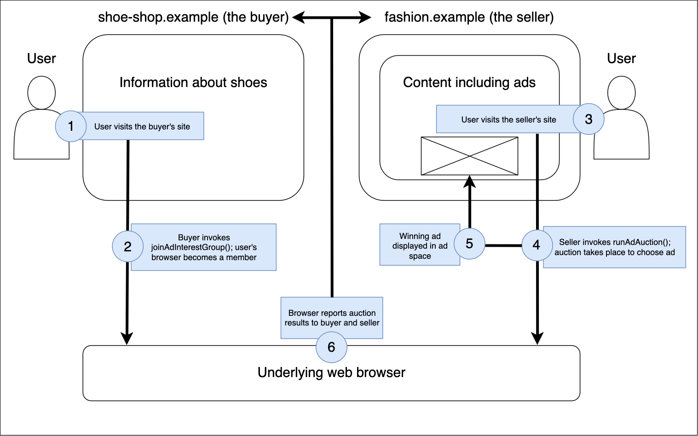

{{SeeCompatTable}}{{securecontext_header}}{{DefaultAPISidebar("Protected Audience API")}}

The **Protected Audience API** allows developers to implement remarketing and custom audience advertising use cases. It uses on-device auctions to choose relevant ads to display related to websites the user has previously visited. The Protected Audience API doesn't use third-party cookies or other tracking technologies — third parties cannot use it to track user browsing behavior across sites.

## Concepts and usage

Advertisers commonly try to discern the interests of users they display ads to on websites, grouping users together in **interest groups**. This allows more relevant ads to be served to users than just choosing ads based on site content (contextual targeting) or information provided by the user (first-party data targeting).

Traditionally, advertisers have learned about user interests by tracking their behavior across sites using technologies such as third-party cookies. An ad will typically be embedded on a web page in an {{htmlelement("iframe")}}, which can set a cookie containing information about the user and the subjects they are interested in.

Later on, when the user decides to visit the advertiser's site, provided it is from the same domain as the ad, that site can access the third-party cookie set previously by the ad. The advertiser can associate data from multiple third-party cookies set by ads, building up a profile of the user, their interests, and other information besides. This is bad for user [privacy](/en-US/docs/Web/Privacy). At this point, any page from the same domain can get access to that information, and unscrupulous companies often sell this information to other companies.

The Protected Audience API is designed to allow advertisers to select relevant ads based on user interests, and content publishers to display those ads and earn ad revenue, without cross-site tracking. The user's browser holds the information about what they are interested in and what ads are displayed to them, not the advertisers or ad tech platforms. This information is held securely, and cannot be accessed by third parties.

### How does it work?

Let's illustrate how the Protected Audience API works via an example.

Say we have a online shop that sells shoes, `shoe-shop.example`, which wants to advertise its products across the web. To do so, it will buy ad-space to display its adverts, either directly or via a third-party called a **Demand-side platform** (DSP). The DSP is an ad tech service for automating ad impression purchasing across a range of publisher sites. In this scenario we'll refer to the shop and/or DSP as the **buyer**.

The other party in our scenario will be a publisher site that displays ads in return for ad revenue. Let's say it's an online fashion magazine, `fashion.example`, which publishes articles about shoes, clothing, makeup, and more. This site will sell ad space to compaines that want to advertise their products, usually via a **Sell-side platform** (SSP). The SSP is an ad tech service for automating selling ad space (often known as ad inventory) — in doing so, it is offered to multiple ad exchanges, ad networks, and DSPs. In this scenario we'll refer to the publisher and/or SSP as the **seller**.

The buyer wants to add users that browse their site to a specific interest group for shoes. Later on, when those users visit contextually relevant places (such as the seller's site), they want to display ads for their shoes on that site. Multiple buyers will be interested in the same ad space at the same time, therefore the Protected Audience API provides a real-time auction mechanism where relevant buyers can bid for the space, and the seller chooses the most relevant ad to display for each user.

The steps involved are as follows:

1. When a user visits the buyer's site, the buyer can invoke the {{domxref("Navigator.joinAdInterestGroup()")}} method — this in effect asks the user's browser to add an interest group to its list of stored interest groups that it is a member of. An interest group is equivalent to a remarketing list in traditional advertising, and contains the following information:
   - A name, indicating what the interest is. In this case, an appropriate name might be `shoes` or `fashion-shoes`.
   - The URL of the interest group owner. This might be the shop itself, i.e. `shoe-shop.example`, or the DSP acting on their behalf, for example `https://dsp.example`.
   - Configuration information required for the browser to include the buyer in ad auctions (see step 2.), such as bidding logic, rela-time data, and appropriate ad metadata.
2. Later on, when the user visits the seller's site, the seller invokes the {{domxref("Navigator.runAdAuction()")}} method to choose the most desirable ad to display to the user. The decision of which ad to display is based on information taken from interest groups the user's browser is a member of that were invited to bid in the auction (see Step 1.), and contextual data from the seller.
3. The ad associated with the winning bid in the ad auction is displayed on the seller's site in a {{htmlelement("fencedframe")}}.
4. The browser sends signals back to the seller and the buyer that won the auction to let them know the auction results. They can then report the auction results via developer-defined functions: `reportResult()` in the seller's code and `reportWin()` in the buyer's code.

For more information on implementing the functionality required for the above steps, see:

- [Protected Audience API: Joining an ad interest group](#)
- [Protected Audience API: Running an ad auction](#)
- [Protected Audience API: Reporting aunction results](#)

### Use cases

The above example illustrates a classic remarketing use case — the shoe shop owner (or its associated DSP) owns an interest group of people that have shown an interest in shoes, and requests that their browsers join that interest group. Later on when those users visit appropriate contextual sites such as the online fashion magazine, an auction is run to show appropriate ads, which should include ads from the shoe shop.

However, other organizations may own interest groups with slightly different purposes.

- A publisher — such as the online fashion magazine — might own one or more interest groups based on different items their readers want to know about. They could add their readers to those interrest groups and then show them more appropriate ads when they revturn to their site, or visit partner sites. They could even charge other advertisers for inclusion in their interest group ad lists.
- An ad tech company might own interest groups related to products their partners are selling, and add people to those groups whenever they show an interest in those products. They can then charge their partners to be invited to auctions they run on relevant sites.

### Relationship with other privacy sandbox APIs

The Protected Audience API has got similarities with other APIs in the [privacy sandbox](#), and works alongside others:GOT HERE

- The former is for interest group-based advertising and allows multiple ad providers to bid for ad space.
  The latter is for showing ads based purely on the user's browsing behavior, and is a simpler solution that allows directly requesting ads from a chosen network.
- fenced frames
- reporting, something about others?

## Interfaces

The Attribution Reporting API doesn't define any distinct interfaces of its own.

### Extensions to other interfaces

- {{domxref("HTMLAnchorElement.attributionSrc")}}, {{domxref("HTMLImageElement.attributionSrc")}}, {{domxref("HTMLScriptElement.attributionSrc")}}
  - : The `attributionSrc` property allows you to get and set the `attributionsrc` attribute on {{htmlelement("a")}}, {{htmlelement("img")}}, and {{htmlelement("script")}} elements programmatically. It reflects the value of that attribute.
- {{domxref("Window/fetch", "fetch()")}} and the {{domxref("Request.Request", "Request()")}} constructor, the `attributionReporting` option
  - : When generating a request via {{domxref("Window/fetch", "fetch()")}}, this indicates that you want the response to be able to register an attribution source or trigger.
- {{domxref("XMLHttpRequest.setAttributionReporting()")}}
  - : When generating a request via {{domxref("XMLHttpRequest")}}, this indicates that you want the response to be able to register an attribution source or trigger.
- {{domxref("Window.open()")}}, the `attributionsrc` feature keyword
  - : Causes completion of the registration of an attribution source _and_ triggers the browser to store the associated source data (as provided in the {{httpheader("Attribution-Reporting-Register-Source")}} response header) when the `open()` method completes. Note that `Window.open()` calls cannot be used to register attribution triggers.

## HTML elements

- {{htmlelement("a")}}, {{htmlelement("img")}}, and {{htmlelement("script")}} — the `attributionsrc` attribute
  - : Specifies that you want the browser to send an {{httpheader("Attribution-Reporting-Eligible")}} header along with the associated resource request. On the server-side this header is used to trigger sending an {{httpheader("Attribution-Reporting-Register-Source")}} or {{httpheader("Attribution-Reporting-Register-Trigger")}} header in the response. When registering an attribution source, this is required; when registering an attribution trigger it is only required if you want to specify a separate registration server to the resource the `src` attribute is pointing at. Note that `<a>` elements cannot be used to register attribution triggers.

## HTTP headers

- {{httpheader("Attribution-Reporting-Eligible")}}
  - : HTTP request that indicates that the corresponding response is eligible to register an attribution source or trigger.
- {{httpheader("Attribution-Reporting-Register-Source")}}
  - : HTTP response that registers a page feature as an attribution source. This is included as part of a response to a request that included an `Attribution-Reporting-Eligible` header.
- {{httpheader("Attribution-Reporting-Register-Trigger")}}
  - : HTTP response that registers a page feature as an attribution trigger. This is included as part of a response to a request that included an `Attribution-Reporting-Eligible` header.
- {{httpheader("Permissions-Policy")}} {{httpheader('Permissions-Policy/attribution-reporting','attribution-reporting')}} directive
  - : Controls whether the current document is allowed to use attribution reporting.

## Enrollment and local testing

To use the Attribution Reporting API in your sites, you must specify it in the [privacy sandbox enrollment process](/en-US/docs/Web/Privacy/Privacy_sandbox/Enrollment). If you don't do this, the API flow is blocked at response time, i.e. the response headers are ignored and sources and triggers are not registered.

You can still test your Attribution Reporting API code locally without enrollment. To allow local testing, enable the following Chrome developer flag:

`chrome://flags/#privacy-sandbox-enrollment-overrides`

## Examples

See [Demo: Attribution Reporting API](https://arapi-home.web.app/) for an example implementation (see the [source code also](https://github.com/GoogleChromeLabs/trust-safety-demo/tree/main/attribution-reporting)).

## Specifications

{{Specifications}}

## Browser compatibility

{{Compat}}

## See also

- [Attribution Reporting Header Validation tool](https://wicg.github.io/attribution-reporting-api/validate-headers)
- [Attribution reporting](https://developers.google.com/privacy-sandbox/relevance/attribution-reporting/) on developers.google.com (2023)
- [Enable conversion measurement](https://developers.google.com/privacy-sandbox/relevance/attribution-reporting/enable-conversion-measurement) on developers.google.com (2023)
- [The Privacy Sandbox](https://developers.google.com/privacy-sandbox/) on developers.google.com (2023)
