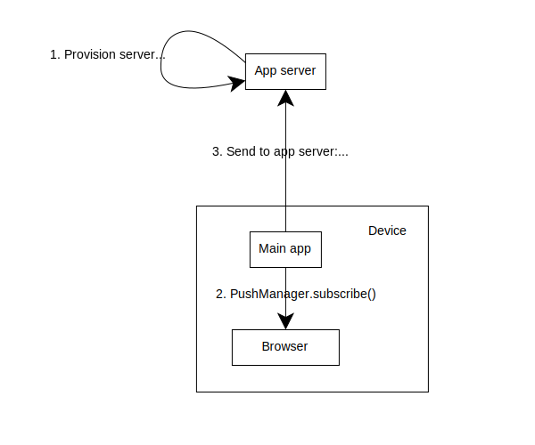
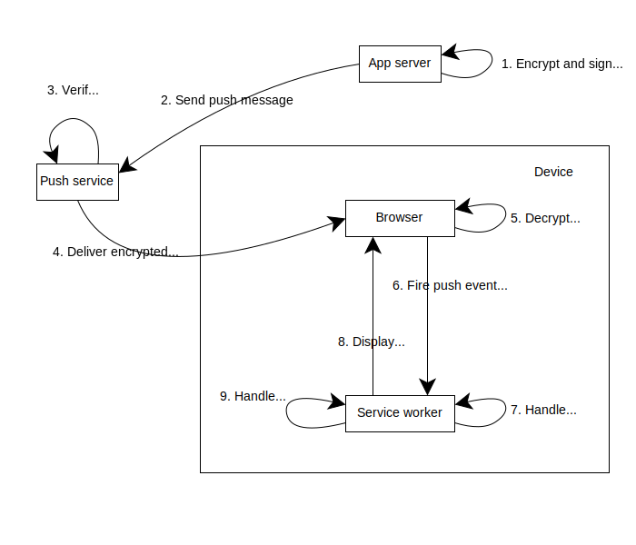

{{DefaultAPISidebar("Push API")}}

Web Push enables a web application to receive messages from an application server even when the app is not open in the browser. The application server does not send messages directly to the browser. Instead, it sends messages to a push service, which delivers them to the browser, and the browser wakes the application's service worker to handle them.

Because the push service sits between your server and the browser, the messages that your server sends to the push service need to be {{Glossary("Encryption", "encrypted")}} so the push service cannot read them, and {{Glossary("Signature/Security", "signed")}} so the push service can verify that they came from your application server. The application server communicates with the push service using the [HTTP Push](https://datatracker.ietf.org/doc/html/rfc8030) protocol.

## Subscription

Before an application can receive push messages, the application server needs a {{Glossary("Public-key_cryptography", "public/private key pair")}} for signing push messages. The public key is given to the web application, and the corresponding private key stays on the application server.

The subscription flow then looks like this:

1. If notification permission has not already been granted, the web application typically requests it from the user.
2. The web application calls {{domxref("PushManager.subscribe()")}}. In browsers that support application server authentication, the call includes the application server's public key in the `applicationServerKey` option.
3. The browser contacts its push service and creates a new subscription.
4. {{domxref("PushManager.subscribe()")}} resolves with a {{domxref("PushSubscription")}} object. This includes:
   - [`endpoint`](/en-US/docs/Web/API/PushSubscription/endpoint): a unique URL on the push service where the application server sends push messages.
   - [`p256dh`](/en-US/docs/Web/API/PushSubscription/getKey#p256dh): a public key that the application server uses when encrypting message payloads.
   - [`auth`](/en-US/docs/Web/API/PushSubscription/getKey#auth): an authentication secret used as part of payload encryption.
5. The web application sends the subscription details to the application server, which stores them for later use.

The `endpoint` is a [capability URL](https://w3ctag.github.io/capability-urls/) and identifies a specific subscription. Treat it as sensitive data and only send it to your application server over authenticated application requests.

## Sending a message

When the application server needs to notify a user, it sends an HTTP {{httpmethod("POST")}} request to the subscription's endpoint URL. The request contains an encrypted payload, authentication information for the push service, and optional delivery headers. The push service validates the request and, if it is valid, queues it for delivery.

### Encrypting the payload

Push payloads are encrypted end-to-end so that the push service can route the message without being able to read it. The application server uses the subscription's `p256dh` public key and `auth` secret to derive the content encryption keys, encrypts the payload, and includes the encrypted body in the request.

The message encryption protocol is defined in [Message Encryption for Web Push (RFC 8291)](https://datatracker.ietf.org/doc/html/rfc8291), and the HTTP content coding it relies on is defined in [RFC 8188](https://datatracker.ietf.org/doc/html/rfc8188). In practice, most applications rely on a library or framework to construct the encryption headers and body correctly.

### VAPID authentication

To let the push service verify who sent the message, the application server signs the request using Voluntary Application Server Identification ([VAPID, RFC 8292](https://datatracker.ietf.org/doc/html/rfc8292)). In browsers that require `applicationServerKey` during subscription, the push service verifies that the request was signed with the private key corresponding to that public key.

VAPID uses a JSON Web Token (JWT) that includes:

- An `aud` claim binding the token to the push service's origin
- An `exp` claim no more than 24 hours in the future
- An optional `sub` claim with a contact URI such as a `mailto:` address

VAPID identifies the application server to the push service. It is separate from payload encryption, which uses the subscription's `p256dh` and `auth` values.

### Delivery headers

The application server can also send headers that control how the push service handles the message:

- `TTL` (required): How many seconds the push service should hold the message if the user is offline. `0` means deliver immediately or discard.
- `Urgency` (optional): A delivery hint. Values are `very-low`, `low`, `normal` (default), and `high`.
- `Topic` (optional): A string up to 32 characters. If two messages share the same topic, the push service replaces the older one. This is useful for updates that supersede each other, such as unread counts.

### Response codes

After receiving the request, the push service responds with status codes such as:

| Status         | Meaning                                                             |
| -------------- | ------------------------------------------------------------------- |
| `201`          | Message accepted for delivery                                       |
| `400`          | Invalid request (missing TTL, oversized payload)                    |
| `401`          | VAPID authentication failed                                         |
| `404` or `410` | Subscription expired or unsubscribed — remove it from your database |
| `413`          | Payload too large                                                   |
| `429`          | Rate limited — back off and retry                                   |

## Receiving a message

When the push service delivers a message to the browser:

1. The browser receives the encrypted message and decrypts it.
2. If necessary, it starts the service worker registered for the subscription's scope.
3. It fires a {{domxref("ServiceWorkerGlobalScope.push_event", "push")}} event with a {{domxref("PushEvent")}} containing the decrypted {{domxref("PushMessageData")}}.
4. The service worker typically calls {{domxref("ServiceWorkerRegistration.showNotification()")}} to display a notification.
5. If the user clicks the notification, a {{domxref("ServiceWorkerGlobalScope/notificationclick_event", "notificationclick")}} event fires, where the service worker can open or focus a window.

Browsers may limit background activity for sites without visible notifications. Firefox enforces a quota on push messages that do not display a notification.

## Subscription lifecycle

Push subscriptions do not last forever. They can become invalid when:

- The push service expires the subscription.
- The user clears browser data or revokes notification permissions.
- The service worker registration is removed.

When a subscription expires, the push service responds with `404` or `410` to your server's POST requests. Your server should remove the subscription from its database.

To detect expiration on the client side, listen for the {{domxref("ServiceWorkerGlobalScope.pushsubscriptionchange_event", "pushsubscriptionchange")}} event and re-subscribe when it fires.

## See also

- [Push API](/en-US/docs/Web/API/Push_API)
- [Web Push API Notifications best practices](/en-US/docs/Web/API/Push_API/Best_Practices)
- [Service Worker API](/en-US/docs/Web/API/Service_Worker_API)
- [Web Push Protocol (RFC 8030)](https://datatracker.ietf.org/doc/html/rfc8030)
- [Message Encryption for Web Push (RFC 8291)](https://datatracker.ietf.org/doc/html/rfc8291)
- [VAPID (RFC 8292)](https://datatracker.ietf.org/doc/html/rfc8292)
- [Push notifications overview on web.dev](https://web.dev/articles/push-notifications-overview)
