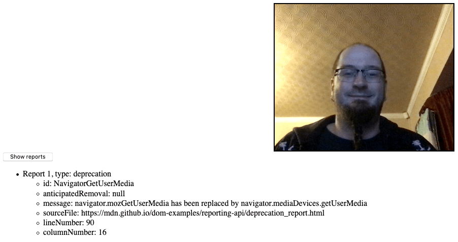

{{APIRef("Reporting API")}}

The `Report` interface of the [Reporting API](/en-US/docs/Web/API/Reporting_API) represents a single report.

Reports can be accessed in a number of ways:

- Via the {{domxref("ReportingObserver.takeRecords()")}} method — this returns all reports in an observer's report queue, and then empties the queue.
- Via the `reports` parameter of the callback function passed into the [`ReportingObserver()`](/en-US/docs/Web/API/ReportingObserver/ReportingObserver) constructor upon creation of a new observer instance. This contains the list of reports currently contained in the observer's report queue.
- By sending requests to the endpoints defined via the {{httpheader("Report-To")}} HTTP header.

## Instance properties

- {{domxref("Report.body")}} {{ReadOnlyInline}}
  - : The body of the report, which is a `ReportBody` object containing the detailed report information.
- {{domxref("Report.type")}} {{ReadOnlyInline}}
  - : The type of report generated, e.g. `deprecation` or `intervention`.
- {{domxref("Report.url")}} {{ReadOnlyInline}}
  - : The URL of the document that generated the report.

## Instance methods

_This interface has no methods defined on it._

## Events

_This interface has no events that fire on it._

## Examples

In our [deprecation_report.html](https://mdn.github.io/dom-examples/reporting-api/deprecation_report.html) example, we create a simple reporting observer to observe usage of deprecated features on our web page:

```js
const options = {
  types: ["deprecation"],
  buffered: true,
};

const observer = new ReportingObserver((reports, observer) => {
  reportBtn.onclick = () => displayReports(reports);
}, options);
```

We then tell it to start observing reports using {{domxref("ReportingObserver.observe()")}}; this tells the observer to start collecting reports in its report queue, and runs the callback function specified inside the constructor:

```js
observer.observe();
```

Because of the event handler we set up inside the `ReportingObserver()` constructor, we can now click the button to display the report details.



The report details are displayed via the `displayReports()` function, which takes the observer callback's `reports` parameter as its parameter:

```js
function displayReports(reports) {
  const outputElem = document.querySelector(".output");
  const list = document.createElement("ul");
  outputElem.appendChild(list);

  reports.forEach((report, i) => {
    let listItem = document.createElement("li");
    let textNode = document.createTextNode(
      `Report ${i + 1}, type: ${report.type}`,
    );
    listItem.appendChild(textNode);
    let innerList = document.createElement("ul");
    listItem.appendChild(innerList);
    list.appendChild(listItem);

    for (const key in report.body) {
      const innerListItem = document.createElement("li");
      const keyValue = report.body[key];
      innerListItem.textContent = `${key}: ${keyValue}`;
      innerList.appendChild(innerListItem);
    }
  });
}
```

The `reports` parameter contains an array of all the reports in the observer's report queue. We loop over each report using a [`forEach()`](/en-US/docs/Web/JavaScript/Reference/Global_Objects/Array/forEach) loop, then iterate over each entry of in the report's body using a [`for...in`](/en-US/docs/Web/JavaScript/Reference/Statements/for...in) structure, displaying each key/value pair inside a list item.

## Specifications

{{Specifications}}

## Browser compatibility

{{Compat}}

## See also

- [Reporting API](/en-US/docs/Web/API/Reporting_API)
