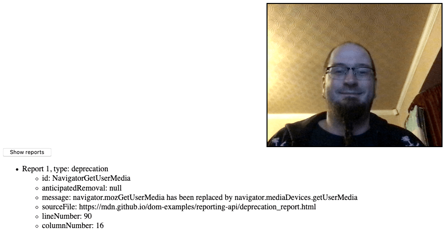

{{SeeCompatTable}}{{DefaultAPISidebar("Reporting API")}}{{AvailableInWorkers}}

The Reporting API provides a generic reporting mechanism for web applications to use to make reports available based on various platform features (for example [Content Security Policy](/en-US/docs/Web/HTTP/CSP), [Permissions-Policy](/en-US/docs/Web/HTTP/Headers/Permissions-Policy), or feature deprecation reports) in a consistent manner.

## Concepts and usage

There are several different features and problems on the web platform that generate information useful to web developers when they are trying to fix bugs or improve their websites in other ways. Such information can include:

- [Content Security Policy](/en-US/docs/Web/HTTP/CSP) violations.
- [Permissions-Policy](/en-US/docs/Web/HTTP/Headers/Permissions-Policy) violations.
- Deprecated feature usage (when you are using something that will stop working soon in browsers).
- Occurrence of crashes.
- Occurrence of user-agent interventions (when the browser blocks something your code is trying to do because it is deemed a security risk for example, or just plain annoying, like auto-playing audio).

The purpose of the Reporting API is to provide a consistent reporting mechanism that can be used to make such information available to developers in the form of reports represented by JavaScript objects. There are a few ways to use it, which are detailed in the sections below.

### Reporting server endpoints

Each unique origin you want to get reports for can be given a series of "endpoints", which are named URLs (or groups of URLs) that can be sent reports from a user agent.
A reporting server at these endpoints can collect the reports, and process and present them as needed by your application.

The {{httpheader("Reporting-Endpoints")}} HTTP header is used to specify details about the different endpoints that a user-agent has available to it for delivering reports.
The `report-to` directive can then be used on particular HTTP response headers to indicate the specific endpoint that will be used for the associated report.
For example, the CSP {{CSP("report-to")}} directive can be used on the {{HTTPHeader("Content-Security-Policy")}} or {{HTTPHeader("Content-Security-Policy-Report-Only")}} HTTP headers to specify the endpoint that CSP violation reports should be sent to.

> [!NOTE]
> There is no absolute guarantee of report delivery — a report could still fail to be collected if a serious error occurs.

The reports themselves are sent to the target endpoint by the user agent in a `POST` operation with a {{HTTPHeader("Content-Type")}} of `application/reports+json`.
They are serializations of {{domxref("Report")}} objects, where the `type` indicates the type of report, the `url` indicates the origin of the report, and the `body` contains a serialization of the API interface that corresponds to the report type.
For example, CSP violation reports have a `type` of `csp-violation` and a `body` that is a serialization of a {{domxref("CSPViolationReportBody")}} object.

Reports sent to endpoints can be retrieved independently of the running of the websites they relate to, which is useful — a crash for example could bring down a website and stop anything running, but a report could still be obtained to give the developer some clues as to why it happened.

### Reporting observers

Reports can also be obtained via {{domxref("ReportingObserver")}} objects created via JavaScript inside the website you are aiming to get reports on.
This method is not as failsafe as sending reports to the server because any page crash could stop you retrieving the reports — but it is easier to set up, and more flexible.

A `ReportingObserver` object is created using the {{domxref("ReportingObserver.ReportingObserver", "ReportingObserver()")}} constructor, which is passed two parameters:

- A callback function with two parameters — an array of the reports available in the observer's report queue and a copy of the same `ReportingObserver` object, which allows observation to be controlled directly from inside the callback. The callback runs when observation starts.
- An options dictionary that allows you to specify the type of reports to collect, and whether reports generated before the observer was created should be observable (`buffered: true`).

Methods are then available on the observer to start collecting reports ({{domxref("ReportingObserver.observe()")}}), retrieve the reports currently in the report queue ({{domxref("ReportingObserver.takeRecords()")}}), and disconnect the observer so it can no longer collect records ({{domxref("ReportingObserver.disconnect()")}}).

### Report types

Reports sent to reporting endpoints and reporting observers are essentially the same: they have an origin `url`, a `type`, and a `body` that is an instance of the interface corresponding with that type.
The only difference is that server reports are JSON serializations of the objects.

The mapping of report `type` to `body` is shown below.

| `type`          | `body`                                | Items reported                                                                   |
| --------------- | ------------------------------------- | -------------------------------------------------------------------------------- |
| `deprecation`   | {{domxref("DeprecationReportBody")}}  | Deprecated features used by the site.                                            |
| `intervention`  | {{domxref("InterventionReportBody")}} | Features blocked by the user agent, for example, if permissions are not granted. |
| `csp-violation` | {{domxref("CSPViolationReportBody")}} | Violations of the site's CSP policy.                                             |

### Generating reports via WebDriver

The Reporting API spec also defines a Generate Test Report [WebDriver](/en-US/docs/Web/WebDriver) extension, which allows you to simulate report generation during automation. Reports generated via WebDriver are observed by any registered `ReportObserver` objects present in the loaded website. This is not yet documented.

## Interfaces

- {{domxref("DeprecationReportBody")}}
  - : Contains details of deprecated web platform features that a website is using.
- {{domxref("InterventionReportBody")}}
  - : Contains details of an intervention report, which is generated when a request made by the website has been denied by the browser; e.g. for security reasons.
- {{domxref("Report")}}
  - : An object representing a single report.
- {{domxref("ReportingObserver")}}
  - : An object that can be used to collect and access reports as they are generated.

### Related interfaces

These interfaces are defined as part of the HTTP [Content Security Policy (CSP)](/en-US/docs/Web/HTTP/CSP) specifications:

- {{domxref("CSPViolationReportBody")}}
  - : Contains details of a CSP violation.
- {{domxref("SecurityPolicyViolationEvent")}}
  - : Represents the event object of a `securitypolicyviolation` event fired on an element, document, or worker when its CSP is violated.

## Related HTTP Headers

These HTTP response headers define the endpoints where reports are sent.

- {{HTTPHeader("Reporting-Endpoints")}}
  - : Sets the name and URL of reporting endpoints.
    These endpoints can be used in the `report-to` directive, which may be used with a number of HTTP headers including {{httpheader("Content-Security-Policy")}} and or {{HTTPHeader("Content-Security-Policy-Report-Only")}}.
- {{HTTPHeader("Report-To")}} {{deprecated_inline}}
  - : Sets the name and URL of reporting endpoint groups, which may be used with a number of HTTP headers including `Content-Security-Policy`.

Report endpoints can be set for the following reports using the `report-to` directive on the corresponding headers:

- CSP Violations

  - : {{CSP("report-to")}} on {{HTTPHeader("Content-Security-Policy")}} or {{HTTPHeader("Content-Security-Policy-Report-Only")}}.

## Examples

### Reporting deprecated features

In our [deprecation_report.html](https://mdn.github.io/dom-examples/reporting-api/deprecation_report.html) example, we create a simple reporting observer to observe usage of deprecated features on our web page:

```js
const options = {
  types: ["deprecation"],
  buffered: true,
};

const observer = new ReportingObserver((reports, observer) => {
  reportBtn.onclick = () => displayReports(reports);
}, options);
```

We then tell it to start observing reports using {{domxref("ReportingObserver.observe()")}}; this tells the observer to start collecting reports in its report queue, and runs the callback function specified inside the constructor:

```js
observer.observe();
```

Later on in the example we deliberately use the deprecated version of {{domxref("MediaDevices.getUserMedia()")}}:

```js
if (navigator.mozGetUserMedia) {
  navigator.mozGetUserMedia(constraints, success, failure);
} else {
  navigator.getUserMedia(constraints, success, failure);
}
```

This causes a deprecation report to be generated; because of the event handler we set up inside the `ReportingObserver()` constructor, we can now click the button to display the report details.



> [!NOTE]
> If you look at the [complete source code](https://github.com/mdn/dom-examples/blob/main/reporting-api/deprecation_report.html), you'll notice that we actually call the deprecated `getUserMedia()` method twice. After the first time we call {{domxref("ReportingObserver.takeRecords()")}}, which returns the first generated report and empties the queue. Because of this, when the button is pressed only the second report is listed.

## Specifications

{{Specifications}}

## Browser compatibility

The API is supported by Chromium browsers, and by Firefox behind a preference (`dom.reporting.enabled`).

See the specific interfaces for more detailed support information.

## See also

- [Content Security Policy](/en-US/docs/Web/HTTP/CSP)
- [`Permissions-Policy`](/en-US/docs/Web/HTTP/Headers/Permissions-Policy)
