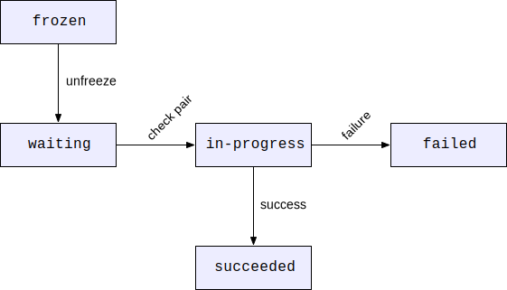

{{APIRef("WebRTC")}}

The **`state`** property in a string that indicates the state of the check list of which the candidate pair is a member.

## Value

A string whose value is one of the following:

- `failed`
  - : A check for this pair has been performed but failed. A failure can occur either because no response was received or because the response indicated that an unrecoverable error occurred.
- `frozen`
  - : No check has been performed yet for this candidate pair, and performing the check is blocked until another check is successful. Once that check has succeeded, this pair will unfreeze and move into the `waiting` state.
- `in-progress`
  - : A check has been initiated for this pair, but the check's transaction is still in progress.
- `succeeded`
  - : A check for this pair has been completed successfully.
- `waiting`
  - : This pair has not yet been checked, but the check can be performed as soon as this pair is the highest priority pair remaining in the `waiting` state.

## ICE check lists

During ICE negotiation, the ICE layer builds up a **check list**, which is
a list of potential pairings of ICE candidates. Each pair has a state, represented by a string literal.

When a candidate pair is added to the check list, it begins in the `frozen`
state. As soon as there are no checks ongoing which block the pair from being analyzed,
it is unfrozen and moves into the `waiting` state. This may happen
immediately upon being added to the check list.

Each time a candidate pair is done being checked, the next-highest priority candidate
pair remaining on the check list moves from the `waiting` state to the
`in-progress` state, and its check begins. If the check fails for any reason,
the pair moves into its final state, `failed`. If the check succeeds, the
pair ends up in the `succeeded` state.

The ICE check list state for any given pair of ICE candidates can be found in the
corresponding the `state` property.

## Specifications

{{Specifications}}

## Browser compatibility

{{Compat}}
