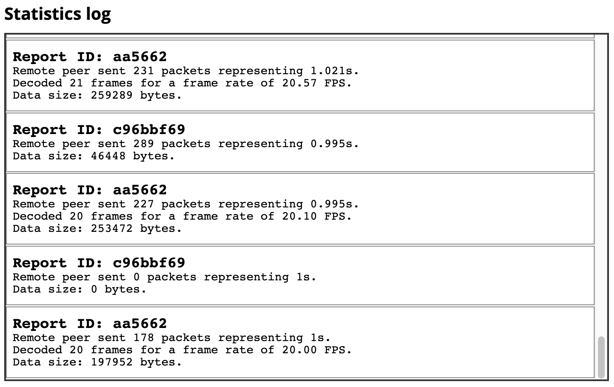

{{APIRef("WebRTC")}}

The {{domxref("RTCRemoteOutboundRtpStreamStats")}}
dictionary's **`localId`** property is a string which can be
used to identify the {{domxref("RTCInboundRtpStreamStats")}} object whose
{{domxref("RTCInboundRtpStreamStats.remoteId", "remoteId")}} matches this value.

Together, these two objects provide statistics about the inbound and outbound
sides of the same synchronization source (SSRC).

## Value

A string which can be compared to the value of an
{{domxref("RTCInboundRtpStreamStats")}} object's
{{domxref("RTCInboundRtpStreamStats.remoteId", "remoteId")}} property to see if the two
represent statistics for each of the two sides of the same set of data received by the
local peer.

## Usage notes

You can think of the local and remote views of the same RTP stream as pairs, each of
which has a reference back to the other one. Thus, if an {{domxref("RTCStatsReport")}}
includes an `remote-outbound-rtp` statistics object (of type
`RTCRemoteOutboundRtpStreamStats`), it should also have a corresponding
`inbound-rtp` object. Both of these provide information about the same batch
of packets being transmitted from the remote peer to the local device. The difference is
that `remote-outbound-rtp` describes statistics about the transmission(s)
from the perspective of the remote peer, while `inbound-rtp` offers
statistics about the incoming data from the local peer's perspective.

You can [examine, try out, and experiment](#try_it_and_fork_it) with this
example on Glitch.

## Examples

In this example, we have a pair of functions: the first,
`networkTestStart()`, captures an initial report, and the second,
`networkTestStop()`, captures a second report.
The second function uses the two reports to output some information about the network conditions.

### networkTestStart()

This function calls the {{domxref("RTCPeerConnection")}} method
{{domxref("RTCPeerConnection.getStats", "getStats()")}} to request an
{{domxref("RTCStatsReport")}} and store it in the variable `startReport`.

```js
let startReport;

async function networkTestStart(pc) {
  if (pc) {
    startReport = await pc.getStats();
  }
}
```

Given an {{domxref("RTCPeerConnection")}}, `pc`, this calls its
{{domxref("RTCPeerConnection.getStats", "getStats()")}} method to obtain a statistics
report object, which it stores in `startReport` for use once the end-of-test
data has been collected by `networkTestStop()`.

### networkTestStop()

The `networkTestStop()` function obtains a second report,
`endReport`, then computes and outputs the results.

#### Finding paired statistics

Each statistics record of {{domxref("RTCStats.type", "type")}}
`remote-outbound-rtp` (describing a remote peer's statistics about sending
data to the local peer) has a corresponding record of type `inbound-rtp`
which describes the local peer's perspective on the same data being moved between the
two peers. Let's create a utility function to help us look up the value of a key in the
paired statistics object.

The `findReportEntry()` function shown below examines
an {{domxref("RTCStatsReport")}}, returning the {{domxref("RTCStats")}}-based statistics
record which contains the specified `key` — _and_ for which the key
has the specified `value`. If no match is found (or the statistics report has
no record corresponding to the statistics category indicated by `key`.

```js
function findReportEntry(report, key, value) {
  for (const stats of report.values()) {
    if (stats[key] === value) {
      return stats;
    }
  }
  return null;
}
```

Since the `RTCStatsReport` is a JavaScript
[`Map`](/en-US/docs/Web/JavaScript/Reference/Global_Objects/Map),
we can iterate over the map's
[`values()`](/en-US/docs/Web/JavaScript/Reference/Global_Objects/Map/values)
to examine each of the `RTCStats`-based statistics records in the report
until we find one that has the `key` property with the specified
`value`. When a match is found, the statistics object is returned.

If no match is found, the function returns `null`.

#### The main networkTestStop() function

Now let's look at the `networkTestStop()` function itself. It takes as input
the {{domxref("RTCPeerConnection")}} being tested, calls `getStats()` to get
a new `RTCStatsReport` with current statistics, then computes the results
it's looking for, outputting those results as appropriate to the user by appending
appropriate HTML to the contents of the {{HTMLElement("div")}} element whose class is
`stats-box`.

```js
async function networkTestStop(pc) {
  if (pc) {
    const statsBox = document.querySelector(".stats-box");
    const endReport = await pc.getStats();

    for (const endRemoteOutbound of endReport.values()) {
      if (endRemoteOutbound.type === "remote-outbound-rtp") {
        const startRemoteOutbound = startReport.get(endRemoteOutbound.id);

        if (startRemoteOutbound) {
          const startInboundStats = findReportEntry(startReport, "remoteId", startRemoteOutbound.id);
          const endInboundStats = findReportEntry(endReport, "remoteId", endRemoteOutbound.id);

          const elapsedTime = (endRemoteOutbound.timestamp - startRemoteOutbound.timestamp) / 1000;    /* in seconds */
          const packetsSent = endRemoteOutbound.packetsSent - startRemoteOutbound.packetsSent;
          const bytesSent = endRemoteOutbound.bytesSent - startRemoteOutbound.bytesSent;
          const framesDecoded = endInboundStats.framesDecoded - startInboundStats.framesDecoded;
          const frameRate = framesDecoded / elapsedTime;

          let timeString = "";
          if (!isNaN(elapsedTime)) {
            timeString = ` representing ${elapsedTime}s`;
          }

          let frameString = "";
          if (!isNaN(framesDecoded)) {
            frameString = `Decoded ${framesDecoded} frames for a frame rate of ${frameRate.toFixed(2)} FPS.<br>`;
          }

          const logEntry = `<div class="stats-entry"><h2>Report ID: ${endRemoteOutbound.id}</h2>` +
                         `Remote peer sent ${packetsSent} packets ${timeString}.<br>` +
                         `${frameString}` +
                         `Data size: ${bytesSent} bytes.</div>`;
          statsBox.innerHTML += logEntry;
        } else {
          statsBox.innerHTML += `<div class="stats-error">Unable to find initial statistics for ID ${endRemoteOutbound.id}.</div>`;
        }
      }

      statsBox.scrollTo(0, statsBox.scrollHeight);
    }
  }
}
```

Here's what's going on in the `networkTestStop()` function: after calling
the {{domxref("RTCPeerConnection")}} method {{domxref("RTCPeerConnection.getStats",
  "getStats()")}} to get the latest statistics report for the connection and storing it in
`endReport`. This is an {{domxref("RTCStatsReport")}} object, which maps
strings to objects of the
corresponding {{domxref("RTCStats")}}-based type.

Now we can begin to process the results, starting with the ending statistics found in
`endReport`. In this case, we're looking for statistics records whose
`type` is `remote-outbound-rtp`, so we iterate over the entries in
the statistics report until we find an entry of that type. This object is, specifically,
of type {{domxref("RTCRemoteOutboundRtpStreamStats")}}, and it provides statistics
giving details about the state of things _from the perspective of the remote
peer_. This statistics record is stored in `endRemoteOutbound`.

Once the ending `remote-outbound-rtp` record is found, we use
its {{domxref("RTCStats.id", "id")}} property to get its ID. WIth that in hand, we can
look up the `remote-outbound-rtp` record in the starting statistics record
(`startReport`), which we store into `startRemoteOutbound`.

Now we obtain the `inbound-rtp` statistics that correspond to these two
`remote-outbound-rtp` records by finding the `remoteId` property
within them whose value is the ID of the `remote-outbound-rtp` record. We use
the `findReportEntry()` function described in the previous section for that,
storing the located `inbound-rtp` records in `startInboundStats`
and `endInboundStats`.

Now we have all the raw statistics needed to calculate the information we want to
display, so we do so:

- We calculate the amount of time—`elapsedTime`—that elapsed between the
  two reports being sent by subtracting the {{domxref("RTCStats.timestamp",
    "timestamp")}} `startReport` from that of `endReport`. We then
  divide by 1000 to convert the result from milliseconds to seconds.
- We compute the number of packets sent during this
  interval—`packetsSent`—by subtracting the two reports' values for the
  {{domxref("RTCSentRtpStreamStats.packetsSent", "packetsSent")}} property.
- Similarly, the number of bytes sent during this interval—`bytesSent`—is
  calculated by subtracting the starting statistics object's
  {{domxref("RTCSentRtpStreamStats.bytesSent", "bytesSent")}} property from that of the
  ending statistics.
- The number of frames decoded during this interval—`framesDecoded`—is
  determined by subtracting `startRecord`'s
  {{domxref("RTCInboundRtpStreamStats.framesDecoded", "framesDecoded")}} from
  `endRecord.framesDecoded`.
- Finally, the frame rate over the elapsed time span is calculated by dividing
  `framesDecoded` by `elapsedTime`.

The remainder of the `networkTestStop()` function constructs the HTML used
to display the output of the collected and computed results to the user, then append it
to the element `statsBox`, which we're using to show the status updates to
the user.

The output log, given the styles used by the example, looks like this:



In the screenshot, we see a heading followed by the scrollable {{HTMLElement("div")}}
we refer to as `statsBox`. The box contains a number of log entries, the last
handful of which are visible. Each one represents approximately one second of time
(since that's much time we're waiting between calling `networkTestStart()`
and `networkTestStop()`).

### Try it and fork it

This example is [available on Glitch for you to try out](https://websocket-webrtc-chat-with-stats.glitch.me), examine, or remix.

[Remix It](https://glitch.com/edit/?utm_content=project_websocket-webrtc-chat-with-stats&utm_source=remix_this&utm_medium=button&utm_campaign=glitchButton#!/remix/websocket-webrtc-chat-with-stats)

[View Source](https://glitch.com/edit/?utm_content=project_websocket-webrtc-chat-with-stats&utm_source=view_source&utm_medium=button&utm_campaign=glitchButton#!/websocket-webrtc-chat-with-stats)

## Specifications

{{Specifications}}

## Browser compatibility

{{Compat}}
