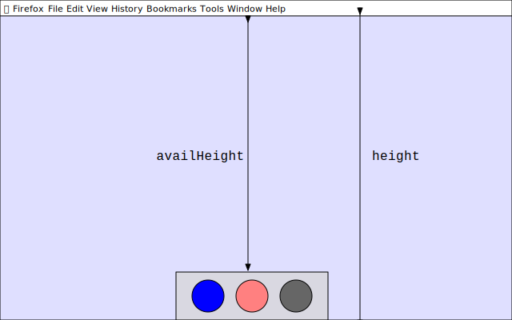
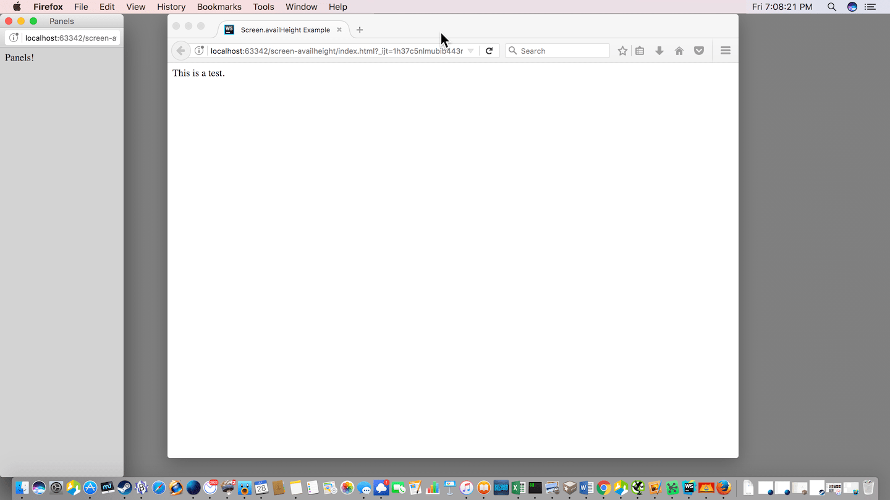

{{APIRef("CSSOM")}}

The read-only {{DOMxRef("Screen")}} interface's
**`availHeight`** property returns the height, in CSS pixels, of
the space available for Web content on the screen. Since {{DOMxRef("Screen")}} is
exposed on the {{DOMxRef("Window")}} interface's {{DOMxRef("Window.screen", "window.screen")}}
property, you access `availHeight` using `window.screen.availHeight`.

You can similarly use {{DOMxRef("Screen.availWidth")}} to get the number of pixels
which are horizontally available to the browser for its use.

## Value

A numeric value indicating the number of CSS pixels tall the screen's available space
is. This can be no larger than the value of {{DOMxRef("Screen.height", "window.screen.height")}},
and will be less if the device or user agent reserves any
vertical space for itself.

For instance, on a Mac whose Dock is located at the bottom of screen (which is the default), the value of `availHeight` is approximately the value of `height` (the total height of the screen in CSS pixels) minus the heights of the Dock and menu bar, as seen in the diagram below. They only take up `availHeight` if they are always shown: if the page is fullscreened, or if the dock is configured to automatically hide and show, then they won't be counted in `availHeight`.



## Examples

If your web application needs to open a new window, such as a tool palette which can
contain multiple panels, and wants to position it so that it occupies the entire
vertical space available, you can do so using code similar to what's seen here.

In the main window, when it's time to open the panels, code like the following is used.

```js
const paletteWindow = window.open(
  "panels.html",
  "Panels",
  "left=0, top=0, width=200",
);
```

The Panels window's HTML, in `panels.html`, has JavaScript code of its own,
which is executed as soon as the window is created. It doesn't even need to wait for any
particular event (or any event at all). That code handles resizing the window based on
the available space:

```js
window.outerHeight = window.screen.availHeight;
```

The result is something similar to the below. Note the Panels window filling all
available vertical space at the left of the screen.



On a Windows system, this would function similarly, by opening the window and sizing it
vertically so it uses all available vertical space, leaving room for the taskbar and any
other interface elements that reserve space.

## Specifications

{{Specifications}}

## Browser compatibility

{{Compat}}

## See also

- {{DOMxRef("Window")}}
- {{DOMxRef("Screen")}}
- {{DOMxRef("Screen.availWidth")}}
- {{DOMxRef("Window.innerHeight")}}
