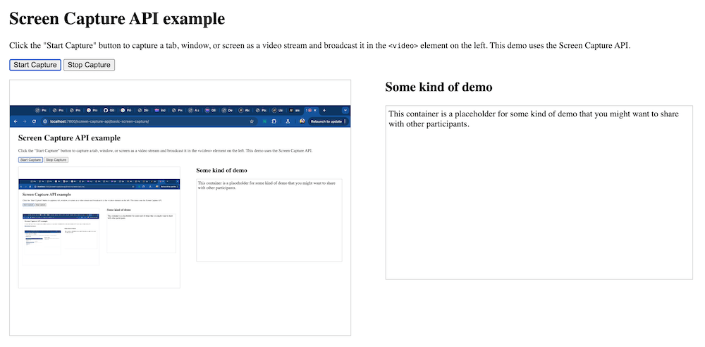

{{DefaultAPISidebar("Screen Capture API")}}

This guide provides a walkthrough of typical usage of the Element Capture and Region Capture APIs, showing how to use them and the problem they solve.

## Background

By default, the [Screen Capture API](/en-US/docs/Web/API/Screen_Capture_API) captures an entire screen, window, or tab. The Element Capture and Region Capture APIs respectively enable you to restrict the captured stream to a specific rendered DOM tree, or to the part of the screen defined by a specific DOM tree's bounding box.

This is useful when you want to share only a limited region to cut down on unnecessary bandwidth or screen space required to show the capture, or for privacy reasons (you might not want to show other participants your message notifications, or background settings required to run the demo you are sharing).

In addition, when capturing your web cam output, you can end up with one of those undesirable "infinite wormhole" or "hall of mirrors" type effects. The Element Capture and Region Capture APIs can help you avoid these kinds of problems too.

## When to use each API

The Element Capture API captures the element itself (and its descendants), whereas the Region Capture API captures the area of the browser tab defined by the bounding box of the target element. Element Capture will always show just the captured element, even if other DOM content overlaps it, whereas Region Capture can result in overlapping content being shown over the top of the content you intended to share.

There are legitimate use cases for both:

- If you need to keep the capture specific to one DOM tree, and exclude anything outside it, then the Element Capture API is a better choice. For example, you don't want private content such as a set of message notifications or a speaker notes UI showing up in the capture.
- However, if you really do want to capture a region of the browser tab, regardless of what is shown in it, the Region Capture API will serve you well. The [Region Capture Demo](https://region-capture-demo.glitch.me/) (see the [source code](https://glitch.com/edit/#!/region-capture-demo)) shows a useful possibility — zooming in on a particular area of the tab as you show multiple users an interactive walkthrough of some kind.

In the next section we'll start with a basic Screen Capture API demo to illustrate the issues that the Element Capture and Region Capture APIs were created to solve.

## Screen Capture API demo

This demo uses the Screen Capture API to capture a window, screen, or tab, and broadcast the stream via a {{htmlelement("video")}} element on the same page. You can see it running live at [Screen Capture API example](https://mdn.github.io/dom-examples/screen-capture-api/basic-screen-capture) (also see the [source code](https://github.com/mdn/dom-examples/tree/main/screen-capture-api/basic-screen-capture)).

### HTML

The HTML starts off with a main heading and intro text, then includes two {{htmlelement("button")}} elements to start and stop the capture:

```html
<h1>Screen Capture API example</h1>
<p>
  This example shows you the contents of the selected part of your display.
  Click the Start Capture button to begin.
</p>

<p>
  <button id="start">Start Capture</button>&nbsp;
  <button id="stop">Stop Capture</button>
</p>
```

Next, we include the main app container, which contains the `<video>` element to broadcast the capture, and plus a demo placeholder {{htmlelement("div")}}:

```html
<div id="main-app">
  <video autoplay></video>
  <div id="demo">
    <h2>Some kind of demo</h2>
    <p>
      This container is a placeholder for some kind of demo that you might want
      to share with other participants.
    </p>
  </div>
</div>
```

### CSS

The CSS for this demo is mostly unremarkable, but the following few rules are worth explaining. We've hidden the rest of the CSS for brevity.

```css hidden
* {
  box-sizing: border-box;
}

body {
  padding: 0 25px;
}

video,
#demo > p {
  border: 1px solid #ccc;
  margin: 0;
}

#demo > h2 {
  margin-top: 0;
}

#demo > p {
  padding: 5px;
  height: 320px;
}
```

We set a {{cssxref("display")}} value of `flex` on the `main-app` `<div>` to lay the video and the demo placeholder out side by side in two columns, setting a {{cssxref("gap")}} of `5%` between them. We also set a {{cssxref("min-width")}} of `980px` on the container, essentially limiting the demo app to being a desktop layout. This is because Element Capture and Region Capture are only supported on desktop browsers, and off-screen content is not captured.

```css
#main-app {
  display: flex;
  gap: 5%;
  min-width: 980px;
}
```

We also give the `<video>` element and the `demo` `<div>` a {{cssxref("flex")}} value of `1`, so they will take up the same amount of horizontal space.

```css
video,
#demo {
  flex: 1;
}
```

Finally, we give the `<video>` element a {{cssxref("max-width")}} of `50%` and a fixed {{cssxref("aspect-ratio")}} of `4/3`. This is to keep the video at a consistent size and avoid too much layout upheaval when the screen capture starts to be broadcast. If we didn't do this, the `<video>` element would grow to the same width as the entire captured area (window or screen), which would affect the layout. It is a [replaced element](/en-US/docs/Web/CSS/Replaced_element), after all, so its [intrinsic size](/en-US/docs/Glossary/Intrinsic_Size) depends on that of its content.

```css
video {
  max-width: 50%;
  aspect-ratio: 4/3;
}
```

Layout shift can also cause problems when using the Region and Element Capture APIs, hence this code is included in all three demos.

### JavaScript

The JavaScript for this example is adapted from the [Streaming screen capture](/en-US/docs/Web/API/Screen_Capture_API/Using_Screen_Capture#streaming_screen_capture) example in our "Using the Screen Capture API" guide. We won't repeat the full code explanation here; we'll just explain the most relevant capture code.

In the options object passed into `getDisplayMedia()` when we invoke it, we set [`preferCurrentTab: true`](/en-US/docs/Web/API/MediaDevices/getDisplayMedia#prefercurrenttab). This hint suggests that the browser should offer the user's current tab as the most prominent capture source in the dialog that asks them what to share. Chrome, for example, only gives them this option when `preferCurrentTab: true` is set.

```js
const displayMediaOptions = {
  video: {
    displaySurface: "window",
  },
  preferCurrentTab: true,
};
```

This option is very useful if you are building an app with a built-in "share screen" option — you don't want to allow users to share a different tab or window.

When the "Start Capture" button is pressed, the `startCapture()` function runs, which invokes {{domxref("MediaDevices.getDisplayMedia()")}}. This causes the browser to prompt the user to choose a surface to share (window, tab, etc.). Once a choice is made, the resulting {{domxref("MediaStream")}} is set to the value of the `<video>` element's {{domxref("HTMLMediaElement.srcObject")}} property to broadcast it:

```js
async function startCapture() {
  try {
    videoElem.srcObject =
      await navigator.mediaDevices.getDisplayMedia(displayMediaOptions);
  } catch (err) {
    console.error(err);
  }
}
```

## Screen Capture API issues

Run the demo above in a [supporting browser](/en-US/docs/Web/API/Screen_Capture_API#browser_compatibility), click "Start Capture", and select the same tab the demo is running in. You will see the "hall of mirrors effect", as mentioned earlier:



This obviously isn't ideal, and would cause issues in any kind of conferencing application with a built-in "share screen" option.

## The Element Capture API

The Element Capture API restricts the captured region to a specified rendered DOM tree (a selected element and its descendants). In this section we will explore a second demo that is identical to the one presented above, except that it uses Element Capture on top of basic Screen Capture. See this demo running live at [Element Capture API example](https://mdn.github.io/dom-examples/screen-capture-api/element-capture) (also see the [source code](https://github.com/mdn/dom-examples/tree/main/screen-capture-api/element-capture)).

The HTML is identical to the previous example, and the CSS is _nearly_ identical. We'll explain the differences in the JavaScript now, then look at the CSS differences later on, in the [Issues with the Element Capture API](#issues-with-the-element-capture-api) section.

To use the Element Capture API, we additionally grab a reference to a DOM element that we will later use as a **restriction target** — the screen area shown in the stream will be restricted to just that rendered element and its descendants:

```js
const demoElem = document.querySelector("#demo");
```

The other code differences are all in the modified `startCapture()` function:

```js
async function startCapture() {
  try {
    const stream =
      await navigator.mediaDevices.getDisplayMedia(displayMediaOptions);
    const [track] = stream.getVideoTracks();
    const restrictionTarget = await RestrictionTarget.fromElement(demoElem);
    await track.restrictTo(restrictionTarget);
    videoElem.srcObject = stream;
  } catch (err) {
    console.error(err);
  }
}
```

1. Here, we start by grabbing the media stream as before, using `mediaDevices.getDisplayMedia()`.
2. We then isolate the video track from the stream using {{domxref("MediaStream.getVideoTracks()")}}.
3. We create the necessary `restrictionTarget` object to apply the restriction to the video track by running {{domxref("RestrictionTarget.fromElement_static", "RestrictionTarget.fromElement()")}}, passing to it the DOM element reference we grabbed earlier.
4. We apply the restriction target to the track by calling {{domxref("BrowserCaptureMediaStreamTrack.restrictTo()")}} on it, passing it the `restrictionTarget` object.
5. Once all the above is done, we then set the `<video>` element's `srcObject` property value to the stream, to start broadcasting it.

Try running the [Element Capture API example](https://mdn.github.io/dom-examples/screen-capture-api/element-capture) in a [supporting browser](/en-US/docs/Web/API/RestrictionTarget#browser_compatibility) now. You should see that only the demo placeholder is included in the stream, thereby fixing the "hall of mirrors" problem.

> [!NOTE]
> You can stop the restriction by calling `restrictTo()` again on the same track, passing an argument of `null` to it:
>
> ```js
> await track.restrictTo(null);
> ```

### Restrictions on the Element Capture API

To ensure that the element is **eligible for restriction**, that is, it will be captured when chosen as the restriction target element, it must form a [stacking context](/en-US/docs/Web/CSS/CSS_positioned_layout/Understanding_z-index/Stacking_context) and be flattened in 3D space.

To handle these restrictions, we've set the following additional CSS rule that targets the demo container element:

```css
#demo {
  /* Forms a stacking context */
  isolation: isolate;
  /* Flattened */
  transform-style: flat;
  /* Explicit background color to stop the capture being transparent */
  background-color: white;
}
```

The {{cssxref("isolation")}} property is set to `isolate` to make the element form a stacking context, and the {{cssxref("transform-style")}} property is set to `flat` to flatten it. Also, because of the nature of the isolation we've set, the element will no longer inherit the page's default white color. As a result, we set {{cssxref("background-color")}} to `white` to stop the capture being transparent.

For the full list of restrictions on the elements that can be used as restriction targets, see the [`RestrictionTarget.fromElement()`](/en-US/docs/Web/API/RestrictionTarget/fromElement_static#element) reference page.

## The Region Capture API

The Region Capture API has a very similar effect to the Element Capture API, except that rather than restricting the captured region to a specific rendered DOM tree, it crops the stream to the area of the current browser tab defined by the bounding box of the target element. Let's look at a demo and then explore the differences between the two in more detail later on.

In this section we will explore a third demo that is identical to the others, except that it uses Region Capture on top of basic Screen Capture. See this demo running live at [Region Capture API example](https://mdn.github.io/dom-examples/screen-capture-api/region-capture) (also see the [source code](https://github.com/mdn/dom-examples/tree/main/screen-capture-api/region-capture)).

The HTML and CSS are identical to the previous examples. The JavaScript is nearly the same as the Element Capture JavaScript, with a few notable differences that we'll now explain.

To use the Region Capture API, we first grab a reference to a DOM element that we will later use as a **crop target** — the region shown in the stream will be cropped to just the area that element is rendered in:

```js
const demoElem = document.querySelector("#demo");
```

Now let's examine the Region Capture demo's `startCapture()` function:

```js
async function startCapture() {
  try {
    const stream =
      await navigator.mediaDevices.getDisplayMedia(displayMediaOptions);
    const [track] = stream.getVideoTracks();
    const cropTarget = await CropTarget.fromElement(demoElem);
    await track.cropTo(cropTarget);
    videoElem.srcObject = stream;
  } catch (err) {
    console.error(err);
  }
}
```

1. As before, we start by grabbing the media stream using `mediaDevices.getDisplayMedia()`, then isolate the video track from the stream using {{domxref("MediaStream.getVideoTracks()")}}.
2. We create the necessary `cropTarget` object to apply the crop to the video track by running {{domxref("CropTarget.fromElement_static", "fromElement()")}}, passing to it the DOM element reference we grabbed earlier.
3. We apply the crop target to the track by calling {{domxref("BrowserCaptureMediaStreamTrack.cropTo()")}} on it, passing it the `cropTarget` object.
4. Once all the above is done, we then set the `<video>` element's `srcObject` property value to the stream, to start broadcasting it.

Try running the [Region Capture API example](https://mdn.github.io/dom-examples/screen-capture-api/region-capture) in a [supporting browser](/en-US/docs/Web/API/CropTarget#browser_compatibility) now. You should see that only the demo placeholder is included in the stream, which also fixes the "hall of mirrors" problem.

> [!NOTE]
> You can stop the cropping by calling `cropTo()` again on the same track, passing an argument of `null` to it:
>
> ```js
> await track.cropTo(null);
> ```

### Restrictions on the Region Capture API

Region Capture doesn't have the same level of restrictions as Element Capture — it is cropping the stream to a particular size, rather than broadcasting a specific rendered DOM tree, so it doesn't require this rule:

```css
#demo {
  /* Forms a stacking context */
  isolation: isolate;
  /* Flattened */
  transform-style: flat;
  /* Explicit background color to stop the capture being transparent */
  background-color: white;
}
```

However, there are still restrictions on the elements that can be used as crop targets. For the full list, see the [`CropTarget.fromElement()`](/en-US/docs/Web/API/CropTarget/fromElement_static#element) reference page.

## See also

- [Capture a video stream from any element](https://developer.chrome.com/docs/web-platform/element-capture) on developer.chrome.com (2025)
- [Better tab sharing with Region Capture](https://developer.chrome.com/docs/web-platform/region-capture) on developer.chrome.com (2023)
- [Element Capture Demo](https://element-capture-demo.glitch.me/)
- [Region Capture Demo](https://region-capture-demo.glitch.me/)
