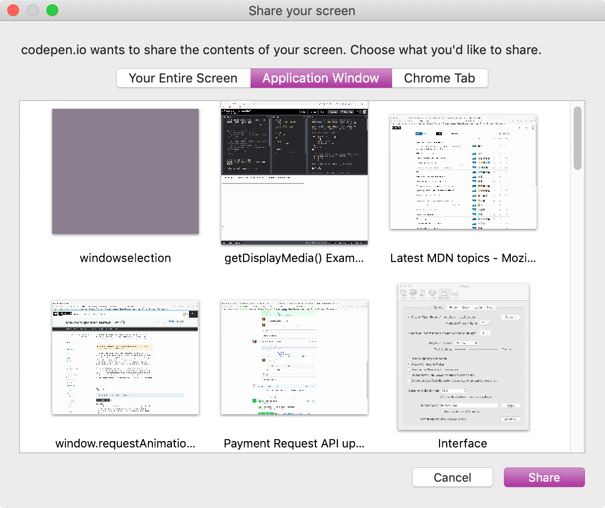

{{DefaultAPISidebar("Screen Capture API")}}

In this article, we will examine how to use the Screen Capture API and its {{domxref("MediaDevices.getDisplayMedia", "getDisplayMedia()")}} method to capture part or all of a screen for streaming, recording, or sharing during a [WebRTC](/en-US/docs/Web/API/WebRTC_API) conference session.

> [!NOTE]
> It may be useful to note that recent versions of the [WebRTC adapter.js shim](https://github.com/webrtcHacks/adapter) include implementations of `getDisplayMedia()` to enable screen sharing on browsers that support it but do not implement the current standard API. This works with at least Chrome, Edge, and Firefox.

## Capturing screen contents

Capturing screen contents as a live {{domxref("MediaStream")}} is initiated by calling {{domxref("MediaDevices.getDisplayMedia", "navigator.mediaDevices.getDisplayMedia()")}}, which returns a promise that resolves to a stream containing the live screen contents. The `displayMediaOptions` object referenced in the below examples might look something like this:

```js
const displayMediaOptions = {
  video: {
    displaySurface: "browser",
  },
  audio: {
    suppressLocalAudioPlayback: false,
  },
  preferCurrentTab: false,
  selfBrowserSurface: "exclude",
  systemAudio: "include",
  surfaceSwitching: "include",
  monitorTypeSurfaces: "include",
};
```

### Starting screen capture: `async`/`await` style

```js
async function startCapture(displayMediaOptions) {
  let captureStream = null;

  try {
    captureStream =
      await navigator.mediaDevices.getDisplayMedia(displayMediaOptions);
  } catch (err) {
    console.error(`Error: ${err}`);
  }
  return captureStream;
}
```

You can write this code either using an asynchronous function and the [`await`](/en-US/docs/Web/JavaScript/Reference/Operators/await) operator, as shown above, or using the {{jsxref("Promise")}} directly, as seen below.

### Starting screen capture: `Promise` style

```js
function startCapture(displayMediaOptions) {
  return navigator.mediaDevices
    .getDisplayMedia(displayMediaOptions)
    .catch((err) => {
      console.error(err);
      return null;
    });
}
```

Either way, the {{Glossary("user agent")}} responds by presenting a user interface that prompts the user to choose the screen area to share. Both of these implementations of `startCapture()` return the {{domxref("MediaStream")}} containing the captured display imagery.

See [Options and constraints](#options_and_constraints), below, for more on both how to specify the type of surface you want as well as other ways to adjust the resulting stream.

### Example of a window allowing the user to select a display surface to capture



You can then use the captured stream, `captureStream`, for anything that accepts a stream as input. The [examples](#examples) below show a few ways to make use of the stream.

### Visible vs. logical display surfaces

For the purposes of the Screen Capture API, a **display surface** is any content object that can be selected by the API for sharing purposes. Sharing surfaces include the contents of a browser tab, a complete window, and a monitor (or group of monitors combined together into one surface).

There are two types of display surface. A **visible display surface** is a surface which is entirely visible on the screen, such as the frontmost window or tab, or the entire screen.

A **logical display surface** is one which is in part or completely obscured, either by being overlapped by another object to some extent, or by being entirely hidden or offscreen. How these are handled by the Screen Capture API varies. Generally, the browser will provide an image which obscures the hidden portion of the logical display surface in some way, such as by blurring or replacing with a color or pattern. This is done for security reasons, as the content that cannot be seen by the user may contain data which they do not want to share.

A user agent might allow the capture of the entire content of an obscured window after gaining permission from the user to do so. In this case, the user agent may include the obscured content, either by getting the current contents of the hidden portion of the window or by presenting the most-recently-visible contents if the current contents are not available.

### Options and constraints

The options object passed into {{domxref("MediaDevices.getDisplayMedia", "getDisplayMedia()")}} is used to set options for the resulting stream.

The `video` and `audio` objects passed into the options object can also hold additional constraints particular to those media tracks. See [Properties of shared screen tracks](/en-US/docs/Web/API/MediaTrackConstraints#instance_properties_of_shared_screen_tracks) for details about additional constraints for configuring a screen-capture stream that are added to {{domxref("MediaTrackConstraints")}}, {{domxref("MediaTrackSupportedConstraints")}}, and {{domxref("MediaTrackSettings")}}).

None of the constraints are applied in any way until after the content to capture has been selected. The constraints alter what you see in the resulting stream. For example, if you specify a {{domxref("MediaTrackConstraints.width", "width")}} constraint for the video, it's applied by scaling the video after the user selects the area to share. It doesn't establish a restriction on the size of the source itself.

> [!NOTE]
> Constraints _never_ cause changes to the list of sources available for capture by the Screen Sharing API. This ensures that web applications can't force the user to share specific content by restricting the source list until only one item is left.

While display capture is in effect, the machine which is sharing screen contents will display some form of indicator so the user is aware that sharing is taking place.

> [!NOTE]
> For privacy and security reasons, screen sharing sources are not enumerable using {{domxref("MediaDevices.enumerateDevices", "enumerateDevices()")}}. Related to this, the {{domxref("MediaDevices/devicechange_event", "devicechange")}} event is never sent when there are changes to the sources available for `getDisplayMedia()`.

### Capturing shared audio

{{domxref("MediaDevices.getDisplayMedia", "getDisplayMedia()")}} is most commonly used to capture video of a user's screen (or parts thereof). However, {{Glossary("user agent", "user agents")}} may allow the capture of audio along with the video content. The source of this audio might be the selected window, the entire computer's audio system, or the user's microphone (or a combination of all of the above).

Before starting a project that will require sharing of audio, be sure to check the [browser compatibility](/en-US/docs/Web/API/MediaDevices/getDisplayMedia#browser_compatibility) for `getDisplayMedia()` to see if the browsers you wish compatibility with have support for audio in captured screen streams.

To request that the screen be shared with included audio, the options passed into `getDisplayMedia()` might look like this:

```js
const displayMediaOptions = {
  video: true,
  audio: true,
};
```

This allows the user total freedom to select whatever they want, within the limits of what the user agent supports. This could be refined further by specifying additional options, and constraints inside the `audio` and `video` objects:

```js
const displayMediaOptions = {
  video: {
    displaySurface: "window",
  },
  audio: {
    echoCancellation: true,
    noiseSuppression: true,
    sampleRate: 44100,
    suppressLocalAudioPlayback: true,
  },
  surfaceSwitching: "include",
  selfBrowserSurface: "exclude",
  systemAudio: "exclude",
};
```

In this example the display surface captured is to be the whole window. The audio track should ideally have noise suppression and echo cancellation features enabled, as well as an ideal audio sample rate of 44.1kHz, and suppression of local audio playback.

In addition, the app is hinting to the user agent that it should:

- Provide a control during screen sharing to allow the user to dynamically switch the shared tab.
- Hide the current tab from the list of options presented to the user when capture is requested.
- Not include the system audio among the possible audio sources offered to the user.

Capturing audio is always optional, and even when web content requests a stream with both audio and video, the returned {{domxref("MediaStream")}} may still have only one video track, with no audio.

## Using the captured stream

The {{jsxref("promise")}} returned by {{domxref("MediaDevices.getDisplayMedia", "getDisplayMedia()")}} resolves to a {{domxref("MediaStream")}} that contains at least one video stream that contains the screen or screen area, and which is adjusted or filtered based upon the constraints specified when `getDisplayMedia()` was called.

### Potential risks

Privacy and security issues surrounding screen sharing are usually not overly serious, but they do exist. The largest potential issue is users inadvertently sharing content they did not wish to share.

For example, privacy and/or security violations can easily occur if the user is sharing their screen and a visible background window happens to contain personal information, or if their password manager is visible in the shared stream. This effect can be amplified when capturing logical display surfaces, which may contain content that the user doesn't know about at all, let alone see.

User agents which take privacy seriously should obfuscate content that is not actually visible onscreen, unless authorization has been given to share that content specifically.

### Authorizing capture of display contents

Before streaming of captured screen contents can begin, the {{Glossary("user agent")}} will ask the user to confirm the sharing request, and to select the content to share.

## Examples

### Streaming screen capture

In this example, the contents of the captured screen area are streamed into a {{HTMLElement("video")}} element on the same page.

#### JavaScript

There isn't all that much code needed in order to make this work, and if you're familiar with using {{domxref("MediaDevices.getUserMedia", "getUserMedia()")}} to capture video from a camera, you'll find {{domxref("MediaDevices.getDisplayMedia", "getDisplayMedia()")}} to be very familiar.

##### Setup

First, some constants are set up to reference the elements on the page to which we'll need access: the {{HTMLElement("video")}} into which the captured screen contents will be streamed, a box into which logged output will be drawn, and the start and stop buttons that will turn on and off capture of screen imagery.

The object `displayMediaOptions` contains the options to pass into `getDisplayMedia()`; here, the {{domxref("MediaTrackConstraints.displaySurface", "displaySurface")}} property is set to `window`, indicating that the whole window should be captured.

Finally, event listeners are established to detect user clicks on the start and stop buttons.

```js
const videoElem = document.getElementById("video");
const logElem = document.getElementById("log");
const startElem = document.getElementById("start");
const stopElem = document.getElementById("stop");

// Options for getDisplayMedia()

const displayMediaOptions = {
  video: {
    displaySurface: "window",
  },
  audio: false,
};

// Set event listeners for the start and stop buttons
startElem.addEventListener(
  "click",
  (evt) => {
    startCapture();
  },
  false,
);

stopElem.addEventListener(
  "click",
  (evt) => {
    stopCapture();
  },
  false,
);
```

##### Logging content

This example overrides certain {{domxref("console")}} methods to output their messages to the {{HTMLElement("pre")}} block whose ID is `log`.

```js
console.log = (msg) => (logElem.textContent = `${logElem.textContent}\n${msg}`);
console.error = (msg) =>
  (logElem.textContent = `${logElem.textContent}\nError: ${msg}`);
```

This allows us to use {{domxref("console/log_static", "console.log()")}} and {{domxref("console.error_static", "console.error()")}} to log information to the log box in the document.

##### Starting display capture

The `startCapture()` method, below, starts the capture of a {{domxref("MediaStream")}} whose contents are taken from a user-selected area of the screen. `startCapture()` is called when the "Start Capture" button is clicked.

```js
async function startCapture() {
  logElem.textContent = "";

  try {
    videoElem.srcObject =
      await navigator.mediaDevices.getDisplayMedia(displayMediaOptions);
    dumpOptionsInfo();
  } catch (err) {
    console.error(err);
  }
}
```

After clearing the contents of the log in order to get rid of any leftover text from the previous attempt to connect, `startCapture()` calls {{domxref("MediaDevices.getDisplayMedia", "getDisplayMedia()")}}, passing into it the constraints object defined by `displayMediaOptions`. Using {{jsxref("Operators/await", "await")}}, the following line of code does not get executed until after the {{jsxref("promise")}} returned by `getDisplayMedia()` resolves. Upon resolution, the promise returns a {{domxref("MediaStream")}}, which will stream the contents of the screen, window, or other region selected by the user.

The stream is connected to the {{HTMLElement("video")}} element by storing the returned `MediaStream` into the element's {{domxref("HTMLMediaElement.srcObject", "srcObject")}}.

The `dumpOptionsInfo()` function—which we will look at in a moment—dumps information about the stream to the log box for educational purposes.

If any of that fails, the [`catch()`](/en-US/docs/Web/JavaScript/Reference/Statements/try...catch) clause outputs an error message to the log box.

##### Stopping display capture

The `stopCapture()` method is called when the "Stop Capture" button is clicked. It stops the stream by getting its track list using {{domxref("MediaStream.getTracks()")}}, then calling each track's {{domxref("MediaStreamTrack.stop", "stop()")}} method. Once that's done, `srcObject` is set to `null` to make sure it's understood by anyone interested that there's no stream connected.

```js
function stopCapture(evt) {
  let tracks = videoElem.srcObject.getTracks();

  tracks.forEach((track) => track.stop());
  videoElem.srcObject = null;
}
```

##### Dumping configuration information

For informational purposes, the `startCapture()` method shown above calls a method named `dumpOptions()`, which outputs the current track settings as well as the constraints that were placed upon the stream when it was created.

```js
function dumpOptionsInfo() {
  const videoTrack = videoElem.srcObject.getVideoTracks()[0];

  console.log("Track settings:");
  console.log(JSON.stringify(videoTrack.getSettings(), null, 2));
  console.log("Track constraints:");
  console.log(JSON.stringify(videoTrack.getConstraints(), null, 2));
}
```

The track list is obtained by calling {{domxref("MediaStream.getVideoTracks", "getVideoTracks()")}} on the captured screen's {{domxref("MediaStream")}}. The settings currently in effect are obtained using {{domxref("MediaStreamTrack.getSettings", "getSettings()")}} and the established constraints are gotten with {{domxref("MediaStreamTrack.getConstraints", "getConstraints()")}}

#### HTML

The HTML starts with an introductory paragraph, then gets into the meat of things.

```html
<p>
  This example shows you the contents of the selected part of your display.
  Click the Start Capture button to begin.
</p>

<p>
  <button id="start">Start Capture</button>&nbsp;<button id="stop">
    Stop Capture
  </button>
</p>

<video id="video" autoplay></video>
<br />

<strong>Log:</strong>
<br />
<pre id="log"></pre>
```

The key parts of the HTML are:

1. A {{HTMLElement("button")}} labeled "Start Capture" which, when clicked, calls the `startCapture()` function to request access to, and begin capturing, screen contents.
2. A second button, "Stop Capture", which upon being clicked calls `stopCapture()` to terminate capture of screen contents.
3. A {{HTMLElement("video")}} into which the captured screen contents are streamed.
4. A {{HTMLElement("pre")}} block into which logged text is placed by the intercepted {{domxref("console")}} method.

#### CSS

The CSS is entirely cosmetic in this example. The video is given a border, and its width is set to occupy nearly the entire available horizontal space (`width: 98%`). {{cssxref("max-width")}} is set to `860px` to set an absolute upper limit on the video's size,

```css
#video {
  border: 1px solid #999;
  width: 98%;
  max-width: 860px;
}

#log {
  width: 25rem;
  height: 15rem;
  border: 1px solid black;
  padding: 0.5rem;
  overflow: scroll;
}
```

#### Result

The final product looks like this. If your browser supports Screen Capture API, clicking "Start Capture" will present the {{Glossary("user agent", "user agent's")}} interface for selecting a screen, window, or tab to share.

{{EmbedLiveSample("Streaming screen capture", 640, 800, "", "", "", "display-capture")}}

## Security

In order to function when [Permissions Policy](/en-US/docs/Web/HTTP/Permissions_Policy) is enabled, you will need the `display-capture` permission. This can be done using the {{HTTPHeader("Permissions-Policy")}} {{Glossary("HTTP")}} header or—if you're using the Screen Capture API in an {{HTMLElement("iframe")}}, the `<iframe>` element's [`allow`](/en-US/docs/Web/HTML/Element/iframe#allow) attribute.

For example, this line in the HTTP headers will enable Screen Capture API for the document and any embedded {{HTMLElement("iframe")}} elements that are loaded from the same origin:

```http
Permissions-Policy: display-capture=(self)
```

If you're performing screen capture within an `<iframe>`, you can request permission just for that frame, which is clearly more secure than requesting permission more generally:

```html
<iframe src="https://mycode.example.net/etc" allow="display-capture"> </iframe>
```

## Browser compatibility

{{Compat}}

## See also

- [Screen Capture API](/en-US/docs/Web/API/Screen_Capture_API)
- [Media Capture and Streams API](/en-US/docs/Web/API/Media_Capture_and_Streams_API)
- [Taking still photos with WebRTC](/en-US/docs/Web/API/Media_Capture_and_Streams_API/Taking_still_photos)
- {{domxref("HTMLCanvasElement.captureStream()")}} to obtain a {{domxref("MediaStream")}} with the live contents of a {{HTMLElement("canvas")}}
