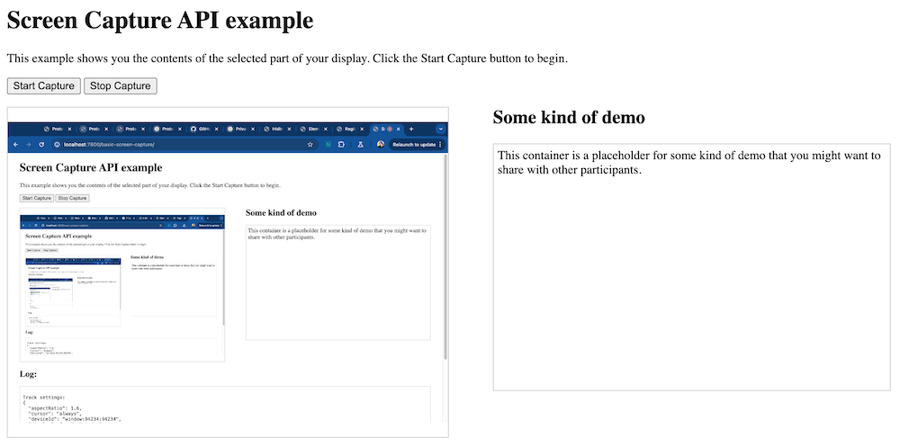

{{SeeCompatTable}}

{{DefaultAPISidebar("Screen Capture extensions")}}{{securecontext_header}}

This guide provides a walkthrough of typical usage of the Element Capture and Region Capture APIs, showing how to use them and the problem they solve.

## Background

The [Screen Capture API](/en-US/docs/Web/API/Screen_Capture_API) was created specifically to allow apps to capture the user's screen — or a particular window or tab — and then do something with the resulting stream (such as transmit it to multiple peers via [WebRTC](/en-US/docs/Web/API/WebRTC_API)). The main use case is video conferencing apps, where a user might wish to share a demo running on their local machine with other participants.

The problem with the Screen Capture API is that, by default, it only allows you to broadcast the entire window, screen, or tab selected by the user. Often it would be preferrable to share only a limited region to cut down on unnecessary bandwidth or screen space required to show the capture, or for privacy reasons (you might not want to show other participants your message notifications, or background settings required to run the demo you are sharing). In addition, such apps generally capture your web cam output, meaning that you will likely end up with one of those undesirable "infinite wormhole" or "hall of mirrors" type effects.

To solve such problems, extensions to the Screen Capture API were invented to allow you to restrict the captured stream to a particular subsection of the screen, window, or tab.

In the next section we'll start with a basic Screen Capture API demo to illustrate the issues described above.

## Screen Capture API demo

This demo uses the Screen Capture API to capture a window, screen, or tab, and broadcast the stream via a {{htmlelement("video")}} element on the same page. It also logs the track settings and constraints to a log container below the main app.

### HTML

The HTML starts off with a main heading and intro text, then includes two {{htmlelement("button")}} elements to start and stop the capture:

```html
<h1>Screen Capture API example</h1>
<p>
  This example shows you the contents of the selected part of your display.
  Click the Start Capture button to begin.
</p>

<p>
  <button id="start">Start Capture</button>&nbsp;
  <button id="stop">Stop Capture</button>
</p>
```

Next, we include the main app container, which contains the `<video>` element to broadcast the capture, and plus a demo placeholder {{htmlelement("div")}}:

```html
<div id="main-app">
  <video autoplay></video>
  <div id="demo">
    <h2>Some kind of demo</h2>
    <p>
      This container is a placeholder for some kind of demo that you might want
      to share with other participants.
    </p>
  </div>
</div>
```

Finally, we include a {{htmlelement("pre")}} element to log the track information into:

```html
<h2>Log:</h2>
<pre id="log"></pre>
```

### CSS

The CSS for this demo is mostly unremarkable, but the following few rules are worth explaining. We've hidden the rest of the CSS for brevity.

```css
* {
  box-sizing: border-box;
}

body {
  padding: 0 25px;
}

video,
#demo > p,
#log {
  border: 1px solid #ccc;
  margin: 0;
}

#demo > h2 {
  margin-top: 0;
}

#demo > p {
  padding: 5px;
  height: 320px;
}

#log {
  height: 20rem;
  padding: 0.5rem;
  overflow: auto;
}
```

We set a {{cssxref("display")}} value of `flex` on the `main-app` `<div>` to lay the video and the demo placeholder out side by side in two columns, setting a {{cssxref("gap")}} of `5%` between them. We also set a {{cssxref("min-width")}} of `980px` on the container, essentially limiting the demo app to being a desktop layout. This is because Element Capture and Region Capture are only supported on desktop browsers, and off-screen content is not captured.

```css
#main-app {
  display: flex;
  gap: 5%;
  min-width: 980px;
}
```

We also give the `<video>` element and the `demo` `<div>` a {{cssxref("flex")}} value of `1`, so they will take up the same amount of horizontal space.

```css
video,
#demo {
  flex: 1;
}
```

Finally, we give the `<video>` element a {{cssxref("max-width")}} of `50%` and a fixed {{cssxref("aspect-ratio")}} of `4/3`. This is to keep the video at a consistent size and avoid too much layout upheaval when the screen capture starts to be broadcast. If we didn't do this, the `<video>` element would grow to the same width as the entire captured area (window or screen), which would affect the layout.

```css
video {
  max-width: 50%;
  aspect-ratio: 4/3;
}
```

### JavaScript

The JavaScript for this example is adapted from the [Streaming screen capture](/en-US/docs/Web/API/Screen_Capture_API/Using_Screen_Capture#streaming_screen_capture) example in our "Using the Screen Capture API" guide. We won't repeat the full code explanation here; we'll just explain the most relevant capture code.

When the "Start Capture" button is pressed, the `startCapture()` function runs, which invokes {{domxref("MediaDevices.getDisplayMedia()")}}. This causes the browser to prompt the user to choose a surface to share (window, tab, etc.). Once a choice is made, the resulting {{domxref("MediaStream")}} is set to the value of the `<video>` element's {{domxref("HTMLMediaElement.srcObject")}} property to broadcast it:

```js
async function startCapture() {
  logElem.textContent = "";

  try {
    videoElem.srcObject =
      await navigator.mediaDevices.getDisplayMedia(displayMediaOptions);
    dumpOptionsInfo();
  } catch (err) {
    console.error(err);
  }
}
```

### Result

You can see the above code running live at [Screen Capture API example](https://mdn.github.io/dom-examples/screen-capture-api/basic-screen-capture) (also see the [source code](https://github.com/mdn/dom-examples/tree/main/screen-capture-api/basic-screen-capture)).

## Screen Capture API issues

Run the live demo above in a [supporting browser](/en-US/docs/Web/API/Screen_Capture_API#browser_compatibility), click "Start Capture", and select the same tab the demo is running in. You will end up seeing the "hall of mirrors effect", as mentioned earlier:



This obviously isn't ideal, and would cause issues in any kind of conferencing application with a built-in "share screen" option.

In addition, it also isn't ideal for an application with a built-in "share screen" option to allow users to share from a different tab or window.

## The Element Capture API

The Element Capture API restricts the captured region to a specified rendered DOM element. In this section we will explore a second demo that is identical to the one presented above, except that it uses Element Capture on top of basic Screen Capture. See this demo running live at [Element Capture API example](https://mdn.github.io/dom-examples/screen-capture-api/element-capture) (also see the [source code](https://github.com/mdn/dom-examples/tree/main/screen-capture-api/element-capture)).

The HTML is identical to the previous example, and the CSS is _nearly_ identical. We'll explain the differences in the JavaScript now, then look at the CSS differences later on, in the [Issues with the Element Capture API](#issues-with-the-element-capture-api) section.

To use the Element Capture API, we first grab a reference to a DOM element that we will later use as a **restriction target** — the screen area shown in the stream will be restricted to just that rendered element:

```js
const demoElem = document.querySelector("#demo");
```

Next, in the options object passed into `getDisplayMedia()` when we invoke it, we set [`preferCurrentTab: true`](/en-US/docs/Web/API/MediaDevices/getDisplayMedia#prefercurrenttab). This hint suggests that the browser should offer the user's current tab as the most prominent capture source in the dialog that asks them what to share. Chrome, for example, only gives them this option when `preferCurrentTab: true` is set.

```js
const displayMediaOptions = {
  video: {
    displaySurface: "window",
  },
  preferCurrentTab: true,
};
```

> [!NOTE]
> This option is part of the regular Screen Capture API, but it solves one of the problems highlighted earlier.

The other code differences are all in the modified `startCapture()` function:

```js
async function startCapture() {
  logElem.textContent = "";

  try {
    const stream =
      await navigator.mediaDevices.getDisplayMedia(displayMediaOptions);
    const [track] = stream.getVideoTracks();
    const restrictionTarget = await RestrictionTarget.fromElement(demoElem);
    await track.restrictTo(restrictionTarget);

    videoElem.srcObject = stream;

    dumpOptionsInfo();
  } catch (err) {
    console.error(err);
  }
}
```

1. Here, we start by grabbing the media stream as before, using, `mediaDevices.getDisplayMedia()`.
2. We then isolate the video track from the stream using {{domxref("MediaStream.getVideoTracks()")}}.
3. We create the necessary `restrictionTarget` object to apply the restriction to the video track by running {{domxref("RestrictionTarget.fromElement_static", "RestrictionTarget.fromElement()")}}, passing to it the DOM element reference we grabbed earlier.
4. We apply the restriction target to the track by calling {{domxref("BrowserCaptureMediaStreamTrack.restrictTo()")}} on it, passing it the `restrictionTarget` object.
5. Once all the above is done, we then set the `<video>` element's `srcObject` property value to the stream, to start broadcasting it.

Try running the [Element Capture API example](https://mdn.github.io/dom-examples/screen-capture-api/element-capture) in a [supporting browser](/en-US/docs/Web/API/RestrictionTarget#browser_compatibility) now. You should see that only the demo placeholder is included in the stream, thereby fixing the "hall of mirrors" problem.

### Stopping the restriction

You can stop the restriction by making a call to `restrictTo()` on the same track, passing an argument of `null` to it:

```js
// Stop restricting
await track.restrictTo(null);
```

### Issues with the Element Capture API

As mentioned earlier, we have given the `<video>` element a {{cssxref("max-width")}} of `50%` and a fixed {{cssxref("aspect-ratio")}} of `4/3`. This is to keep the video at a consistent size and avoid too much layout upheaval when the screen capture starts to be broadcast.

```css
video {
  max-width: 50%;
  aspect-ratio: 4/3;
}
```

If we didn't do this, the `<video>` element would change size to the same width as the entire captured area — it is a [replaced element](/en-US/docs/Web/CSS/Replaced_element), after all, so its [intrinsic size](/en-US/docs/Glossary/Intrinsic_Size) depends on that of its content.

When using the basic Screen Capture API, the problem is more obvious — as soon as you start the capture, the `<video>` element would grow to the same size as the entire captured browser window.

When using the Element Capture API, the problem is more subtle, as you are only capturing a single subtree of the DOM. However, it can still cause some really strange effects, especially if your demo is contained within a relative layout and you start resizing the window. It is better to keep the `<video>` element at the same size if at all possible.

The second CSS difference is in the styling of the demo container element:

```css
#demo {
  isolation: isolate;
  /* Forms a stacking context */
  transform-style: flat;
  /* Flattened */
  background-color: white;
}
```

These properties are added to ensure that the element is **eligible for restriction**, in other words, that it will be captured when chosen as the restriction target element. An {{cssxref("isolation")}} value of `isolate` ensures that the element will form a [stacking context](/en-US/docs/Web/CSS/CSS_positioned_layout/Understanding_z-index/Stacking_context), and a {{cssxref("transform-style")}} value of `flat` ensures that the element is flattened in 3D space (for example, it is not subjected to any 3D transforms). Both of these are requirements for restriction-eligible elements.

Other issues and restrictions are as follows:

- When the element is captured, any alpha-channel value set on it is not included. If the restriction target element is semi-transparent, it will end up looking different in the capture.
- The element will not be captured (ineligible for restriction) if it is off-screen or hidden via `display: none`.
- The element will not be captured if the track being restricted has clones or is not a track captured from the user's screen.
- The element will not be captured if the `restrictionTarget` was created in a tab other than the one being captured.

## The Region Capture API

The Region Capture API has a very similar effect to the Element Capture API, except that rather than restricting the captured region to a specific rendered DOM element, it crops the stream to the area of the screen in which a specific element is rendered. Let's look at a demo and then explore the differences between the two in more detail later on.

In this section we will explore a third demo that is identical to the others, except that it uses Region Capture on top of basic Screen Capture. See this demo running live at [Region Capture API example](https://mdn.github.io/dom-examples/screen-capture-api/region-capture) (also see the [source code](https://github.com/mdn/dom-examples/tree/main/screen-capture-api/region-capture)).

The HTML is identical to the previous examples, and the CSS is nearly identical (see [Issues with the Region Capture API](#issues-with-the-region-capture-api) section for more). The JavaScript is nearly the same as the Element Capture JavaScript, with a few notable differences, which we'll now explain.

To use the Region Capture API, we first grab a reference to a DOM element that we will later use as a **crop target** — the screen area shown in the stream will be cropped to just the area that element is rendered in:

```js
const demoElem = document.querySelector("#demo");
```

Now let's examine the Region Capture demo's `startCapture()` function:

```js
const displayMediaOptions = {
  video: {
    displaySurface: "window",
  },
  preferCurrentTab: true,
};

async function startCapture() {
  logElem.textContent = "";

  try {
    const stream =
      await navigator.mediaDevices.getDisplayMedia(displayMediaOptions);
    const [track] = stream.getVideoTracks();
    const cropTarget = await CropTarget.fromElement(demoElem);
    await track.cropTo(cropTarget);

    videoElem.srcObject = stream;

    dumpOptionsInfo();
  } catch (err) {
    console.error(err);
  }
}
```

1. As before, we start by grabbing the media stream using `mediaDevices.getDisplayMedia()`, then isolate the video track from the stream using {{domxref("MediaStream.getVideoTracks()")}}.
2. We create the necessary `cropTarget` object to apply the crop to the video track by running {{domxref("CropTarget.fromElement_static", "fromElement()")}}, passing to it the DOM element reference we grabbed earlier.
3. We apply the crop target to the track by calling {{domxref("BrowserCaptureMediaStreamTrack.cropTo()")}} on it, passing it the `cropTarget` object.
4. Once all the above is done, we then set the `<video>` element's `srcObject` property value to the stream, to start broadcasting it.

Try running the [Region Capture API example](https://mdn.github.io/dom-examples/screen-capture-api/region-capture) in a [supporting browser](/en-US/docs/Web/API/CropTarget#browser_compatibility) now. You should see that only the demo placeholder is included in the stream, which also fixes the "hall of mirrors" problem.

### Stopping the cropping

You can stop the cropping by making a call to `cropTo()` on the same track, passing an argument of `null` to it:

```js
// Stop cropping
await track.cropTo(null);
```

### Issues with the Region Capture API

Region Capture doesn't have the same level of restrictions as Element Capture — it is cropping the stream to a particular size, rather than broadcasting a specific element, so it doesn't require this rule:

```css
#demo {
  isolation: isolate;
  /* Forms a stacking context */
  transform-style: flat;
  /* Flattened */
  background-color: white;
}
```

Apart from that, the restrictions on what elements can be cropped are as follows:

- The element will not be cropped to if it is off-screen.
- The element will not be cropped to if the track being cropped has clones or is not a track captured from the user's screen.
- The element will not be captured if the `cropTarget` was created in a tab other than the one being captured.
- Because Region Capture crops to an area of the screen rather than capturing a specific element, any content drawn on top of the cropped element will be shown in the stream.

## Element Capture versus Region Capture

As explained above, Element Capture captures the element itself, whereas Region Capture captures the area of the screen the element is rendered in. This means that Element Capture will always show just the captured element, even if other DOM content overlaps it, whereas Region Capture can result in overlapping content being shown over the top of the content you intended to share.

There are legitimate use cases for both:

- If you need to keep the capture specific to one element, and occlude anything outside it, then you should use the Element Capture API. For example, if you've got private content appearing such as a set of message notifications or a speaker notes UI, you won't want it showing up in the capture.
- However, if you really do want to capture a region of the screen, regardless of what is shown in it, you should use the Region Capture API. The [Region Capture Demo](https://region-capture-demo.glitch.me/) shows a useful possibility — zooming in on a particular section of the screen as you show multiple users around on an interactive walkthrough of some kind.

## See also

- [Screen Capture extensions](/en-US/docs/Web/API/Screen_Capture_extensions)
- [Screen Capture API](/en-US/docs/Web/API/Screen_Capture_API)
- [Element Capture Demo](https://element-capture-demo.glitch.me/)
