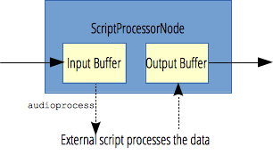

{{APIRef("Web Audio API")}}{{Deprecated_Header}}

The `ScriptProcessorNode` interface allows the generation, processing, or analyzing of audio using JavaScript.

{{InheritanceDiagram}}

> **Note:** This feature was replaced by [AudioWorklets](/en-US/docs/Web/API/AudioWorklet) and the {{domxref("AudioWorkletNode")}} interface.

The `ScriptProcessorNode` interface is an {{domxref("AudioNode")}} audio-processing module that is linked to two buffers, one containing the input audio data, one containing the processed output audio data. An event, implementing the {{domxref("AudioProcessingEvent")}} interface, is sent to the object each time the input buffer contains new data, and the event handler terminates when it has filled the output buffer with data.

The size of the input and output buffer are defined at the creation time, when the {{domxref("BaseAudioContext.createScriptProcessor")}} method is called (both are defined by {{domxref("BaseAudioContext.createScriptProcessor")}}'s `bufferSize` parameter). The buffer size must be a power of 2 between `256` and `16384`, that is `256`, `512`, `1024`, `2048`, `4096`, `8192` or `16384`. Small numbers lower the _latency_, but large number may be necessary to avoid audio breakup and glitches.

If the buffer size is not defined, which is recommended, the browser will pick one that its heuristic deems appropriate.

<table class="properties">
  <tbody>
    <tr>
      <th scope="row">Number of inputs</th>
      <td><code>1</code></td>
    </tr>
    <tr>
      <th scope="row">Number of outputs</th>
      <td><code>1</code></td>
    </tr>
    <tr>
      <th scope="row">Channel count mode</th>
      <td><code>"max"</code></td>
    </tr>
    <tr>
      <th scope="row">Channel count</th>
      <td><code>2</code> (not used in the default count mode)</td>
    </tr>
    <tr>
      <th scope="row">Channel interpretation</th>
      <td><code>"speakers"</code></td>
    </tr>
  </tbody>
</table>

## Instance properties

_Inherits properties from its parent, {{domxref("AudioNode")}}_.

- {{domxref("ScriptProcessorNode.bufferSize")}} {{ReadOnlyInline}} {{Deprecated_Inline}}
  - : Returns an integer representing both the input and output buffer size. Its value can be a power of 2 value in the range `256` – `16384`.

## Instance methods

_No specific methods; inherits methods from its parent, {{domxref("AudioNode")}}_.

## Events

Listen to these events using [`addEventListener()`](/en-US/docs/Web/API/EventTarget/addEventListener) or by assigning an event listener to the `oneventname` property of this interface:

- [`audioprocess`](/en-US/docs/Web/API/ScriptProcessorNode/audioprocess_event) {{Deprecated_Inline}}
  - : Fired when an input buffer of a `ScriptProcessorNode` is ready to be processed.
    Also available via the `onaudioprocess` event handler property.

## Examples

See [`BaseAudioContext.createScriptProcessor()`](/en-US/docs/Web/API/BaseAudioContext/createScriptProcessor#examples) for example code.

## Specifications

Since the August 29, 2014 [Web Audio API specification](https://www.w3.org/TR/webaudio/#ScriptProcessorNode) publication, this feature has been deprecated. It is no longer on track to become a standard.

It was replaced by [AudioWorklets](/en-US/docs/Web/API/AudioWorklet) and the {{domxref("AudioWorkletNode")}} interface.

## Browser compatibility

{{Compat}}

## See also

- [Using the Web Audio API](/en-US/docs/Web/API/Web_Audio_API/Using_Web_Audio_API)
