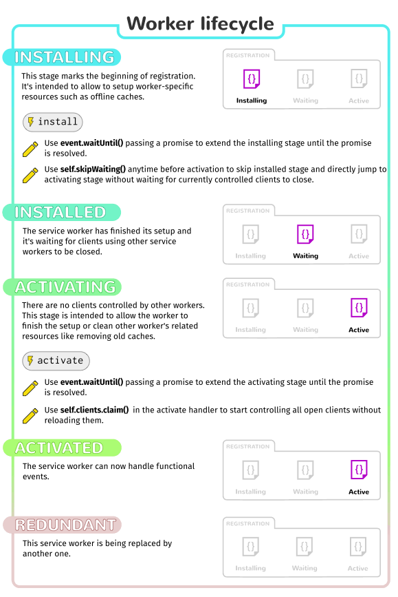
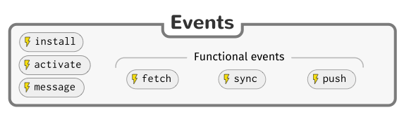
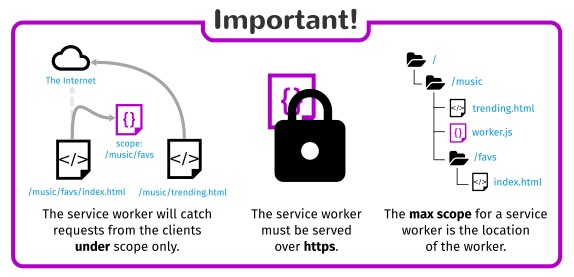
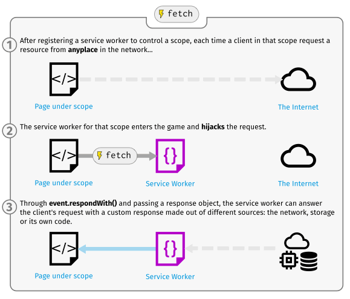

{{ServiceWorkerSidebar}}

This article provides information on getting started with service workers, including basic architecture, registering a service worker, the install and activation process for a new service worker, updating your service worker, cache control and custom responses, all in the context of a simple app with offline functionality.

## The premise of service workers

One overriding problem that web users have suffered with for years is loss of connectivity. The best web app in the world will provide a terrible user experience if you can’t download it. There have been various attempts to create technologies to solve this problem, and some of the issues have been solved. But the overriding problem is that there still isn’t a good overall control mechanism for asset caching and custom network requests.

The previous attempt, _AppCache_, seemed to be a good idea because it allowed you to specify assets to cache really easily. However, it made many assumptions about what you were trying to do and then broke horribly when your app didn’t follow those assumptions exactly. Read Jake Archibald's (unfortunately-titled but well-written) [Application Cache is a Douchebag](https://alistapart.com/article/application-cache-is-a-douchebag) for more details.

> **Note:** From Firefox 84, AppCache has been removed ({{bug("1619673")}}). It is also planned for removal in Chomium 90, and is deprecated in Safari.

Service workers should finally fix these issues. Service worker syntax is more complex than that of AppCache, but the trade off is that you can use JavaScript to control your AppCache-implied behaviors with a fine degree of granularity, allowing you to handle this problem and many more. Using a Service worker you can easily set an app up to use cached assets first, thus providing a default experience even when offline, before then getting more data from the network (commonly known as [Offline First](http://offlinefirst.org/)). This is already available with native apps, which is one of the main reasons native apps are often chosen over web apps.

## Setting up to play with service workers

These days, service workers are enabled by default in all modern browsers. To run code using service workers, you’ll need to serve your code via HTTPS — Service workers are restricted to running across HTTPS for security reasons. GitHub is therefore a good place to host experiments, as it supports HTTPS. In order to facilitate local development, `localhost` is considered a secure origin by browsers as well.

## Basic architecture

With service workers, the following steps are generally observed for basic set up:

1.  The service worker URL is fetched and registered via {{domxref("serviceWorkerContainer.register()")}}.
2.  If successful, the service worker is executed in a {{domxref("ServiceWorkerGlobalScope") }}; this is basically a special kind of worker context, running off the main script execution thread, with no DOM access.
3.  The service worker is now ready to process events.
4.  Installation of the worker is attempted when service worker-controlled pages are accessed subsequently. An Install event is always the first one sent to a service worker (this can be used to start the process of populating an IndexedDB, and caching site assets). This is really the same kind of procedure as installing a native or Firefox OS app — making everything available for use offline.
5.  When the `oninstall` handler completes, the service worker is considered installed.
6.  Next is activation. When the service worker is installed, it then receives an activate event. The primary use of `onactivate` is for cleanup of resources used in previous versions of a Service worker script.
7.  The Service worker will now control pages, but only those opened after the `register()` is successful. i.e. a document starts life with or without a Service worker and maintains that for its lifetime. So documents will have to be reloaded to actually be controlled.



The below graphic shows a summary of the available service worker events:



### Promises

[Promises](/en-US/docs/Web/JavaScript/Reference/Global_Objects/Promise) are a great mechanism for running async operations, with success dependant on one another. This is central to the way service workers work.

Promises can do a variety of things, but all you need to know for now is that if something returns a promise, you can attach `.then()` to the end and include callbacks inside it for success cases, or you can insert `.catch()` on the end if you want to include a failure callback.

Let’s compare a traditional synchronous callback structure to its asynchronous promise equivalent.

#### sync

```js
try {
  const value = myFunction();
  console.log(value);
} catch(err) {
  console.log(err);
}
```

#### async

```js
myFunction().then((value) => {
  console.log(value);
}).catch((err) => {
  console.log(err);
});
```

In the first example, we have to wait for `myFunction()` to run and return `value` before any more of the code can execute. In the second example, `myFunction()` returns a promise for `value`, then the rest of the code can carry on running. When the promise resolves, the code inside `then` will be run, asynchronously.

Now for a real example — what if we wanted to load images dynamically, but we wanted to make sure the images were loaded before we tried to display them? This is a standard thing to do, but it can be a bit of a pain. We can use `.onload` to only display the image after it’s loaded, but what about events that start happening before we start listening to them? We could try to work around this using `.complete`, but it’s still not foolproof, and what about multiple images? And, ummm, it’s still synchronous, so blocks the main thread.

Instead, we could build our own promise to handle this kind of case. (See our [Promises test](https://github.com/mdn/js-examples/tree/master/promises-test) example for the source code, or [look at it running live](https://mdn.github.io/js-examples/promises-test/).)

> **Note:** A real service worker implementation would use caching and onfetch rather than the XMLHttpRequest API. Those features are not used here so that you can focus on understanding Promises.

```js
const imgLoad = (url) => {
  return new Promise((resolve, reject) => {
    var request = new XMLHttpRequest();
    request.open('GET', url);
    request.responseType = 'blob';

    request.onload = () => {
      if (request.status == 200) {
        resolve(request.response);
      } else {
        reject(Error('Image didn\'t load successfully; error code:' + request.statusText));
      }
    };

    request.onerror = () => {
      reject(Error('There was a network error.'));
    };

    request.send();
  });
}
```

We return a new promise using the `Promise()` constructor, which takes as an argument a callback function with `resolve` and `reject` parameters. Somewhere in the function, we need to define what happens for the promise to resolve successfully or be rejected — in this case return a 200 OK status or not — and then call `resolve` on success, or `reject` on failure. The rest of the contents of this function is fairly standard XHR stuff, so we won’t worry about that for now.

When we come to call the `imgLoad()` function, we call it with the url to the image we want to load, as we might expect, but the rest of the code is a little different:

```js
let body = document.querySelector('body');
let myImage = new Image();

imgLoad('myLittleVader.jpg').then((response) => {
  var imageURL = window.URL.createObjectURL(response);
  myImage.src = imageURL;
  body.appendChild(myImage);
}, (Error) => {
  console.log(Error);
});
```

On to the end of the function call, we chain the promise `then()` method, which contains two functions — the first one is executed when the promise successfully resolves, and the second is called when the promise is rejected. In the resolved case, we display the image inside `myImage` and append it to the body (its argument is the `request.response` contained inside the promise’s `resolve` method); in the rejected case we return an error to the console.

This all happens asynchronously.

> **Note:** You can also chain promise calls together, for example:
> `myPromise().then(success, failure).then(success).catch(failure);`

> **Note:** You can find a lot more out about promises by reading Jake Archibald’s excellent [JavaScript Promises: there and back again](https://www.html5rocks.com/en/tutorials/es6/promises/).

## Service workers demo

To demonstrate just the very basics of registering and installing a service worker, we have created a simple demo called [sw-test](https://github.com/mdn/sw-test), which is a simple Star wars Lego image gallery. It uses a promise-powered function to read image data from a JSON object and load the images using Ajax, before displaying the images in a line down the page. We’ve kept things static and simple for now. It also registers, installs, and activates a service worker, and when more of the spec is supported by browsers it will cache all the files required so it will work offline!


You can see the [source code on GitHub](https://github.com/mdn/sw-test/), and [view the example live](https://mdn.github.io/sw-test/). The one bit we’ll call out here is the promise (see [app.js lines 22-47](https://github.com/mdn/sw-test/blob/gh-pages/app.js#L22-L47)), which is a modified version of what you read about above, in the [Promises test demo](https://mdn.github.io/js-examples/promises-test/). It is different in the following ways:

1.  In the original, we only passed in a URL to an image we wanted to load. In this version, we pass in a JSON fragment containing all the data for a single image (see what they look like in [image-list.js](https://github.com/mdn/sw-test/blob/gh-pages/image-list.js)). This is because all the data for each promise resolve has to be passed in with the promise, as it is asynchronous. If you just passed in the url, and then tried to access the other items in the JSON separately when the `for()` loop is being iterated through later on, it wouldn’t work, as the promise wouldn’t resolve at the same time as the iterations are being done (that is a synchronous process.)
2.  We actually resolve the promise with an array, as we want to make the loaded image blob available to the resolving function later on in the code, but also the image name, credits and alt text (see [app.js lines 31-34](https://github.com/mdn/sw-test/blob/gh-pages/app.js#L31-L34)). Promises will only resolve with a single argument, so if you want to resolve with multiple values, you need to use an array/object.
3.  To access the resolved promise values, we then access this function as you’d then expect (see [app.js lines 60-64](https://github.com/mdn/sw-test/blob/gh-pages/app.js#L60-L64)). This may seem a bit odd at first, but this is the way promises work.

## Enter service workers

> **Note:** We're using the [es6](http://es6-features.org/) **arrow functions** syntax in the Service Worker Implementation.

Now let’s get on to service workers!

### Registering your worker

The first block of code in our app’s JavaScript file — `app.js` — is as follows. This is our entry point into using service workers.

```js
if ('serviceWorker' in navigator) {
  navigator.serviceWorker.register('./sw-test/sw.js', {scope: './sw-test/'})
  .then((reg) => {
    // registration worked
    console.log('Registration succeeded. Scope is ' + reg.scope);
  }).catch((error) => {
    // registration failed
    console.log('Registration failed with ' + error);
  });
}
```

1.  The outer block performs a feature detection test to make sure service workers are supported before trying to register one.
2.  Next, we use the {{domxref("ServiceWorkerContainer.register()") }} function to register the service worker for this site, which is just a JavaScript file residing inside our app (note this is the file's URL relative to the origin, not the JS file that references it.)
3.  The `scope` parameter is optional, and can be used to specify the subset of your content that you want the service worker to control. In this case, we have specified '`/sw-test/'`, which means all content under the app's origin. If you leave it out, it will default to this value anyway, but we specified it here for illustration purposes.
4.  The `.then()` promise function is used to chain a success case onto our promise structure.  When the promise resolves successfully, the code inside it executes.
5.  Finally, we chain a `.catch()` function onto the end that will run if the promise is rejected.

This registers a service worker, which runs in a worker context, and therefore has no DOM access. You then run code in the service worker outside of your normal pages to control their loading.

A single service worker can control many pages. Each time a page within your scope is loaded, the service worker is installed against that page and operates on it. Bear in mind therefore that you need to be careful with global variables in the service worker script: each page doesn’t get its own unique worker.

> **Note:** Your service worker functions like a proxy server, allowing you to modify requests and responses, replace them with items from its own cache, and more.

> **Note:** One great thing about service workers is that if you use feature detection like we’ve shown above, browsers that don’t support service workers can just use your app online in the normal expected fashion. Furthermore, if you use AppCache and SW on a page, browsers that don’t support SW but do support AppCache will use that, and browsers that support both will ignore the AppCache and let SW take over.

#### Why is my service worker failing to register?

This could be for the following reasons:

1.  You are not running your application through HTTPS.
2.  The path to your service worker file is not written correctly — it needs to be written relative to the origin, not your app’s root directory. In our example, the worker is at `https://mdn.github.io/sw-test/sw.js`, and the app’s root is `https://mdn.github.io/sw-test/`. But the path needs to be written as `/sw-test/sw.js`, not `/sw.js`.
3.  It is also not allowed to point to a service worker of a different origin than that of your app.



Also note:

- The service worker will only catch requests from clients under the service worker's scope.
- The max scope for a service worker is the location of the worker.
- If your service worker is active on a client being served with the `Service-Worker-Allowed` header, you can specify a list of max scopes for that worker.
- In Firefox, Service Worker APIs are hidden and cannot be used when the user is in [private browsing mode](https://support.mozilla.org/en-US/kb/private-browsing-use-firefox-without-history).

### Install and activate: populating your cache

After your service worker is registered, the browser will attempt to install then activate the service worker for your page/site.

The install event is fired when an install is successfully completed. The install event is generally used to populate your browser’s offline caching capabilities with the assets you need to run your app offline. To do this, we use Service Worker’s storage API — {{domxref("cache")}} — a global object on the service worker that allows us to store assets delivered by responses, and keyed by their requests. This API works in a similar way to the browser’s standard cache, but it is specific to your domain. It persists until you tell it not to — again, you have full control.

Let’s start this section by looking at a code sample — this is the [first block you’ll find in our service worker](https://github.com/mdn/sw-test/blob/gh-pages/sw.js#L1-L18):

```js
self.addEventListener('install', (event) => {
  event.waitUntil(
    caches.open('v1').then((cache) => {
      return cache.addAll([
        './sw-test/',
        './sw-test/index.html',
        './sw-test/style.css',
        './sw-test/app.js',
        './sw-test/image-list.js',
        './sw-test/star-wars-logo.jpg',
        './sw-test/gallery/',
        './sw-test/gallery/bountyHunters.jpg',
        './sw-test/gallery/myLittleVader.jpg',
        './sw-test/gallery/snowTroopers.jpg'
      ]);
    })
  );
});
```

1.  Here we add an `install` event listener to the service worker (hence `self`), and then chain a {{domxref("ExtendableEvent.waitUntil()") }} method onto the event — this ensures that the service worker will not install until the code inside `waitUntil()` has successfully occurred.
2.  Inside `waitUntil()` we use the [`caches.open()`](/en-US/docs/Web/API/CacheStorage/open) method to create a new cache called `v1`, which will be version 1 of our site resources cache. This returns a promise for a created cache; once resolved, we then call a function that calls `addAll()` on the created cache, which for its parameter takes an array of origin-relative URLs to all the resources you want to cache.
3.  If the promise is rejected, the install fails, and the worker won’t do anything. This is OK, as you can fix your code and then try again the next time registration occurs.
4.  After a successful installation, the service worker activates. This doesn’t have much of a distinct use the first time your service worker is installed/activated, but it means more when the service worker is updated (see the {{anch("Updating your service worker") }} section later on.)

> **Note:** [localStorage](/en-US/docs/Web/API/Web_Storage_API) works in a similar way to service worker cache, but it is synchronous, so not allowed in service workers.

> **Note:** [IndexedDB](/en-US/docs/Web/API/IndexedDB_API) can be used inside a service worker for data storage if you require it.

### Custom responses to requests

Now you’ve got your site assets cached, you need to tell service workers to do something with the cached content. This is easily done with the `fetch` event.



A `fetch` event fires every time any resource controlled by a service worker is fetched, which includes the documents inside the specified scope, and any resources referenced in those documents (for example if `index.html` makes a cross origin request to embed an image, that still goes through its service worker.)

You can attach a `fetch` event listener to the service worker, then call the `respondWith()` method on the event to hijack our HTTP responses and update them with your own magic.

```js
self.addEventListener('fetch', (event) => {
  event.respondWith(
    // magic goes here
  );
});
```

We could start by responding with the resource whose url matches that of the network request, in each case:

```js
self.addEventListener('fetch', (event) => {
  event.respondWith(
    caches.match(event.request)
  );
});
```

`caches.match(event.request)` allows us to match each resource requested from the network with the equivalent resource available in the cache, if there is a matching one available. The matching is done via URL and various headers, just like with normal HTTP requests.

Let’s look at a few other options we have when defining our magic (see our [Fetch API documentation](/en-US/docs/Web/API/Fetch_API) for more information about {{domxref("Request")}} and {{domxref("Response")}} objects.)

1.  The `{{domxref("Response.Response","Response()")}}` constructor allows you to create a custom response. In this case, we are just returning a simple text string:

    ```js
    new Response('Hello from your friendly neighborhood service worker!');
    ```

2.  This more complex `Response` below shows that you can optionally pass a set of headers in with your response, emulating standard HTTP response headers. Here we are just telling the browser what the content type of our synthetic response is:

    ```js
    new Response('<p>Hello from your friendly neighborhood service worker!</p>', {
      headers: { 'Content-Type': 'text/html' }
    });
    ```

3.  If a match wasn’t found in the cache, you could tell the browser to {{domxref("fetch()")}} the default network request for that resource, to get the new resource from the network if it is available:

    ```js
    fetch(event.request);
    ```

4.  If a match wasn’t found in the cache, and the network isn’t available, you could just match the request with some kind of default fallback page as a response using {{domxref("CacheStorage.match","match()")}}, like this:

    ```js
    caches.match('./fallback.html');
    ```

5.  You can retrieve a lot of information about each request by calling parameters of the {{domxref("Request")}} object returned by the {{domxref("FetchEvent")}}:

    ```js
    event.request.url
    event.request.method
    event.request.headers
    event.request.body
    ```

## Recovering failed requests

So `caches.match(event.request)` is great when there is a match in the service worker cache, but what about cases when there isn’t a match? If we didn’t provide any kind of failure handling, our promise would resolve with `undefined` and we wouldn't get anything returned.

Fortunately, service workers’ promise-based structure makes it trivial to provide further options towards success. We could do this:

```js
self.addEventListener('fetch', (event) => {
  event.respondWith(
    caches.match(event.request).then((response) => {
      return response || fetch(event.request);
    })
  );
});
```

If the resources aren't in the cache, they are requested from the network.

If we were being really clever, we would not only request the resource from the network; we would also save it into the cache so that later requests for that resource could be retrieved offline too! This would mean that if extra images were added to the Star Wars gallery, our app could automatically grab them and cache them. The following would do the trick:

```js
self.addEventListener('fetch', (event) => {
  event.respondWith(
    caches.match(event.request).then((resp) => {
      return resp || fetch(event.request).then((response) => {
        return caches.open('v1').then((cache) => {
          cache.put(event.request, response.clone());
          return response;
        });
      });
    })
  );
});
```

Here we return the default network request with `return fetch(event.request)`, which returns a promise. When this promise is resolved, we respond by running a function that grabs our cache using `caches.open('v1')`; this also returns a promise. When that promise resolves, `cache.put()` is used to add the resource to the cache. The resource is grabbed from `event.request`, and the response is then cloned with `response.clone()` and added to the cache. The clone is put in the cache, and the original response is returned to the browser to be given to the page that called it.

Cloning the response is necessary because request and response streams can only be read once.  In order to return the response to the browser and put it in the cache we have to clone it. So the original gets returned to the browser and the clone gets sent to the cache.  They are each read once.

The only trouble we have now is that if the request doesn’t match anything in the cache, and the network is not available, our request will still fail. Let’s provide a default fallback so that whatever happens, the user will at least get something:

```js
self.addEventListener('fetch', (event) => {
  event.respondWith(
    caches.match(event.request).then((resp) => {
      return resp || fetch(event.request).then((response) => {
        let responseClone = response.clone();
        caches.open('v1').then((cache) => {
          cache.put(event.request, responseClone);
        });

        return response;
      }).catch(() => {
        return caches.match('./sw-test/gallery/myLittleVader.jpg');
      })
    })
  );
});
```

We have opted for this fallback image because the only updates that are likely to fail are new images, as everything else is depended on for installation in the `install` event listener we saw earlier.

## Updating your service worker

If your service worker has previously been installed, but then a new version of the worker is available on refresh or page load, the new version is installed in the background, but not yet activated. It is only activated when there are no longer any pages loaded that are still using the old service worker. As soon as there are no more such pages still loaded, the new service worker activates.

You’ll want to update your `install` event listener in the new service worker to something like this (notice the new version number):

```js
self.addEventListener('install', (event) => {
  event.waitUntil(
    caches.open('v2').then((cache) => {
      return cache.addAll([
        './sw-test/',
        './sw-test/index.html',
        './sw-test/style.css',
        './sw-test/app.js',
        './sw-test/image-list.js',

        …

        // include other new resources for the new version...
      ]);
    })
  );
});
```

While this happens, the previous version is still responsible for fetches. The new version is installing in the background. We are calling the new cache `v2`, so the previous `v1` cache isn't disturbed.

When no pages are using the current version, the new worker activates and becomes responsible for fetches.

### Deleting old caches

You also get an `activate` event. This is a generally used to do stuff that would have broken the previous version while it was still running, for example getting rid of old caches. This is also useful for removing data that is no longer needed to avoid filling up too much disk space — each browser has a hard limit on the amount of cache storage that a given service worker can use. The browser does its best to manage disk space, but it may delete the Cache storage for an origin.  The browser will generally delete all of the data for an origin or none of the data for an origin.

Promises passed into `waitUntil()` will block other events until completion, so you can rest assured that your clean-up operation will have completed by the time you get your first `fetch` event on the new service worker.

```js
self.addEventListener('activate', (event) => {
  var cacheKeeplist = ['v2'];

  event.waitUntil(
    caches.keys().then((keyList) => {
      return Promise.all(keyList.map((key) => {
        if (cacheKeeplist.indexOf(key) === -1) {
          return caches.delete(key);
        }
      }));
    })
  );
});
```

## Developer tools

Chrome has `chrome://inspect/#service-workers`, which shows current service worker activity and storage on a device, and `chrome://serviceworker-internals`, which shows more detail and allows you to start/stop/debug the worker process. In the future they will have throttling/offline modes to simulate bad or non-existent connections, which will be a really good thing.

Firefox has also started to implement some useful tools related to service workers:

- You can navigate to [`about:debugging`](/en-US/docs/Tools/about:debugging) to see what SWs are registered and update/remove them.
- When testing you can get around the HTTPS restriction by checking the "Enable Service Workers over HTTP (when toolbox is open)" option in the [Firefox Developer Tools settings](/en-US/docs/Tools/Settings).
- The "Forget" button, available in Firefox's customization options, can be used to clear service workers and their caches ({{bug(1252998)}}).

> **Note:** You may serve your app from `http://localhost` (e.g. using `me@localhost:/my/app$ python -m SimpleHTTPServer`) for local development. See [Security considerations](https://www.w3.org/TR/service-workers/#security-considerations)

## See also

- [Understanding Service Workers](http://blog.88mph.io/2017/07/28/understanding-service-workers/)
- [The Service Worker Cookbook](https://github.com/mozilla/serviceworker-cookbook)
- [Is ServiceWorker ready?](https://jakearchibald.github.io/isserviceworkerready/)
- Download the [Service Workers 101 cheatsheet](sw101.png).
- [Promises](/en-US/docs/Web/JavaScript/Reference/Global_Objects/Promise)
- [Using web workers](/en-US/docs/Web/API/Web_Workers_API/Using_web_workers)
