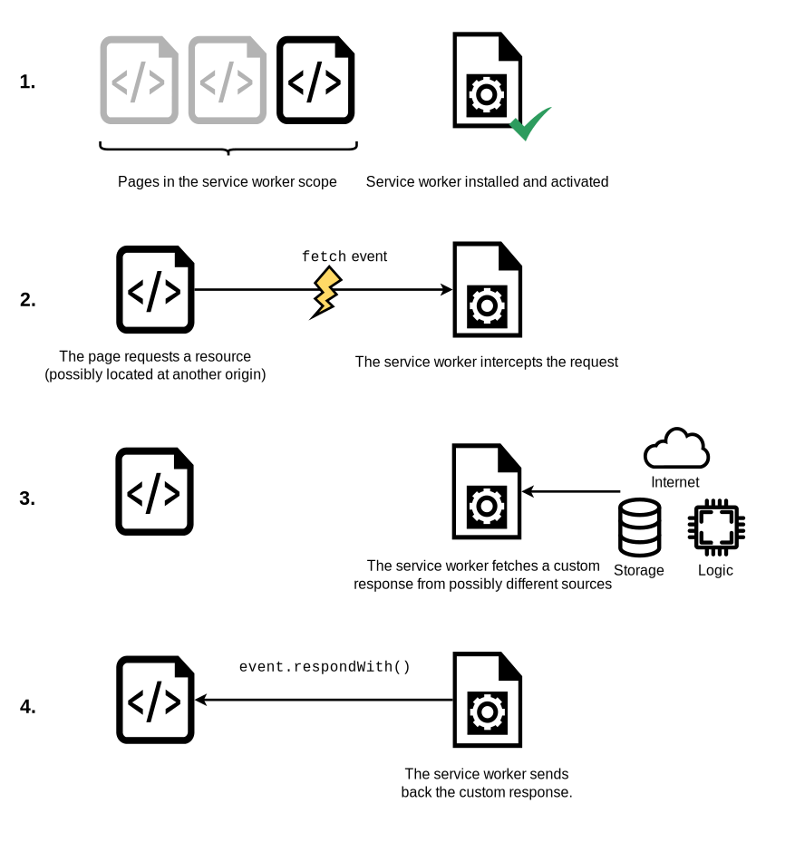

{{DefaultAPISidebar("Service Workers API")}}

This article provides information on getting started with service workers, including basic architecture, registering a service worker, the installation and activation process for a new service worker, updating your service worker, cache control and custom responses, all in the context of an app with offline functionality.

## The premise of service workers

One overriding problem that web users have suffered with for years is loss of connectivity. The best web app in the world will provide a terrible user experience if you can't download it. There have been various attempts to create technologies to solve this problem, and some of the issues have been solved. But the overriding problem is that there wasn't a good overall control mechanism for asset caching and custom network requests.

Service workers fix these issues. Using a service worker you can set an app up to use cached assets first, thus providing a default experience even when offline, before then getting more data from the network (commonly known as "offline first"). This is already available with native apps, which is one of the main reasons native apps are often chosen over web apps.

A service worker functions like a proxy server, allowing you to modify requests and responses replacing them with items from its own cache.

## Setting up to play with service workers

Service workers are enabled by default in all modern browsers. To run code using service workers, you'll need to serve your code via HTTPS — Service workers are restricted to running across HTTPS for security reasons. A server supporting HTTPS is necessary. To host experiments, you can use a service such as GitHub, Netlify, Vercel, etc. In order to facilitate local development, `localhost` is considered a secure origin by browsers as well.

## Basic architecture

With service workers, the following steps are generally observed for basic setup:

1. The service worker code is fetched and then registered using [`serviceWorkerContainer.register()`](/en-US/docs/Web/API/ServiceWorkerContainer/register). If successful, the service worker is executed in a [`ServiceWorkerGlobalScope`](/en-US/docs/Web/API/ServiceWorkerGlobalScope); this is basically a special kind of worker context, running off the main script execution thread, with no DOM access. The service worker is now ready to process events.
2. Installation takes place. An `install` event is always the first one sent to a service worker (this can be used to start the process of populating an IndexedDB, and caching site assets). During this step, the application is preparing to make everything available for use offline.
3. When the `install` handler completes, the service worker is considered installed. At this point a previous version of the service worker may be active and controlling open pages. Because we don't want two different versions of the same service worker running at the same time, the new version is not yet active.
4. Once all pages controlled by the old version of the service worker have closed, it's safe to retire the old version, and the newly installed service worker receives an `activate` event. The primary use of `activate` is to clean up resources used in previous versions of the service worker. The new service worker can call [`skipWaiting()`](/en-US/docs/Web/API/ServiceWorkerGlobalScope/skipWaiting) to ask to be activated immediately without waiting for open pages to be closed. The new service worker will then receive `activate` immediately, and will take over any open pages.
5. After activation, the service worker will now control pages, but only those that were opened after the `register()` is successful. In other words, documents will have to be reloaded to actually be controlled, because a document starts life with or without a service worker and maintains that for its lifetime. To override this default behavior and adopt open pages, a service worker can call [`clients.claim()`](/en-US/docs/Web/API/Clients/claim).
6. Whenever a new version of a service worker is fetched, this cycle happens again and the remains of the previous version are cleaned during the new version's activation.


Here is a summary of the available service worker events:

- [`install`](/en-US/docs/Web/API/ServiceWorkerGlobalScope/install_event)
- [`activate`](/en-US/docs/Web/API/ServiceWorkerGlobalScope/activate_event)
- [`message`](/en-US/docs/Web/API/ServiceWorkerGlobalScope/message_event)
- Functional events
  - [`fetch`](/en-US/docs/Web/API/ServiceWorkerGlobalScope/fetch_event)
  - [`sync`](/en-US/docs/Web/API/ServiceWorkerGlobalScope/sync_event)
  - [`push`](/en-US/docs/Web/API/ServiceWorkerGlobalScope/push_event)

## Demo

To demonstrate just the very basics of registering and installing a service worker, we have created a demo called [simple service worker](https://github.com/mdn/dom-examples/tree/main/service-worker/simple-service-worker), which is a simple Star Wars Lego image gallery. It uses a promise-powered function to read image data from a JSON object and load the images using [`fetch()`](/en-US/docs/Web/API/Fetch_API/Using_Fetch), before displaying the images in a line down the page. We've kept things static for now. It also registers, installs, and activates a service worker.


You can see the [source code on GitHub](https://github.com/mdn/dom-examples/tree/main/service-worker/simple-service-worker), and the [simple service worker running live](https://bncb2v.csb.app/).

### Registering your worker

The first block of code in our app's JavaScript file — `app.js` — is as follows. This is our entry point into using service workers.

```js
const registerServiceWorker = async () => {
  if ("serviceWorker" in navigator) {
    try {
      const registration = await navigator.serviceWorker.register("/sw.js", {
        scope: "/",
      });
      if (registration.installing) {
        console.log("Service worker installing");
      } else if (registration.waiting) {
        console.log("Service worker installed");
      } else if (registration.active) {
        console.log("Service worker active");
      }
    } catch (error) {
      console.error(`Registration failed with ${error}`);
    }
  }
};

// …

registerServiceWorker();
```

1. The `if`-block performs a feature detection test to make sure service workers are supported before trying to register one.
2. Next, we use the [`ServiceWorkerContainer.register()`](/en-US/docs/Web/API/ServiceWorkerContainer/register) function to register the service worker for this site. The service worker code is in a JavaScript file residing inside our app (note this is the file's URL relative to the origin, not the JS file that references it.)
3. The `scope` parameter is optional, and can be used to specify the subset of your content that you want the service worker to control. In this case, we have specified `'/'`, which means all content under the app's origin. If you leave it out, it will default to this value anyway, but we specified it here for illustration purposes.

This registers a service worker, which runs in a worker context, and therefore has no DOM access.

A single service worker can control many pages. Each time a page within your scope is loaded, the service worker is installed against that page and operates on it. Bear in mind therefore that you need to be careful with global variables in the service worker script: each page doesn't get its own unique worker.

> [!NOTE]
> One great thing about service workers is that if you use feature detection like we've shown above, browsers that don't support service workers can just use your app online in the normal expected fashion.

#### Why is my service worker failing to register?

A service worker fails to register for one of the following reasons:

- You are not running your application in a [secure context](/en-US/docs/Web/Security/Secure_Contexts) (over HTTPS).
- The path of the service worker file is incorrect.
  The path must be relative to the origin, not an app's root directory.
  In our example, the worker is at `https://bncb2v.csb.app/sw.js`, and the app's root is `https://bncb2v.csb.app/`, so the service worker must be specified as `/sw.js`.
- The path to your service worker points to a service worker of a different origin to your app.
- The service worker registration contains a `scope` option broader than permitted by the worker path.
  The default scope for a service worker is the directory where the worker is located.
  In other words, if the script `sw.js` is located in `/js/sw.js`, it can only control URLs in (or nested within) the `/js/` path by default.
  The scope for a service worker can be broadened (or narrowed) with the {{HTTPHeader("Service-Worker-Allowed")}} header.
- Browser-specific settings are enabled, such as blocking all cookies, private browsing mode, automatic cookie deletion on close, etc.
  See [`serviceWorker.register()` browser compatibility](/en-US/docs/Web/API/ServiceWorkerContainer/register#browser_compatibility) for more information.

### Install and activate: populating your cache

After your service worker is registered, the browser will attempt to install then activate the service worker for your page/site.

The `install` event is the first event that is fired on service worker installation or update.
It is emitted just once, immediately after registration is successfully completed, and is generally used to populate your browser's offline caching capabilities with the assets you need to run your app offline. To do this, we use Service Worker's storage API — [`cache`](/en-US/docs/Web/API/Cache) — a global object on the service worker that allows us to store assets delivered by responses, and keyed by their requests. This API works in a similar way to the browser's standard cache, but it is specific to your domain. The contents of the cache are kept until you clear them.

Here's how our service worker handles the `install` event:

```js
const addResourcesToCache = async (resources) => {
  const cache = await caches.open("v1");
  await cache.addAll(resources);
};

self.addEventListener("install", (event) => {
  event.waitUntil(
    addResourcesToCache([
      "/",
      "/index.html",
      "/style.css",
      "/app.js",
      "/image-list.js",
      "/star-wars-logo.jpg",
      "/gallery/bountyHunters.jpg",
      "/gallery/myLittleVader.jpg",
      "/gallery/snowTroopers.jpg",
    ]),
  );
});
```

1. Here we add an `install` event listener to the service worker (hence `self`), and then chain a [`ExtendableEvent.waitUntil()`](/en-US/docs/Web/API/ExtendableEvent/waitUntil) method onto the event — this ensures that the service worker will not install until the code inside `waitUntil()` has successfully occurred.
2. Inside `addResourcesToCache()` we use the [`caches.open()`](/en-US/docs/Web/API/CacheStorage/open) method to create a new cache called `v1`, which will be version 1 of our site resources cache. Then we call a function `addAll()` on the created cache, which for its parameter takes an array of URLs to all the resources you want to cache. The URLs are relative to the worker's {{domxref("WorkerGlobalScope.location", "location", "", 1)}}.
3. If the promise is rejected, the installation fails, and the worker won't do anything. This is OK, as you can fix your code and then try again the next time registration occurs.
4. After a successful installation, the service worker activates. This doesn't have much of a distinct use the first time your service worker is installed/activated, but it means more when the service worker is updated (see the [Updating your service worker](#updating_your_service_worker) section later on.)

> **Note:** [The Web Storage API (`localStorage`)](/en-US/docs/Web/API/Web_Storage_API) works in a similar way to service worker cache, but it is synchronous, so not allowed in service workers.

> **Note:** [IndexedDB](/en-US/docs/Web/API/IndexedDB_API) can be used inside a service worker for data storage if you require it.

### Custom responses to requests

Now you've got your site assets cached, you need to tell service workers to do something with the cached content. This is done with the `fetch` event.

1. A `fetch` event fires every time any resource controlled by a service worker is fetched, which includes the documents inside the specified scope, and any resources referenced in those documents (for example if `index.html` makes a cross-origin request to embed an image, that still goes through its service worker.)

2. You can attach a `fetch` event listener to the service worker, then call the `respondWith()` method on the event to hijack our HTTP responses and update them with your own content.

   ```js
   self.addEventListener("fetch", (event) => {
     event.respondWith(/* custom content goes here */);
   });
   ```

3. We could start by responding with the resource whose URL matches that of the network request, in each case:

   ```js
   self.addEventListener("fetch", (event) => {
     event.respondWith(caches.match(event.request));
   });
   ```

   `caches.match(event.request)` allows us to match each resource requested from the network with the equivalent resource available in the cache, if there is a matching one available. The matching is done via URL and various headers, just like with normal HTTP requests.



## Recovering failed requests

So `caches.match(event.request)` is great when there is a match in the service worker cache, but what about cases when there isn't a match? If we didn't provide any kind of failure handling, our promise would resolve with `undefined` and we wouldn't get anything returned.

After testing the response from the cache, we can fall back on a regular network request:

```js
const cacheFirst = async (request) => {
  const responseFromCache = await caches.match(request);
  if (responseFromCache) {
    return responseFromCache;
  }
  return fetch(request);
};

self.addEventListener("fetch", (event) => {
  event.respondWith(cacheFirst(event.request));
});
```

If the resources aren't in the cache, they are requested from the network.

Using a more elaborate strategy, we could not only request the resource from the network, but also save it into the cache so that later requests for that resource could be retrieved offline too. This would mean that if extra images were added to the Star Wars gallery, our app could automatically grab them and cache them. The following snippet implements such a strategy:

```js
const putInCache = async (request, response) => {
  const cache = await caches.open("v1");
  await cache.put(request, response);
};

const cacheFirst = async (request, event) => {
  const responseFromCache = await caches.match(request);
  if (responseFromCache) {
    return responseFromCache;
  }
  const responseFromNetwork = await fetch(request);
  event.waitUntil(putInCache(request, responseFromNetwork.clone()));
  return responseFromNetwork;
};

self.addEventListener("fetch", (event) => {
  event.respondWith(cacheFirst(event.request, event));
});
```

If the request URL is not available in the cache, we request the resource from the network request with `await fetch(request)`. After that, we put a clone of the response into the cache. The `putInCache()` function uses `caches.open('v1')` and `cache.put()` to add the resource to the cache. The original response is returned to the browser to be given to the page that called it.

Cloning the response is necessary because request and response streams can only be read once. In order to return the response to the browser and put it in the cache we have to clone it. So the original gets returned to the browser and the clone gets sent to the cache. They are each read once.

What might look a bit weird is that the promise returned by `putInCache()` is not awaited. The reason is that we don't want to wait until the response clone has been added to the cache before returning a response. However, we do need to call `event.waitUntil()` on the promise, to make sure the service worker doesn't terminate before the cache is populated.

The only trouble we have now is that if the request doesn't match anything in the cache, and the network is not available, our request will still fail. Let's provide a default fallback so that whatever happens, the user will at least get something:

```js
const putInCache = async (request, response) => {
  const cache = await caches.open("v1");
  await cache.put(request, response);
};

const cacheFirst = async ({ request, fallbackUrl, event }) => {
  // First try to get the resource from the cache
  const responseFromCache = await caches.match(request);
  if (responseFromCache) {
    return responseFromCache;
  }

  // Next try to get the resource from the network
  try {
    const responseFromNetwork = await fetch(request);
    // response may be used only once
    // we need to save clone to put one copy in cache
    // and serve second one
    event.waitUntil(putInCache(request, responseFromNetwork.clone()));
    return responseFromNetwork;
  } catch (error) {
    const fallbackResponse = await caches.match(fallbackUrl);
    if (fallbackResponse) {
      return fallbackResponse;
    }
    // when even the fallback response is not available,
    // there is nothing we can do, but we must always
    // return a Response object
    return new Response("Network error happened", {
      status: 408,
      headers: { "Content-Type": "text/plain" },
    });
  }
};

self.addEventListener("fetch", (event) => {
  event.respondWith(
    cacheFirst({
      request: event.request,
      fallbackUrl: "/gallery/myLittleVader.jpg",
      event,
    }),
  );
});
```

We have opted for this fallback image because the only updates that are likely to fail are new images, as everything else is depended on for installation in the `install` event listener we saw earlier.

## Service Worker navigation preload

If enabled, the [navigation preload](/en-US/docs/Web/API/NavigationPreloadManager) feature starts downloading resources as soon as the fetch request is made, and in parallel with service worker activation. This ensures that download starts immediately on navigation to a page, rather than having to wait until the service worker is activated. That delay happens relatively rarely, but is unavoidable when it does happen, and may be significant.

First the feature must be enabled during service worker activation, using [`registration.navigationPreload.enable()`](/en-US/docs/Web/API/NavigationPreloadManager/enable):

```js
self.addEventListener("activate", (event) => {
  event.waitUntil(self.registration?.navigationPreload.enable());
});
```

Then use [`event.preloadResponse`](/en-US/docs/Web/API/FetchEvent/preloadResponse) to wait for the preloaded resource to finish downloading in the `fetch` event handler.

Continuing the example from the previous sections, we insert the code to wait for the preloaded resource after the cache check, and before fetching from the network if that doesn't succeed.

The new process is:

1. Check cache
2. Wait on `event.preloadResponse`, which is passed as `preloadResponsePromise` to the `cacheFirst()` function. Cache the result if it returns.
3. If neither of these are defined then we go to the network.

```js
const addResourcesToCache = async (resources) => {
  const cache = await caches.open("v1");
  await cache.addAll(resources);
};

const putInCache = async (request, response) => {
  const cache = await caches.open("v1");
  await cache.put(request, response);
};

const cacheFirst = async ({
  request,
  preloadResponsePromise,
  fallbackUrl,
  event,
}) => {
  // First try to get the resource from the cache
  const responseFromCache = await caches.match(request);
  if (responseFromCache) {
    return responseFromCache;
  }

  // Next try to use (and cache) the preloaded response, if it's there
  const preloadResponse = await preloadResponsePromise;
  if (preloadResponse) {
    console.info("using preload response", preloadResponse);
    event.waitUntil(putInCache(request, preloadResponse.clone()));
    return preloadResponse;
  }

  // Next try to get the resource from the network
  try {
    const responseFromNetwork = await fetch(request);
    // response may be used only once
    // we need to save clone to put one copy in cache
    // and serve second one
    event.waitUntil(putInCache(request, responseFromNetwork.clone()));
    return responseFromNetwork;
  } catch (error) {
    const fallbackResponse = await caches.match(fallbackUrl);
    if (fallbackResponse) {
      return fallbackResponse;
    }
    // when even the fallback response is not available,
    // there is nothing we can do, but we must always
    // return a Response object
    return new Response("Network error happened", {
      status: 408,
      headers: { "Content-Type": "text/plain" },
    });
  }
};

// Enable navigation preload
const enableNavigationPreload = async () => {
  if (self.registration.navigationPreload) {
    await self.registration.navigationPreload.enable();
  }
};

self.addEventListener("activate", (event) => {
  event.waitUntil(enableNavigationPreload());
});

self.addEventListener("install", (event) => {
  event.waitUntil(
    addResourcesToCache([
      "/",
      "/index.html",
      "/style.css",
      "/app.js",
      "/image-list.js",
      "/star-wars-logo.jpg",
      "/gallery/bountyHunters.jpg",
      "/gallery/myLittleVader.jpg",
      "/gallery/snowTroopers.jpg",
    ]),
  );
});

self.addEventListener("fetch", (event) => {
  event.respondWith(
    cacheFirst({
      request: event.request,
      preloadResponsePromise: event.preloadResponse,
      fallbackUrl: "/gallery/myLittleVader.jpg",
      event,
    }),
  );
});
```

Note that in this example we download and cache the same data for the resource whether it is downloaded "normally" or preloaded. You can instead choose to download and cache a different resource on preload. For more information see [`NavigationPreloadManager` > Custom responses](/en-US/docs/Web/API/NavigationPreloadManager#custom_responses).

## Updating your service worker

If your service worker has previously been installed, but then a new version of the worker is available on refresh or page load, the new version is installed in the background, but not yet activated. It is only activated when there are no longer any pages loaded that are still using the old service worker. As soon as there are no more such pages still loaded, the new service worker activates.

> [!NOTE]
> It is possible to bypass this by using [`Clients.claim()`](/en-US/docs/Web/API/Clients/claim).

You'll want to update your `install` event listener in the new service worker to something like this (notice the new version number):

```js
const addResourcesToCache = async (resources) => {
  const cache = await caches.open("v2");
  await cache.addAll(resources);
};

self.addEventListener("install", (event) => {
  event.waitUntil(
    addResourcesToCache([
      "/",
      "/index.html",
      "/style.css",
      "/app.js",
      "/image-list.js",

      // …

      // include other new resources for the new version…
    ]),
  );
});
```

While the service worker is being installed, the previous version is still responsible for fetches. The new version is installing in the background. We are calling the new cache `v2`, so the previous `v1` cache isn't disturbed.

When no pages are using the previous version, the new worker activates and becomes responsible for fetches.

### Deleting old caches

As we saw in the last section, when you update a service worker to a new version, you'll create a new cache in its `install` event handler. While there are open pages that are controlled by the previous version of the worker, you need to keep both caches, because the previous version needs its version of the cache. You can use the `activate` event to remove data from the previous caches.

Promises passed into `waitUntil()` will block other events until completion, so you can rest assured that your clean-up operation will have completed by the time you get your first `fetch` event on the new service worker.

```js
const deleteCache = async (key) => {
  await caches.delete(key);
};

const deleteOldCaches = async () => {
  const cacheKeepList = ["v2"];
  const keyList = await caches.keys();
  const cachesToDelete = keyList.filter((key) => !cacheKeepList.includes(key));
  await Promise.all(cachesToDelete.map(deleteCache));
};

self.addEventListener("activate", (event) => {
  event.waitUntil(deleteOldCaches());
});
```

## Developer tools

- [Chrome](https://www.chromium.org/blink/serviceworker/service-worker-faq/)
- [Firefox](https://firefox-source-docs.mozilla.org/devtools-user/application/service_workers/index.html)
  - The "Forget about this site" button, available in [Firefox's toolbar customization options](https://support.mozilla.org/en-US/kb/customize-firefox-controls-buttons-and-toolbars), can be used to clear service workers and their caches.
- [Edge](https://learn.microsoft.com/en-us/microsoft-edge/devtools-guide-chromium/service-workers/)

## See also

- [Promises](/en-US/docs/Web/JavaScript/Reference/Global_Objects/Promise)
- [Using web workers](/en-US/docs/Web/API/Web_Workers_API/Using_web_workers)
- {{HTTPHeader("Service-Worker-Allowed")}} HTTP header
