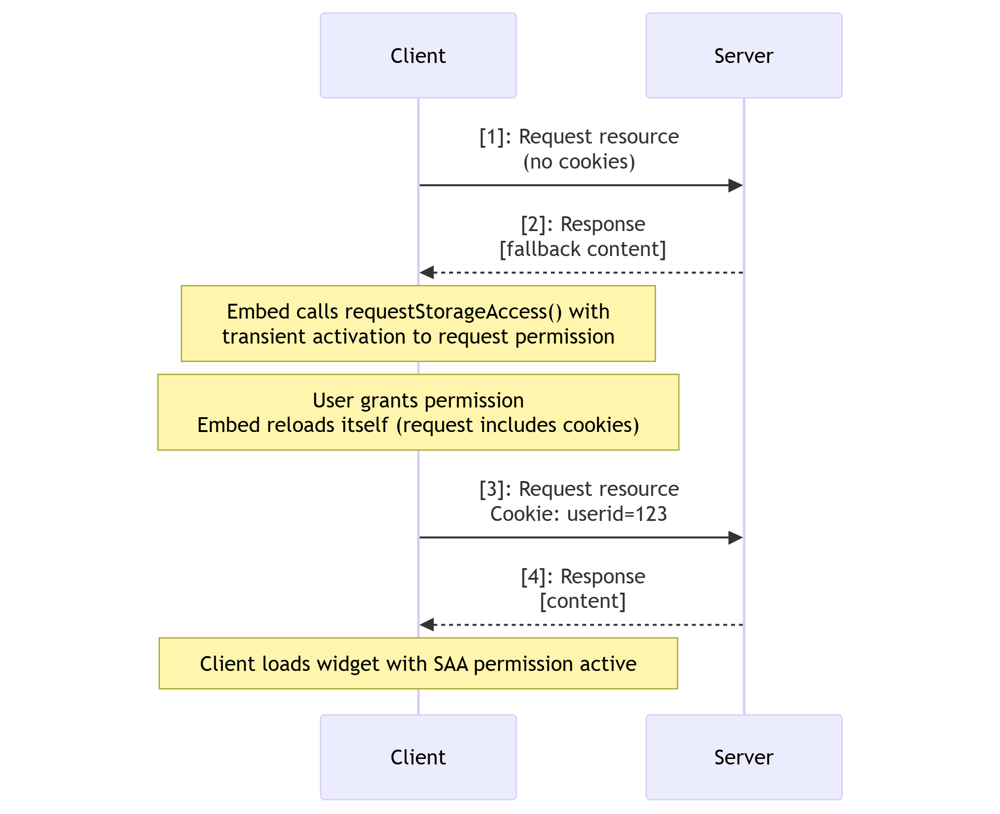
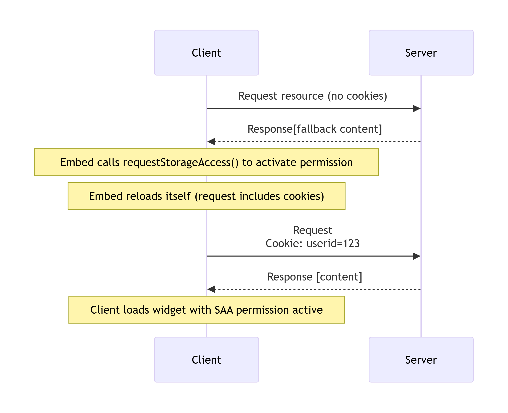
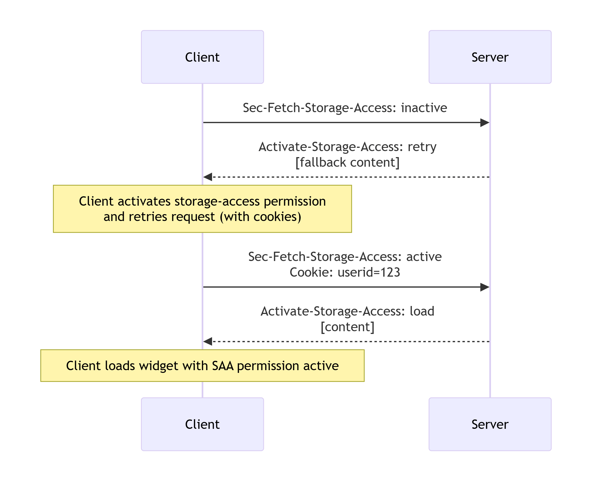
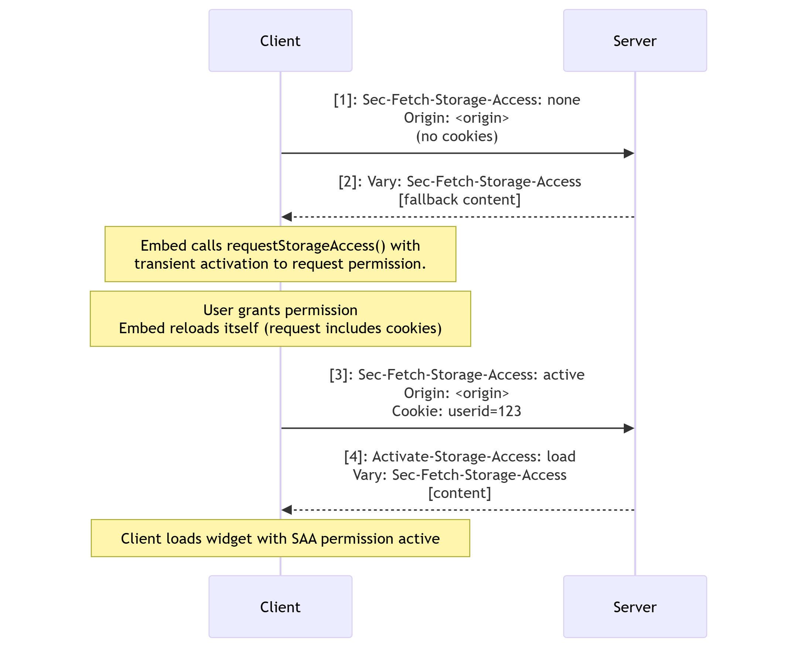

{{DefaultAPISidebar("Storage Access API")}}{{securecontext_header}}

The Storage Access API provides a way for cross-site content loaded in a third-party context (i.e., embedded in an {{htmlelement("iframe")}}) to gain access to [third-party cookies](/en-US/docs/Web/Privacy/Guides/Third-party_cookies) and [unpartitioned state](/en-US/docs/Web/Privacy/Guides/State_Partitioning#state_partitioning) that it would typically only have access to in a first-party context (i.e., when loaded directly in a browser tab).

The Storage Access API is relevant to user agents that, by default, block access to third-party cookies and unpartitioned state to improve privacy (for example, to prevent tracking). There are legitimate uses for third-party cookies and unpartitioned state that we still want to enable, even with these default restrictions in place. Examples include single sign-on (SSO) with federated identity providers (IdPs), or persisting user details such as location data or viewing preferences across different sites.

The API provides methods that allow embedded resources to check whether they currently have access to third-party cookies and, if not, to request access from the user agent.

## Concepts and usage

Browsers implement several storage access features and policies restricting access to third-party cookies and unpartitioned state. These range from giving embedded resources under each top-level origin a unique cookie storage space ([partitioned cookies](#unpartitioned_versus_partitioned_cookies)) to outright blocking of cookie access when resources are loaded in a third-party context.

The semantics around third-party cookie and unpartitioned state blocking features and policies differ from browser to browser, but the core functionality is similar. Cross-site resources embedded in a third-party context are not given access to the same state that they would have access to when loaded in a first-party context. This is done with good intent — browser vendors want to take steps to better protect their user's privacy and security. Examples include leaving them less open to having their activity tracked across different sites, and less vulnerable to exploits such as cross-site request forgery ({{glossary("CSRF")}}).

However, there are legitimate uses for embedded cross-site content accessing third-party cookies and unpartitioned state, which the above features and policies are known to break. Let's say you've got a series of different sites that provide access to different products — `heads-example.com`, `shoulders-example.com`, `knees-example.com`, and `toes-example.com`.

Alternatively, you might separate your content or services into different country domains for localization purposes — `example.com`, `example.ua`, `example.br`, etc. — or in some other way.

You might have accompanying utility sites with components embedded in all the other sites, for example, to provide SSO (`sso-example.com`) or general personalization services (`services-example.com`). These utility sites will want to share their state with the sites they are embedded in via cookies. They cannot share first-party cookies because they are on different domains, and third-party cookies will no longer work in browsers that block them.

In such situations, site owners often encourage users to add their site as an exception or to disable third-party cookie-blocking policies entirely. Users who wish to continue interacting with their content must significantly relax their blocking policy for resources loaded from all embedded origins and possibly across all websites.

The Storage Access API is intended to solve this problem; embedded cross-site content can request unrestricted access to third-party cookies and unpartitioned state on a frame-by-frame basis via the {{domxref("Document.requestStorageAccess()")}} method.
It can also check whether it already has access via the {{domxref("Document.hasStorageAccess()")}} method.

> [!NOTE]
> The [storage access headers](/en-US/docs/Web/API/Storage_Access_API#storage_access_headers) are an HTTP extension to the API that enables a more efficient storage API workflow, and can also be used to activate a previously granted storage access permission for passive resources, such as images.

### Unpartitioned versus partitioned cookies

The Storage Access API is only needed to provide access to _unpartitioned_ third-party cookies!
Unpartitioned cookies are those where all cookies set on the same site are stored in the same cookie jar — the traditional way since the early web.
Because there is a risk of exposing data intended for one site to other sites, browsers commonly block sending unpartitioned third-party cookies in requests, and don't allow access to them in embedded contexts.

This is in contrast to _partitioned_ cookies, where embedded resources under each top-level site are given a unique cookie storage space, isolated from those of other sites.
Since there is no privacy risk, because it is not possible to track users across sites via partitioned cookies, browsers send partitioned cookies in requests and make them available to embedded resources.
Note however that, because the cookies aren't shared between sites, they are also not automatically synchronized across sites.
Browsers have various mechanisms to partition third-party cookie access, for example [Firefox Total Cookie Protection](https://blog.mozilla.org/en/mozilla/firefox-rolls-out-total-cookie-protection-by-default-to-all-users-worldwide/) and [Cookies Having Independent Partitioned State (CHIPS)](/en-US/docs/Web/Privacy/Guides/Privacy_sandbox/Partitioned_cookies).

When we talk about third-party cookies in the context of the Storage Access API, we implicitly mean _unpartitioned_ third-party cookies.

### How it works

Third party content embedded in an {{htmlelement("iframe")}} that needs to access cookie or other unpartitioned state can request access using the Storage Access API as follows:

1. {{domxref("Document.hasStorageAccess()")}} can be called to check if the embedded content already has access to unpartitioned cookies.
2. If not, {{domxref("Document.requestStorageAccess()")}} can be called with {{Glossary("transient activation")}} to request the `storage-access` permission.

   Depending on the browser, the user will be asked whether to grant permission to the requesting embed in slightly different ways.
   - Safari shows prompts for all embedded content that has not previously received storage access.
   - Firefox only prompts users after an origin has requested storage access on more than a threshold number of sites.
   - Chrome shows prompts for all embedded content that has not previously received storage access.
     It will however automatically grant access and skip prompts if the embedded content and embedding site are part of the same [related website set](/en-US/docs/Web/API/Storage_Access_API/Related_website_sets).

3. Permission is granted or denied based on whether the content meets all the security requirements — see [Security considerations](#security_considerations) for general requirements, and [Browser-specific variations](#browser-specific_variations) for some browser-specific security requirements.
   The {{jsxref("Promise")}}-based nature of `requestStorageAccess()` allows you to run code to handle success and failure cases.

   Once permission is granted, a permission key is stored in the browser with the structure `<top-level site, embedded site>`.
   For example, if the embedding site is `embedder.com`, and the embed is `locator.example.com`, the key would be `<embedder.com, example.com>`.

   This means that permission is granted for unpartitioned cookie access to any page on the `example.com` site or any of its subdomains embedded in any page on the `embedder.com` site.
   For example, `docs.example.com`, `profile.example.com`, can now call `requestStorageAccess()` and the promise would fulfill automatically.

   > [!NOTE]
   > Older spec versions used the more specific permission key structure `<top-level site, embedded origin>`, which meant that same-site, cross-origin embeds didn't match the permission key and had to go through the whole process separately.

4. Permission must be explicitly activated for each _context_.

   When an embed is granted permission, that permission is also activated for the current context.
   However, other contexts, such as new browser tabs or content in other {{htmlelement("iframe")}} elements in the page, have their third-party cookie access blocked by default.
   That means that even if permission is granted, the page will need to load and call `requestStorageAccess()` to activate the permission.
   If permission has already been granted then a call to `requestStorageAccess()` will not require transient activation and the promise will fulfill automatically.

   The only exception to the "blocked by default" behavior is if an embed performs a same-origin navigation to reload itself after after being granted permission or activating a permission.
   In such cases, the storage access is carried over from the previous navigation.
   This allows the embedded resource to reload itself and gain access to its cookies.

   > [!NOTE]
   > In older spec versions, the access was _per-page_ (Safari is the only browser still using this model). When one embed received third-party cookie access via `requestStorageAccess()`, all other same-site embeds would automatically receive access.
   > This was not desirable behavior from a security standpoint — for example, if `shop.example.com` embedded `locator.users.com` to allow users to use their location info while shopping, and `locator.users.com` called `requestStorageAccess()`, `shop.example.com` and any other sites it embeds would be able to access its cookies, but also access cookies from `private.users.com`, which is not intended to be embedded. [Read more about the motivations](https://github.com/privacycg/storage-access/issues/113) behind this change.

5. After an embed has activated the storage-access permission it should reload itself.
   The browser will re-request the resource with third-party cookies included, and make them available to the embedded resource once it has loaded.

### Storage access headers

The API requires that a resource must must call `requestStorageAccess()` for each new context to opt-in to activating the storage-access permission, which must already have been granted.
This in turn means that the embedded resource must first be requested without cookies and loaded so it can call the method.

The storage access headers enable a workflow where the server can request that the permission is activated for the context, avoiding an unnecessary additional load of the embedded resource if permission has already been granted.
The resource must still be loaded in order to request permission the first time.

There are two headers:

- The browser adds the {{HTTPHeader("Sec-Fetch-Storage-Access")}} header to requests to indicate the storage access state of the current fetch context, such as whether permission has been activated, granted, or not granted.
- Depending on the storage access state of the request, the server can respond with an {{HTTPHeader("Activate-Storage-Access")}} header to request that the browser activate the permission for the context and retry the request with cookies (avoiding it having to load the resource so it can call `requestStorageAccess()` to achieve the same thing), or activate the permission and load the returned resource.

The storage access headers can also be used to activate permission for passive resources, such as images, provided the context has already been granted permission.
This might be used, for example, to serve different images for different users, demographics, or locales.

The workflows are shown in the [Storage access header sequences](#storage_access_header_sequences) section.

### Request/response flow

#### JavaScript sequences

Consider the example of a library loaded in an {{htmlelement("iframe")}} that needs to be shared across a number of sites and relies on credentials stored in unpartitioned cookies.

First let's look at the case where permission has not been granted:

1. The browser requests the resource without including third-party cookies.
2. The server responds with a "fallback" version of content that does not rely on credentials, and that when loaded doesn't have access to its cookies.
   - Once loaded, the resource calls `requestStorageAccess()` with transient activation to request and activate the `storage-access` permission.
   - If permission is granted, the resource will then reload itself.

3. The browser requests the resource again, this time including third-party cookies.
4. The server response includes a "credentialed" version of the resource.

The browser loads the resource, which has access to its own cookies because it has an activated `storage-access` permission.



<!--
[](https://mermaid.live/edit#pako:eNqFks1u2zAQhF-F4MkBnEB_lmU1MWC4ufZQo5dGOdDkWiYikSq5StoafveuRCgIHBjVRdrBfrOrIU9cWgW85B5-9WAkfNWidqL9UhlGTyccaqk7YZBtGw0GP-s7cK_ggh56btfrIJbsKX4u2ffB2yNz4G3vJNzv3XpmLJPWvmjwN4ENyC3BwYXgZIR9Z40foaeDaJq9kC-EGqSe54B-swjMEs0m9LHdg2KS2j2NHcfv0DpRw0ZK8H52w940HgdTdML4gWJCon4VqK1haCeMdeBa7T2p14b98FRQagb9h-7BO6zhoLFCeabRQ3Ngs8lZG9n0CvxFEJ9DTK-EuB25kvW0gFYPcZJejTK7jPJ_CYY3C5u_aVUDjpGx3Wbz4S9DaFAZPuc1LcFLdD3MeUsdYij5aZhQcTxCCxUv6VPBQfQNVrwyZ8LoFv20tp1IZ_v6yEs6ak9V3ymB0628UB-VpjN9Fx0YBW5re4O8jFfx6MzLE__NyyRb3aWLokjyPIuyfDHnf6iHxOVimWdFvMyTNCnOc_533CS6W-ZRGhfZooiKKFnFy_M_V38SSw)

sequenceDiagram;
    participant Client
    participant Server
    Client->>Server: [1]: Request resource<br>(no cookies)
    Server-- >>Client: [2]: Response<br>[fallback content]
    Note over Client: Embed calls requestStorageAccess() with<br>transient activation to request permission
    Note over Client: User grants permission<br>Embed reloads itself (request includes cookies)
    Client->>Server: [3]: Request resource<br>Cookie: userid=123
    Server-- >>Client: [4]: Response<br>[content]
    Note over Client: Client loads widget with SAA permission active
-->

Now consider the case where permission has been granted but not activated.
This would happen if you were to open the same URL in a new browser tab, or attempt to embed the same resource from another page in the same site.

The workflow is almost exactly the same because the resource still needs to be loaded the first time without cookies, and it then needs to call `requestStorageAccess()` to activate the permission for the context.
In this case, however, it doesn't need transient activation and can execute on load.



<!--
[](https://mermaid.live/edit#pako:eNqFkk1P4zAQhv-K5VORSpWvJqmBSlWX6x7oDcLBtaepRWJn_cHuUvW_M40BrYpYfLE9nued8WsfqDASKKMOfgXQAn4o3lreXzWa4Bi49UqogWtP1p0C7T_HN2CfwcZ4zLlcLmOQkYf0kZG7k7bzxIIzwQq43trlRBsijHlS4C4iG5FLhKMKwtkIu8FoN0IPO951Wy6eENUecx4j-tN4IAZp8o7e9luQRGC6w7Jj-Y03lrewEgKcm1wQbwgXXj1zZAewvXJOGf1_QQud4dIR5R10OzJ5kyZKiy5IcGdX-mxH_oUd65FjJDiwSt6kWf6lKcW5Kd95EWcSO_-tZAseJ78nm9Xqn5tHN6DRdEpbbIIybwNMaY8Z_LSlh1OFhvo99NBQhksJOx4639BGHxHD_3BvTP9OWhPaPWX4aA53YZBo9dv_OoveSoWv8xG0oCXYtQnaU5YW81GZsgP9Q1lWLGb5vK6zsiySosSzv6ecxayaV2VRp1WZ5Vl9nNKXsZNkVpVJntbFvE7qJFuk1fEVT-z9Kg)

sequenceDiagram;
    participant Client
    participant Server
    Client->>Server: [1]: Request resource<br>(no cookies)
    Server-- >>Client: [2]: Response<br>[fallback content]
    Note over Client: Embed calls requestStorageAccess() to activate permission
    Note over Client: Embed reloads itself (request includes cookies)
    Client->>Server: [3]: Request resource<br>Cookie: userid=123
    Server-- >>Client: [4]: Response<br>[content]
    Note over Client: Client loads widget with SAA permission active
-->

#### Storage access header sequences

The storage access headers enable an improved workflow that allows the server to request that the browser activate a permission that has been granted and retry the request with cookies included.
This avoids the requirement to load the resource to call `requestStorageAccess()` when the user has already granted permission.

> [!NOTE]
> These headers do not provide a mechanism to grant the storage access permission in the first place.
> Permission must always be requested by the embedded resource calling `requestStorageAccess()` with transient activation.

The {{HTTPHeader("Sec-Fetch-Storage-Access")}} header is added to requests to indicate the storage access state of the current fetch context, such as whether permission has been activated, granted, or not granted.
Depending on the storage access state of the request, the server can respond with an {{HTTPHeader("Activate-Storage-Access")}} header to request that the browser activate the permission for the context and retry the request with cookies.

First let's look at the case of attempting to load an embedded resource for a new context that already has permission granted:

1. The browser sends a request with `Sec-Fetch-Storage-Access: inactive` to indicate that the permission is granted but inactive for the context.
   - The request will also include the {{httpheader("Origin")}} header to help the server decide if it wants to activate the permission.
2. The server can then respond with `Activate-Storage-Access: retry` to indicate that the browser should activate the permission, and retry the request with cookies.
   - The response should also include the {{httpheader("Vary","Vary: Sec-Fetch-Storage-Access")}} header, as it depends on the value of `Sec-Fetch-Storage-Access`.
   - Note that the response doesn't include content.
3. If the browser retries the request, it adds `Sec-Fetch-Storage-Access: active` to the request along with the cookies.
4. The server then responds with `Activate-Storage-Access: load`, which tells the browser to load the new version of the library with access to third-party cookies.



<!--
[](https://mermaid.live/edit#pako:eNqFkkFP4zAQhf-KNSdWaqq2SWhr2EpVYY_LoRIHCAdjD6m1jd21J0Cp-t-ZJGW1oqJEimw_zXxv_OQdaG8QJET8W6PTeGVVGVR1UTjB30YFstpulCOxWFt0dKwvMTxj6PSuJpnNOlGK--GD5Aqd_ELSq2RJPqgSk7nWGKMU1ilN9hkvH8PsJtjSOikufbuZNdqZ80J7_8di_NE5dOCELTovthixxbzBKMIjh4AUtg3qVoXt16N08N-eUHjmiw94twp1wEcRD22qbRMbDJWN0XrXeChnWkMel1cONJI4e7G0-nSJ45jSkzGdDmnRsqWoIwZrfg5H6ZdRZaeiWntlvk-qqbjX3hETH76JrSFG8WJNiSTaHJbz-X-ZHS5WOOhBybODpFBjDyquUM0Rdo1DAbTCCguQvDX4pOo1FVC4PbfxE7zzvvroDL4uVyCf1Dryqd4YvujhSX9Sr43le_0TAzqDYeFrRyBHk0lLBrmDV5BpOujnwywfTPkfT_PzHmxB5ml_mo6z8ZCFLM8G6b4Hb-0og_5knO_fAfjRIqA)

sequenceDiagram;
    participant Client
    participant Server
    Client->>Server: [1]: Sec-Fetch-Storage-Access: inactive<br>Origin: <origin><br>(no cookies)
    Server-- >>Client: [2]: Activate-Storage-Access: retry<br>Vary: Sec-Fetch-Storage-Access
    Note over Client: Client activates storage-access permission<br>and retries request (with cookies)
    Client->>Server: [3]: Sec-Fetch-Storage-Access: active<br>Origin: <origin><br>Cookie: userid=123
    Server-- >>Client: [4]: Activate-Storage-Access: load<br>Vary: Sec-Fetch-Storage-Access<br>[content]
    Note over Client: Client loads widget with SAA permission active
-->

The last state to consider is when loading an embedded resource for which permission has not been granted:

> [!NOTE]
> Because we can't use the headers to grant permission, we need to load the resource without cookies so that it can request the permission.
> This is the same sequence as if the headers were not applied.

1. The browser sends a request with `Sec-Fetch-Storage-Access: none` to indicate that the permission has not been granted.
2. The server then responds with the resource, which when loaded requests permission for secure access with transient activation.
   The `Activate-Storage-Access` header isn't included in the response, but the server should add {{httpheader("Vary","Vary: Sec-Fetch-Storage-Access")}}.

   After the user has granted (and thereby activated) the permission, the embed reloads itself.

3. The browser adds `Sec-Fetch-Storage-Access: active` to the request to indicate the context has an activated `storage-access` permission, and includes the third-party cookies.
4. The server responds with `Activate-Storage-Access: load`, which tells the browser to load the new version of the library with access to third-party cookies.



<!--
[](https://mermaid.live/edit#pako:eNqNk01v2zAMhv-KoFMKxEH8EcfWugBB1h23Q7AdVvegyIwj1JYySW7XBfnvpaxkKBpkmy82X5APyVfygQpdA2XUws8elIBPkjeGdx8qRfDZc-OkkHuuHFm1EpS71NdgnsAEPeREi0UQGbmPHxhmiOgzOLGL1k4b3kC0FAKsZURpBbcbs_hqZCMVI7d6-Fh4baQ0EVo_SrA3gR6gEeJDH8QniP_Ozcv1Jh51v-Vtu-HiEYHKYeVDAH7RDohGJjkD77oN1ERguiXGW2LdCRdooxvyLN3OQ53hyvoqwoWTT9xJrYjT5zKyB9NJa1GdXOv2zWKAditn36R7eJjDQKt5bYl0FtotGZ3RUom2r8G-8-fS_fSv7g9zX_V_NbAZ6XFIWX-Mk_TqKWTYZhlMgIsufgXP-49j-tfphDcJpjzLugE3HAdZL5dvDDwtVik6pg3OTpkzPYxphxnch_TgO1TU7aCDijL8rGHL-9ZVtFJHLMOb_UPr7lxpdN_sKMNrZDHq9zUuevpT3ql3tcS9_ogGVA1mpXvlKEuSZCBTdqC_MMzKSToriiTPs2mWz8b0hbIYxflsnmdFPM-TNCmOY_p7mGQ6mefTNC6yWVmWSZklx1dtqUSP)

sequenceDiagram;
    participant Client
    participant Server
    Client->>Server: [1]: Sec-Fetch-Storage-Access: none<br>Origin: <origin><br>(no cookies)
    Server-- >>Client: [2]: Vary: Sec-Fetch-Storage-Access<br>[fallback content]
    Note over Client: Embed calls requestStorageAccess() with<br>transient activation to request permission.
    Note over Client: User grants permission<br>Embed reloads itself (request includes cookies)
    Client->>Server: [3]: Sec-Fetch-Storage-Access: active<br>Origin: <origin><br>Cookie: userid=123
    Server-- >>Client: [4]: Activate-Storage-Access: load<br>Vary: Sec-Fetch-Storage-Access<br>[content]
    Note over Client: Client loads widget with SAA permission active
-->

## Security considerations

Several different security measures could cause a {{domxref("Document.requestStorageAccess()")}} call to fail.
Check the below list if you are having trouble getting a request to work:

1. The permission request must be associated with a user gesture ({{Glossary("transient activation")}}) such as a tap or click.
   This prevents embedded content on the page from spamming the browser or user with excessive access requests.
   Note that this isn't required if:
   - Permission to use the API has already been granted to another context with the same `<top-level site, embedded site>` key.
   - The caller is a top-level document or same-site to the top-level document.
     In such cases, `requestStorageAccess()` probably doesn't need to be called at all.
2. The document and top-level document must not have a `null` origin.
3. Origins that have never been interacted with as a first party do not have a notion of first-party storage. From the user's perspective, they only have a third-party relationship with that origin. Access requests are automatically denied if the browser detects that the user hasn't interacted with the embedded content in a first-party context recently (in Firefox, "recently" means within 30 days).
4. The document's window must be a [secure context](/en-US/docs/Web/Security/Secure_Contexts).
5. Sandboxed {{htmlelement("iframe")}}s cannot be granted storage access by default for security reasons.
   To handle this, the API provides the [`allow-storage-access-by-user-activation`](/en-US/docs/Web/HTML/Reference/Elements/iframe#allow-storage-access-by-user-activation) [sandbox token](/en-US/docs/Web/HTML/Reference/Elements/iframe#sandbox).
   The `<iframe>` needs to include this to enable storage access requests, along with `allow-scripts` and `allow-same-origin` to allow it to execute a script to call the API and execute it in an origin that can have cookies/state:

   ```html
   <iframe
     sandbox="allow-storage-access-by-user-activation
                   allow-scripts
                   allow-same-origin">
     …
   </iframe>
   ```

6. Usage of this feature may be blocked by a {{httpheader("Permissions-Policy/storage-access", "storage-access")}} [Permissions Policy](/en-US/docs/Web/HTTP/Guides/Permissions_Policy) set on your server.

> [!NOTE]
> The document may also be required to pass additional browser-specific checks. Examples: allowlists, blocklists, on-device classification, user settings, anti-[clickjacking](/en-US/docs/Web/Security/Attacks/Clickjacking) heuristics, or prompting the user for explicit permission.

## Browser-specific variations

Although the API surface is the same, websites using the Storage Access API should expect differences in the level and extent of third-party cookie access they receive between different browsers, due to differences in their storage access policies.

### Chrome

- Cookies must have [`SameSite=None`](/en-US/docs/Web/HTTP/Reference/Headers/Set-Cookie#samesitesamesite-value) explicitly set on them, because the default value for Chrome is `SameSite=Lax` (`SameSite=None` is the default in Firefox and Safari).
- Cookies must have the [`Secure`](/en-US/docs/Web/HTTP/Reference/Headers/Set-Cookie#secure) attribute set on them.
- The storage access grants are phased out after 30 days of browser usage passed without user interaction. Interaction with the embedded content extends this limit by another 30 days. This doesn't occur when {{domxref("Document.requestStorageAccessFor()")}} is called because the user is already on the page.

### Firefox

- If the embedded origin `tracker.example` has already obtained third-party cookie access on the top-level origin `foo.example`, and the user visits a page from `foo.example` embedding a page from `tracker.example` again in less than 30 days, the embedded origin will have third-party cookie access immediately when loading.
- The storage access grants are phased out after 30 calendar days have passed.

Documentation for Firefox's new storage access policy for blocking tracking cookies includes [a detailed description](/en-US/docs/Web/Privacy/Guides/Storage_Access_Policy#storage_access_grants) of the scope of storage access grants.

### Safari

- The storage access grants are phased out after 30 days of browser usage passed without user interaction. Successful use of the Storage Access API resets this counter.

## Examples

- See [Using the Storage Access API](/en-US/docs/Web/API/Storage_Access_API/Using) for an implementation guide with code examples.

## API methods

- {{domxref("Document.hasStorageAccess()")}}
  - : Returns a {{jsxref("Promise")}} that resolves with a boolean value indicating whether the document has access to third-party cookies.
- {{domxref("Document.hasUnpartitionedCookieAccess()")}}
  - : New name for {{domxref("Document.hasStorageAccess()")}}.
- {{domxref("Document.requestStorageAccess()")}}
  - : Allows content loaded in a third-party context (i.e., embedded in an {{htmlelement("iframe")}}) to request access to third-party cookies and unpartitioned state; returns a {{jsxref("Promise")}} that resolves if the access was granted, and rejects if access was denied.
- {{domxref("Document.requestStorageAccessFor()")}} {{experimental_inline}}
  - : A proposed extension to the Storage Access API that allows top-level sites to request third-party cookie access on behalf of embedded content originating from another site in the same [related website set](/en-US/docs/Web/API/Storage_Access_API/Related_website_sets). Returns a {{jsxref("Promise")}} that resolves if the access was granted, and rejects if access was denied.

> [!NOTE]
> User interaction propagates to the promise returned by these methods, allowing the callers to take actions requiring user interaction without requiring a second click. For example, a caller could open a pop-up window from the resolved promise without triggering Firefox's pop-up blocker.

### Additions to other APIs

- {{domxref("Permissions.query()")}}, the `"storage-access"` feature name
  - : In supporting browsers, this can query whether third-party cookie access has been granted in general, that is, to another same-site embed. If so, you can call `requestStorageAccess()` without user interaction, and the promise will resolve automatically.
- `Permissions.query()`, the `"top-level-storage-access"` feature name {{experimental_inline}}
  - : A separate feature name used to query whether permission to access third-party cookies has already been granted via `requestStorageAccessFor()`. If so, you don't need to call `requestStorageAccessFor()` again.

### Additions to HTTP

#### Permissions-Policy

- {{httpheader("Permissions-Policy/storage-access","Permissions-Policy: storage-access")}}
  - : The `storage-access` {{HTTPHeader("Permissions-Policy")}} directive controls whether a document loaded in a third-party context (i.e., embedded in an {{htmlelement("iframe")}}) is allowed to use the storage access API to request access to unpartitioned cookies.

#### Storage access headers

- {{HTTPHeader("Sec-Fetch-Storage-Access")}}
  - : Indicates the "storage access status" for the current request context, which will be one of `none`, `inactive`, or `active`.
- {{HTTPHeader("Activate-Storage-Access")}}
  - : Used in response to `Sec-Fetch-Storage-Access` to indicate that the browser can activate an existing permission for secure access and retry the request with cookies, or load a resource with cookie access if it already has an activated permission.

## Specifications

{{Specifications}}

## Browser compatibility

{{Compat}}

## See also

- [Using the Storage Access API](/en-US/docs/Web/API/Storage_Access_API/Using)
- [Introducing Storage Access API](https://webkit.org/blog/8124/introducing-storage-access-api/) (WebKit blog)
