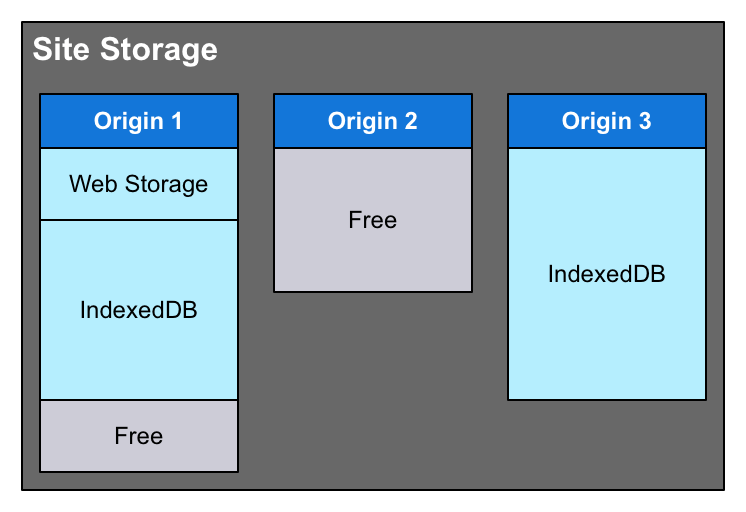

{{securecontext_header}}{{DefaultAPISidebar("Storage")}} {{AvailableInWorkers}}

The Storage Standard defines a common, shared storage system to be used by all APIs and technologies that store content-accessible data for individual Web sites. The Storage API gives sites' code the ability to find out how much space they can use, how much they are already using, and even control whether or not they need to be alerted before the {{Glossary("user agent")}} disposes of site data in order to make room for other things.

Site storage—the data stored for a Web site which is managed by the Storage Standard—includes:

- [IndexedDB databases](/en-US/docs/Web/API/IndexedDB_API)
- [Cache API data](/en-US/docs/Web/API/Cache)
- [Service Worker registrations](/en-US/docs/Web/API/Service_Worker_API)
- [Web Storage API data](/en-US/docs/Web/API/Web_Storage_API) managed using {{domxref("window.localStorage")}}
- History state information saved using {{domxref("History.pushState()")}}
- [Notification data](/en-US/docs/Web/API/Notifications_API)
- Other kinds of site-accessible, site-specific data that may be maintained

## Site storage units

The site storage system described by the Storage Standard and interacted with using the Storage API consists of a single **site storage unit** for each {{Glossary("origin")}}. In essence, every Web site or Web application has its own storage unit into which its data gets placed. The diagram below shows a site storage pool with three storage units within, showing how storage units can have different data types stored within and may have different quotas (maximum storage limits).



- Origin 1 has some Web Storage data as well as some IndexedDB data, but also has some free space left; its current usage hasn't yet reached its quota.
- Origin 2 has no data stored in it yet; it's just an empty box waiting for content. This origin, however, has a lower quota than the other two do. It may be a less-visited site, or one known to have lower data storage requirements.
- Origin 3's storage unit is completely full; it's reached its quota and can't store any more data without some existing material being removed.

{{Glossary("User agent", "User agents")}} are likely to use various techniques to determine the quota for various origins. One of the most likely methods—one which the specification specifically encourages, in fact—would be to consider the popularity and/or usage levels of individual sites to determine what their quotas should be.  It's also conceivable that the browser might offer a user interface to customize these quotas.

## Box modes

The actual data storage within each site storage unit is called its **box**. Each site storage unit has exactly one box into which all of its data is placed, and has a **box mode** that describes the data retention policy for that box. There are two modes:

- `"best-effort"`
  - : The user agent will try to retain the data contained in the box for as long as it can, _but will not warn users_ if storage space runs low and it becomes necessary to clear the box in order to relieve the storage pressure.
- `"persistent"`
  - : The user agent will retain the data as long as possible, clearing all `"best-effort"` boxes before considering clearing a box marked `"persistent"`. If it becomes necessary to consider clearing persistent boxes, the user agent will notify the user and provide a way to clear one or more persistent boxes as needed.

To change an origin's box mode requires permission to use the `"persistent-storage"` feature.

## Data persistence and clearing

If the site or app has the **`"persistent-storage"`** feature permission, it can use the {{domxref("StorageManager.persist()")}} method to request that its box be made persistent. It's also possible for the user agent to decide to make the site's storage unit persistent due to usage characteristics or other metrics. The `"persistent-storage"` feature's permission-related flags, algorithms, and types are all set to the standard defaults for a permission, except that the **permission state** must be the same across the entire origin, and that if the permission state isn't `"granted"` (meaning that for whatever reason, access to the persistent storage feature was denied), the origin's site storage unit's box mode is always `"best-effort"`.

> **Note:** See [Using the Permissions API](/en-US/docs/Web/API/Permissions_API/Using_the_Permissions_API) for further details about obtaining and managing permissions.

When clearing site storage units, an origin's box is treated as a single entity; if the user agent needs to clear it and the user approves, the entire data store is cleared rather than providing some means of clearing only data from individual APIs.

If a box is marked as `"persistent"`, the contents won't be cleared by the user agent without either the data's origin itself or the user specifically doing so. This includes scenarios such as the user selecting a "Clear Caches" or "Clear Recent History" option. The user will be asked specifically for permission to remove persistent site storage units.

## Quotas and usage estimates

The user agent determines, using whatever mechanism it chooses, the maximum amount of storage a given site can use. This maximum is the origin's **quota**. The amount of this space which is in use by the site is called its **usage**. Both of these values are estimates; there are several reasons why they're not precise:

- User agents are encouraged to obscure the exact size of the data used by a given origin, to prevent these values from being used for fingerprinting purposes.
- De-duplication, compression, and other methods to reduce the physical size of the stored data may be used.
- Quotas are conservative estimates of the space available for the origin's use, and should be less than the available space on the device to help prevent overruns.

User agents may use any method they choose to determine the size of origins' quotas, and are encouraged by the specification to provide popular or frequently-used sites with extra space.

To determine the estimated quota and usage values for a given origin, use the {{domxref("StorageManager.estimate", "navigator.storage.estimate()")}} method, which returns a promise that, when resolved, receives an object that contains these figures. For example:

```js
navigator.storage.estimate().then((estimate) => {
  // estimate.quota is the estimated quota
  // estimate.usage is the estimated number of bytes used
});
```

## Specifications

{{Specifications}}

## Browser compatibility

{{Compat}}

## See also

- {{domxref("navigator.storage")}}
- {{domxref("StorageManager")}} (the object returned by `navigator.storage`)
- [Using the Permissions API](/en-US/docs/Web/API/Permissions_API/Using_the_Permissions_API)
