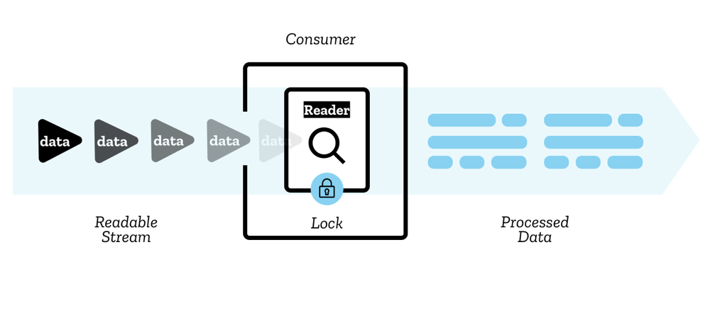
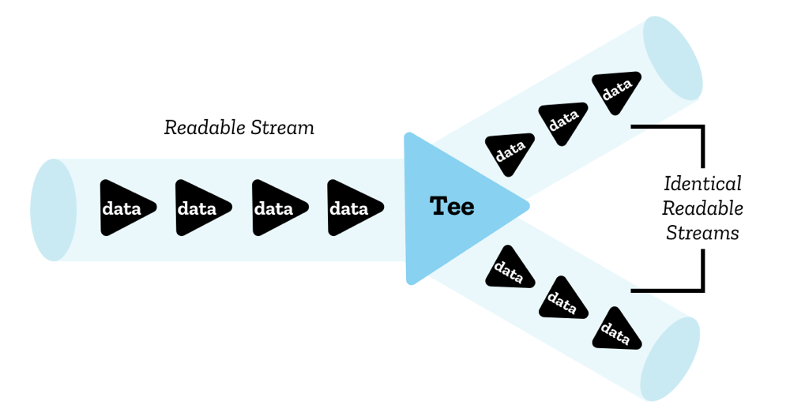
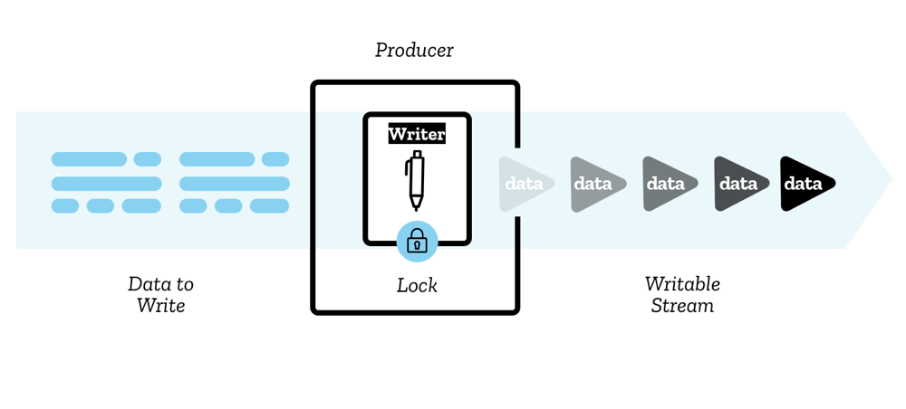
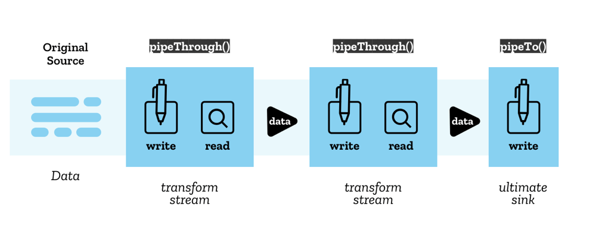

{{DefaultAPISidebar("Streams")}}

The [Streams API](/en-US/docs/Web/API/Streams_API) adds a very useful set of tools to the web platform, providing objects allowing JavaScript to programmatically access streams of data received over the network and process them as desired by the developer. Some of the concepts and terminology associated with streams might be new to you — this article explains all you need to know.

## Readable streams

A readable stream is a data source represented in JavaScript by a {{domxref("ReadableStream")}} object that flows from an **underlying source** — this is a resource somewhere on the network or elsewhere on your domain that you want to get data from.

There are two types of underlying source:

- **Push sources** constantly push data at you when you've accessed them, and it is up to you to start, pause, or cancel access to the stream. Examples include video streams and TCP/[Web sockets](/en-US/docs/Web/API/WebSockets_API).
- **Pull sources** require you to explicitly request data from them once connected to. Examples include a file access operation via a [Fetch](/en-US/docs/Web/API/Fetch_API) or [XHR](/en-US/docs/Web/API/XMLHttpRequest/XMLHttpRequest) call.

The data is read sequentially in small pieces called **chunks**. A chunk can be a single byte, or it can be something larger such as a [typed array](/en-US/docs/Web/JavaScript/Guide/Typed_arrays) of a certain size. A single stream can contain chunks of different sizes and types.

The chunks placed in a stream are said to be **enqueued** — this means they are waiting in a queue ready to be read. An **internal queue** keeps track of the chunks that have not yet been read (see the Internal queues and queuing strategies section below).

The chunks inside the stream are read by a **reader** — this processes the data one chunk at a time, allowing you to do whatever kind of operation you want to do on it. The reader plus the other processing code that goes along with it is called a **consumer**.

There is also a construct you'll use called a **controller** — each reader has an associated controller that allows you to control the stream (for example, to close it if wished).

Only one reader can read a stream at a time; when a reader is created and starts reading a stream (an **active reader**), we say it is **locked** to it. If you want another reader to start reading your stream, you typically need to cancel the first reader before you do anything else (although you can **tee** streams, see the Teeing section below)

Note that there are two different types of readable stream. As well as the conventional readable stream there is a type called a byte stream — this is an extended version of a conventional stream for reading underlying byte sources. Compared with the conventional readable stream, byte streams are allowed to be read by BYOB readers (BYOB, "bring your own buffer"). This kind of reader allows streams to be read straight into a buffer supplied by the developer, minimizing the copying required. Which underlying stream (and by extension, reader and controller) your code will use depends on how the stream was created in the first place (see the {{domxref("ReadableStream.ReadableStream","ReadableStream()")}} constructor page).

You can make use of ready-made readable streams via mechanisms like a {{domxref("Response.body")}} from a fetch request, or roll your own streams using the {{domxref("ReadableStream.ReadableStream","ReadableStream()")}} constructor.

## Teeing

Even though only a single reader can read a stream at once, it is possible to split a stream into two identical copies, which can then be read by two separate readers. This is called **teeing**.

In JavaScript, this is achieved via the {{domxref("ReadableStream.tee()")}} method — it outputs an array containing two identical copies of the original readable stream, which can then be read independently by two separate readers.

You might do this for example in a [ServiceWorker](/en-US/docs/Web/API/Service_Worker_API) if you want to fetch a response from the server and stream it to the browser, but also stream it to the ServiceWorker cache. Since a response body cannot be consumed more than once, and a stream can't be read by more than one reader at once, you'd need two copies to do this.

## Writable streams

A **writable stream** is a destination into which you can write data, represented in JavaScript by a {{domxref("WritableStream")}} object. This serves as an abstraction over the top of an **underlying sink** — a lower-level I/O sink into which raw data is written.

The data is written to the stream via a **writer**, one chunk at a time. A chunk can take a multitude of forms, just like the chunks in a reader. You can use whatever code you like to produce the chunks ready for writing; the writer plus the associated code is called a **producer**.

When a writer is created and starts writing to a stream (an **active writer**), it is said to be **locked** to it. Only one writer can write to a writable stream at one time. If you want another writer to start writing to your stream, you typically need to abort it before you then attach another writer to it.

An **internal queue** keeps track of the chunks that have been written to the stream but not yet been processed by the underlying sink.

There is also a construct you'll use called a controller — each writer has an associated controller that allows you to control the stream (for example, to abort it if wished).

You can make use of writable streams using the {{domxref("WritableStream.WritableStream","WritableStream()")}} constructor. These currently have very limited availability in browsers.

## Pipe chains

The Streams API makes it possible to pipe streams into one another using a structure called a **pipe chain**.
There are two methods that facilitate this:

- {{domxref("ReadableStream.pipeThrough()")}} — pipes the stream through a **transform stream**, potentially transforming the data format along the way.
  This might be used, for example, to encode or decode video frames, compress or decompress data, or otherwise convert data from one form to another.

  A transform stream consists of a pair of streams: a readable stream from which data is read and a writable stream into which it is written, along with appropriate mechanisms to ensure that new data is made available to read as soon as data is written.

  {{domxref("TransformStream")}} is a concrete implementation of a transform stream, but any object that has the same readable stream and writable stream properties can be passed to `pipeThrough()`.

- {{domxref("ReadableStream.pipeTo()")}} — pipes to a writable stream that acts as the end point of the pipe chain.

The start of the pipe chain is called the **original source**, and the end is called the **ultimate sink**.

## Backpressure

An important concept in streams is **backpressure** — this is the process by which a single stream or a pipe chain regulates the speed of reading/writing. When a stream later in the chain is still busy and isn't yet ready to accept more chunks, it sends a signal backwards through the chain to tell earlier transform streams (or the original source) to slow down delivery so that you don't end up with a bottleneck anywhere.

To use backpressure in a {{domxref("ReadableStream")}}, we can ask the controller for the chunk size desired by the consumer by querying the {{domxref("ReadableStreamDefaultController.desiredSize")}} property on the controller. If it is too low, our `ReadableStream` can tell its underlying source to stop sending data, and we backpressure along the stream chain.

If later on the consumer again wants to receive data, we can use the pull method in the stream creation to tell our underlying source to feed our stream with data.

## Internal queues and queuing strategies

As mentioned earlier, the chunks in a stream that have not yet been processed and finished with are kept track of by an internal queue.

- In the case of readable streams, these are the chunks that have been enqueued but not yet read
- In the case of writable streams, these are chunks that have been written but not yet processed by the underlying sink.

Internal queues employ a **queuing strategy**, which dictates how to signal backpressure based on the **internal queue state.**

In general, the strategy compares the size of the chunks in the queue to a value called the **high water mark**, which is the largest total chunk size that the queue would prefer to manage.

The calculation performed is

`high water mark - total size of chunks in queue = desired size`

The **desired size** is the number of chunks the stream can still accept to keep the stream flowing but below the high water mark in size.
Chunk generation will be slowed down/sped up as appropriate to keep the stream flowing as fast as possible while keeping the desired size above zero.
If the value falls to zero (or below), it means that chunks are being generated faster than the stream can cope with, which may result in problems.

As an example, let's take a chunk size of 1, and a high water mark of 3.
This means that up to 3 chunks can be enqueued before the high water mark is reached and backpressure is applied.
