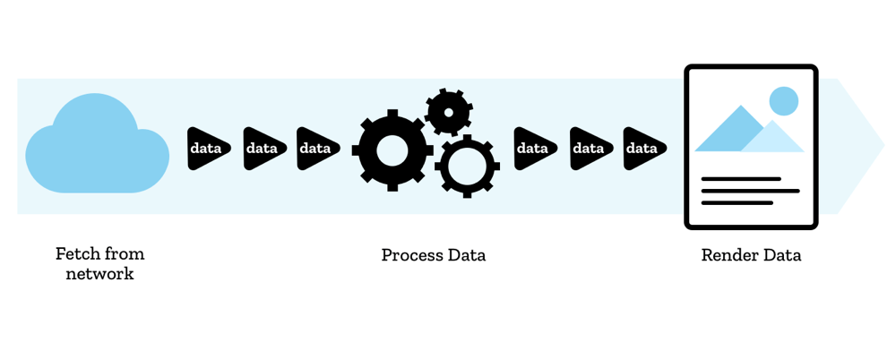

{{DefaultAPISidebar("Streams")}}{{AvailableInWorkers}}

The Streams API allows JavaScript to programmatically access streams of data received over the network and process them as desired by the developer.

## Concepts and usage

Streaming involves breaking a resource that you want to receive over a network down into small chunks, then processing it bit by bit. Browsers already do this when receiving media assets — videos buffer and play as more of the content downloads, and sometimes you'll see images display gradually as more is loaded too.

But this capability has never been available to JavaScript before. Previously, if we wanted to process a resource of some kind (video, text file, etc.), we'd have to download the entire file, wait for it to be deserialized into a suitable format, then process all the data.

With the Streams API, you can start processing raw data with JavaScript bit by bit, as soon as it is available, without needing to generate a buffer, string, or blob.

There are more advantages too — you can detect when streams start or end, chain streams together, handle errors and cancel streams as required, and react to the speed at which the stream is being read.

The usage of Streams hinges on making responses available as streams. For example, the response body returned by a successful [fetch request](/en-US/docs/Web/API/Window/fetch) is a {{domxref("ReadableStream")}} that can be read by a reader created with {{domxref("ReadableStream.getReader()")}}.

More complicated uses involve creating your own stream using the {{domxref("ReadableStream.ReadableStream", "ReadableStream()")}} constructor, for example to process data inside a [service worker](/en-US/docs/Web/API/Service_Worker_API).

You can also write data to streams using {{domxref("WritableStream")}}.

> **Note:** You can find a lot more details about the theory and practice of streams in our articles — [Streams API concepts](/en-US/docs/Web/API/Streams_API/Concepts), [Using readable streams](/en-US/docs/Web/API/Streams_API/Using_readable_streams), [Using readable byte streams](/en-US/docs/Web/API/Streams_API/Using_readable_byte_streams), and [Using writable streams](/en-US/docs/Web/API/Streams_API/Using_writable_streams).

## Stream interfaces

### Readable streams

- {{domxref("ReadableStream")}}
  - : Represents a readable stream of data. It can be used to handle response streams of the [Fetch API](/en-US/docs/Web/API/Fetch_API), or developer-defined streams (e.g. a custom {{domxref("ReadableStream.ReadableStream", "ReadableStream()")}} constructor).
- {{domxref("ReadableStreamDefaultReader")}}
  - : Represents a default reader that can be used to read stream data supplied from a network (e.g. a fetch request).
- {{domxref("ReadableStreamDefaultController")}}
  - : Represents a controller allowing control of a {{domxref("ReadableStream")}}'s state and internal queue. Default controllers are for streams that are not byte streams.

### Writable streams

- {{domxref("WritableStream")}}
  - : Provides a standard abstraction for writing streaming data to a destination, known as a sink. This object comes with built-in backpressure and queuing.
- {{domxref("WritableStreamDefaultWriter")}}
  - : Represents a default writable stream writer that can be used to write chunks of data to a writable stream.
- {{domxref("WritableStreamDefaultController")}}
  - : Represents a controller allowing control of a {{domxref("WritableStream")}}'s state. When constructing a `WritableStream`, the underlying sink is given a corresponding `WritableStreamDefaultController` instance to manipulate.

### Transform Streams

- {{domxref("TransformStream")}}
  - : Represents an abstraction for a stream object that transforms data as it passes through a [pipe chain](/en-US/docs/Web/API/Streams_API/Concepts#pipe_chains) of stream objects.
- {{domxref("TransformStreamDefaultController")}}
  - : Provides methods to manipulate the {{domxref("ReadableStream")}} and {{domxref("WritableStream")}} associated with a transform stream.

### Related stream APIs and operations

- {{domxref("ByteLengthQueuingStrategy")}}
  - : Provides a built-in byte length queuing strategy that can be used when constructing streams.
- {{domxref("CountQueuingStrategy")}}
  - : Provides a built-in chunk counting queuing strategy that can be used when constructing streams.

### Extensions to other APIs

- {{domxref("Request")}}
  - : When a new `Request` object is constructed, you can pass it a {{domxref("ReadableStream")}} in the `body` property of its `RequestInit` dictionary. This `Request` could then be passed to a {{domxref("fetch()")}} to commence fetching the stream.
- {{domxref("Response.body")}}
  - : The response body returned by a successful [fetch request](/en-US/docs/Web/API/Window/fetch) is exposed by default as a {{domxref("ReadableStream")}}, and can have a reader attached to it, etc.

### ByteStream-related interfaces

- {{domxref("ReadableStreamBYOBReader")}}
  - : Represents a BYOB ("bring your own buffer") reader that can be used to read stream data supplied by the developer (e.g. a custom {{domxref("ReadableStream.ReadableStream", "ReadableStream()")}} constructor).
- {{domxref("ReadableByteStreamController")}}
  - : Represents a controller allowing control of a {{domxref("ReadableStream")}}'s state and internal queue. Byte stream controllers are for byte streams.
- {{domxref("ReadableStreamBYOBRequest")}}
  - : Represents a pull into request in a {{domxref("ReadableByteStreamController")}}.

## Examples

We have created a directory of examples to go along with the Streams API documentation — see [mdn/dom-examples/streams](https://github.com/mdn/dom-examples/tree/main/streams). The examples are as follows:

- [Simple stream pump](https://mdn.github.io/dom-examples/streams/simple-pump/): This example shows how to consume a ReadableStream and pass its data to another.
- [Grayscale a PNG](https://mdn.github.io/dom-examples/streams/grayscale-png/): This example shows how a ReadableStream of a PNG can be turned into grayscale.
- [Simple random stream](https://mdn.github.io/dom-examples/streams/simple-random-stream/): This example shows how to use a custom stream to generate random strings, enqueue them as chunks, and then read them back out again.
- [Simple tee example](https://mdn.github.io/dom-examples/streams/simple-tee-example/): This example extends the Simple random stream example, showing how a stream can be teed and both resulting streams can be read independently.
- [Simple writer](https://mdn.github.io/dom-examples/streams/simple-writer/): This example shows how to write to a writable stream, then decode the stream and write the contents to the UI.
- [Unpack chunks of a PNG](https://mdn.github.io/dom-examples/streams/png-transform-stream/): This example shows how [`pipeThrough()`](/en-US/docs/Web/API/ReadableStream/pipeThrough) can be used to transform a ReadableStream into a stream of other data types by transforming a data of a PNG file into a stream of PNG chunks.

Examples from other developers:

- [Progress Indicators with Streams, Service Workers, & Fetch](https://fetch-progress.anthum.com/).

## Specifications

{{Specifications}}

## Browser compatibility

{{Compat}}

## See also

- [Streams API concepts](/en-US/docs/Web/API/Streams_API/Concepts)
- [Using readable streams](/en-US/docs/Web/API/Streams_API/Using_readable_streams)
- [Using readable byte streams](/en-US/docs/Web/API/Streams_API/Using_readable_byte_streams)
- [Using writable streams](/en-US/docs/Web/API/Streams_API/Using_writable_streams)
