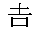

{{APIRef("Encoding API")}}

The **`TextDecoder`** interface represents a decoder for a specific text encoding, such as `UTF-8`, `ISO-8859-2`, `KOI8-R`, `GBK`, etc. A decoder takes a stream of bytes as input and emits a stream of code points.

{{AvailableInWorkers}}

## Constructor

- {{DOMxRef("TextDecoder.TextDecoder", "TextDecoder()")}}
  - : Returns a newly constructed `TextDecoder` that will generate a code point stream with the decoding method specified in parameters.

## Instance properties

_The `TextDecoder` interface doesn't inherit any properties._

- {{DOMxRef("TextDecoder.encoding")}} {{ReadOnlyInline}}
  - : A string containing the name of the decoder, which is a string describing the method the `TextDecoder` will use.
- {{DOMxRef("TextDecoder.fatal")}} {{ReadOnlyInline}}
  - : A {{jsxref('Boolean')}} indicating whether the error mode is fatal.
- {{DOMxRef("TextDecoder.ignoreBOM")}} {{ReadOnlyInline}}
  - : A {{jsxref('Boolean')}} indicating whether the [byte order mark](https://www.w3.org/International/questions/qa-byte-order-mark) is ignored.

## Instance methods

_The `TextDecoder` interface doesn't inherit any methods_.

- {{DOMxRef("TextDecoder.decode()")}}
  - : Returns a string containing the text decoded with the method of the specific `TextDecoder` object.

## Examples

### Representing text with typed arrays

This example shows how to decode a Chinese/Japanese character , as represented by five different typed arrays: {{jsxref("Uint8Array")}}, {{jsxref("Int8Array")}}, {{jsxref("Uint16Array")}}, {{jsxref("Int16Array")}}, and {{jsxref("Int32Array")}}.

```js
let utf8decoder = new TextDecoder(); // default 'utf-8' or 'utf8'

let u8arr = new Uint8Array([240, 160, 174, 183]);
let i8arr = new Int8Array([-16, -96, -82, -73]);
let u16arr = new Uint16Array([41200, 47022]);
let i16arr = new Int16Array([-24336, -18514]);
let i32arr = new Int32Array([-1213292304]);

console.log(utf8decoder.decode(u8arr));
console.log(utf8decoder.decode(i8arr));
console.log(utf8decoder.decode(u16arr));
console.log(utf8decoder.decode(i16arr));
console.log(utf8decoder.decode(i32arr));
```

### Handling non-UTF8 text

In this example, we decode the Russian text "Привет, мир!", which means "Hello, world." In our {{domxref("TextDecoder/TextDecoder", "TextDecoder()")}} constructor, we specify the Windows-1251 character encoding, which is appropriate for Cyrillic script.

```js
const win1251decoder = new TextDecoder("windows-1251");
const bytes = new Uint8Array([
  207, 240, 232, 226, 229, 242, 44, 32, 236, 232, 240, 33,
]);
console.log(win1251decoder.decode(bytes)); // Привет, мир!
```

## Specifications

{{Specifications}}

## Browser compatibility

{{Compat}}

## See also

- The {{DOMxRef("TextEncoder")}} interface describing the inverse operation.
- A [shim](https://github.com/inexorabletash/text-encoding) allowing to use this interface in browsers that do not support it.
- [Node.js supports global export from v11.0.0](https://nodejs.org/api/util.html#util_class_util_textdecoder)
