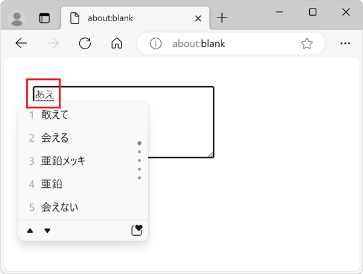
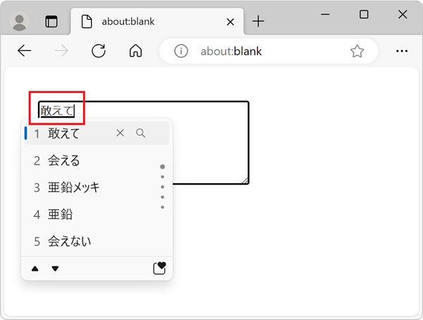

{{APIRef("EditContext API")}}{{SeeCompatTable}}

The **`TextFormat`** interface represents specific formatting that should be applied to a range of text in an editable text region that's attached to an {{domxref("EditContext")}} instance. The text formatting is requested by the {{glossary("Input Method Editor")}} (IME) window that the user is composing text with.

When using one of the default editable regions of the web, such as a [`<textarea>`](/en-US/docs/Web/HTML/Element/textarea) element, IME composition is handled by the browser and operating system for you. For example, when using Japanese IME in a textarea, on Windows, the following text formats can be applied:

- When text is being composed with the keyboard, the typed characters have a thin wavy underline:

  

- When the user selects a suggestion from the list of candidates in the IME window, the text is replaced and is underlined with a thick solid line:

  

When creating your own custom editable region by using the {{domxref("EditContext API", "", "", "nocode")}}, you need to handle IME composition yourself. You should listen for the {{domxref("EditContext/textformatupdate_event", "textformatupdate")}} event, which gives you the list of text formats that the IME window wants to apply to the text being composed. You should then update the formatting of the text displayed in your editable region accordingly.

## Constructor

- {{DOMxRef("TextFormat.TextFormat", "TextFormat()")}} {{experimental_inline}}
  - : Returns a new `TextFormat` instance.

## Instance properties

- {{domxref("TextFormat.rangeStart")}} {{readonlyinline}} {{experimental_inline}}
  - : The start position of the text range that needs to be formatted with the given text format.
- {{domxref("TextFormat.rangeEnd")}} {{readonlyinline}} {{experimental_inline}}
  - : The end position of the text range that needs to be formatted with the given text format.
- {{domxref("TextFormat.underlineStyle")}} {{readonlyinline}} {{experimental_inline}}
  - : The style of the underline that needs to be applied to the text range that is being formatted.
- {{domxref("TextFormat.underlineThickness")}} {{readonlyinline}} {{experimental_inline}}
  - : The thickness of the underline that needs to be applied to the text range that is being formatted.

## Examples

### Using the `textformatupdate` event

In the following example, the `textformatupdate` event is used to log the various formats that the IME composition window wants to apply to text ranges in the editable element. Note that the event listener callback in this example is only called when using an IME window to compose text.

```html
<div id="editor" style="height:200px;background:#eee;"></div>
```

```js
const editorEl = document.getElementById("editor");
const editContext = new EditContext(editorEl);
editorEl.editContext = editContext;

editContext.addEventListener("textformatupdate", (e) => {
  // Get the TextFormat instances.
  const formats = e.getTextFormats();

  // Iterate over the TextFormat instances.
  for (const format of formats) {
    console.log(
      `Applying a ${format.underlineThickness} ${format.underlineStyle} underline between ${format.rangeStart} and ${format.rangeEnd}.`,
    );
  }
});
```

## Specifications

{{Specifications}}

## Browser compatibility

{{Compat}}
