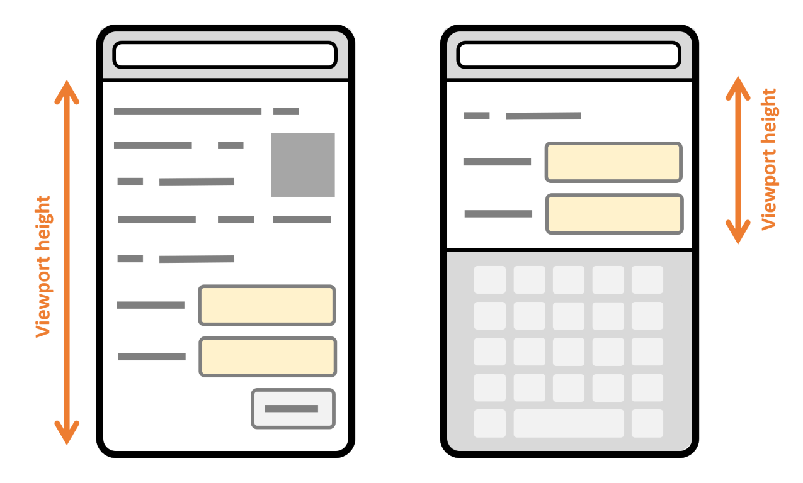
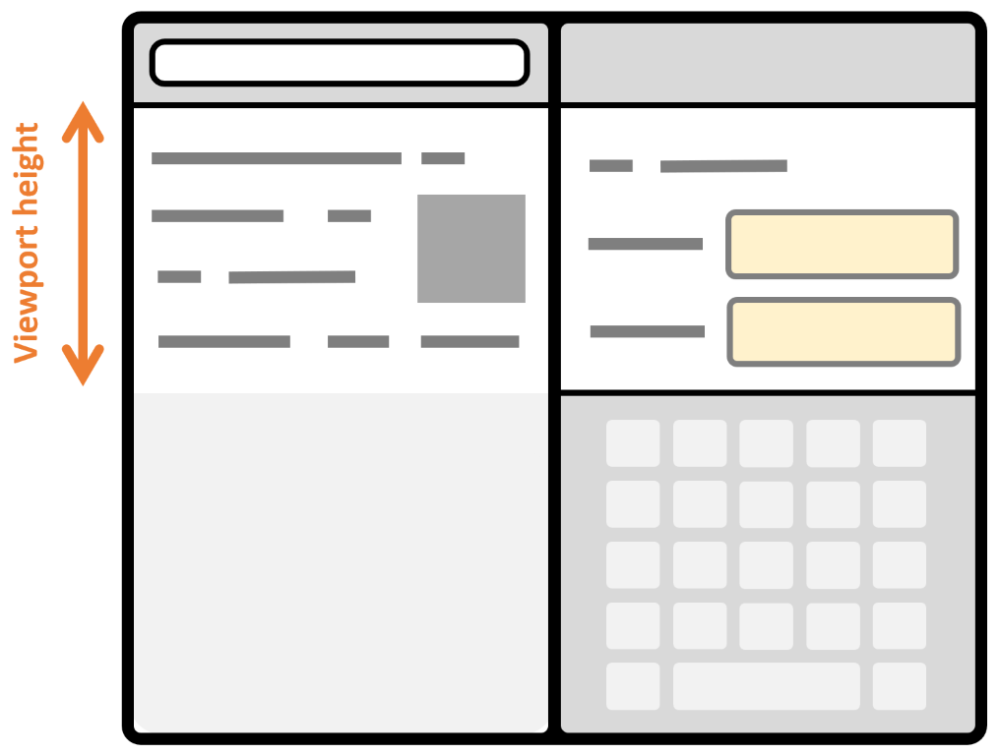

{{SeeCompatTable}}{{DefaultAPISidebar("VirtualKeyboard API")}}

The VirtualKeyboard API provides developers control over the layout of their applications when the on-screen virtual keyboard appears and disappears on devices such as tablets, mobile phones, or other devices where a hardware keyboard may not be available.

Web browsers usually deal with virtual keyboards on their own, by adjusting the viewport height and scrolling to input fields when focused.

The figure below illustrates the difference in viewport height and scroll position on a web page when the device has its on-screen virtual keyboard hidden, and when it is shown.



More complex applications or specific devices such as multi-screen mobile phones may require more control of the layout when the virtual keyboard appears.

The figure below shows what happens on a dual-screen device when the virtual keyboard appears on just one of the two screens. The viewport becomes smaller on both screens to accommodate for the virtual keyboard, leaving wasted space on the screen where the virtual keyboard is not displayed.



The VirtualKeyboard API can be used to opt out of the way the browser automatically handles the virtual keyboard, and take full control of it instead. With the VirtualKeyboard API, the keyboard still appears and disappears as necessary when form controls are focused, but the viewport does not change, and you can use JavaScript and CSS to adapt your layout.

## Concept

The VirtualKeyboard API consists of three parts:

- The {{domxref("VirtualKeyboard")}} interface, accessed through {{domxref('navigator.virtualKeyboard')}}, is used to opt out of the automatic virtual keyboard behavior, show or hide the virtual keyboard programmatically, as well as get the current position and size of the virtual keyboard.
- The `keyboard-inset-*` CSS environment variables provide information about the virtual keyboard's position and size.
- The [`virtualkeyboardpolicy`](/en-US/docs/Web/HTML/Global_attributes#virtualkeyboardpolicy) attribute specifies whether the virtual keyboard should appear on `contenteditable` elements.

### Opt out of the automatic virtual keyboard behavior

To opt out of the automatic virtual keyboard behavior of the browser, use `navigator.virtualKeyboard.overlaysContent = true`. The browser will no longer automatically resize the viewport to make space for the virtual keyboard, which will overlay your content instead.

### Detect the virtual keyboard geometry using JavaScript

Once you've opted out of the default browser behavior, you can get the current geometry of the virtual keyboard using `navigator.virtualKeyboard.boundingRect`, and adapt the layout as appropriate using CSS and JavaScript. In addition, you can listen to geometry changes, such as when the keyboard is shown or hidden, by using the `geometrychange` event.

This is useful for positioning important UI elements in the area that's not covered by the virtual keyboard.

The code snippet below uses the `geometrychange` event to detect when the virtual keyboard geometry changes; it then accesses the `boundingRect` property to query the size and position of the virtual keyboard:

```js
if ("virtualKeyboard" in navigator) {
  navigator.virtualKeyboard.overlaysContent = true;

  navigator.virtualKeyboard.addEventListener("geometrychange", (event) => {
    const { x, y, width, height } = event.target.boundingRect;
  });
}
```

### Detect the virtual keyboard geometry using CSS environment variables

The VirtualKeyboard API also exposes the following {{cssxref("env", "CSS environment variables", "", "nocode")}}: `keyboard-inset-top`, `keyboard-inset-right`, `keyboard-inset-bottom`, `keyboard-inset-left`, `keyboard-inset-width`, and `keyboard-inset-height`.

The `keyboard-inset-*` CSS environment variables are useful to adapt your layout to the virtual keyboard appearance using CSS. They define a rectangle by its top, right, bottom, and left insets from the edge of the viewport. The `width` and `height` variables are also available if needed.

The code snippet below uses the `keyboard-inset-height` CSS variable to reserve space for the virtual keyboard to appear below the list of messages and input field in a chat-like application. When the virtual keyboard is hidden, the `env()` function returns `0px` and the `keyboard` grid area is hidden. The messages and input elements can occupy the full height of the viewport. When the virtual keyboard appears, the `keyboard` grid area gets the height of the virtual keyboard.

```html
<style>
  body {
    display: grid;
    margin: 0;
    height: 100vh;
    grid-template:
      "messages" 1fr
      "input" auto
      "keyboard" env(keyboard-inset-height, 0px);
  }
</style>
<ul id="messages"></ul>
<input type="text" />
<script>
  if ("virtualKeyboard" in navigator) {
    navigator.virtualKeyboard.overlaysContent = true;
  }
</script>
```

### Control the virtual keyboard on `contenteditable` elements

By default, elements using the [`contenteditable`](/en-US/docs/Web/HTML/Global_attributes#contenteditable) attribute also trigger the virtual keyboard when tapped or clicked. In certain situations, it may be desirable to prevent this behavior and instead show the virtual keyboard after a different event.

Set the [`virtualkeyboardpolicy`](/en-US/docs/Web/HTML/Global_attributes#virtualkeyboardpolicy) attribute to `manual` to prevent the default handling of the virtual keyboard in the browser, and instead handle it yourself by using the {{domxref("VirtualKeyboard")}} interface's `show()` and `hide()` methods.

The code snippet below shows how to use the `virtualkeyboardpolicy` attribute and the `navigator.virtualKeyboard.show()` method to show the virtual keyboard on double-click instead:

```html
<div contenteditable virtualkeyboardpolicy="manual" id="editor"></div>
<script>
  if ("virtualKeyboard" in navigator) {
    navigator.virtualKeyboard.overlaysContent = true;

    const editor = document.getElementById("editor");
    editor.addEventListener("dblclick", () => {
      navigator.virtualKeyboard.show();
    });
  }
</script>
```

## Interfaces

- {{domxref('VirtualKeyboard')}} {{experimental_inline}}
  - : Provides functions that retrieve keyboard layout maps and toggle capturing of key presses from the physical keyboard.

## Specifications

{{Specifications}}

## Browser compatibility

{{Compat}}

## See also

- [Full control with the VirtualKeyboard API](https://developer.chrome.com/docs/web-platform/virtual-keyboard/)
