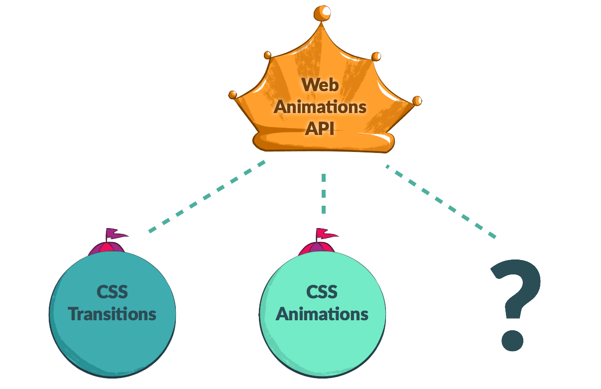
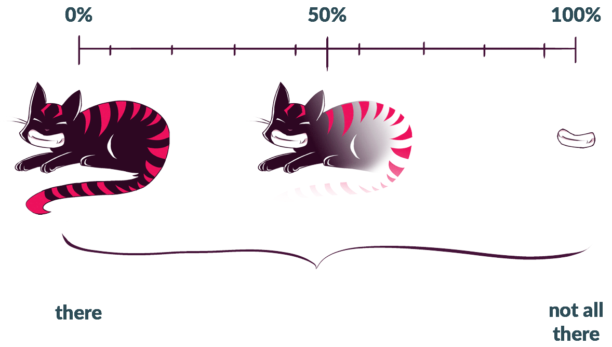
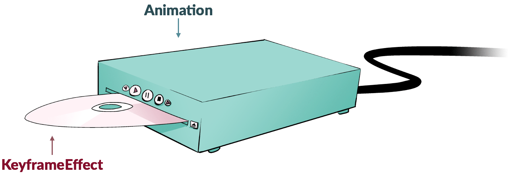

{{DefaultAPISidebar("Web Animations")}}

The Web Animations API (WAAPI) provides JavaScript developers access to the browser's animation engine and describes how animations should be implemented across browsers. This article will introduce you to the important concepts behind the WAAPI, providing you with a theoretical understanding of how it works so you can use it effectively. To learn how to put the API to use, check out its sister article, [Using the Web Animations API](/en-US/docs/Web/API/Web_Animations_API/Using_the_Web_Animations_API).

The Web Animations API fills the gap between declarative CSS animations and transitions, and dynamic JavaScript animations. This means we can use it to create and manipulate CSS-like animations that go from one pre-defined state to another, or we can use variables, loops, and callbacks to create interactive animations that adapt and react to changing inputs.

## History

Over a decade ago, [Synchronized Multimedia Integration Language, or SMIL](/en-US/docs/Web/SVG/SVG_animation_with_SMIL) (pronounced "smile"), brought animation to SVG. Back then it was the only animation engine browsers had to worry about. While four out of five browsers supported SMIL, it only animated SVG elements, could not be used from CSS, and was very complex — often leading to inconsistent implementations. Ten years later, the Safari team introduced the [CSS Animations](https://drafts.csswg.org/css-animations/) and [CSS Transitions](https://drafts.csswg.org/css-transitions/) specs.

The Internet Explorer team requested an animations API to consolidate and normalize animation functionality across all browsers, and thus efforts began in earnest among Mozilla Firefox and Google Chrome developers to create the one animation spec to rule them all: the Web Animations API. Now we've got the WAAPI for future animation specifications to piggyback on, allowing them to remain consistent and play well together. It also provides a point of reference all browsers can adhere to with the currently available specs.

## The Two Models: Timing and Animation

The Web Animations API runs on top of two models, one that handles time—Timing—and one that handles visual change over time—Animation. The Timing Model keeps track of how far along a set timeline we've come. The Animation Model determines what the animated object should look like at any given time.

### Timing

The Timing Model is the backbone of working with the WAAPI. Each document has a master timeline, [`Document.timeline`](/en-US/docs/Web/API/Document/timeline), which stretches from the moment the page is loaded to infinity — or until the window is closed. Spread along that timeline according to their durations are our animations. Each animation is anchored to a point in the timeline by its [`startTime`](/en-US/docs/Web/API/Animation/startTime), representing the moment along the document's timeline when the animation starts playing.

All the animation's playback relies on this timeline: seeking the animation moves the animation's position along the timeline; slowing down or speeding up the playback rate condenses or expands its spread across the timeline; repeating the animation lines up additional iterations of it along the timeline. In the future, we might have timelines based on gestures or scroll position or even parent and child timelines. The Web Animations API opens up so many possibilities!

### Animation

The animation model can be thought of as an array of snapshots of what the animation could look like at any given time, lined up along the duration of the animation.

## Core Concepts

Web animations consist of Timeline Objects, Animation Objects, and Animation Effect Objects working together. By assembling these disparate objects, we can create animations of our own.

### Timeline

Timeline objects provide the useful property [`currentTime`](/en-US/docs/Web/API/AnimationTimeline/currentTime), which lets us see how long the page has been opened for: it's the "current time" of the document's timeline, which started when the page was opened. As of this writing, there's only one kind of timeline object: the one based on the active document's [`timeline`](/en-US/docs/Web/API/Document/timeline). In the future we may see timeline objects that correspond to the length of the page, perhaps a `ScrollTimeline`, or other things entirely.

### Animation

[Animation objects](/en-US/docs/Web/API/Animation) can be imagined as DVD players: they're used for controlling media playback, but without media to play, they don't do anything. Animation objects accept media in the form of Animation Effects, specifically Keyframe Effects (we'll get to those in a moment). Like a DVD player, we can use the Animation Object's methods to [play](/en-US/docs/Web/API/Animation/play), [pause](/en-US/docs/Web/API/Animation/pause), [seek](/en-US/docs/Web/API/Animation/currentTime), and [control the animation's playback direction](/en-US/docs/Web/API/Animation/reverse) and [speed](/en-US/docs/Web/API/Animation/playbackRate).

### Animation Effect

If Animation objects are DVD players, we can think of Animation Effects, or Keyframe Effects, as DVDs. Keyframe Effects are a bundle of information including at the bare minimum a set of keys and the duration they need to be animated over. The Animation Object takes this information and, using the Timeline Object, assembles a playable animation we can view and reference.

We currently have only one animation effect type available: [`KeyframeEffect`](/en-US/docs/Web/API/KeyframeEffect). Potentially we could have all kinds of Animation Effects in the future—e.g. effects for grouping and sequencing, not unlike features we had in Flash. In fact, Group Effects and Sequence Effects have already been outlined in the currently-in-progress level 2 spec of the Web Animations API.

### Assembling the Animation from disparate pieces

We can assemble all these pieces together to create a working animation with the [`Animation()` Constructor](/en-US/docs/Web/API/Animation/Animation) or we can use the [`Element.animate()`](/en-US/docs/Web/API/Element/animate) shortcut function. (Read more about how to use `Element.animate()` in [Using the Web Animations API](/en-US/docs/Web/API/Web_Animations_API/Using_the_Web_Animations_API).)

## Uses

The API allows for the creation of dynamic animations that can be updated on the fly as well as more straightforward, declarative animations like those CSS creates. It can be used in automated tests to ensure that your UI animations are running correctly. It opens up the browser's rendering engine for building animation development tools like timelines. It is also a performant base on which to build a custom or commercial animation library. (See [Animating like you just don't care with Element.animate](https://hacks.mozilla.org/2016/08/animating-like-you-just-dont-care-with-element-animate/).) In some instances, it may negate the need for a fully fledged library entirely in the same way Vanilla JavaScript can be used without jQuery for many purposes.

## See also

- [Web Animations API](/en-US/docs/Web/API/Web_Animations_API) — main page
- [Using the Web Animations API](/en-US/docs/Web/API/Web_Animations_API/Using_the_Web_Animations_API) — guide
- The [full suite of Alice in Wonderland demos](https://codepen.io/collection/nqNJvD) on CodePen for you to play with, fork, and share
- [web-animations-js](https://github.com/web-animations/web-animations-js) — the Web Animations API polyfill
