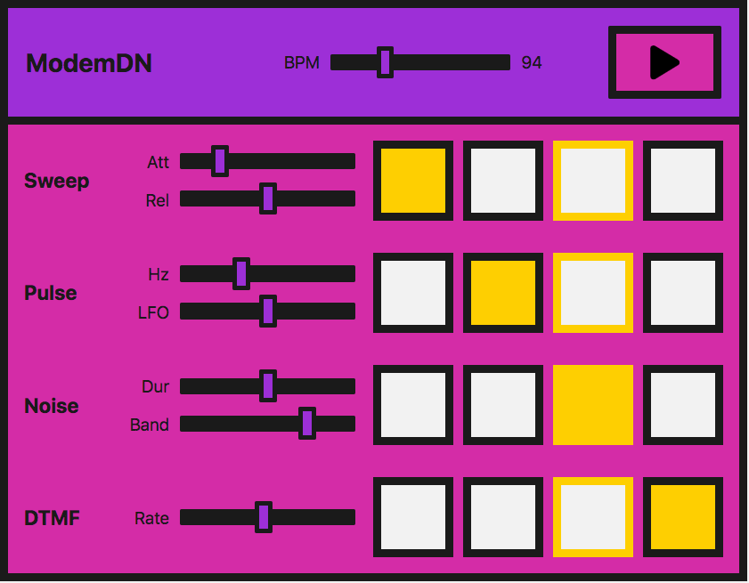

{{DefaultAPISidebar("Web Audio API")}}

In this tutorial, we're going to cover sound creation and modification, as well as timing and scheduling. We will introduce sample loading, envelopes, filters, wavetables, and frequency modulation. If you're familiar with these terms and looking for an introduction to their application with the Web Audio API, you've come to the right place.

## Demo

We're going to be looking at a very simple step sequencer:



In practice, this is easier to do with a library — the Web Audio API was built to be built upon. If you are about to embark on building something more complex, [tone.js](https://tonejs.github.io/) would be an excellent place to start. However, we want to demonstrate how to create such a demo from first principles as a learning exercise.

> **Note:** You can find the source code on GitHub as [step-sequencer](https://github.com/mdn/webaudio-examples/tree/master/step-sequencer); see the [step-sequencer running live](https://mdn.github.io/webaudio-examples/step-sequencer/) also.

The interface consists of master controls, which allow us to play/stop the sequencer, and adjust the BPM (beats per minute) to speed up or slow down the "music".

Four different sounds, or voices, can be played. Each voice has four buttons, one for each beat in one bar of music. When they are enabled, the note will sound. When the instrument plays, it will move across this set of beats and loop the bar.

Each voice also has local controls, allowing you to manipulate the effects or parameters particular to each technique we use to create those voices. The methods we are using are:

<table class="no-markdown">
  <thead>
    <tr>
      <th scope="col">Name of voice</th>
      <th scope="col">Technique</th>
      <th scope="col">Associated Web Audio API feature</th>
    </tr>
  </thead>
  <tbody>
    <tr>
      <td>"Sweep"</td>
      <td>Oscillator, periodic wave</td>
      <td>
        {{domxref("OscillatorNode")}},
        {{domxref("PeriodicWave")}}
      </td>
    </tr>
    <tr>
      <td>"Pulse"</td>
      <td>Multiple oscillators</td>
      <td>{{domxref("OscillatorNode")}}</td>
    </tr>
    <tr>
      <td>"Noise"</td>
      <td>Random noise buffer, Biquad filter</td>
      <td>
        {{domxref("AudioBuffer")}},
        {{domxref("AudioBufferSourceNode")}},
        {{domxref("BiquadFilterNode")}}
      </td>
    </tr>
    <tr>
      <td>"Dial up"</td>
      <td>Loading a sound sample to play</td>
      <td>
        {{domxref("BaseAudioContext/decodeAudioData")}},
        {{domxref("AudioBufferSourceNode")}}
      </td>
    </tr>
  </tbody>
</table>

> **Note:** We didn't create this instrument to sound good but to provide demonstration code. This demonstration represents a _very_ simplified version of such an instrument. The sounds are based on a dial-up modem. If you are unaware of how such a device sounds, you can [listen to one here](https://soundcloud.com/john-pemberton/modem-dialup).

## Creating an audio context

As you should be used to by now, each Web Audio API app starts with an audio context:

```js
const audioCtx = new AudioContext();
```

## The "sweep" — oscillators, periodic waves, and envelopes

For what we will call the "sweep" sound, that first noise you hear when you dial up, we're going to create an oscillator to generate the sound.

The {{domxref("OscillatorNode")}} comes with basic waveforms out of the box — sine, square, triangle, or sawtooth. However, instead of using the standard waves that come by default, we're going to create our own using the {{domxref("PeriodicWave")}} interface and values set in a wavetable. We can use the {{domxref("PeriodicWave/PeriodicWave", "PeriodicWave()")}} constructor to use this custom wave with an oscillator.

### The periodic wave

First of all, we'll create our periodic wave. To do so, We need to pass real and imaginary values into the {{domxref("PeriodicWave/PeriodicWave", "PeriodicWave()")}} constructor:

```js
const wave = new PeriodicWave(audioCtx, {
  real: wavetable.real,
  imag: wavetable.imag
});
```

> **Note:** In our example, the wavetable is held in a separate JavaScript file (`wavetable.js`) because there are _so_ many values. We took it from a [repository of wavetables](https://github.com/GoogleChromeLabs/web-audio-samples/tree/main/src/demos/wavetable-synth/wave-tables), found in the [Web Audio API examples from Google Chrome Labs](https://github.com/GoogleChromeLabs/web-audio-samples/).

### The Oscillator

Now we can create an {{domxref("OscillatorNode")}} and set its wave to the one we've created:

```js
function playSweep(time) {
  const osc = new OscillatorNode(audioCtx, {
    frequency: 380,
    type: "custom",
    periodicWave: wave
  });
  osc.connect(audioCtx.destination);
  osc.start(time);
  osc.stop(time + 1);
}
```

We pass a time parameter to the function here, which we'll use later to schedule the sweep.

### Controlling amplitude

This is great, but wouldn't it be nice if we had an amplitude envelope to go with it? Let's create a simple one, so we get used to the methods we need to create an envelope with the Web Audio API.

Let's say our envelope has attack and release. We can allow the user to control these using [range inputs](/en-US/docs/Web/HTML/Element/input/range) on the interface:

```html
<label for="attack">Attack</label>
<input name="attack" id="attack" type="range" min="0" max="1" value="0.2" step="0.1" />

<label for="release">Release</label>
<input name="release" id="release" type="range" min="0" max="1" value="0.5" step="0.1" />
```

Now we can create some variables over in JavaScript and have them change when the input values are updated:

```js
let attackTime = 0.2;
const attackControl = document.querySelector("#attack");
attackControl.addEventListener(
  "input",
  (ev) => {
    attackTime = parseInt(ev.target.value, 10);
  },
  false
);

let releaseTime = 0.5;
const releaseControl = document.querySelector("#release");
releaseControl.addEventListener(
  "input",
  (ev) => {
    releaseTime = parseInt(ev.target.value, 10);
  },
  false
);
```

### The final playSweep() function

Now we can expand our `playSweep()` function. We need to add a {{domxref("GainNode")}} and connect that through our audio graph to apply amplitude variations to our sound. The gain node has one property: `gain`, which is of type {{domxref("AudioParam")}}.

This is useful — now we can start to harness the power of the audio param methods on the gain value. We can set a value at a certain time, or we can change it _over_ time with methods such as {{domxref("AudioParam.linearRampToValueAtTime")}}.

As mentioned above, we'll use the `linearRampToValueAtTime` method for our attack and release. It takes two parameters — the value you want to set the parameter you are changing to (in this case, the gain) and when you want to do this. In our case _when_ is controlled by our inputs. So, in the example below, the gain increases to 1 at a linear rate over the time the attack range input defines. Similarly, for our release, the gain is set to 0 at a linear rate, over the time the release input has been set to.

```js
const sweepLength = 2;
function playSweep(time) {
  const osc = new OscillatorNode(audioCtx, {
    frequency: 380,
    type: "custom",
    periodicWave: wave
  });

  const sweepEnv = new GainNode(audioCtx);
  sweepEnv.gain.cancelScheduledValues(time);
  sweepEnv.gain.setValueAtTime(0, time);
  sweepEnv.gain.linearRampToValueAtTime(1, time + attackTime);
  sweepEnv.gain.linearRampToValueAtTime(
    0,
    time + sweepLength - releaseTime
  );

  osc.connect(sweepEnv).connect(audioCtx.destination);
  osc.start(time);
  osc.stop(time + sweepLength);
}
```

## The "pulse" — low-frequency oscillator modulation

Great, now we've got our sweep! Let's move on and take a look at that nice pulse sound. We can achieve this with a basic oscillator, modulated with a second oscillator.

### Initial oscillator

We'll set up our first {{domxref("OscillatorNode")}} the same way as our sweep sound, except we won't use a wavetable to set a bespoke wave — we'll just use the default `sine` wave:

```js
const osc = new OscillatorNode(audioCtx, {
  type: "sine",
  frequency: pulseHz,
});
```

Now we're going to create a {{domxref("GainNode")}}, as it's the `gain` value that we will oscillate with our second, low-frequency oscillator:

```js
const amp = new GainNode(audioCtx, {
  value: 1,
});
```

### Creating the second, low-frequency oscillator

We'll now create a second — `square` — wave (or pulse) oscillator to alter the amplification of our first sine wave:

```js
const lfo = new OscillatorNode(audioCtx, {
  type: "square",
  frequency: 30,
});
```

### Connecting the graph

The key here is connecting the graph correctly and also starting both oscillators:

```js
lfo.connect(amp.gain);
osc.connect(amp).connect(audioCtx.destination);
lfo.start();
osc.start(time);
osc.stop(time + pulseTime);
```

> **Note:** We also don't have to use the default wave types for either of these oscillators we're creating — we could use a wavetable and the periodic wave method as we did before. There is a multitude of possibilities with just a minimum of nodes.

### Pulse user controls

For the UI controls, let's expose both frequencies of our oscillators, allowing them to be controlled via range inputs. One will change the tone, and the other will change how the pulse modulates the first wave:

```html
<label for="hz">Hz</label>
<input name="hz" id="hz" type="range" min="660" max="1320" value="880" step="1" />
<label for="lfo">LFO</label>
<input name="lfo" id="lfo" type="range" min="20" max="40" value="30" step="1" />
```

As before, we'll vary the parameters when the user changes the ranges values.

```js
let pulseHz = 880;
const hzControl = document.querySelector("#hz");
hzControl.addEventListener(
  "input",
  (ev) => {
    pulseHz = parseInt(ev.target.value, 10);
  },
  false
);

let lfoHz = 30;
const lfoControl = document.querySelector("#lfo");
lfoControl.addEventListener(
  "input",
  (ev) => {
    lfoHz = parseInt(ev.target.value, 10);
  },
  false
);
```

### The final playPulse() function

Here's the entire `playPulse()` function:

```js
const pulseTime = 1;
function playPulse(time) {
  const osc = new OscillatorNode(audioCtx, {
    type: "sine",
    frequency: pulseHz,
  });

  const amp = new GainNode(audioCtx, {
    value: 1,
  });

  const lfo = new OscillatorNode(audioCtx, {
    type: "square",
    frequency: lfoHz,
  });

  lfo.connect(amp.gain);
  osc.connect(amp).connect(audioCtx.destination);
  lfo.start();
  osc.start(time);
  osc.stop(time + pulseTime);
}
```

## The "noise" — random noise buffer with a biquad filter

Now we need to make some noise! All modems have noise. Noise is just random numbers when it comes to audio data, so is, therefore, a relatively straightforward thing to create with code.

### Creating an audio buffer

We need to create an empty container to put these numbers into, however, one that the Web Audio API understands. This is where {{domxref("AudioBuffer")}} objects come in. You can fetch a file and decode it into a buffer (we'll get to that later in the tutorial), or you can create an empty buffer and fill it with your data.

For noise, let's do the latter. We first need to calculate the size of our buffer to create it. We can use the {{domxref("BaseAudioContext.sampleRate")}} property for this:

```js
const bufferSize = audioCtx.sampleRate * noiseDuration;
// Create an empty buffer
const noiseBuffer = new AudioBuffer({
  length: bufferSize,
  sampleRate: audioCtx.sampleRate
});
```

Now we can fill it with random numbers between -1 and 1:

```js
// Fill the buffer with noise
const data = noiseBuffer.getChannelData(0);
for (let i = 0; i < bufferSize; i++) {
  data[i] = Math.random() * 2 - 1;
}
```

> **Note:** Why -1 to 1? When outputting sound to a file or speakers, we need a number representing 0 dB full scale — the numerical limit of the fixed point media or DAC. In floating point audio, 1 is a convenient number to map to "full scale" for mathematical operations on signals, so oscillators, noise generators, and other sound sources typically output bipolar signals in the range -1 to 1. A browser will clamp values outside this range.

### Creating a buffer source

Now we have the audio buffer and have filled it with data; we need a node to add to our graph that can use the buffer as a source. We'll create an {{domxref("AudioBufferSourceNode")}} for this, and pass in the data we've created:

```js
// Create a buffer source for our created data
const noise = new AudioBufferSourceNode(audioCtx, {
  buffer: noiseBuffer
});
```

When we connect this through our audio graph and play it:

```js
noise.connect(audioCtx.destination);
noise.start();
```

You'll notice that it's pretty hissy or tinny. We've created white noise; that's how it should be. Our values are spread from -1 to 1, meaning we have peaks of all frequencies, which are actually quite dramatic and piercing. We _could_ modify the function only spread values from 0.5 to -0.5 or similar to take the peaks off and reduce the discomfort; however, where's the fun in that? Let's route the noise we've created through a filter.

### Adding a biquad filter to the mix

We want something in the range of pink or brown noise. We want to cut off those high frequencies and possibly some lower ones. Let's pick a bandpass biquad filter for the job.

> **Note:** The Web Audio API comes with two types of filter nodes: {{domxref("BiquadFilterNode")}} and {{domxref("IIRFilterNode")}}. For the most part, a biquad filter will be good enough — it comes with different types such as lowpass, highpass, and bandpass. If you're looking to do something more bespoke, however, the IIR filter might be a good option — see [Using IIR filters](/en-US/docs/Web/API/Web_Audio_API/Using_IIR_filters) for more information.

Wiring this up is the same as we've seen before. We create the {{domxref("BiquadFilterNode")}}, configure the properties we want for it, and connect it through our graph. Different types of biquad filters have different properties — for instance, setting the frequency on a bandpass type adjusts the middle frequency. However, on a lowpass, it would set the top frequency.

```js
// Filter the output
const bandpass = new BiquadFilterNode(audioCtx, {
  type: "bandpass",
  frequency: bandHz
});

// Connect our graph
noise.connect(bandpass).connect(audioCtx.destination);
```

### Noise user controls

On the UI, we'll expose the noise duration and the frequency we want to band, allowing the user to adjust them via range inputs and event handlers just like in previous sections:

```html
<label for="duration">Duration</label>
<input name="duration" id="duration" type="range" min="0" max="2" value="1" step="0.1" />

<label for="band">Band</label>
<input name="band" id="band" type="range" min="400" max="1200" value="1000" step="5" />
```

```js
let noiseDuration = 1;
const durControl = document.querySelector("#duration");
durControl.addEventListener(
  "input",
  (ev) => {
    noiseDuration = parseInt(ev.target.value, 10);
  },
  false
);

let bandHz = 1000;
const bandControl = document.querySelector("#band");
bandControl.addEventListener(
  "input",
  (ev) => {
    bandHz = parseInt(ev.target.value, 10);
  },
  false
);
```

### The final playNoise() function

Here's the entire `playNoise()` function:

```js
function playNoise(time) {
  const bufferSize = audioCtx.sampleRate * noiseDuration; // set the time of the note

  // Create an empty buffer
  const noiseBuffer = new AudioBuffer({
    length: bufferSize,
    sampleRate: audioCtx.sampleRate
  });

  // Fill the buffer with noise
  const data = noiseBuffer.getChannelData(0);
  for (let i = 0; i < bufferSize; i++) {
    data[i] = Math.random() * 2 - 1;
  }

  // Create a buffer source for our created data
  const noise = new AudioBufferSourceNode(audioCtx, {
    buffer: noiseBuffer
  });

  // Filter the output
  const bandpass = new BiquadFilterNode(audioCtx, {
    type: "bandpass",
    frequency: bandHz
  });

  // Connect our graph
  noise.connect(bandpass).connect(audioCtx.destination);
  noise.start(time);
}
```

## "Dial-up" — loading a sound sample

It's straightforward enough to emulate phone dial (DTMF) sounds by playing a couple of oscillators together using the methods we've already used. Instead, we'll load a sample file in this section to look at what's involved.

### Loading the sample

We want to make sure our file has loaded and been decoded into a buffer before we use it, so let's create an [`async`](/en-US/docs/Web/JavaScript/Reference/Statements/async_function) function to allow us to do this:

```js
async function getFile(audioContext, filepath) {
  const response = await fetch(filepath);
  const arrayBuffer = await response.arrayBuffer();
  const audioBuffer = await audioContext.decodeAudioData(arrayBuffer);
  return audioBuffer;
}
```

We can then use the [`await`](/en-US/docs/Web/JavaScript/Reference/Operators/await) operator when calling this function, which ensures that we can only run subsequent code when it has finished executing.

Let's create another `async` function to set up the sample — we can combine the two async functions in a lovely promise pattern to perform further actions when this file is loaded and buffered:

```js
async function setupSample() {
    const filePath = 'dtmf.mp3';
    const sample = await getFile(audioCtx, filePath);
    return sample;
}
```

> **Note:** You can easily modify the above function to take an array of files and loop over them to load more than one sample. This technique would be convenient for more complex instruments or gaming.

We can now use `setupSample()` like so:

```js
setupSample().then((sample) => {
  // sample is our buffered file
  // …
});
```

When the sample is ready to play, the program sets up the UI, so it is ready to go.

### Playing the sample

Let's create a `playSample()` function similarly to how we did with the other sounds. This time we will create an {{domxref("AudioBufferSourceNode")}}, put the buffer data we've fetched and decoded into it, and play it:

```js
function playSample(audioContext, audioBuffer, time) {
  const sampleSource = new AudioBufferSourceNode(audioCtx, {
    buffer: audioBuffer,
    playbackRate,
  });
  sampleSource.connect(audioContext.destination);
  sampleSource.start(time);
  return sampleSource;
}
```

> **Note:** We can call `stop()` on an {{domxref("AudioBufferSourceNode")}}, however, this will happen automatically when the sample has finished playing.

### Dial-up user controls

The {{domxref("AudioBufferSourceNode")}} comes with a [`playbackRate`](/en-US/docs/Web/API/AudioBufferSourceNode/playbackRate) property. Let's expose that to our UI so that we can speed up and slow down our sample. We'll do that in the same sort of way as before:

```html
<label for="rate">Rate</label>
<input name="rate" id="rate" type="range" min="0.1" max="2" value="1" step="0.1" />
```

```js
let playbackRate = 1;
const rateControl = document.querySelector("#rate");
rateControl.addEventListener(
  "input",
  (ev) => {
    playbackRate = parseInt(ev.target.value, 10);
  },
  false
);
```

### The final playSample() function

We'll then add a line to update the `playbackRate` property to our `playSample()` function. The final version looks like this:

```js
function playSample(audioContext, audioBuffer, time) {
  const sampleSource = new AudioBufferSourceNode(audioCtx, {
    buffer: audioBuffer,
    playbackRate,
  });
  sampleSource.connect(audioContext.destination);
  sampleSource.start(time);
  return sampleSource;
}
```

> **Note:** The sound file was [sourced from soundbible.com](https://soundbible.com/1573-DTMF-Tones.html).

## Playing the audio in time

A common problem with digital audio applications is getting the sounds to play in time so that the beat remains consistent and things do not slip out of time.

We could schedule our voices to play within a `for` loop; however, the biggest problem with this is updating while it is playing, and we've already implemented UI controls to do so. Also, it would be really nice to consider an instrument-wide BPM control. The best way to get our voices to play on the beat is to create a scheduling system, whereby we look ahead at when the notes will play and push them into a queue. We can start them at a precise time with the `currentTime` property and also consider any changes.

> **Note:** This is a much stripped down version of [Chris Wilson's A Tale Of Two Clocks (2013)](https://web.dev/audio-scheduling/) article, which goes into this method with much more detail. There's no point repeating it all here, but we highly recommend reading this article and using this method. Much of the code here is taken from his [metronome example](https://github.com/cwilso/metronome/blob/master/js/metronome.js), which he references in the article.

Let's start by setting up our default BPM (beats per minute), which will also be user-controllable via — you guessed it — another range input.

```js
let tempo = 60.0;
const bpmControl = document.querySelector("#bpm");

bpmControl.addEventListener(
  "input",
  (ev) => {
    tempo = parseInt(ev.target.value, 10);
  },
  false
);
```

Then we'll create variables to define how far ahead we want to look and how far ahead we want to schedule:

```js
const lookahead = 25.0; // How frequently to call scheduling function (in milliseconds)
const scheduleAheadTime = 0.1; // How far ahead to schedule audio (sec)
```

Let's create a function that moves the note forwards by one beat and loops back to the first when it reaches the 4th (last) one:

```js
let currentNote = 0;
let nextNoteTime = 0.0; // when the next note is due.

function nextNote() {
  const secondsPerBeat = 60.0 / tempo;

  nextNoteTime += secondsPerBeat; // Add beat length to last beat time

  // Advance the beat number, wrap to zero when reaching 4
  currentNote = (currentNote+1) % 4;
}
```

We want to create a reference queue for the notes that are to be played, and the functionality to play them using the functions we've previously created:

```js
const notesInQueue = [];

function scheduleNote(beatNumber, time) {
  // Push the note on the queue, even if we're not playing.
  notesInQueue.push({ note: beatNumber, time });

  if (pads[0].querySelectorAll("input")[beatNumber].checked) {
    playSweep(time);
  }
  if (pads[1].querySelectorAll("input")[beatNumber].checked) {
    playPulse(time);
  }
  if (pads[2].querySelectorAll("input")[beatNumber].checked) {
    playNoise(time);
  }
  if (pads[3].querySelectorAll("input")[beatNumber].checked) {
    playSample(audioCtx, dtmf, time);
  }
}
```

Here we look at the current time and compare it to the time for the following note; when the two match, it will call the previous two functions.

{{domxref("AudioContext")}} object instances have a [`currentTime`](/en-US/docs/Web/API/BaseAudioContext/currentTime) property, which allows us to retrieve the number of seconds after we first created the context. We will use it for timing within our step sequencer. It's extremely accurate, returning a float value accurate to about 15 decimal places.

```js
let timerID;
function scheduler() {
  // While there are notes that will need to play before the next interval,
  // schedule them and advance the pointer.
  while (nextNoteTime < audioCtx.currentTime + scheduleAheadTime) {
    scheduleNote(currentNote, nextNoteTime);
    nextNote();
  }
  timerID = setTimeout(scheduler, lookahead);
}
```

We also need a `draw()` function to update the UI, so we can see when the beat progresses.

```js
let lastNoteDrawn = 3;
function draw() {
  let drawNote = lastNoteDrawn;
  const currentTime = audioCtx.currentTime;

  while (notesInQueue.length && notesInQueue[0].time < currentTime) {
    drawNote = notesInQueue[0].note;
    notesInQueue.shift(); // Remove note from queue
  }

  // We only need to draw if the note has moved.
  if (lastNoteDrawn !== drawNote) {
    pads.forEach((pad) => {
      pad.children[lastNoteDrawn*2].style.borderColor = "var(--black)";
      pad.children[drawNote*2].style.borderColor = "var(--yellow)";
    });

    lastNoteDrawn = drawNote;
  }
  // Set up to draw again
  requestAnimationFrame(draw);
}
```

## Putting it all together

Now all that's left to do is make sure we've loaded the sample before we can _play_ the instrument. We'll add a loading screen that disappears when the file has been fetched and decoded. Then we can allow the scheduler to start using the play button click event.

```js
// When the sample has loaded, allow play
const loadingEl = document.querySelector(".loading");
const playButton = document.querySelector("#playBtn");
let isPlaying = false;
setupSample().then((sample) => {
  loadingEl.style.display = "none";

  dtmf = sample; // to be used in our playSample function

  playButton.addEventListener("click", (ev) => {
    isPlaying = !isPlaying;

    if (isPlaying) {
      // Start playing

      // Check if context is in suspended state (autoplay policy)
      if (audioCtx.state === "suspended") {
        audioCtx.resume();
      }

      currentNote = 0;
      nextNoteTime = audioCtx.currentTime;
      scheduler(); // kick off scheduling
      requestAnimationFrame(draw); // start the drawing loop.
      ev.target.dataset.playing = "true";
    } else {
      clearTimeout(timerID);
      ev.target.dataset.playing = "false";
    }
  });
});
```

## Summary

We've now got an instrument inside our browser! Keep playing and experimenting — you can expand on any of these techniques to create something much more elaborate.
