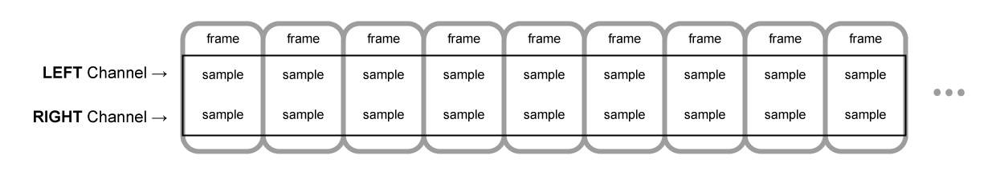

{{DefaultAPISidebar("Web Audio API")}}

This article explains some of the audio theory behind how the features of the Web Audio API work to help you make informed decisions while designing how your app routes audio. If you are not already a sound engineer, it will give you enough background to understand why the Web Audio API works as it does.

## Audio graphs

The [Web Audio API](/en-US/docs/Web/API/Web_Audio_API) involves handling audio operations inside an [audio context](/en-US/docs/Web/API/AudioContext), and has been designed to allow _modular routing_. Each [audio node](/en-US/docs/Web/API/AudioNode) performs a basic audio operation and is linked with one more other audio nodes to form an [audio routing graph](/en-US/docs/Web/API/AudioNode#the_audio_routing_graph). Several sources with different channel layouts are supported, even within a single context. This modular design provides the flexibility to create complex audio functions with dynamic effects.

Audio nodes are linked via their inputs and outputs, forming a chain that starts with one or more sources, goes through one or more nodes, then ends up at a destination (although you don't have to provide a destination if you only want to visualize some audio data). A simple, typical workflow for web audio would look something like this:

1. Create the audio context.
2. Create audio sources inside the context (such as {{HTMLElement("audio")}}, an oscillator, or stream).
3. Create audio effects (such as the reverb, biquad filter, panner, or compressor nodes).
4. Choose the final destination for the audio (such as the user's computer speakers).
5. Connect the source nodes to zero or more effect nodes and then to the chosen destination.

> [!NOTE]
> The [channel notation](https://en.wikipedia.org/wiki/Surround_sound#Channel_notation) is a numeric value, such as _2.0_ or _5.1_, representing the number of audio channels available on a signal. The first number is the number of full frequency range audio channels the signal includes. The number appearing after the period indicates the number of those channels reserved for low-frequency effect (LFE) outputs; these are often called **subwoofers**.


Each input or output is composed of one or more audio **channels**, which together represent a specific audio layout. Any discrete channel structure is supported, including _mono_, _stereo_, _quad_, _5.1_, and so on.


You have several ways to obtain audio:

- Sound can be generated directly in JavaScript by an audio node (such as an oscillator).
- It can be created from raw [PCM](https://en.wikipedia.org/wiki/Pulse-code_modulation) data (such as .WAV files or other formats supported by {{domxref("BaseAudioContext/decodeAudioData", "decodeAudioData()")}}).
- It can be generated from HTML media elements, such as {{HTMLElement("video")}} or {{HTMLElement("audio")}}.
- It can be obtained from a [WebRTC](/en-US/docs/Web/API/WebRTC_API) {{domxref("MediaStream")}}, such as a webcam or microphone.

## Audio data: what's in a sample

When an audio signal is processed, sampling happens. **Sampling** is the conversion of a [continuous signal](https://en.wikipedia.org/wiki/Continuous_signal) to a [discrete signal](https://en.wikipedia.org/wiki/Discrete_signal). Put another way, a continuous sound wave, such as a band playing live, is converted into a sequence of digital samples (a discrete-time signal) that allows a computer to handle the audio in distinct blocks.

You'll find more information on the Wikipedia page [_Sampling (signal processing)_](https://en.wikipedia.org/wiki/Sampling_%28signal_processing%29).

## Audio buffers: frames, samples, and channels

An {{domxref("AudioBuffer")}} is defined with three parameters:

- the number of channels (1 for mono, 2 for stereo, etc.),
- its length, meaning the number of sample frames inside the buffer,
- and the sample rate, the number of sample frames played per second.

A _sample_ is a single 32-bit floating point value representing the value of the audio stream at each specific moment in time within a particular channel (left or right, if in the case of stereo). A _frame_, or _sample frame_, is the set of all values for all channels that will play at a specific moment in time: all the samples of all the channels that play at the same time (two for a stereo sound, six for 5.1, etc.).

The _sample rate_ is the quantity of those samples (or frames, since all samples of a frame play at the same time) that will play in one second, measured in Hz. The higher the sample rate, the better the sound quality.

Let's look at a _mono_ and a _stereo_ audio buffer, each one second long at a rate of 44100Hz:

- The _mono_ buffer will have 44,100 samples and 44,100 frames. The `length` property will be 44,100.
- The _stereo_ buffer will have 88,200 samples but still 44,100 frames. The `length` property will still be 44100 since it equals the number of frames.



When a buffer plays, you will first hear the leftmost sample frame, then the one right next to it, then the next, _and so on_, until the end of the buffer. In the case of stereo, you will hear both channels simultaneously. Sample frames are handy because they are independent of the number of channels and represent time in an ideal way for precise audio manipulation.

> [!NOTE]
> To get a time in seconds from a frame count, divide the number of frames by the sample rate. To get the number of frames from the number of samples, you only need to divide the latter value by the channel count.

Here are a couple of simple examples:

```js
const context = new AudioContext();
const buffer = new AudioBuffer(context, {
  numberOfChannels: 2,
  length: 22050,
  sampleRate: 44100,
});
```

> [!NOTE]
> In [digital audio](https://en.wikipedia.org/wiki/Digital_audio), **44,100 [Hz](https://en.wikipedia.org/wiki/Hertz)** (alternately represented as **44.1 kHz**) is a common [sampling frequency](https://en.wikipedia.org/wiki/Sampling_frequency). Why 44.1 kHz?
>
> Firstly, because the [hearing range](https://en.wikipedia.org/wiki/Hearing_range) of human ears is roughly 20 Hz to 20,000 Hz. Via the [Nyquist–Shannon sampling theorem](https://en.wikipedia.org/wiki/Nyquist%E2%80%93Shannon_sampling_theorem), the sampling frequency must be greater than twice the maximum frequency one wishes to reproduce. Therefore, the sampling rate has to be _greater_ than 40,000 Hz.
>
> Secondly, signals must be [low-pass filtered](https://en.wikipedia.org/wiki/Low-pass_filter) before sampling, otherwise [aliasing](https://en.wikipedia.org/wiki/Aliasing) occurs. While an ideal low-pass filter would perfectly pass frequencies below 20 kHz (without attenuating them) and perfectly cut off frequencies above 20 kHz, in practice, a [transition band](https://en.wikipedia.org/wiki/Transition_band) is necessary, where frequencies are partly attenuated. The wider this transition band is, the easier and more economical it is to make an [anti-aliasing filter](https://en.wikipedia.org/wiki/Anti-aliasing_filter). The 44.1 kHz sampling frequency allows for a 2.05 kHz transition band.

If you use this call above, you will get a stereo buffer with two channels that, when played back on an {{domxref("AudioContext")}} running at 44100 Hz (very common, most normal sound cards run at this rate), will last for 0.5 seconds: 22,050 frames/44,100 Hz = 0.5 seconds.

```js
const context = new AudioContext();
const buffer = new AudioBuffer(context, {
  numberOfChannels: 1,
  length: 22050,
  sampleRate: 22050,
});
```

If you use this call, you will get a mono buffer (single-channel buffer) that, when played back on an {{domxref("AudioContext")}} running at 44,100 Hz, will be automatically _resampled_ to 44,100 Hz (and therefore yield 44,100 frames), and last for 1.0 second: 44,100 frames/44,100 Hz = 1 second.

> [!NOTE]
> Audio resampling is very similar to image resizing. Say you've got a 16 x 16 image but want it to fill a 32 x 32 area. You resize (or resample) it. The result has less quality (it can be blurry or edgy, depending on the resizing algorithm), but it works, with the resized image taking up less space. Resampled audio is the same: you save space, but, in practice, you cannot correctly reproduce high-frequency content or treble sound.

### Planar versus interleaved buffers

The Web Audio API uses a planar buffer format. The left and right channels are stored like this:

```plain
LLLLLLLLLLLLLLLLRRRRRRRRRRRRRRRR (for a buffer of 16 frames)
```

This structure is widespread in audio processing, making it easy to process each channel independently.

The alternative is to use an interleaved buffer format:

```plain
LRLRLRLRLRLRLRLRLRLRLRLRLRLRLRLR (for a buffer of 16 frames)
```

This format is prevalent for storing and playing back audio without much processing, for example: .WAV files or a decoded MP3 stream.

Because the Web Audio API is designed for processing, it exposes _only_ planar buffers. It uses the planar format but converts the audio to the interleaved format when it sends it to the sound card for playback. Conversely, when the API decodes an MP3, it starts with the interleaved format and converts it to the planar format for processing.

## Audio channels

Each audio buffer may contain different numbers of channels. Most modern audio devices use the basic _mono_ (only one channel) and _stereo_ (left and right channels) settings. Some more complex sets support _surround sound_ settings (like _quad_ and _5.1_), which can lead to a richer sound experience thanks to their high channel count. We usually represent the channels with the standard abbreviations detailed in the table below:

| Name     | Channels                                                                                           |
| -------- | -------------------------------------------------------------------------------------------------- |
| _Mono_   | `0: M: mono`                                                                                       |
| _Stereo_ | `0: L: left 1: R: right`                                                                           |
| _Quad_   | `0: L: left 1: R: right 2: SL: surround left 3: SR: surround right`                                |
| _5.1_    | `0: L: left 1: R: right 2: C: center 3: LFE: subwoofer 4: SL: surround left 5: SR: surround right` |

### Up-mixing and down-mixing

When the numbers of channels of the input and the output don't match, up-mixing, or down-mixing, must be done. The following rules, controlled by setting the {{domxref("AudioNode.channelInterpretation")}} property to `speakers` or `discrete`, apply:

<table class="standard-table">
  <thead>
    <tr>
      <th scope="row">Interpretation</th>
      <th scope="col">Input channels</th>
      <th scope="col">Output channels</th>
      <th scope="col">Mixing rules</th>
    </tr>
  </thead>
  <tbody>
    <tr>
      <th rowspan="13" scope="row"><code>speakers</code></th>
      <td><code>1</code> <em>(Mono)</em></td>
      <td><code>2</code> <em>(Stereo)</em></td>
      <td>
        <em>Up-mix from mono to stereo</em>.<br />The <code>M</code> input
        channel is used for both output channels (<code>L</code> and
        <code>R</code>).<br /><code
          >output.L = input.M<br />output.R = input.M</code
        >
      </td>
    </tr>
    <tr>
      <td><code>1</code> <em>(Mono)</em></td>
      <td><code>4</code> <em>(Quad)</em></td>
      <td>
        <em>Up-mix from mono to quad.</em><br />The <code>M</code> input channel
        is used for non-surround output channels (<code>L</code> and
        <code>R</code>). Surround output channels (<code>SL</code> and
        <code>SR</code>) are silent.<br /><code
          >output.L = input.M<br />output.R = input.M<br />output.SL = 0<br />output.SR
          = 0</code
        >
      </td>
    </tr>
    <tr>
      <td><code>1</code> <em>(Mono)</em></td>
      <td><code>6</code> <em>(5.1)</em></td>
      <td>
        <em>Up-mix from mono to 5.1.</em><br />The <code>M</code> input channel
        is used for the center output channel (<code>C</code>). All the others
        (<code>L</code>, <code>R</code>, <code>LFE</code>, <code>SL</code>, and
        <code>SR</code>) are silent.<br /><code
          >output.L = 0<br />output.R = 0</code
        ><br /><code
          >output.C = input.M<br />output.LFE = 0<br />output.SL = 0<br />output.SR
          = 0</code
        >
      </td>
    </tr>
    <tr>
      <td><code>2</code> <em>(Stereo)</em></td>
      <td><code>1</code> <em>(Mono)</em></td>
      <td>
        <em>Down-mix from stereo to mono</em>.<br />Both input channels (<code
          >L</code
        >
        and <code>R</code>) are equally combined to produce the unique output
        channel (<code>M</code>).<br /><code
          >output.M = 0.5 * (input.L + input.R)</code
        >
      </td>
    </tr>
    <tr>
      <td><code>2</code> <em>(Stereo)</em></td>
      <td><code>4</code> <em>(Quad)</em></td>
      <td>
        <em>Up-mix from stereo to quad.</em><br />The <code>L</code> and
        <code>R</code> input channels are used for their non-surround respective
        output channels (<code>L</code> and <code>R</code>). Surround output
        channels (<code>SL</code> and <code>SR</code>) are silent.<br /><code
          >output.L = input.L<br />output.R = input.R<br />output.SL = 0<br />output.SR
          = 0</code
        >
      </td>
    </tr>
    <tr>
      <td><code>2</code> <em>(Stereo)</em></td>
      <td><code>6</code> <em>(5.1)</em></td>
      <td>
        <em>Up-mix from stereo to 5.1.</em><br />The <code>L</code> and
        <code>R</code> input channels are used for their non-surround respective
        output channels (<code>L</code> and <code>R</code>). Surround output
        channels (<code>SL</code> and <code>SR</code>), as well as the center
        (<code>C</code>) and subwoofer (<code>LFE</code>) channels, are left
        silent.<br /><code
          >output.L = input.L<br />output.R = input.R<br />output.C = 0<br />output.LFE
          = 0<br />output.SL = 0<br />output.SR = 0</code
        >
      </td>
    </tr>
    <tr>
      <td><code>4</code> <em>(Quad)</em></td>
      <td><code>1</code> <em>(Mono)</em></td>
      <td>
        <em>Down-mix from quad to mono</em>.<br />All four input channels
        (<code>L</code>, <code>R</code>, <code>SL</code>, and <code>SR</code>)
        are equally combined to produce the unique output channel
        (<code>M</code>).<br />
        <code>output.M = 0.25 * (input.L + input.R + input.SL + input.SR)</code>
      </td>
    </tr>
    <tr>
      <td><code>4</code> <em>(Quad)</em></td>
      <td><code>2</code> <em>(Stereo)</em></td>
      <td>
        <em>Down-mix from quad to stereo</em>.<br />Both left input channels
        (<code>L</code> and <code>SL</code>) are equally combined to produce the
        unique left output channel (<code>L</code>). And similarly, both right
        input channels (<code>R</code> and <code>SR</code>) are equally combined
        to produce the unique right output channel (<code>R</code>).<br />
        <code>output.L = 0.5 * (input.L + input.SL)</code><br />
        <code>output.R = 0.5 * (input.R + input.SR)</code>
      </td>
    </tr>
    <tr>
      <td><code>4</code> <em>(Quad)</em></td>
      <td><code>6</code> <em>(5.1)</em></td>
      <td>
        <em>Up-mix from quad to 5.1.</em><br />The <code>L</code>,
        <code>R</code>, <code>SL</code>, and <code>SR</code> input channels are
        used for their respective output channels (<code>L</code> and
        <code>R</code>). Center (<code>C</code>) and subwoofer
        (<code>LFE</code>) channels are left silent.<br />
        <code>output.L = input.L</code><br />
        <code>output.R = input.R</code><br />
        <code>output.C = 0</code><br />
        <code>output.LFE = 0</code><br />
        <code>output.SL = input.SL</code><br />
        <code>output.SR = input.SR</code>
      </td>
    </tr>
    <tr>
      <td><code>6</code> <em>(5.1)</em></td>
      <td><code>1</code> <em>(Mono)</em></td>
      <td>
        <em>Down-mix from 5.1 to mono.</em><br />The left (<code>L</code> and
        <code>SL</code>), right (<code>R</code> and <code>SR</code>) and central
        channels are all mixed together. The surround channels are slightly
        attenuated, and the regular lateral channels are power-compensated to
        make them count as a single channel by multiplying by <code>√2/2</code>.
        The subwoofer (<code>LFE</code>) channel is lost.<br />
        <code>output.M = 0.7071 * (input.L + input.R) + input.C + 0.5 * (input.SL + input.SR)</code>
      </td>
    </tr>
    <tr>
      <td><code>6</code> <em>(5.1)</em></td>
      <td><code>2</code> <em>(Stereo)</em></td>
      <td>
        <em>Down-mix from 5.1 to stereo.</em><br />The central channel
        (<code>C</code>) is summed with each lateral surround channel (<code
          >SL</code
        >
        or <code>SR</code>) and mixed to each lateral channel. As it is mixed
        down to two channels, it is mixed at a lower power: in each case, it is
        multiplied by <code>√2/2</code>. The subwoofer (<code>LFE</code>)
        channel is lost.<br />
        <code>output.L = input.L + 0.7071 * (input.C + input.SL)</code><br />
        <code>output.R = input.R + 0.7071 * (input.C + input.SR)</code>
      </td>
    </tr>
    <tr>
      <td><code>6</code> <em>(5.1)</em></td>
      <td><code>4</code> <em>(Quad)</em></td>
      <td>
        <em>Down-mix from 5.1 to quad.</em><br />The central (<code>C</code>) is
        mixed with the lateral non-surround channels (<code>L</code> and
        <code>R</code>). As it is mixed down to two channels, it is mixed at a
        lower power: in each case, it is multiplied by <code>√2/2</code>. The
        surround channels are passed unchanged. The subwoofer (<code>LFE</code>)
        channel is lost.<br />
        <code>output.L = input.L + 0.7071 * input.C</code><br />
        <code>output.R = input.R + 0.7071 * input.C</code><br />
        <code>output.SL = input.SL</code><br />
        <code>output.SR = input.SR</code>
      </td>
    </tr>
    <tr>
      <td colspan="2">Other, non-standard layouts</td>
      <td>
        Non-standard channel layouts behave as if
        <code>channelInterpretation</code> is set to
        <code>discrete</code>.<br />The specification explicitly allows the future definition of new speaker layouts. Therefore, this fallback is not future-proof as the behavior of the browsers for a specific number of channels may change in the future.
      </td>
    </tr>
    <tr>
      <th rowspan="2" scope="row"><code>discrete</code></th>
      <td>any (<code>x</code>)</td>
      <td>any (<code>y</code>) where <code>x&#x3C;y</code></td>
      <td>
        <em>Up-mix discrete channels.</em><br />Fill each output channel with
        its input counterpart &mdash; that is, the input channel with the same index.
        Channels with no corresponding input channels are left silent.
      </td>
    </tr>
    <tr>
      <td>any (<code>x</code>)</td>
      <td>any (<code>y</code>) where <code>x>y</code></td>
      <td>
        <em>Down-mix discrete channels.</em><br />Fill each output channel with
        its input counterpart &mdash; that is, the input channel with the same index.
        Input channels with no corresponding output channels are dropped.
      </td>
    </tr>
  </tbody>
</table>

## Visualizations

In general, we get the output over time to produce audio visualizations, usually reading its gain or frequency data. Then, using a graphical tool, we turn the obtained data into a visual representation, such as a graph. The Web Audio API has an {{domxref("AnalyserNode")}} available that doesn't alter the audio signal passing through it. Additionally, it outputs the audio data, allowing us to process it via a technology such as {{htmlelement("canvas")}}.


You can grab data using the following methods:

- {{domxref("AnalyserNode.getFloatFrequencyData()")}}
  - : Copies the current frequency data into a {{jsxref("Float32Array")}} array passed into it.
- {{domxref("AnalyserNode.getByteFrequencyData()")}}
  - : Copies the current frequency data into a {{jsxref("Uint8Array")}} (unsigned byte array) passed into it.
- {{domxref("AnalyserNode.getFloatTimeDomainData()")}}
  - : Copies the current waveform, or time-domain, data into a {{jsxref("Float32Array")}} array passed into it.
- {{domxref("AnalyserNode.getByteTimeDomainData()")}}
  - : Copies the current waveform, or time-domain, data into a {{jsxref("Uint8Array")}} (unsigned byte array) passed into it.

> [!NOTE]
> For more information, see our [Visualizations with Web Audio API](/en-US/docs/Web/API/Web_Audio_API/Visualizations_with_Web_Audio_API) article.

## Spatializations

Audio spatialization allows us to model the position and behavior of an audio signal at a certain point in physical space, simulating the listener hearing that audio. In the Web Audio API, spatialization is handled by the {{domxref("PannerNode")}} and the {{domxref("AudioListener")}}.

The panner uses right-hand Cartesian coordinates to describe the audio source's _position_ as a vector and its _orientation_ as a 3D directional cone. The cone can be pretty large, for example, for omnidirectional sources.


Similarly, the Web Audio API describes the listener using right-hand Cartesian coordinates: their _position_ as one vector and their _orientation_ as two direction vectors, _up_ and _front_. These vectors define the direction of the top of the listener's head and the direction the listener's nose is pointing. The vectors are perpendicular to one another.


> [!NOTE]
> For more information, see our [Web audio spatialization basics](/en-US/docs/Web/API/Web_Audio_API/Web_audio_spatialization_basics) article.

## Fan-in and Fan-out

In audio terms, **fan-in** describes the process by which a {{domxref("ChannelMergerNode")}} takes a series of _mono_ input sources and outputs a single multi-channel signal:


**Fan-out** describes the opposite process, whereby a {{domxref("ChannelSplitterNode")}} takes a multi-channel input source and outputs multiple _mono_ output signals:


