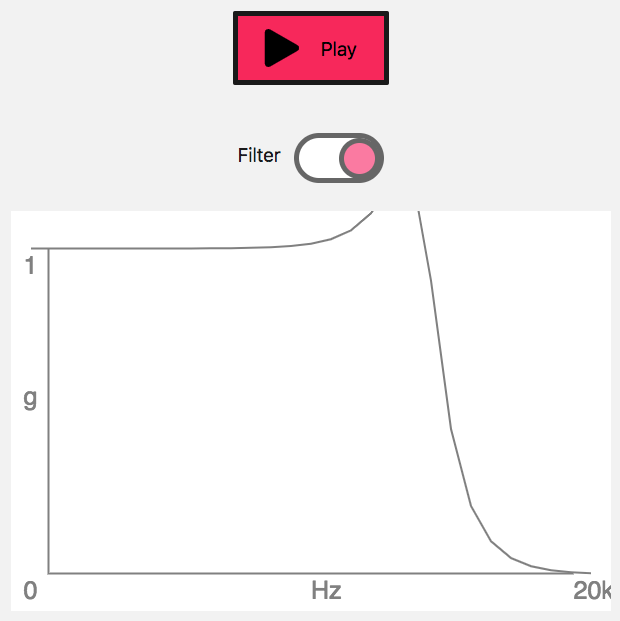

{{DefaultAPISidebar("Web Audio API")}}

The **`IIRFilterNode`** interface of the [Web Audio API](/en-US/docs/Web/API/Web_Audio_API) is an {{domxref("AudioNode")}} processor that implements a general [infinite impulse response](https://en.wikipedia.org/wiki/Infinite_impulse_response) (IIR) filter; this type of filter can be used to implement tone control devices and graphic equalizers, and the filter response parameters can be specified, so that it can be tuned as needed. This article looks at how to implement one, and use it in a simple example.

## Demo

Our simple example for this guide provides a play/pause button that starts and pauses audio play, and a toggle that turns an IIR filter on and off, altering the tone of the sound. It also provides a canvas on which is drawn the frequency response of the audio, so you can see what effect the IIR filter has.



You can check out the [full demo here on Codepen](https://codepen.io/Rumyra/pen/oPxvYB/). Also see the [source code on GitHub](https://github.com/mdn/webaudio-examples/tree/master/iirfilter-node). It includes some different coefficient values for different lowpass frequencies — you can change the value of the `filterNumber` constant to a value between 0 and 3 to check out the different available effects.

## Browser support

[IIR filters](/en-US/docs/Web/API/IIRFilterNode) are supported well across modern browsers, although they have been implemented more recently than some of the more longstanding Web Audio API features, like [Biquad filters](/en-US/docs/Web/API/BiquadFilterNode).

## The IIRFilterNode

The Web Audio API now comes with an {{domxref("IIRFilterNode")}} interface. But what is this and how does it differ from the {{domxref("BiquadFilterNode")}} we have already?

An IIR filter is a **infinite impulse response filter**. It's one of two primary types of filters used in audio and digital signal processing. The other type is FIR — **finite impulse response filter**. There's a really good overview to [IIF filters and FIR filters here](https://dspguru.com/dsp/faqs/iir/basics/).

A biquad filter is actually a _specific type_ of infinite impulse response filter. It's a commonly-used type and we already have it as a node in the Web Audio API. If you choose this node the hard work is done for you. For instance, if you want to filter lower frequencies from your sound, you can set the [type](/en-US/docs/Web/API/BiquadFilterNode/type) to `highpass` and then set which frequency to filter from (or cut off). [There's more information on how biquad filters work here](https://www.earlevel.com/main/2003/02/28/biquads/).

When you are using an {{domxref("IIRFilterNode")}} instead of a {{domxref("BiquadFilterNode")}} you are creating the filter yourself, rather than just choosing a pre-programmed type. So you can create a highpass filter, or a lowpass filter, or a more bespoke one. And this is where the IIR filter node is useful — you can create your own if none of the already available settings is right for what you want. As well as this, if your audio graph needed a highpass and a bandpass filter within it, you could just use one IIR filter node in place of the two biquad filter nodes you would otherwise need for this.

With the IIRFIlter node it's up to you to set what `feedforward` and `feedback` values the filter needs — this determines the characteristics of the filter. The downside is that this involves some complex maths.

If you are looking to learn more there's some [information about the maths behind IIR filters here](http://ece.uccs.edu/~mwickert/ece2610/lecture_notes/ece2610_chap8.pdf). This enters the realms of signal processing theory — don't worry if you look at it and feel like it's not for you.

If you want to play with the IIR filter node and need some values to help along the way, there's [a table of already calculated values here](https://www.dspguide.com/CH20.PDF); on pages 4 & 5 of the linked PDF the a*n* values refer to the `feedForward` values and the b*n* values refer to the `feedback`. [musicdsp.org](https://www.musicdsp.org/en/latest/) is also a great resource if you want to read more about different filters and how they are implemented digitally.

With that all in mind, let's take a look at the code to create an IIR filter with the Web Audio API.

## Setting our IIRFilter coefficients

When creating an IIR filter, we pass in the `feedforward` and `feedback` coefficients as options (coefficients is how we describe the values). Both of these parameters are arrays, neither of which can be larger than 20 items.

When setting our coefficients, the `feedforward` values can't all be set to zero, otherwise nothing would be sent to the filter. Something like this is acceptable:

```js
const feedForward = [0.00020298, 0.0004059599, 0.00020298];
```

Our `feedback` values cannot start with zero, otherwise on the first pass nothing would be sent back:

```js
const feedBackward = [1.0126964558, -1.9991880801, 0.9873035442];
```

> **Note:** These values are calculated based on the lowpass filter specified in the [filter characteristics of the Web Audio API specification](https://webaudio.github.io/web-audio-api/#filters-characteristics). As this filter node gains more popularity we should be able to collate more coefficient values.

## Using an IIRFilter in an audio graph

Let's create our context and our filter node:

```js
const audioCtx = new AudioContext();

const iirFilter = audioCtx.createIIRFilter(feedForward, feedBack);
```

We need a sound source to play. We set this up using a custom function, `playSoundNode()`, which [creates a buffer source](/en-US/docs/Web/API/BaseAudioContext/createBufferSource) from an existing {{domxref("AudioBuffer")}}, attaches it to the default destination, starts it playing, and returns it:

```js
function playSourceNode(audioContext, audioBuffer) {
  const soundSource = audioContext.createBufferSource();
  soundSource.buffer = audioBuffer;
  soundSource.connect(audioContext.destination);
  soundSource.start();
  return soundSource;
}
```

This function is called when the play button is pressed. The play button HTML looks like this:

```html
<button class="button-play" role="switch" data-playing="false" aria-pressed="false">Play</button>
```

And the `click` event listener starts like so:

```js
playButton.addEventListener('click', () => {
  if (playButton.dataset.playing === 'false') {
    srcNode = playSourceNode(audioCtx, sample);
     // …
  }
}, false);
```

The toggle that turns the IIR filter on and off is set up in the similar way. First, the HTML:

```html
<button class="button-filter" role="switch" data-filteron="false" aria-pressed="false" aria-describedby="label" disabled></button>
```

The filter button's `click` handler then connects the `IIRFilter` up to the graph, between the source and the destination:

```js
filterButton.addEventListener('click', () => {
  if (filterButton.dataset.filteron === 'false') {
    srcNode.disconnect(audioCtx.destination);
    srcNode.connect(iirfilter).connect(audioCtx.destination);
    // …
  }
}, false);
```

### Frequency response

We only have one method available on {{domxref("IIRFilterNode")}} instances, `getFrequencyResponse()`, this allows us to see what is happening to the frequencies of the audio being passed into the filter.

Let's draw a frequency plot of the filter we've created with the data we get back from this method.

We need to create three arrays. One of frequency values for which we want to receive the magnitude response and phase response for, and two empty arrays to receive the data. All three of these have to be of type [`float32array`](/en-US/docs/Web/JavaScript/Reference/Global_Objects/Float32Array) and all be of the same size.

```js
// arrays for our frequency response
const totalArrayItems = 30;
let myFrequencyArray = new Float32Array(totalArrayItems);
const magResponseOutput = new Float32Array(totalArrayItems);
const phaseResponseOutput = new Float32Array(totalArrayItems);
```

Let's fill our first array with frequency values we want data to be returned on:

```js
myFrequencyArray = myFrequencyArray.map((item, index) => 1.4 ** index);
```

We could go for a linear approach, but it's far better when working with frequencies to take a log approach, so let's fill our array with frequency values that get larger further on in the array items.

Now let's get our response data:

```js
iirFilter.getFrequencyResponse(myFrequencyArray, magResponseOutput, phaseResponseOutput);
```

We can use this data to draw a filter frequency plot. We'll do so on a 2d canvas context.

```js
// Create a canvas element and append it to our DOM
const canvasContainer = document.querySelector('.filter-graph');
const canvasEl = document.createElement('canvas');
canvasContainer.appendChild(canvasEl);

// Set 2d context and set dimensions
const canvasCtx = canvasEl.getContext('2d');
const width = canvasContainer.offsetWidth;
const height = canvasContainer.offsetHeight;
canvasEl.width = width;
canvasEl.height = height;

// Set background fill
canvasCtx.fillStyle = 'white';
canvasCtx.fillRect(0, 0, width, height);

// Set up some spacing based on size
const spacing = width / 16;
const fontSize = Math.floor(spacing / 1.5);

// Draw our axis
canvasCtx.lineWidth = 2;
canvasCtx.strokeStyle = 'grey';

canvasCtx.beginPath();
canvasCtx.moveTo(spacing, spacing);
canvasCtx.lineTo(spacing, height-spacing);
canvasCtx.lineTo(width-spacing, height-spacing);
canvasCtx.stroke();

// Axis is gain by frequency -> make labels
canvasCtx.font = `${fontSize}px sans-serif`;
canvasCtx.fillStyle = 'grey';
canvasCtx.fillText('1', spacing - fontSize, spacing + fontSize);
canvasCtx.fillText('g', spacing - fontSize, (height - spacing + fontSize) / 2);
canvasCtx.fillText('0', spacing - fontSize, height - spacing + fontSize);
canvasCtx.fillText('Hz', width / 2, height - spacing + fontSize);
canvasCtx.fillText('20k', width - spacing, height - spacing + fontSize);

// Loop over our magnitude response data and plot our filter
canvasCtx.beginPath();

magResponseOutput.forEach((magResponseData, i) => {
  if (i === 0) {
    canvasCtx.moveTo(
      spacing,
      height - magResponseData * 100 - spacing,
    );
  } else {
    canvasCtx.lineTo(
      width / totalArrayItems * i,
      height - magResponseData * 100 - spacing,
    );
  }
});

canvasCtx.stroke();
```

## Summary

That's it for our IIRFilter demo. This should have shown you how to use the basics, and helped you to understand what it's useful for and how it works.
