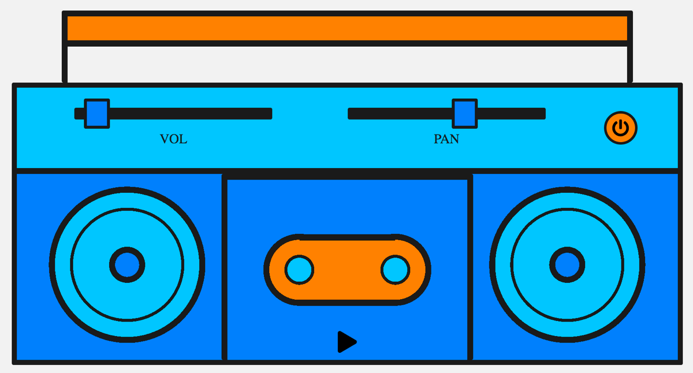
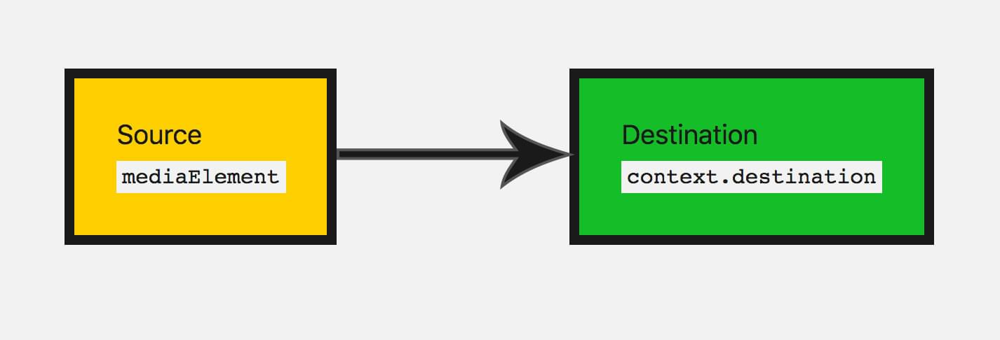
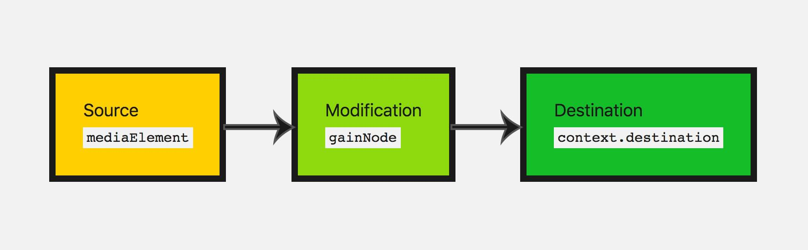
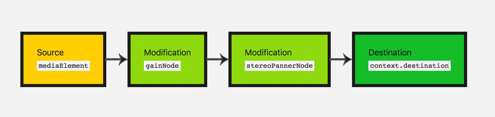
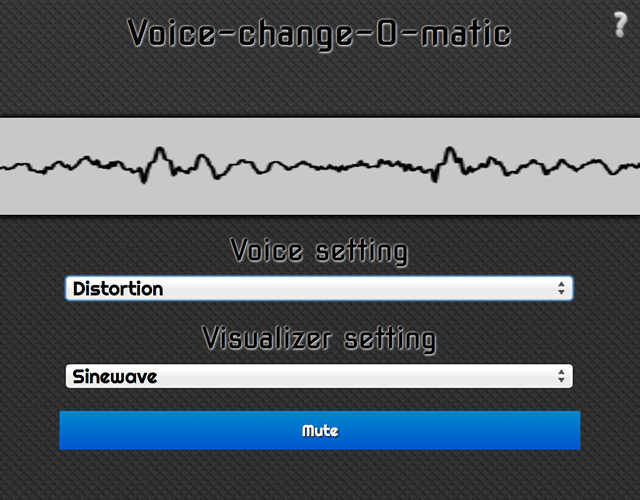
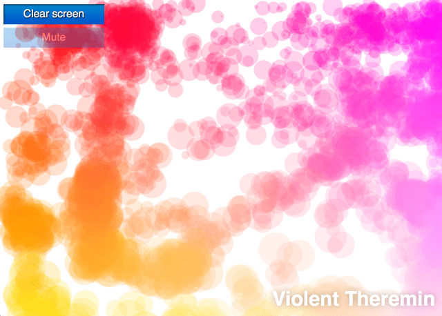

{{DefaultAPISidebar("Web Audio API")}}

Let's take a look at getting started with the [Web Audio API](/en-US/docs/Web/API/Web_Audio_API). We'll briefly look at some concepts, then study a simple boombox example that allows us to load an audio track, play and pause it, and change its volume and stereo panning.

The Web Audio API does not replace the {{HTMLElement("audio")}} media element, but rather complements it, just like {{HTMLElement("canvas")}} coexists alongside the {{HTMLElement("img")}} element. Your use case will determine what tools you use to implement audio. If you want to control playback of an audio track, the `<audio>` media element provides a better, quicker solution than the Web Audio API. If you want to carry out more complex audio processing, as well as playback, the Web Audio API provides much more power and control.

A powerful feature of the Web Audio API is that it does not have a strict "sound call limitation". For example, there is no ceiling of 32 or 64 sound calls at one time. Some processors may be capable of playing more than 1,000 simultaneous sounds without stuttering.

## Example code

Our boombox looks like this:



Note the retro cassette deck with a play button, and vol and pan sliders to allow you to alter the volume and stereo panning. We could make this a lot more complex, but this is ideal for simple learning at this stage.

[Check out the final demo here on CodePen](https://codepen.io/Rumyra/pen/qyMzqN/), or see the [source code on GitHub](https://github.com/mdn/webaudio-examples/tree/main/audio-basics).

## Audio graphs

Everything within the Web Audio API is based around the concept of an audio graph, which is made up of nodes.

The Web Audio API handles audio operations inside an **audio context**, and has been designed to allow **modular routing**. Basic audio operations are performed with **audio nodes**, which are linked together to form an **audio routing graph**. You have input nodes, which are the source of the sounds you are manipulating, modification nodes that change those sounds as desired, and output nodes (destinations), which allow you to save or hear those sounds.

Several audio sources with different channel layouts are supported, even within a single context. Because of this modular design, you can create complex audio functions with dynamic effects.

## Audio context

To be able to do anything with the Web Audio API, we need to create an instance of the audio context. This then gives us access to all the features and functionality of the API.

```js
const audioContext = new AudioContext();
```

So what's going on when we do this? A {{domxref("BaseAudioContext")}} is created for us automatically and extended to an online audio context. We'll want this because we're looking to play live sound.

> [!NOTE]
> If you just want to process audio data, for instance, buffer and stream it but not play it, you might want to look into creating an {{domxref("OfflineAudioContext")}}.

## Loading sound

Now, the audio context we've created needs some sound to play through it. There are a few ways to do this with the API. Let's begin with a simple method — as we have a boombox, we most likely want to play a full song track. Also, for accessibility, it's nice to expose that track in the DOM. We'll expose the song on the page using an {{htmlelement("audio")}} element.

```html
<audio src="myCoolTrack.mp3"></audio>
```

> [!NOTE]
> If the sound file you're loading is held on a different domain you will need to use the `crossorigin` attribute; see [Cross Origin Resource Sharing (CORS)](/en-US/docs/Web/HTTP/CORS) for more information.

To use all the nice things we get with the Web Audio API, we need to grab the source from this element and _pipe_ it into the context we have created. Lucky for us there's a method that allows us to do just that — {{domxref("AudioContext.createMediaElementSource")}}:

```js
// get the audio element
const audioElement = document.querySelector("audio");

// pass it into the audio context
const track = audioContext.createMediaElementSource(audioElement);
```

> [!NOTE]
> The `<audio>` element above is represented in the DOM by an object of type {{domxref("HTMLMediaElement")}}, which comes with its own set of functionality. All of this has stayed intact; we are merely allowing the sound to be available to the Web Audio API.

## Controlling sound

When playing sound on the web, it's important to allow the user to control it. Depending on the use case, there's a myriad of options, but we'll provide functionality to play/pause the sound, alter the track's volume, and pan it from left to right.

Controlling sound programmatically from JavaScript code is covered by browsers' autoplay support policies, as such is likely to be blocked without permission being granted by the user (or an allowlist). Autoplay policies typically require either explicit permission or a user engagement with the page before scripts can trigger audio to play.

These special requirements are in place essentially because unexpected sounds can be annoying and intrusive, and can cause accessibility problems. You can learn more about this in our article [Autoplay guide for media and Web Audio APIs](/en-US/docs/Web/Media/Guides/Autoplay).

Since our scripts are playing audio in response to a user input event (a click on a play button, for instance), we're in good shape and should have no problems from autoplay blocking. So, let's start by taking a look at our play and pause functionality. We have a play button that changes to a pause button when the track is playing:

```html
<button data-playing="false" role="switch" aria-checked="false">
  <span>Play/Pause</span>
</button>
```

Before we can play our track we need to connect our audio graph from the audio source/input node to the destination.

We've already created an input node by passing our audio element into the API. For the most part, you don't need to create an output node, you can just connect your other nodes to {{domxref("BaseAudioContext.destination")}}, which handles the situation for you:

```js
track.connect(audioContext.destination);
```

A good way to visualize these nodes is by drawing an audio graph so you can visualize it. This is what our current audio graph looks like:



Now we can add the play and pause functionality.

```js
// Select our play button
const playButton = document.querySelector("button");

playButton.addEventListener(
  "click",
  () => {
    // Check if context is in suspended state (autoplay policy)
    if (audioContext.state === "suspended") {
      audioContext.resume();
    }

    // Play or pause track depending on state
    if (playButton.dataset.playing === "false") {
      audioElement.play();
      playButton.dataset.playing = "true";
    } else if (playButton.dataset.playing === "true") {
      audioElement.pause();
      playButton.dataset.playing = "false";
    }
  },
  false,
);
```

We also need to take into account what to do when the track finishes playing. Our `HTMLMediaElement` fires an `ended` event once it's finished playing, so we can listen for that and run code accordingly:

```js
audioElement.addEventListener(
  "ended",
  () => {
    playButton.dataset.playing = "false";
  },
  false,
);
```

## Modifying sound

Let's delve into some basic modification nodes, to change the sound that we have. This is where the Web Audio API really starts to come in handy. First of all, let's change the volume. This can be done using a {{domxref("GainNode")}}, which represents how big our sound wave is.

There are two ways you can create nodes with the Web Audio API. You can use the factory method on the context itself (e.g. `audioContext.createGain()`) or via a constructor of the node (e.g. `new GainNode()`). We'll use the factory method in our code:

```js
const gainNode = audioContext.createGain();
```

Now we have to update our audio graph from before, so the input is connected to the gain, then the gain node is connected to the destination:

```js
track.connect(gainNode).connect(audioContext.destination);
```

This will make our audio graph look like this:



The default value for gain is 1; this keeps the current volume the same. Gain can be set to a minimum of about -3.4028235E38 and a max of about 3.4028235E38 (float number range in JavaScript). Here we'll allow the boombox to move the gain up to 2 (double the original volume) and down to 0 (this will effectively mute our sound).

Let's give the user control to do this — we'll use a [range input](/en-US/docs/Web/HTML/Element/input/range):

```html
<input type="range" id="volume" min="0" max="2" value="1" step="0.01" />
```

> [!NOTE]
> Range inputs are a really handy input type for updating values on audio nodes. You can specify a range's values and use them directly with the audio node's parameters.

So let's grab this input's value and update the gain value when the input node has its value changed by the user:

```js
const volumeControl = document.querySelector("#volume");

volumeControl.addEventListener(
  "input",
  () => {
    gainNode.gain.value = volumeControl.value;
  },
  false,
);
```

> [!NOTE]
> The values of node objects (e.g. `GainNode.gain`) are not simple values; they are actually objects of type {{domxref("AudioParam")}} — these called parameters. This is why we have to set `GainNode.gain`'s `value` property, rather than just setting the value on `gain` directly. This enables them to be much more flexible, allowing for passing the parameter a specific set of values to change between over a set period of time, for example.

Great, now the user can update the track's volume! The gain node is the perfect node to use if you want to add mute functionality.

## Adding stereo panning to our app

Let's add another modification node to practice what we've just learnt.

There's a {{domxref("StereoPannerNode")}} node, which changes the balance of the sound between the left and right speakers, if the user has stereo capabilities.

> [!NOTE]
> The `StereoPannerNode` is for simple cases in which you just want stereo panning from left to right.
> There is also a {{domxref("PannerNode")}}, which allows for a great deal of control over 3D space, or sound _spatialization_, for creating more complex effects.
> This is used in games and 3D apps to create birds flying overhead, or sound coming from behind the user for instance.

To visualize it, we will be making our audio graph look like this:



Let's use the constructor method of creating a node this time. When we do it this way, we have to pass in the context and any options that the particular node may take:

```js
const pannerOptions = { pan: 0 };
const panner = new StereoPannerNode(audioContext, pannerOptions);
```

> [!NOTE]
> The constructor method of creating nodes is not supported by all browsers at this time. The older factory methods are supported more widely.

Here our values range from -1 (far left) and 1 (far right). Again let's use a range type input to vary this parameter:

```html
<input type="range" id="panner" min="-1" max="1" value="0" step="0.01" />
```

We use the values from that input to adjust our panner values in the same way as we did before:

```js
const pannerControl = document.querySelector("#panner");

pannerControl.addEventListener(
  "input",
  () => {
    panner.pan.value = pannerControl.value;
  },
  false,
);
```

Let's adjust our audio graph again, to connect all the nodes together:

```js
track.connect(gainNode).connect(panner).connect(audioContext.destination);
```

The only thing left to do is give the app a try: [Check out the final demo here on CodePen](https://codepen.io/Rumyra/pen/qyMzqN/).

## Summary

Great! We have a boombox that plays our 'tape', and we can adjust the volume and stereo panning, giving us a fairly basic working audio graph.

This makes up quite a few basics that you would need to start to add audio to your website or web app. There's a lot more functionality to the Web Audio API, but once you've grasped the concept of nodes and putting your audio graph together, we can move on to looking at more complex functionality.

## More examples

There are other examples available to learn more about the Web Audio API.

The [Voice-change-O-matic](https://github.com/mdn/webaudio-examples/tree/main/voice-change-o-matic) is a fun voice manipulator and sound visualization web app that allows you to choose different effects and visualizations. The application is fairly rudimentary, but it demonstrates the simultaneous use of multiple Web Audio API features. ([run the Voice-change-O-matic live](https://mdn.github.io/webaudio-examples/voice-change-o-matic/)).



Another application developed specifically to demonstrate the Web Audio API is the [Violent Theremin](https://mdn.github.io/webaudio-examples/violent-theremin/), a simple web application that allows you to change pitch and volume by moving your mouse pointer. It also provides a psychedelic lightshow ([see Violent Theremin source code](https://github.com/mdn/webaudio-examples/tree/main/violent-theremin)).



Also see our [webaudio-examples repo](https://github.com/mdn/webaudio-examples) for more examples.
