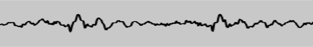

{{DefaultAPISidebar("Web Audio API")}}

One of the most interesting features of the Web Audio API is the ability to extract frequency, waveform, and other data from your audio source, which can then be used to create visualizations. This article explains how, and provides a couple of basic use cases.

> **Note:** You can find working examples of all the code snippets in our [Voice-change-O-matic](https://mdn.github.io/webaudio-examples/voice-change-o-matic/) demo.

## Basic concepts

To extract data from your audio source, you need an {{ domxref("AnalyserNode") }}, which is created using the {{ domxref("BaseAudioContext.createAnalyser") }} method, for example:

```js
const audioCtx = new AudioContext();
const analyser = audioCtx.createAnalyser();
```

This node is then connected to your audio source at some point between your source and your destination, for example:

```js
const source = audioCtx.createMediaStreamSource(stream);
source.connect(analyser);
analyser.connect(distortion);
distortion.connect(audioCtx.destination);
```

> **Note:** you don't need to connect the analyser's output to another node for it to work, as long as the input is connected to the source, either directly or via another node.

The analyser node will then capture audio data using a Fast Fourier Transform (fft) in a certain frequency domain, depending on what you specify as the {{ domxref("AnalyserNode.fftSize") }} property value (if no value is specified, the default is 2048.)

> **Note:** You can also specify a minimum and maximum power value for the fft data scaling range, using {{ domxref("AnalyserNode.minDecibels") }} and {{ domxref("AnalyserNode.maxDecibels") }}, and different data averaging constants using {{ domxref("AnalyserNode.smoothingTimeConstant") }}. Read those pages to get more information on how to use them.

To capture data, you need to use the methods {{ domxref("AnalyserNode.getFloatFrequencyData()") }} and {{ domxref("AnalyserNode.getByteFrequencyData()") }} to capture frequency data, and {{ domxref("AnalyserNode.getByteTimeDomainData()") }} and {{ domxref("AnalyserNode.getFloatTimeDomainData()") }} to capture waveform data.

These methods copy data into a specified array, so you need to create a new array to receive the data before invoking one. The first one produces 32-bit floating point numbers, and the second and third ones produce 8-bit unsigned integers, therefore a standard JavaScript array won't do — you need to use a {{jsxref("Float32Array")}} or {{jsxref("Uint8Array")}} array, depending on what data you are handling.

So for example, say we are dealing with an fft size of 2048. We return the {{ domxref("AnalyserNode.frequencyBinCount") }} value, which is half the fft, then call Uint8Array() with the frequencyBinCount as its length argument — this is how many data points we will be collecting, for that fft size.

```js
analyser.fftSize = 2048;
const bufferLength = analyser.frequencyBinCount;
const dataArray = new Uint8Array(bufferLength);
```

To actually retrieve the data and copy it into our array, we then call the data collection method we want, with the array passed as it's argument. For example:

```js
analyser.getByteTimeDomainData(dataArray);
```

We now have the audio data for that moment in time captured in our array, and can proceed to visualize it however we like, for example by plotting it onto an HTML {{ htmlelement("canvas") }}.

Let's go on to look at some specific examples.

## Creating a waveform/oscilloscope

To create the oscilloscope visualization (hat tip to [Soledad Penadés](https://soledadpenades.com/) for the original code in [Voice-change-O-matic](https://github.com/mdn/webaudio-examples/blob/main/voice-change-o-matic/scripts/app.js#L142), we first follow the standard pattern described in the previous section to set up the buffer:

```js
analyser.fftSize = 2048;
const bufferLength = analyser.frequencyBinCount;
const dataArray = new Uint8Array(bufferLength);
```

Next, we clear the canvas of what had been drawn on it before to get ready for the new visualization display:

```js
canvasCtx.clearRect(0, 0, WIDTH, HEIGHT);
```

We now define the `draw()` function:

```js
function draw() {
```

In here, we use `requestAnimationFrame()` to keep looping the drawing function once it has been started:

```js
const drawVisual = requestAnimationFrame(draw);
```

Next, we grab the time domain data and copy it into our array

```js
analyser.getByteTimeDomainData(dataArray);
```

Next, fill the canvas with a solid color to start

```js
canvasCtx.fillStyle = "rgb(200, 200, 200)";
canvasCtx.fillRect(0, 0, WIDTH, HEIGHT);
```

Set a line width and stroke color for the wave we will draw, then begin drawing a path

```js
canvasCtx.lineWidth = 2;
canvasCtx.strokeStyle = "rgb(0, 0, 0)";
canvasCtx.beginPath();
```

Determine the width of each segment of the line to be drawn by dividing the canvas width by the array length (equal to the FrequencyBinCount, as defined earlier on), then define an x variable to define the position to move to for drawing each segment of the line.

```js
const sliceWidth = WIDTH / bufferLength;
let x = 0;
```

Now we run through a loop, defining the position of a small segment of the wave for each point in the buffer at a certain height based on the data point value from the array, then moving the line across to the place where the next wave segment should be drawn:

```js
for (let i = 0; i < bufferLength; i++) {
  const v = dataArray[i] / 128.0;
  const y = v * (HEIGHT / 2);

  if (i === 0) {
    canvasCtx.moveTo(x, y);
  } else {
    canvasCtx.lineTo(x, y);
  }

  x += sliceWidth;
}
```

Finally, we finish the line in the middle of the right-hand side of the canvas, then draw the stroke we've defined:

```js
  canvasCtx.lineTo(WIDTH, HEIGHT / 2);
  canvasCtx.stroke();
}
```

At the end of this section of code, we invoke the `draw()` function to start off the whole process:

```js
draw();
```

This gives us a nice waveform display that updates several times a second:



## Creating a frequency bar graph

Another nice little sound visualization to create is one of those Winamp-style frequency bar graphs. We have one available in Voice-change-O-matic; let's look at how it's done.

First, we again set up our analyser and data array, then clear the current canvas display with `clearRect()`. The only difference from before is that we have set the fft size to be much smaller; this is so that each bar in the graph is big enough to actually look like a bar rather than a thin strand.

```js
analyser.fftSize = 256;
const bufferLength = analyser.frequencyBinCount;
const dataArray = new Uint8Array(bufferLength);

canvasCtx.clearRect(0, 0, WIDTH, HEIGHT);
```

Next, we start our `draw()` function off, again setting up a loop with `requestAnimationFrame()` so that the displayed data keeps updating, and clearing the display with each animation frame.

```js
function draw() {
  drawVisual = requestAnimationFrame(draw);

  analyser.getByteFrequencyData(dataArray);

  canvasCtx.fillStyle = "rgb(0, 0, 0)";
  canvasCtx.fillRect(0, 0, WIDTH, HEIGHT);
```

Now we set our `barWidth` to be equal to the canvas width divided by the number of bars (the buffer length). However, we are also multiplying that width by 2.5, because most of the frequencies will come back as having no audio in them, as most of the sounds we hear every day are in a certain lower frequency range. We don't want to display loads of empty bars, therefore we shift the ones that will display regularly at a noticeable height across so they fill the canvas display.

We also set a `barHeight` variable, and an `x` variable to record how far across the screen to draw the current bar.

```js
const barWidth = (WIDTH / bufferLength) * 2.5;
let barHeight;
let x = 0;
```

As before, we now start a for loop and cycle through each value in the `dataArray`. For each one, we make the `barHeight` equal to the array value, set a fill color based on the `barHeight` (taller bars are brighter), and draw a bar at `x` pixels across the canvas, which is `barWidth` wide and `barHeight / 2` tall (we eventually decided to cut each bar in half so they would all fit on the canvas better.)

The one value that needs explaining is the vertical offset position we are drawing each bar at: `HEIGHT - barHeight / 2`. I am doing this because I want each bar to stick up from the bottom of the canvas, not down from the top, as it would if we set the vertical position to 0. Therefore, we instead set the vertical position each time to the height of the canvas minus `barHeight / 2`, so therefore each bar will be drawn from partway down the canvas, down to the bottom.

```js
  for (let i = 0; i < bufferLength; i++) {
    barHeight = dataArray[i] / 2;

    canvasCtx.fillStyle = `rgb(${barHeight + 100}, 50, 50)`;
    canvasCtx.fillRect(x, HEIGHT - barHeight / 2, barWidth, barHeight);

    x += barWidth + 1;
  }
}
```

Again, at the end of the code we invoke the `draw()` function to set the whole process in motion.

```js
draw();
```

This code gives us a result like the following:


> **Note:** The examples listed in this article have shown usage of {{ domxref("AnalyserNode.getByteFrequencyData()") }} and {{ domxref("AnalyserNode.getByteTimeDomainData()") }}. For working examples showing {{ domxref("AnalyserNode.getFloatFrequencyData()") }} and {{ domxref("AnalyserNode.getFloatTimeDomainData()") }}, refer to our [Voice-change-O-matic-float-data](https://mdn.github.io/voice-change-o-matic-float-data/) demo — this is exactly the same as the original [Voice-change-O-matic](https://mdn.github.io/webaudio-examples/voice-change-o-matic/), except that it uses Float data, not unsigned byte data. See [this section](https://github.com/mdn/webaudio-examples/blob/main/voice-change-o-matic/scripts/app.js#L155) of the source code for details
