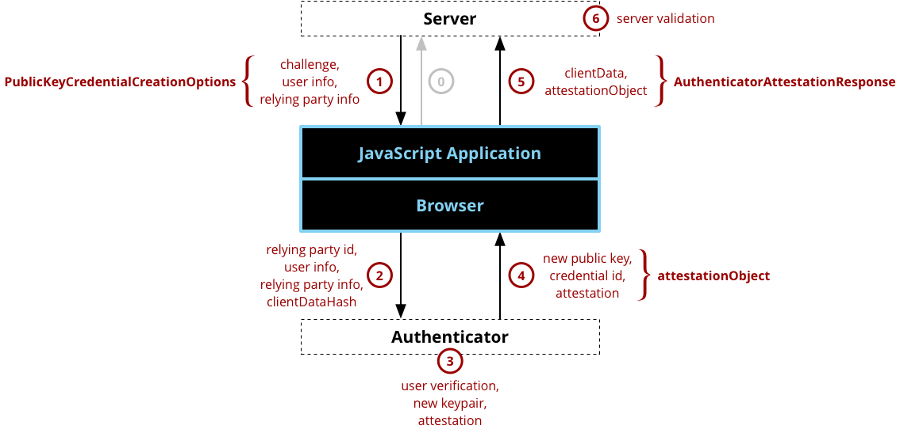

{{securecontext_header}}{{DefaultAPISidebar("Web Authentication API")}}

The Web Authentication API is an extension of the [Credential Management API](/en-US/docs/Web/API/Credential_Management_API) that enables strong authentication with public key cryptography, enabling passwordless authentication and/or secure second-factor authentication without SMS texts.

## Web authentication concepts and usage

The Web Authentication API (also referred to as WebAuthn) uses [asymmetric (public-key)](https://en.wikipedia.org/wiki/Public-key_cryptography) instead of passwords or SMS texts for registering, authenticating, and [second-factor authentication](https://en.wikipedia.org/wiki/Multi-factor_authentication) with websites. This has some benefits:

- **Protection against phishing:** An attacker who creates a fake login website can't login as the user because the signature changes with the [origin](/en-US/docs/Glossary/Origin) of the website.
- **Reduced impact of data breaches:** Developers don't need to hash the public key, and if an attacker gets access to the public key used to verify the authentication, it can't authenticate because it needs the private key.
- **Invulnerable to password attacks:** Some users might reuse passwords, and an attacker may obtain the user's password for another website (e.g. via a data breach). Also, text passwords are much easier to brute-force than a digital signature.

Many websites already have pages that allow users to register new accounts or sign in to an existing account, and the Web Authentication API acts as a replacement or supplement to those on those existing webpages. Similar to the other forms of the [Credential Management API](/en-US/docs/Web/API/Credential_Management_API), the Web Authentication API has two basic methods that correspond to register and login:

- {{domxref("CredentialsContainer.create()", "navigator.credentials.create()")}} - when used with the publicKey option, creates new credentials, either for registering a new account or for associating a new asymmetric key pair credentials with an existing account.
- {{domxref("CredentialsContainer.get()", "navigator.credentials.get()")}} - when used with the publicKey option, uses an existing set of credentials to authenticate to a service, either logging a user in or as a form of second-factor authentication.

> **Note:** Both `create()` and `get()` require a [secure context](/en-US/docs/Web/Security/Secure_Contexts) (i.e. the server is connected by HTTPS or is the localhost), and will not be available for use if the browser is not operating in a secure context.

In their most basic forms, both `create()` and `get()` receive a very large random number called the "challenge" from the server and they return the challenge signed by the private key back to the server. This proves to the server that a user is in possession of the private key required for authentication without revealing any secrets over the network.

In order to understand how the create() and get() methods fit into the bigger picture, it is important to understand that they sit between two components that are outside the browser:

1. **Server** - the Web Authentication API is intended to register new credentials on a server (also referred to as a service or a [relying party](https://en.wikipedia.org/wiki/Relying_party)) and later use those same credentials on that same server to authenticate a user.
2. **Authenticator** - the credentials are created and stored in a device called an authenticator. This is a new concept in authentication: when authenticating using passwords, the password is stored in a user's brain and no other device is needed; when authenticating using web authentication, the password is replaced with a key pair that is stored in an authenticator. The authenticator may be embedded into the user agent, into an operating system, such as Windows Hello, or it may be a physical token, such as a USB or Bluetooth Security Key.

### Registration

A typical registration process has six steps, as illustrated in Figure 1 and described further below. This is a simplification of the data required for the registration process that is only intended to provide an overview. The full set of required fields, optional fields, and their meanings for creating a registration request can be found in the {{domxref("PublicKeyCredentialCreationOptions")}} dictionary. Likewise, the full set of response fields can be found in the {{domxref("PublicKeyCredential")}} interface (where {{domxref("PublicKeyCredential.response")}} is the {{domxref("AuthenticatorAttestationResponse")}} interface). Note most JavaScript programmers that are creating an application will only really care about steps 1 and 5 where the create() function is called and subsequently returns; however, steps 2, 3, and 4 are essential to understanding the processing that takes place in the browser and authenticator and what the resulting data means.



_Figure 1 - a diagram showing the sequence of actions for a web authentication registration and the essential data associated with each action._

First (labeled step 0 in the diagram), the application makes the initial registration request. The protocol and format of this request are outside the scope of the Web Authentication API.

After this, the registration steps are:

1. **Server Sends Challenge, User Info, and Relying Party Info** - The server sends a challenge, user information, and relying party information to the JavaScript program. The protocol for communicating with the server is not specified and is outside of the scope of the Web Authentication API. Typically, server communications would be [REST](/en-US/docs/Glossary/REST) over https (probably using [XMLHttpRequest](/en-US/docs/Web/API/XMLHttpRequest) or [Fetch](/en-US/docs/Web/API/Fetch_API)), but they could also be [SOAP](/en-US/docs/Glossary/SOAP), [RFC 2549](https://datatracker.ietf.org/doc/html/rfc2549) or nearly any other protocol provided that the protocol is secure. The parameters received from the server will be passed to the [create()](/en-US/docs/Web/API/CredentialsContainer/create) call, typically with little or no modification and returns a [Promise](/en-US/docs/Web/JavaScript/Reference/Global_Objects/Promise) that will resolve to a {{domxref("PublicKeyCredential")}} containing an {{domxref("AuthenticatorAttestationResponse")}}. **Note that it is absolutely critical that the challenge be a buffer of random information (at least 16 bytes) and it MUST be generated on the server in order to ensure the security of the registration process.**
2. **Browser Calls authenticatorMakeCredential() on Authenticator** - Internally, the browser will validate the parameters and fill in any defaults, which become the {{domxref("AuthenticatorResponse.clientDataJSON")}}. One of the most important parameters is the origin, which is recorded as part of the clientData so that the origin can be verified by the server later. The parameters to the create() call are passed to the authenticator, along with a SHA-256 hash of the clientDataJSON (only a hash is sent because the link to the authenticator may be a low-bandwidth NFC or Bluetooth link and the authenticator is just going to sign over the hash to ensure that it isn't tampered with).
3. **Authenticator Creates New Key Pair and Attestation** - Before doing anything, the authenticator will typically ask for some form of user verification. This could be entering a PIN, using a fingerprint, doing an iris scan, etc. to prove that the user is present and consenting to the registration. After the user verification, the authenticator will create a new asymmetric key pair and safely store the private key for future reference. The public key will become part of the attestation, which the authenticator will sign over with a private key that was burned into the authenticator during its manufacturing process and that has a certificate chain that can be validated back to a root of trust.
4. **Authenticator Returns Data to Browser** - The new public key, a globally unique credential id, and other attestation data are returned to the browser where they become the attestationObject.
5. **Browser Creates Final Data, Application sends response to Server** - The create() Promise resolves to an {{domxref("PublicKeyCredential")}}, which has a {{domxref("PublicKeyCredential.rawId")}} that is the globally unique credential id along with a response that is the {{domxref("AuthenticatorAttestationResponse")}} containing the {{domxref("AuthenticatorResponse.clientDataJSON")}} and {{domxref("AuthenticatorAttestationResponse.attestationObject")}}. The {{domxref("PublicKeyCredential")}} is sent back to the server using any desired formatting and protocol (note that the ArrayBuffer properties need to be base64 encoded or similar).
6. **Server Validates and Finalizes Registration** - Finally, the server is required to perform a series of checks to ensure that the registration was complete and not tampered with. These include:

    1. Verifying that the challenge is the same as the challenge that was sent
    2. Ensuring that the origin was the origin expected
    3. Validating that the signature over the clientDataHash and the attestation using the certificate chain for that specific model of the authenticator

    A complete list of validation steps [can be found in the Web Authentication API specification](https://w3c.github.io/webauthn/#registering-a-new-credential). Assuming that the checks pan out, the server will store the new public key associated with the user's account for future use — that is, whenever the user desires to use the public key for authentication.

### Authentication

After a user has registered with web authentication, they can subsequently authenticate (a.k.a. - login or sign-in) with the service. The authentication flow looks similar to the registration flow, and the illustration of actions in Figure 2 may be recognizable as being similar to the illustration of registration actions in Figure 1. The primary differences between registration and authentication are that: 1) authentication doesn't require user or relying party information; and 2) authentication creates an assertion using the previously generated key pair for the service rather than creating an attestation with the key pair that was burned into the authenticator during manufacturing. Again, the description of authentication below is a broad overview rather than getting into all the options and features of the Web Authentication API. The specific options for authenticating can be found in the {{domxref("PublicKeyCredentialRequestOptions")}} dictionary, and the resulting data can be found in the {{domxref("PublicKeyCredential")}} interface (where {{domxref("PublicKeyCredential.response")}} is the {{domxref("AuthenticatorAssertionResponse")}} interface) .

.png>)

_Figure 2 - similar to Figure 1, a diagram showing the sequence of actions for a web authentication and the essential data associated with each action._

First (labeled step 0 in the diagram), the application makes the initial authentication request. The protocol and format of this request are outside the scope of the Web Authentication API.

After this, the authentication steps are:

1. **Server Sends Challenge** - The server sends a challenge to the JavaScript program. The protocol for communicating with the server is not specified and is outside of the scope of the Web Authentication API. Typically, server communications would be [REST](/en-US/docs/Glossary/REST) over https (probably using [XMLHttpRequest](/en-US/docs/Web/API/XMLHttpRequest) or [Fetch](/en-US/docs/Web/API/Fetch_API)), but they could also be [SOAP](/en-US/docs/Glossary/SOAP), [RFC 2549](https://datatracker.ietf.org/doc/html/rfc2549) or nearly any other protocol provided that the protocol is secure. The parameters received from the server will be passed to the [get()](/en-US/docs/Web/API/CredentialsContainer/get) call, typically with little or no modification. **Note that it is absolutely critical that the challenge be a buffer of random information (at least 16 bytes) and it MUST be generated on the server in order to ensure the security of the authentication process.**
2. **Browser Calls authenticatorGetCredential() on Authenticator** - Internally, the browser will validate the parameters and fill in any defaults, which become the {{domxref("AuthenticatorResponse.clientDataJSON")}}. One of the most important parameters is the origin, which recorded as part of the clientData so that the origin can be verified by the server later. The parameters to the get() call are passed to the authenticator, along with a SHA-256 hash of the clientDataJSON (only a hash is sent because the link to the authenticator may be a low-bandwidth NFC or Bluetooth link and the authenticator is just going to sign over the hash to ensure that it isn't tampered with).
3. **Authenticator Creates an Assertion** - The authenticator finds a credential for this service that matches the Relying Party ID and prompts a user to consent to the authentication. Assuming both of those steps are successful, the authenticator will create a new assertion by signing over the clientDataHash and authenticatorData with the private key generated for this account during the registration call.
4. **Authenticator Returns Data to Browser** - The authenticator returns the authenticatorData and assertion signature back to the browser.
5. **Browser Creates Final Data, Application sends response to Server** - The browser resolves the [Promise](/en-US/docs/Web/JavaScript/Reference/Global_Objects/Promise) to a {{domxref("PublicKeyCredential")}} with a {{domxref("PublicKeyCredential.response")}} that contains the {{domxref("AuthenticatorAssertionResponse")}}. It is up to the JavaScript application to transmit this data back to the server using any protocol and format of its choice.
6. **Server Validates and Finalizes Authentication** - Upon receiving the result of the authentication request, the server performs validation of the response such as:

    1. Using the public key that was stored during the registration request to validate the signature by the authenticator.
    2. Ensuring that the challenge that was signed by the authenticator matches the challenge that was generated by the server.
    3. Checking that the Relying Party ID is the one expected for this service.

    A full list of the [steps for validating an assertion can be found in the Web Authentication API specification](https://w3c.github.io/webauthn/#verifying-assertion). Assuming the validation is successful, the server will note that the user is now authenticated. This is outside the scope of the Web Authentication API specification, but one option would be to drop a new cookie for the user session.

## Interfaces

- {{domxref("Credential")}} {{experimental_inline}}
  - : Provides information about an entity as a prerequisite to a trust decision.
- {{domxref("CredentialsContainer")}}
  - : Exposes methods to request credentials and notify the user agent when events such as successful sign in or sign out happen. This interface is accessible from {{domxref('Navigator.credentials')}}. The Web Authentication specification adds a `publicKey` member to the {{domxref('CredentialsContainer.create','create()')}} and {{domxref('CredentialsContainer.get','get()')}} methods to either create a new public key pair or get an authentication for a key pair, respectively.
- {{domxref("PublicKeyCredential")}}
  - : Provides information about a public key / private key pair, which is a credential for logging in to a service using an un-phishable and data-breach resistant asymmetric key pair instead of a password.
- {{domxref("AuthenticatorResponse")}}
  - : The base interface for {{domxref("AuthenticatorAttestationResponse")}} and {{domxref("AuthenticatorAssertionResponse")}}, which provide a cryptographic root of trust for a key pair. Returned by {{domxref('CredentialsContainer.create()')}} and {{domxref('CredentialsContainer.get()')}}, respectively, the child interfaces include information from the browser such as the challenge origin. Either may be returned from {{domxref("PublicKeyCredential.response")}}.
- {{domxref("AuthenticatorAttestationResponse")}}
  - : Returned by {{domxref('CredentialsContainer.create()')}} when a {{domxref('PublicKeyCredential')}} is passed, and provides a cryptographic root of trust for the new key pair that has been generated.
- {{domxref("AuthenticatorAssertionResponse")}}
  - : Returned by {{domxref('CredentialsContainer.get()')}} when a {{domxref('PublicKeyCredential')}} is passed, and provides proof to a service that it has a key pair and that the authentication request is valid and approved.

## Options

- {{domxref("PublicKeyCredentialCreationOptions")}}
  - : The options passed to {{domxref('CredentialsContainer.create()')}}.
- {{domxref("PublicKeyCredentialRequestOptions")}}
  - : The options passed to {{domxref('CredentialsContainer.get()')}}.

## Examples

### Demo sites

- [Mozilla Demo](https://webauthn.bin.coffee/) website and its [source code](https://github.com/jcjones/webauthn.bin.coffee).
- [Google Demo](https://try-webauthn.appspot.com/) website and its [source code](https://github.com/google/webauthndemo).
- [https://webauthn.io/ Demo](https://github.com/duo-labs/webauthn.io) website and its [source code](https://github.com/duo-labs/webauthn.io).
- [github.com/webauthn-open-source](https://github.com/webauthn-open-source) and its [client source code](https://github.com/webauthn-open-source/webauthn-simple-app) and [server source code](https://github.com/webauthn-open-source/fido2-lib)
- [OWASP Single Sign-On](https://owasp.org/www-project-sso/)

### Usage example

> **Warning:** For security reasons, web authentication calls ({{domxref('CredentialsContainer.create','create()')}} and {{domxref('CredentialsContainer.get','get()')}}) are cancelled if the browser window loses focus while the call is pending.

```js
// sample arguments for registration
const createCredentialDefaultArgs = {
    publicKey: {
        // Relying Party (a.k.a. - Service):
        rp: {
            name: "Acme"
        },

        // User:
        user: {
            id: new Uint8Array(16),
            name: "john.p.smith@example.com",
            displayName: "John P. Smith"
        },

        pubKeyCredParams: [{
            type: "public-key",
            alg: -7
        }],

        attestation: "direct",

        timeout: 60000,

        challenge: new Uint8Array([ // must be a cryptographically random number sent from a server
            0x8C, 0x0A, 0x26, 0xFF, 0x22, 0x91, 0xC1, 0xE9, 0xB9, 0x4E, 0x2E, 0x17, 0x1A, 0x98, 0x6A, 0x73,
            0x71, 0x9D, 0x43, 0x48, 0xD5, 0xA7, 0x6A, 0x15, 0x7E, 0x38, 0x94, 0x52, 0x77, 0x97, 0x0F, 0xEF
        ]).buffer
    }
};

// sample arguments for login
const getCredentialDefaultArgs = {
    publicKey: {
        timeout: 60000,
        // allowCredentials: [newCredential] // see below
        challenge: new Uint8Array([ // must be a cryptographically random number sent from a server
            0x79, 0x50, 0x68, 0x71, 0xDA, 0xEE, 0xEE, 0xB9, 0x94, 0xC3, 0xC2, 0x15, 0x67, 0x65, 0x26, 0x22,
            0xE3, 0xF3, 0xAB, 0x3B, 0x78, 0x2E, 0xD5, 0x6F, 0x81, 0x26, 0xE2, 0xA6, 0x01, 0x7D, 0x74, 0x50
        ]).buffer
    },
};

// register / create a new credential
navigator.credentials.create(createCredentialDefaultArgs)
    .then((cred) => {
        console.log("NEW CREDENTIAL", cred);

        // normally the credential IDs available for an account would come from a server
        // but we can just copy them from above…
        const idList = [{
            id: cred.rawId,
            transports: ["usb", "nfc", "ble"],
            type: "public-key"
        }];
        getCredentialDefaultArgs.publicKey.allowCredentials = idList;
        return navigator.credentials.get(getCredentialDefaultArgs);
    })
    .then((assertion) => {
        console.log("ASSERTION", assertion);
    })
    .catch((err) => {
        console.log("ERROR", err);
    });
```

## Specifications

{{Specifications}}

## Browser compatibility

{{Compat}}
