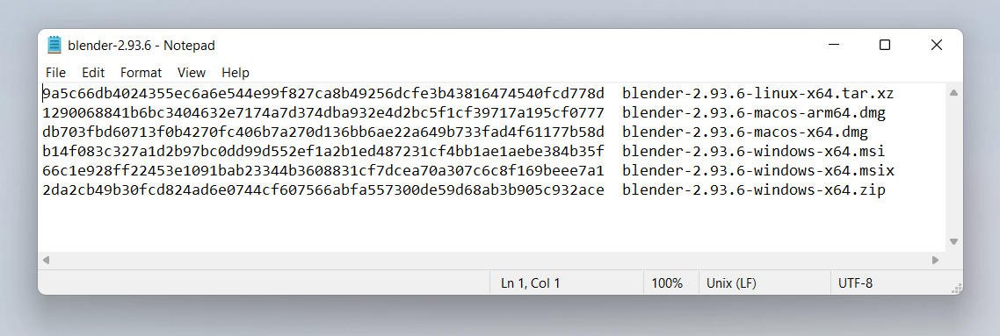

{{DefaultAPISidebar("Web Crypto API")}}

This article will focus on uses of the [`digest`](/en-US/docs/Web/API/SubtleCrypto/digest) method of the [SubtleCrypto interface](/en-US/docs/Web/API/SubtleCrypto). A lot of other methods within the [Web Crypto API](/en-US/docs/Web/API/Web_Crypto_API) have very specific cryptographic use cases, creating hashes of content (which is what the digest method does) has lots of very useful purposes.

This article does not discuss the cryptographic uses of the [SubtleCrypto interface](/en-US/docs/Web/API/SubtleCrypto). An important thing to take away from this article is **don't use this API** for production cryptographic purposes because it is powerful and low level. To use it correctly you will need to take many context specific steps to accomplish cryptographic tasks correctly. If any of those steps are taken incorrectly at best your code won't run, at worse it _will_ run and you will unknowingly be putting your users at risk with an insecure product.

You may not even need to use the [Web Crypto API](/en-US/docs/Web/API/Web_Crypto_API) at all. Many of the things you would want to use cryptography for are already solved and part of the Web platform. For example, if you are worried about man-in-the-middle attacks, such as Wi-Fi hotspots reading the information between the client and the server, this is solved by ensuring correct use of [HTTPS](/en-US/docs/Glossary/HTTPS). Do you want to securely send information between users? Then you can set up a data connection between users using [WebRTC Data Channels](/en-US/docs/Web/API/WebRTC_API/Using_data_channels) which is encrypted as part of the standard.

The [SubtleCrypto interface](/en-US/docs/Web/API/SubtleCrypto) provides low level primitives for working with cryptography, but implementing a system using these tools is a complicated task. Mistakes are hard to notice and the results can mean your user's data is not as secure as you think it is. Which could have catastrophic results if your users are sharing sensitive or valuable data.

If in doubt don't try doing it yourself, hire someone with experience and ensure your software is audited by a security expert.

## Hashing a file

This is the simplest useful thing you can do with the [Web Crypto API](/en-US/docs/Web/API/Web_Crypto_API). It doesn't involve generating keys or certificates and has one single step.

[Hashing](/en-US/docs/Glossary/Hash) is a technique where you convert a large string of bytes into a smaller string, where small changes to the long string result in large changes in the smaller string. This technique is useful for identifying two identical files without checking every byte of both files. This is very useful as you have a simple string to compare. To be clear hashing is a **one way** operation. You cannot generate the original string of bytes from the hash.

If two generated hashes are the same, but the files that used to generate them are different, that is known as a _hash collision_ which is an extremely improbable thing to occur by accident and, for a secure hash function like SHA256, almost impossible to manufacture. So if the two strings are the same you can be reasonably sure the two original files are identical.

As of publication, SHA256 is the usual choice for hashing files but there are [higher order hashing functions](/en-US/docs/Web/API/SubtleCrypto#supported_algorithms) available in the SubtleCrypto interface. The most common representation of a SHA256 hash is a string of 64 hexadecimal digits. Hexadecimal means it only uses the characters 0-9 and a-f, representing 4 bits of information. So in short a SHA256 hash turns any length of data into an almost unique 256 bits of data.

This technique is often used by sites that let you download executables, to ensure that the downloaded file matches the one the author intended. This ensures that your users are not installing malware. The most common way to do this is:

1. Note down the file's name and the SHA256 checksum provided by the website.
2. Download the executable.
3. Run `sha256sum /path/to/the/file` in the terminal to generate your own code. If you are using a Mac you may have to [install it separately](https://unix.stackexchange.com/questions/426837/no-sha256sum-in-macos).
4. Compare the two strings - they should match unless the file has been compromised.



The [`digest()`](/en-US/docs/Web/API/SubtleCrypto/digest) method of SubtleCrypto is useful for this. To generate a checksum of a file you can do it like so:

First we add some HTML elements for loading some files and displaying the SHA-256 output:

```html
<h3>Demonstration of hashing a file with SHA256</h3>

<label
  >Choose file(s) to hash <input type="file" id="file" name="file" multiple
/></label>
<output style="display:block;font-family:monospace;"></output>
```

Next we use the SubtleCrypto interface to process them. This works by:

- Reading the files to an {{jsxref("ArrayBuffer")}} using the {{domxref("File")}} object's {{domxref("Blob.arrayBuffer()", "arrayBuffer()")}} method.
- Use `crypto.subtle.digest('SHA-256', arrayBuffer)` to digest the ArrayBuffer
- Convert the resulting hash (another ArrayBuffer) into a string so it can be displayed

```js
const output = document.querySelector("output");
const file = document.getElementById("file");

// Run the hashing function when the user selects one or more file
file.addEventListener("change", hashTheseFiles);

// The digest function is asynchronous, it returns a promise
// We use the async/await syntax to simplify the code.
async function fileHash(file) {
  const arrayBuffer = await file.arrayBuffer();

  // Use the subtle crypto API to perform a SHA256 Sum of the file's
  // Array Buffer. The resulting hash is stored in an array buffer
  const hashAsArrayBuffer = await crypto.subtle.digest("SHA-256", arrayBuffer);

  // To display it as a string we will get the hexadecimal value of
  // each byte of the array buffer. This gets us an array where each byte
  // of the array buffer becomes one item in the array
  const uint8ViewOfHash = new Uint8Array(hashAsArrayBuffer);
  // We then convert it to a regular array so we can convert each item
  // to hexadecimal strings, where characters of 0-9 or a-f represent
  // a number between 0 and 16, containing 4 bits of information,
  // so 2 of them is 8 bits (1 byte).
  const hashAsString = Array.from(uint8ViewOfHash)
    .map((b) => b.toString(16).padStart(2, "0"))
    .join("");
  return hashAsString;
}

async function hashTheseFiles(e) {
  let outHTML = "";
  // iterate over each file in file select input
  for (const file of this.files) {
    // calculate its hash and list it in the output element.
    outHTML += `${file.name}    ${await fileHash(file)}`;
  }
  output.innerHTML = outHTML;
}
```

{{EmbedLiveSample("hashing_a_file")}}

### Where would you use this?

At this point you may be thinking to yourself "_I can use this on my own website, so when users go to download a file we can ensure the hashes match to reassure the user their download is secure_". Unfortunately this has two issues that immediate spring to mind:

- Executable downloads should **always** be done over HTTPS. This prevents intermediate parties from performing attacks like this so it would be redundant.
- If the attacker is able to replace the download file on the original server, then they can also simply replace the code which invokes the SubtleCrypto interface to bypass it and just state that everything is fine. Probably something sneaky like replacing [strict equality](/en-US/docs/Web/JavaScript/Equality_comparisons_and_sameness#strict_equality_using), which can be a pain to spot in your own code:

  ```diff
  --- if (checksum === correctCheckSum) return true;
  +++ if (checksum = correctCheckSum) return true;
  ```

One place it may be worthwhile, is if you want to test a file from a third party download source, which you do not control. This would be the case as long as the download location has [CORS](/en-US/docs/Glossary/CORS) headers enabled to let you scan the file before you make it available to your users. Unfortunately not many servers have CORS turned on by default.

## What is "Salting the Hash"?

A phrase you may have heard before is _"Salting the hash"_. It's not immediately relevant to our topics at hand, but it is good to know about.

> **Note:** this section is talking about password security and the hash functions provided by SubtleCrypto are not suitable for this use case. For these purposes you need expensive slow hash functions like `scrypt` and `bcrypt`. SHA is designed to be pretty fast and efficient, which makes it unsuitable for password hashing. This section is purely for your interest — do not use the Web Crypto API to hash passwords on the client.

A popular use case for hashing is passwords, you never ever want to store a users password in plain text, its simply a terrible idea. Instead you store a hash of the users password, so the original password cannot be recovered should a hacker obtain your username and password database. The eagle eyed among may notice you can still work out the original passwords by comparing the hashes from lists of known passwords against the obtained password hash list. Concatenating a string to the passwords changes the hash so it no longer matches. This is known as **salting**. Another tricky problem is if you use the same salt for each password, then passwords with matching hashes will also be the same original password. Thus if you know one then you know all matching passwords.

To solve this issue, you perform what is known as _salting the hash_. For each password, you generate a salt (a random string of characters) and concatenate that with the password string. You then store the hash and the salt in the same database so you can check a match when the user tries to log in later. This means that if two users use the same password the hashes will be different. Hence the reason why you need an expensive cryptographic function, so it makes it too time consuming to use lists of common passwords to find out what the original passwords were.

## Hash Tables with SHA

You can use SHA1 to quickly generate non-cryptographically secure hashes. These are incredibly useful for turning some arbitrary data into a key you can look up later.

For example, if you want to have a database which includes a large blob of data as one of the fields in a row. This decreases the efficiency of your database because one of the fields has to be either variable length, or large enough to store the largest possible blob. An alternative solution is to generate a hash of the blob and store it in a separate look up table using the hash as the index. You can then store just the hash in your original database which is a nice fixed length.

The possible variations for a SHA1 hash are incredibly numerous. So much so that accidentally producing two blobs with the same SHA1 hash is nearly-impossible. It _is_ possible to intentionally produce two files with the same SHA1 hash, because SHA1 is not cryptographically secure. So a malicious user could in theory generate a blob of data that replaces the original in the database, which goes undetected because the hash is the same. This is an attack vector worth being aware of.

## How git stores files

Git uses SHA1 hashes and is a great example here, it uses hashes in two interesting ways. When files are stored in git, they are referenced by their SHA1 hash. This makes it quick for git to find the data and restore files.

It doesn't just use the file contents for the hash however, it also prepends it with the UTF8 string `"blob "`, followed by the file size in bytes written in decimal, followed by the null character (which in JavaScript can be written `"\0"`). You can use the [TextEncoder interface](/en-US/docs/Web/API/TextEncoder) of the [Encoding API](/en-US/docs/Web/API/Encoding_API) to encode the UTF8 text, since strings in JavaScript are UTF16.

The code below, like our SHA256 example, can be used to generate these hashes from files. The HTML to upload files remains the same, but we do some additional work to prepend the size information in the same way git does.

```html
<h3>Demonstration of how git uses SHA1 for files</h3>

<label
  >Choose file(s) to hash <input type="file" id="file" name="file" multiple
/></label>

<output style="display:block;font-family:monospace;"></output>
```

```js
const output = document.querySelector("output");
const file = document.getElementById("file");
file.addEventListener("change", hashTheseFiles);

async function fileHash(file) {
  const arrayBuffer = await file.arrayBuffer();

  // Git prepends the null terminated text 'blob 1234' where 1234
  // represents the file size before hashing so we are going to reproduce that

  // first we work out the Byte length of the file
  const uint8View = new Uint8Array(arrayBuffer);
  const length = uint8View.length;

  // Git in the terminal uses UTF8 for its strings; the Web uses UTF16.
  // We need to use an encoder because different binary representations
  // of the letters in our message will result in different hashes
  const encoder = new TextEncoder();
  // Null-terminated means the string ends in the null character which
  // in JavaScript is '\0'
  const view = encoder.encode(`blob ${length}\0`);

  // We then combine the 2 Array Buffers together into a new Array Buffer.
  const newBlob = new Blob([view.buffer, arrayBuffer], {
    type: "text/plain",
  });
  const arrayBufferToHash = await newBlob.arrayBuffer();

  // Finally we perform the hash this time as SHA1 which is what Git uses.
  // Then we return it as a string to be displayed.
  return hashToString(await crypto.subtle.digest("SHA-1", arrayBufferToHash));
}

function hashToString(arrayBuffer) {
  const uint8View = new Uint8Array(arrayBuffer);
  return Array.from(uint8View)
    .map((b) => b.toString(16).padStart(2, "0"))
    .join("");
}

// like before we iterate over the files
async function hashTheseFiles(e) {
  let outHTML = "";
  for (const file of this.files) {
    outHTML += `${file.name}    ${await fileHash(file)}`;
  }
  output.innerHTML = outHTML;
}
```

{{EmbedLiveSample("how-git-stores-files")}}

Notice how it uses the [Encoding API](/en-US/docs/Web/API/Encoding_API) to produce the header, which is concatenated with the original ArrayBuffer to produce the string to be hashed.

## How git generates commit hashes

Interestingly git also generates commit hashes in a similar way based upon multiple pieces of information. These can include the previous commit hash and the commit message, which come together to make a new hash. This can be used to reference commits which are based on several unique identifiers.

The terminal command is: `(printf "commit %s\0" $(git --no-replace-objects cat-file commit HEAD | wc -c); git cat-file commit HEAD) | sha1sum`

Source: [How is git commit sha1 formed](https://gist.github.com/masak/2415865)

Essentially it's the UTF8 string (null character written as `\0`):

```plain
commit [size in bytes as decimal of this info]\0tree [tree hash]
parent [parent commit hash]
author [author info] [timestamp]
committer [committer info] [timestamp]

commit message
```

This is great because none of the individual fields are guaranteed to be unique, but when combined together give a unique pointer to a single commit. However, the whole string is too long and unwieldy to use. So by hashing it you get a new unique string which is short enough to share conveniently from multiple fields.

This is why the hash changes if you have ever amended your commit, even if you don't make any changes to the message. The timestamp of the commit has changed, which even by a single character, is enough to totally change the new hash.

The take away from this is that when you want to add a key to some data, but any single piece of information isn't unique enough, then concatenating multiple strings together and hashing them is a great way to generate a useful key.

Hopefully these examples have encourage you to take a look at this new powerful API. Remember don't try recreating cryptography things yourself. Its enough to know the tools are there and some of them like the [`crypto.digest()`](/en-US/docs/Web/API/SubtleCrypto/digest) function are useful tools for your day to day development.
