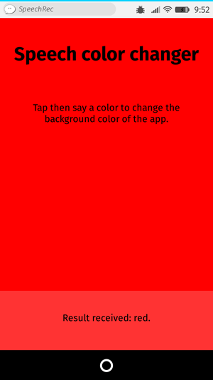
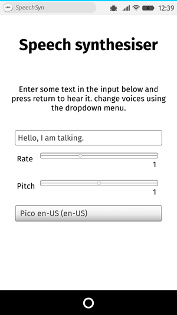

{{DefaultAPISidebar("Web Speech API")}}
The Web Speech API provides two distinct areas of functionality — speech recognition, and speech synthesis (also known as text to speech, or tts) — which open up interesting new possibilities for accessibility, and control mechanisms. This article provides a simple introduction to both areas, along with demos.

## Speech recognition

Speech recognition involves receiving speech through a device's microphone, which is then checked by a speech recognition service against a list of grammar (basically, the vocabulary you want to have recognized in a particular app.) When a word or phrase is successfully recognized, it is returned as a result (or list of results) as a text string, and further actions can be initiated as a result.

The Web Speech API has a main controller interface for this — {{domxref("SpeechRecognition")}} — plus a number of closely-related interfaces for representing grammar, results, etc. Generally, the default speech recognition system available on the device will be used for the speech recognition — most modern OSes have a speech recognition system for issuing voice commands. Think about Dictation on macOS, Siri on iOS, Cortana on Windows 10, Android Speech, etc.

> **Note:** On some browsers, like Chrome, using Speech Recognition on a web page involves a server-based recognition engine. Your audio is sent to a web service for recognition processing, so it won't work offline.

### Demo

To show simple usage of Web speech recognition, we've written a demo called [Speech color changer](https://github.com/mdn/dom-examples/tree/main/web-speech-api/speech-color-changer). When the screen is tapped/clicked, you can say an HTML color keyword, and the app's background color will change to that color.



To run the demo, navigate to the [live demo URL](https://mdn.github.io/dom-examples/web-speech-api/speech-color-changer/) in a supporting mobile browser like Chrome.

### Browser support

Support for Web Speech API speech recognition is currently limited to Chrome for Desktop and Android — Chrome has supported it since around version 33 but with prefixed interfaces, so you need to include prefixed versions of them, e.g. `webkitSpeechRecognition`.

### HTML and CSS

The HTML and CSS for the app is really trivial. We have a title, instructions paragraph, and a div into which we output diagnostic messages.

```html
<h1>Speech color changer</h1>
<p>Tap/click then say a color to change the background color of the app.</p>
<div>
  <p class="output"><em>…diagnostic messages</em></p>
</div>
```

The CSS provides a very simple responsive styling so that it looks OK across devices.

### JavaScript

Let's look at the JavaScript in a bit more detail.

#### Chrome support

As mentioned earlier, Chrome currently supports speech recognition with prefixed properties, therefore at the start of our code we include these lines to feed the right objects to Chrome, and any future implementations that might support the features without a prefix:

```js
const SpeechRecognition = window.SpeechRecognition || webkitSpeechRecognition;
const SpeechGrammarList = window.SpeechGrammarList || webkitSpeechGrammarList;
const SpeechRecognitionEvent = window.SpeechRecognitionEvent || webkitSpeechRecognitionEvent;
```

#### The grammar

The next part of our code defines the grammar we want our app to recognize. The following variable is defined to hold our grammar:

```js
const colors = [ 'aqua' , 'azure' , 'beige', 'bisque', 'black', 'blue', 'brown', 'chocolate', 'coral', /* … */ ];
const grammar = `#JSGF V1.0; grammar colors; public <color> = ${colors.join(' | ')};`
```

The grammar format used is [JSpeech Grammar Format](https://www.w3.org/TR/jsgf/) (**JSGF**) — you can find a lot more about it at the previous link to its spec. However, for now let's just run through it quickly:

- The lines are separated by semi-colons, just like in JavaScript.
- The first line — `#JSGF V1.0;` — states the format and version used. This always needs to be included first.
- The second line indicates a type of term that we want to recognize. `public` declares that it is a public rule, the string in angle brackets defines the recognized name for this term (`color`), and the list of items that follow the equals sign are the alternative values that will be recognized and accepted as appropriate values for the term. Note how each is separated by a pipe character.
- You can have as many terms defined as you want on separate lines following the above structure, and include fairly complex grammar definitions. For this basic demo, we are just keeping things simple.

#### Plugging the grammar into our speech recognition

The next thing to do is define a speech recognition instance to control the recognition for our application. This is done using the {{domxref("SpeechRecognition.SpeechRecognition()","SpeechRecognition()")}} constructor. We also create a new speech grammar list to contain our grammar, using the {{domxref("SpeechGrammarList.SpeechGrammarList()","SpeechGrammarList()")}} constructor.

```js
const recognition = new SpeechRecognition();
const speechRecognitionList = new SpeechGrammarList();
```

We add our `grammar` to the list using the {{domxref("SpeechGrammarList.addFromString()")}} method. This accepts as parameters the string we want to add, plus optionally a weight value that specifies the importance of this grammar in relation of other grammars available in the list (can be from 0 to 1 inclusive.) The added grammar is available in the list as a {{domxref("SpeechGrammar")}} object instance.

```js
speechRecognitionList.addFromString(grammar, 1);
```

We then add the {{domxref("SpeechGrammarList")}} to the speech recognition instance by setting it to the value of the {{domxref("SpeechRecognition.grammars")}} property. We also set a few other properties of the recognition instance before we move on:

- {{domxref("SpeechRecognition.continuous")}}: Controls whether continuous results are captured (`true`), or just a single result each time recognition is started (`false`).
- {{domxref("SpeechRecognition.lang")}}: Sets the language of the recognition. Setting this is good practice, and therefore recommended.
- {{domxref("SpeechRecognition.interimResults")}}: Defines whether the speech recognition system should return interim results, or just final results. Final results are good enough for this simple demo.
- {{domxref("SpeechRecognition.maxAlternatives")}}: Sets the number of alternative potential matches that should be returned per result. This can sometimes be useful, say if a result is not completely clear and you want to display a list if alternatives for the user to choose the correct one from. But it is not needed for this simple demo, so we are just specifying one (which is actually the default anyway.)

```js
recognition.grammars = speechRecognitionList;
recognition.continuous = false;
recognition.lang = 'en-US';
recognition.interimResults = false;
recognition.maxAlternatives = 1;
```

#### Starting the speech recognition

After grabbing references to the output {{htmlelement("div")}} and the HTML element (so we can output diagnostic messages and update the app background color later on), we implement an onclick handler so that when the screen is tapped/clicked, the speech recognition service will start. This is achieved by calling {{domxref("SpeechRecognition.start()")}}. The `forEach()` method is used to output colored indicators showing what colors to try saying.

```js
const diagnostic = document.querySelector('.output');
const bg = document.querySelector('html');
const hints = document.querySelector('.hints');

let colorHTML = '';
colors.forEach((color, i) => {
  console.log(color, i);
  colorHTML += `<span style="background-color:${color};"> ${color} </span>`;
});
hints.innerHTML = `Tap or click then say a color to change the background color of the app. Try ${colorHTML}.`;

document.body.onclick = () => {
  recognition.start();
  console.log('Ready to receive a color command.');
};
```

#### Receiving and handling results

Once the speech recognition is started, there are many event handlers that can be used to retrieve results, and other pieces of surrounding information (see the [`SpeechRecognition` events](/en-US/docs/Web/API/SpeechRecognition#events).) The most common one you'll probably use is the {{domxref("SpeechRecognition.result_event", "result")}} event, which is fired once a successful result is received:

```js
recognition.onresult = (event) => {
  const color = event.results[0][0].transcript;
  diagnostic.textContent = `Result received: ${color}.`;
  bg.style.backgroundColor = color;
  console.log(`Confidence: ${event.results[0][0].confidence}`);
}
```

The second line here is a bit complex-looking, so let's explain it step by step. The {{domxref("SpeechRecognitionEvent.results")}} property returns a {{domxref("SpeechRecognitionResultList")}} object containing {{domxref("SpeechRecognitionResult")}} objects. It has a getter so it can be accessed like an array — so the first `[0]` returns the `SpeechRecognitionResult` at position 0. Each `SpeechRecognitionResult` object contains {{domxref("SpeechRecognitionAlternative")}} objects that contain individual recognized words. These also have getters so they can be accessed like arrays — the second `[0]` therefore returns the `SpeechRecognitionAlternative` at position 0. We then return its `transcript` property to get a string containing the individual recognized result as a string, set the background color to that color, and report the color recognized as a diagnostic message in the UI.

We also use the {{domxref("SpeechRecognition.speechend_event", "speechend")}} event to stop the speech recognition service from running (using {{domxref("SpeechRecognition.stop()")}}) once a single word has been recognized and it has finished being spoken:

```js
recognition.onspeechend = () => {
  recognition.stop();
}
```

#### Handling errors and unrecognized speech

The last two handlers are there to handle cases where speech was recognized that wasn't in the defined grammar, or an error occurred. The {{domxref("SpeechRecognition.nomatch_event", "nomatch")}} event seems to be supposed to handle the first case mentioned, although note that at the moment it doesn't seem to fire correctly; it just returns whatever was recognized anyway:

```js
recognition.onnomatch = (event) => {
  diagnostic.textContent = "I didn't recognize that color.";
}
```

The {{domxref("SpeechRecognition.error_event", "error")}} event handles cases where there is an actual error with the recognition successfully — the {{domxref("SpeechRecognitionErrorEvent.error")}} property contains the actual error returned:

```js
recognition.onerror = (event) => {
  diagnostic.textContent = `Error occurred in recognition: ${event.error}`;
}
```

## Speech synthesis

Speech synthesis (aka text-to-speech, or tts) involves receiving synthesizing text contained within an app to speech, and playing it out of a device's speaker or audio output connection.

The Web Speech API has a main controller interface for this — {{domxref("SpeechSynthesis")}} — plus a number of closely-related interfaces for representing text to be synthesized (known as utterances), voices to be used for the utterance, etc. Again, most OSes have some kind of speech synthesis system, which will be used by the API for this task as available.

### Demo

To show simple usage of Web speech synthesis, we've provided a demo called [Speak easy synthesis](https://github.com/mdn/dom-examples/tree/main/web-speech-api/speak-easy-synthesis). This includes a set of form controls for entering text to be synthesized, and setting the pitch, rate, and voice to use when the text is uttered. After you have entered your text, you can press <kbd>Enter</kbd>/<kbd>Return</kbd> to hear it spoken.



To run the demo, navigate to the [live demo URL](https://mdn.github.io/dom-examples/web-speech-api/speak-easy-synthesis/) in a supporting mobile browser like Chrome.

### Browser support

Support for Web Speech API speech synthesis is still getting there across mainstream browsers, and is currently limited to the following:

- Firefox desktop and mobile support it in Gecko 42+ (Windows)/44+, without prefixes, and it can be turned on by flipping the `media.webspeech.synth.enabled` flag to `true` in `about:config`.
- Firefox OS 2.5+ supports it, by default, and without the need for any permissions.
- Chrome for Desktop and Android have supported it since around version 33, without prefixes.

### HTML and CSS

The HTML and CSS are again pretty trivial, containing a title, some instructions for use, and a form with some simple controls. The {{htmlelement("select")}} element is initially empty, but is populated with {{htmlelement("option")}}s via JavaScript (see later on.)

```html
<h1>Speech synthesizer</h1>

<p>Enter some text in the input below and press return to hear it. change voices using the dropdown menu.</p>

<form>
  <input type="text" class="txt">
  <div>
    <label for="rate">Rate</label><input type="range" min="0.5" max="2" value="1" step="0.1" id="rate">
    <div class="rate-value">1</div>
    <div class="clearfix"></div>
  </div>
  <div>
    <label for="pitch">Pitch</label><input type="range" min="0" max="2" value="1" step="0.1" id="pitch">
    <div class="pitch-value">1</div>
    <div class="clearfix"></div>
  </div>
  <select>

  </select>
</form>
```

### JavaScript

Let's investigate the JavaScript that powers this app.

#### Setting variables

First of all, we capture references to all the DOM elements involved in the UI, but more interestingly, we capture a reference to {{domxref("Window.speechSynthesis")}}. This is API's entry point — it returns an instance of {{domxref("SpeechSynthesis")}}, the controller interface for web speech synthesis.

```js
const synth = window.speechSynthesis;

const inputForm = document.querySelector('form');
const inputTxt = document.querySelector('.txt');
const voiceSelect = document.querySelector('select');

const pitch = document.querySelector('#pitch');
const pitchValue = document.querySelector('.pitch-value');
const rate = document.querySelector('#rate');
const rateValue = document.querySelector('.rate-value');

const voices = [];
```

#### Populating the select element

To populate the {{htmlelement("select")}} element with the different voice options the device has available, we've written a `populateVoiceList()` function. We first invoke {{domxref("SpeechSynthesis.getVoices()")}}, which returns a list of all the available voices, represented by {{domxref("SpeechSynthesisVoice")}} objects. We then loop through this list — for each voice we create an {{htmlelement("option")}} element, set its text content to display the name of the voice (grabbed from {{domxref("SpeechSynthesisVoice.name")}}), the language of the voice (grabbed from {{domxref("SpeechSynthesisVoice.lang")}}), and `-- DEFAULT` if the voice is the default voice for the synthesis engine (checked by seeing if {{domxref("SpeechSynthesisVoice.default")}} returns `true`.)

We also create `data-` attributes for each option, containing the name and language of the associated voice, so we can grab them easily later on, and then append the options as children of the select.

```js
function populateVoiceList() {
  voices = synth.getVoices();

  for (const voice of voices) {
    const option = document.createElement('option');
    option.textContent = `${voice.name} (${voice.lang})`;

    if (voice.default) {
      option.textContent += ' — DEFAULT';
    }

    option.setAttribute('data-lang', voice.lang);
    option.setAttribute('data-name', voice.name);
    voiceSelect.appendChild(option);
  }
}
```

When we come to run the function, we do the following. This is because Firefox doesn't support the {{domxref("SpeechSynthesis.voiceschanged_event", "voiceschanged")}} event, and will just return a list of voices when {{domxref("SpeechSynthesis.getVoices()")}} is fired. With Chrome, however, you have to wait for the event to fire before populating the list, hence the if statement seen below.

```js
populateVoiceList();
if (speechSynthesis.onvoiceschanged !== undefined) {
  speechSynthesis.onvoiceschanged = populateVoiceList;
}
```

#### Speaking the entered text

Next, we create an event handler to start speaking the text entered into the text field. We are using an [onsubmit](/en-US/docs/Web/API/HTMLFormElement/submit_event) handler on the form so that the action happens when <kbd>Enter</kbd>/<kbd>Return</kbd> is pressed. We first create a new {{domxref("SpeechSynthesisUtterance.SpeechSynthesisUtterance()", "SpeechSynthesisUtterance()")}} instance using its constructor — this is passed the text input's value as a parameter.

Next, we need to figure out which voice to use. We use the {{domxref("HTMLSelectElement")}} `selectedOptions` property to return the currently selected {{htmlelement("option")}} element. We then use this element's `data-name` attribute, finding the {{domxref("SpeechSynthesisVoice")}} object whose name matches this attribute's value. We set the matching voice object to be the value of the {{domxref("SpeechSynthesisUtterance.voice")}} property.

Finally, we set the {{domxref("SpeechSynthesisUtterance.pitch")}} and {{domxref("SpeechSynthesisUtterance.rate")}} to the values of the relevant range form elements. Then, with all necessary preparations made, we start the utterance being spoken by invoking {{domxref("SpeechSynthesis.speak()")}}, passing it the {{domxref("SpeechSynthesisUtterance")}} instance as a parameter.

```js
inputForm.onsubmit = (event) => {
  event.preventDefault();

  const utterThis = new SpeechSynthesisUtterance(inputTxt.value);
  const selectedOption = voiceSelect.selectedOptions[0].getAttribute('data-name');
  for (const voice of voices) {
    if (voice.name === selectedOption) {
      utterThis.voice = voice;
    }
  }
  utterThis.pitch = pitch.value;
  utterThis.rate = rate.value;
  synth.speak(utterThis);
```

In the final part of the handler, we include an {{domxref("SpeechSynthesisUtterance.pause_event", "pause")}} event to demonstrate how {{domxref("SpeechSynthesisEvent")}} can be put to good use. When {{domxref("SpeechSynthesis.pause()")}} is invoked, this returns a message reporting the character number and name that the speech was paused at.

```js
   utterThis.onpause = (event) => {
    const char = event.utterance.text.charAt(event.charIndex);
    console.log(
      `Speech paused at character ${event.charIndex} of "${event.utterance.text}", which is "${char}".`
    );
  }
```

Finally, we call [blur()](/en-US/docs/Web/API/HTMLElement/blur) on the text input. This is mainly to hide the keyboard on Firefox OS.

```js
  inputTxt.blur();
}
```

#### Updating the displayed pitch and rate values

The last part of the code updates the `pitch`/`rate` values displayed in the UI, each time the slider positions are moved.

```js
pitch.onchange = () => {
  pitchValue.textContent = pitch.value;
}

rate.onchange = () => {
  rateValue.textContent = rate.value;
}
```
