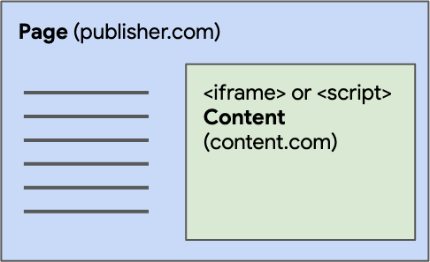

{{DefaultAPISidebar("Web Storage API")}}

The **Web Storage API** provides mechanisms by which browsers can store key/value pairs, in a much more intuitive fashion than using {{glossary("cookie", "cookies")}}.

## Concepts and usage

The two mechanisms within Web Storage are as follows:

- `sessionStorage` maintains a separate storage area for each given {{glossary("origin")}} that's available for the duration of the page session (as long as the browser tab is open, including page reloads and restores).

- `localStorage` does the same thing, but persists even when the browser is closed and reopened.

These mechanisms are available via the {{domxref("Window.sessionStorage")}} and {{domxref("Window.localStorage")}} properties. Invoking one of these will return an instance of a {{domxref("Storage")}} object, through which data items can be set, retrieved and removed. A different storage object is used for the `sessionStorage` and `localStorage` for each origin — they function and are controlled separately.

To learn about the amount of storage available using the APIs, and what happens when storage limits are exceeded, see [Storage quotas and eviction criteria](/en-US/docs/Web/API/Storage_API/Storage_quotas_and_eviction_criteria).

Both `sessionStorage` and `localStorage` in Web Storage are synchronous in nature. This means that when data is set, retrieved, or removed from these storage mechanisms, the operations are performed synchronously, blocking the execution of other JavaScript code until the operation is completed. This synchronous behavior can potentially affect the performance of the web application, especially if there is a large amount of data being stored or retrieved.

Developers should be cautious when performing operations on `sessionStorage` or `localStorage` that involve a significant amount of data or computationally intensive tasks. It is important to optimize code and minimize synchronous operations to prevent blocking the user interface and causing delays in the application's responsiveness.

Asynchronous alternatives, such as [IndexedDB](/en-US/docs/Web/API/IndexedDB_API), may be more suitable for scenarios where performance is a concern or when dealing with larger datasets. These alternatives allow for non-blocking operations, enabling smoother user experiences and better performance in web applications.

> [!NOTE]
> Access to Web Storage from third-party IFrames is denied if the user has [disabled third-party cookies](https://support.mozilla.org/en-US/kb/third-party-cookies-firefox-tracking-protection).

## Determining storage access by a third party

Each origin has its own storage — this is true for both web storage and [shared storage](/en-US/docs/Web/API/Shared_Storage_API). However, access of third-party (i.e., embedded) code to shared storage depends on its [browsing context](/en-US/docs/Glossary/Browsing_context). The context in which a third-party code from another origin runs determines the storage access of the third-party code.

Third-party code can be added to another site by injecting it with a {{htmlelement("script")}} element or by setting the source of an {{htmlelement("iframe")}} to a site that contains third-party code. The method used for integrating third-party code determines the browsing context of the code.

- If your third-party code is added to another site with a `<script>` element, your code will be executed in the browsing context of the embedder. Therefore, when you call {{domxref("Storage.setItem()")}} or {{domxref("SharedStorage.set()")}}, the key/value pair will be written to the embedder's storage. From the browser's perspective, there is no difference between first-party code and third-party code when a `<script>` tag is used.
- When your third-party code is added to another site within an `<iframe>`, the code inside the `<iframe>` will be executed with the origin of the `<iframe>`'s browsing context. If the code inside the `<iframe>` calls {{domxref("Storage.setItem()")}}, data will be written into the local or session storage of the `<iframe>`'s origin. If the `<iframe>` code calls {{domxref("SharedStorage.set()")}}, the data will be written into the shared storage of the `<iframe>`'s origin.

## Web Storage interfaces

- {{domxref("Storage")}}
  - : Allows you to set, retrieve and remove data for a specific domain and storage type (session or local).
- {{domxref("Window")}}
  - : The Web Storage API extends the {{domxref("Window")}} object with two new properties — {{domxref("Window.sessionStorage")}} and {{domxref("Window.localStorage")}} — which provide access to the current domain's session and local {{domxref("Storage")}} objects respectively, and a {{domxref("Window/storage_event", "storage")}} event handler that fires when a storage area changes (e.g., a new item is stored).
- {{domxref("StorageEvent")}}
  - : The `storage` event is fired on a document's `Window` object when a storage area changes.

## Examples

To illustrate some typical web storage usage, we have created an example, imaginatively called [Web Storage Demo](https://github.com/mdn/dom-examples/tree/main/web-storage). The [landing page](https://mdn.github.io/dom-examples/web-storage/) provides controls that can be used to customize the color, font and decorative image. When you choose different options, the page is instantly updated; in addition your choices are stored in `localStorage`, so that when you leave the page then load it again later on your choices are remembered.

In addition, we have provided an [event output page](https://mdn.github.io/dom-examples/web-storage/event.html) — if you load this page in another tab, then make changes to your choices in the landing page, you'll see the updated storage information outputted as the {{domxref("StorageEvent")}} is fired.

## Specifications

{{Specifications}}

## Browser compatibility

{{Compat}}

## Private Browsing / Incognito modes

Private windows, incognito mode, and similarly named privacy browsing options, don't store data like history and cookies. In private mode, `localStorage` is treated like `sessionStorage`. The storage APIs are still available and fully functional, but all data stored in the private window is deleted when the browser or browser tab is closed.

## See also

- [Using the Web Storage API](/en-US/docs/Web/API/Web_Storage_API/Using_the_Web_Storage_API)
- [Browser storage quotas and eviction criteria](/en-US/docs/Web/API/Storage_API/Storage_quotas_and_eviction_criteria)
