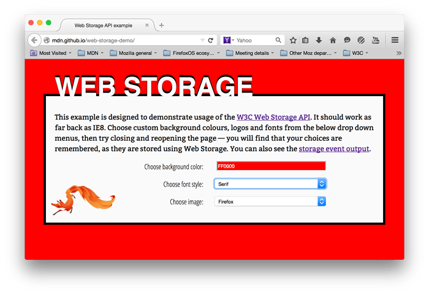
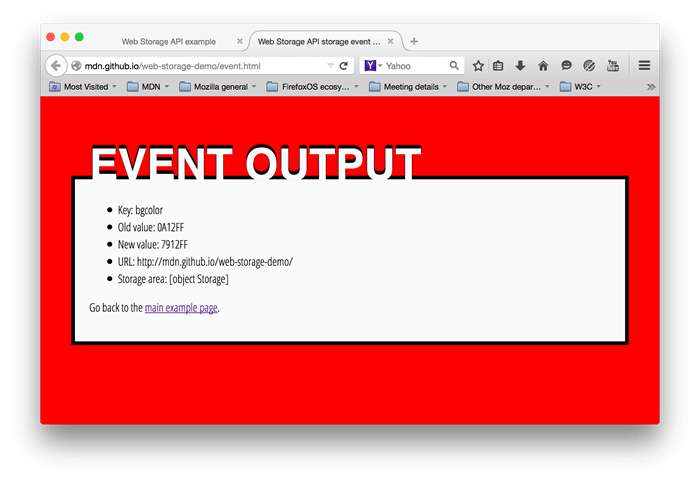

{{DefaultAPISidebar("Web Storage API")}}

The Web Storage API provides mechanisms by which browsers can securely store key/value pairs.

This article provides a walkthrough of how to make use of this technology.

## Basic concepts

Storage objects are simple key-value stores, similar to objects, but they stay intact through page loads. The keys and the values are always strings (note that, as with objects, integer keys will be automatically converted to strings). You can access these values like an object, or with the {{domxref("Storage.getItem()")}} and {{domxref("Storage.setItem()")}} methods. These three lines all set the (same) colorSetting entry:

```js
localStorage.colorSetting = '#a4509b';
localStorage['colorSetting'] = '#a4509b';
localStorage.setItem('colorSetting', '#a4509b');
```

> **Note:** It's recommended to use the Web Storage API (`setItem`, `getItem`, `removeItem`, `key`, `length`) to prevent the [pitfalls](https://2ality.com/2012/01/objects-as-maps.html) associated with using plain objects as key-value stores.

The two mechanisms within Web Storage are as follows:

- `sessionStorage` maintains a separate storage area for each given origin that's available for the duration of the page session (as long as the browser is open, including page reloads and restores).
- `localStorage` does the same thing, but persists even when the browser is closed and reopened.

These mechanisms are available via the {{domxref("Window.sessionStorage")}} and {{domxref("Window.localStorage")}} properties (to be more precise, in supporting browsers the `Window` object implements the `WindowLocalStorage` and `WindowSessionStorage` objects, which the `localStorage` and `sessionStorage` properties are members of) — invoking one of these will create an instance of the {{domxref("Storage")}} object, through which data items can be set, retrieved, and removed. A different Storage object is used for the `sessionStorage` and `localStorage` for each origin — they function and are controlled separately.

So, for example, initially calling `localStorage` on a document will return a {{domxref("Storage")}} object; calling `sessionStorage` on a document will return a different {{domxref("Storage")}} object. Both of these can be manipulated in the same way, but separately.

## Feature-detecting localStorage

To be able to use localStorage, we should first verify that it is supported and available in the current browsing session.

### Testing for availability

> **Note:** This API is available in current versions of all major browsers. Testing for availability is necessary only if you must support very old browsers, such as Internet Explorer 6 or 7, or in the limited circumstances described below.

Browsers that support localStorage have a property on the window object named `localStorage`. However, just asserting that the property exists may throw exceptions. If the `localStorage` object does exist, there is still no guarantee that the localStorage API is actually available, as various browsers offer settings that disable localStorage. So a browser may _support_ localStorage, but not make it _available_ to the scripts on the page.

For example, for a document viewed in a browser's private browsing mode, some browsers might give us an empty `localStorage` object with a quota of zero, effectively making it unusable. Conversely, we might get a legitimate `QuotaExceededError`, which means that we've used up all available storage space, but storage _is_ actually _available_. Our feature detection should take these scenarios into account.

Here is a function that detects whether localStorage is both supported and available:

```js
function storageAvailable(type) {
    let storage;
    try {
        storage = window[type];
        const x = '__storage_test__';
        storage.setItem(x, x);
        storage.removeItem(x);
        return true;
    }
    catch (e) {
        return e instanceof DOMException && (
            // everything except Firefox
            e.code === 22 ||
            // Firefox
            e.code === 1014 ||
            // test name field too, because code might not be present
            // everything except Firefox
            e.name === 'QuotaExceededError' ||
            // Firefox
            e.name === 'NS_ERROR_DOM_QUOTA_REACHED') &&
            // acknowledge QuotaExceededError only if there's something already stored
            (storage && storage.length !== 0);
    }
}
```

And here is how you would use it:

```js
if (storageAvailable('localStorage')) {
  // Yippee! We can use localStorage awesomeness
}
else {
  // Too bad, no localStorage for us
}
```

You can test for sessionStorage instead by calling `storageAvailable('sessionStorage')`.

See here for a [brief history of feature-detecting localStorage](https://gist.github.com/paulirish/5558557).

## Example

To illustrate some typical web storage usage, we have created an example, imaginatively called **Web Storage Demo**. The [landing page](https://mdn.github.io/dom-examples/web-storage/) provides controls that can be used to customize the color, font, and decorative image:

When you choose different options, the page is instantly updated; in addition, your choices are stored in `localStorage`, so that when you leave the page and load it again, later on, your choices are remembered.

We have also provided an [event output page](https://mdn.github.io/dom-examples/web-storage/event.html) — if you load this page in another tab, then make changes to your choices in the landing page, you'll see the updated storage information outputted as a {{domxref("StorageEvent")}} is fired.



> **Note:** As well as viewing the example pages live using the above links, you can also [check out the source code](https://github.com/mdn/dom-examples/tree/main/web-storage).

### Testing whether your storage has been populated

To start with, in [main.js](https://github.com/mdn/dom-examples/blob/main/web-storage/main.js), we test whether the storage object has already been populated (i.e., the page was previously accessed):

```js
if (!localStorage.getItem('bgcolor')) {
  populateStorage();
} else {
  setStyles();
}
```

The {{domxref("Storage.getItem()")}} method is used to get a data item from storage; in this case, we are testing to see whether the `bgcolor` item exists; if not, we run `populateStorage()` to add the existing customization values to the storage. If there are already values there, we run `setStyles()` to update the page styling with the stored values.

> **Note:** You could also use {{domxref("Storage.length")}} to test whether the storage object is empty or not.

### Getting values from storage

As noted above, values can be retrieved from storage using {{domxref("Storage.getItem()")}}.
This takes the key of the data item as an argument, and returns the data value.

For example:

```js
function setStyles() {
  const currentColor = localStorage.getItem('bgcolor');
  const currentFont = localStorage.getItem('font');
  const currentImage = localStorage.getItem('image');

  document.getElementById('bgcolor').value = currentColor;
  document.getElementById('font').value = currentFont;
  document.getElementById('image').value = currentImage;

  htmlElem.style.backgroundColor = `#${currentColor}`;
  pElem.style.fontFamily = currentFont;
  imgElem.setAttribute('src', currentImage);
}
```

Here, the first three lines grab the values from local storage.
Next, we set the values displayed in the form elements to those values, so that they keep in sync when you reload the page.
Finally, we update the styles/decorative image on the page, so your customization options come up again on reload.

### Setting values in storage

{{domxref("Storage.setItem()")}} is used both to create new data items, and (if the data item already exists) update existing values. This takes two arguments — the key of the data item to create/modify, and the value to store in it.

```js
function populateStorage() {
  localStorage.setItem('bgcolor', document.getElementById('bgcolor').value);
  localStorage.setItem('font', document.getElementById('font').value);
  localStorage.setItem('image', document.getElementById('image').value);

  setStyles();
}
```

The `populateStorage()` function sets three items in local storage — the background color, font, and image path. It then runs the `setStyles()` function to update the page styles, etc.

We've also included an `onchange` handler on each form element so that the data and styling are updated whenever a form value is changed:

```js
bgcolorForm.onchange = populateStorage;
fontForm.onchange = populateStorage;
imageForm.onchange = populateStorage;
```

### Responding to storage changes with the StorageEvent

The {{domxref("StorageEvent")}} is fired whenever a change is made to the {{domxref("Storage")}} object (note that this event is not fired for sessionStorage changes). This won't work on the same page that is making the changes — it is really a way for other pages on the domain using the storage to sync any changes that are made. Pages on other domains can't access the same storage objects.

On the events page (see [events.js](https://github.com/mdn/dom-examples/blob/main/web-storage/event.js)) the only JavaScript is as follows:

```js
window.addEventListener('storage', (e) => {
  document.querySelector('.my-key').textContent = e.key;
  document.querySelector('.my-old').textContent = e.oldValue;
  document.querySelector('.my-new').textContent = e.newValue;
  document.querySelector('.my-url').textContent = e.url;
  document.querySelector('.my-storage').textContent = JSON.stringify(e.storageArea);
});
```

Here we add an event listener to the `window` object that fires when the {{domxref("Storage")}} object associated with the current origin is changed. As you can see above, the event object associated with this event has a number of properties containing useful information — the key of the data that changed, the old value before the change, the new value after that change, the URL of the document that changed the storage, and the storage object itself (which we've stringified so you can see its content).

### Deleting data records

Web Storage also provides a couple of simple methods to remove data. We don't use these in our demo, but they are very simple to add to your project:

- {{domxref("Storage.removeItem()")}} takes a single argument — the key of the data item you want to remove — and removes it from the storage object for that domain.
- {{domxref("Storage.clear()")}} takes no arguments, and empties the entire storage object for that domain.

## Specifications

{{Specifications}}

## Browser compatibility

{{Compat}}

All browsers have varying capacity levels for both localStorage and sessionStorage. Here is a [detailed rundown of all the storage capacities for various browsers](http://dev-test.nemikor.com/web-storage/support-test/).

## See also

- [Web Storage API landing page](/en-US/docs/Web/API/Web_Storage_API)
