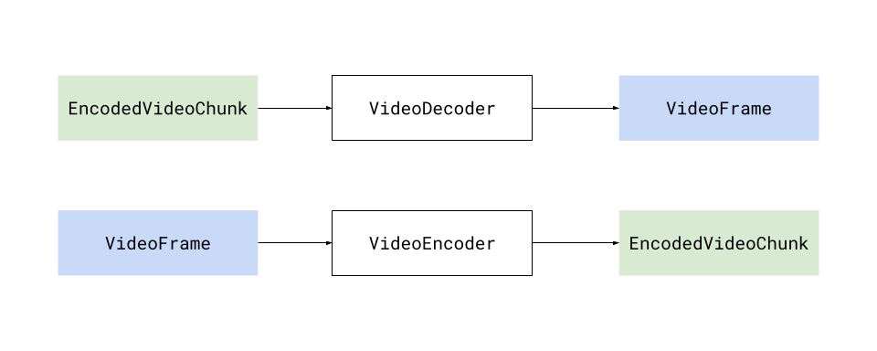
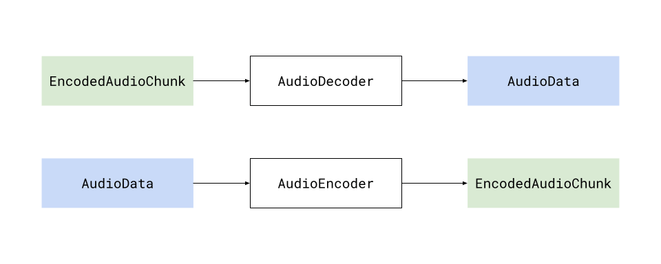
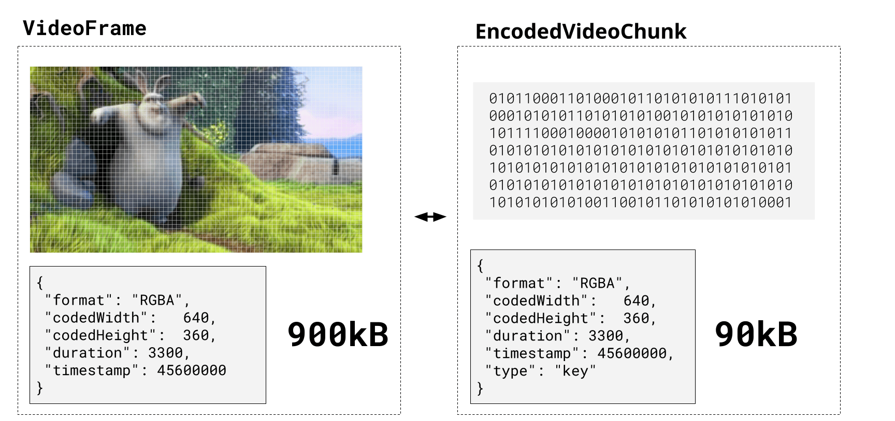
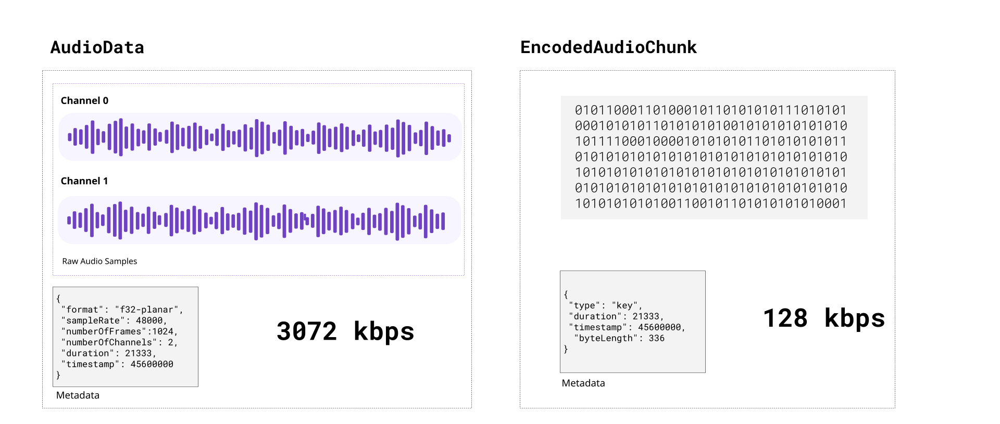

{{DefaultAPISidebar("WebCodecs API")}}{{AvailableInWorkers("window_and_dedicated")}}

The **WebCodecs API** enables web developers to encode and decode video and audio in the browser efficiently (using hardware acceleration) and with very low-level control (processing on a per-frame basis).

It is useful for web applications that do heavy media processing, or which require low-level control over the way media is encoded, such as browser-based video and audio editing, as well as live-streaming and video conferencing.

## Why WebCodecs exists

There are other APIs which use media codecs internally, such as the [MediaRecorder API](/en-US/docs/Web/API/MediaRecorder) and the [WebRTC API](/en-US/docs/Web/API/WebRTC_API), but these lack the low-level (per-frame) control required by some applications.

Previously, developers used WebAssembly ports of ffmpeg such as [ffmpeg.js](https://github.com/Kagami/ffmpeg.js/), but these lack true hardware acceleration capabilities, and are difficult to integrate with other key APIs like the File API for working with large Files efficiently.

WebCodecs was designed to enable low-level, hardware-accelerated media processing, for applications such as high-performance streaming and video editing, which were not well served by the existing APIs.

## Concepts

The WebCodecs API provides browser-native interfaces to represent raw video frames, encoded video frames, as well as raw and encoded audio.

|             | Video                            | Audio                            |
| ----------- | -------------------------------- | -------------------------------- |
| **Raw**     | {{domxref("VideoFrame")}}        | {{domxref("AudioData")}}         |
| **Encoded** | {{domxref("EncodedVideoChunk")}} | {{domxref("EncodedAudioChunk")}} |

The WebCodecs API also introduces the {{domxref("VideoDecoder")}} and {{domxref("VideoEncoder")}} interfaces, which transform `EncodedVideoChunk` objects into `VideoFrame` objects and vice-versa.



Likewise, the WebCodecs API also introduces the {{domxref("AudioDecoder")}} and {{domxref("AudioEncoder")}} interfaces, which transform `EncodedAudioChunk` objects into `AudioData` objects and vice-versa.



There is a 1:1 correspondence between the raw and encoded versions of each media type. Decoding n `EncodedVideoChunk` objects will yield exactly n `VideoFrame` objects (same with audio).

### Video

A `VideoFrame` represents a video frame, and is tied both to actual pixel data on the device's graphics memory, as well as metadata such as the timestamp and duration (in microseconds), format and resolution. A `VideoFrame` can be constructed from any image source, and can also be rendered to a {{domxref("Canvas")}} using any of the canvas rendering methods.

`EncodedVideoChunk` represents the encoded version of the same frame, tied to binary data in regular memory and the same metadata, with one key additional field: `type`, which can be "key" or "delta", representing whether it corresponds to a [key frame](https://webcodecsfundamentals.org/basics/encoded-video-chunk/#key-frames).



### Audio

An `AudioData` object represents a number of individual audio samples (1024 is a typical number). Audio sample data can be extracted as a {{jsxref("Float32Array")}} via the `copyTo` method. There is no direct integration to the [Web Audio API](/en-US/docs/Web/API/Web_Audio_API).



### Codecs

A codec is a specific algorithm for encoding (compressing) and decoding (decompressing) video and audio. There are several industry standard codecs for video, and a separate set of codecs for audio. Here are the major ones supported in WebCodecs:

#### Video Codecs

- H.264 (AVC)
  - : The most widely supported video codec. Most MP4 files use H.264.
- VP9
  - : Open source, developed by Google. Better compression than H.264. Commonly used on YouTube and in WebM files.
- AV1
  - : The newest open source codec, with better compression than VP9. Broad decoder support; hardware encoder support is still limited.
- H.265 (HEVC)
  - : Better compression than H.264, but with significant gaps in browser support outside of Apple platforms.

#### Audio Codecs

- Opus
  - : Open source, low-latency. The recommended choice for most WebCodecs audio encoding.
- AAC
  - : Widely supported. Common in MP4 files.
- MP3
  - : Broadly supported for decoding, but not available as an encoder in WebCodecs.
- PCM
  - : Uncompressed audio. No quality loss, but large file sizes.

The WebCodecs specification only supports a specific set of codecs, and individual devices and browsers may only support a subset of those. Encoders and decoders must be configured with a specific codec string (such as `"vp09.00.40.08"` for VP9 or `"avc1.4d0034"` for H.264) rather than a general codec name. For a full list of codec strings and their browser support, see the [Codec Support Table](https://webcodecsfundamentals.org/datasets/codec-support-table/) on WebCodecs Fundamentals, or the [Codec selection guide](/en-US/docs/Web/API/WebCodecs_API/Codec_selection) for guidance on choosing the right codec string.

### Muxing and Demuxing

The WebCodecs API only deals with encoding and decoding, with encoded chunks just representing binary data. It does not provide a built-in way to read `EncodedVideoChunk` objects from a video file, or write them to a playable video file.

Reading encoded chunks from a video file is a completely different process called demuxing, and to fetch `EncodedVideoChunk` objects from a video file, you will need to use a demuxing library such as [MediaBunny](https://mediabunny.dev/) or [web-demuxer](https://github.com/bilibili/web-demuxer).


These libraries will follow the video container specifications (e.g., webm, mp4) to extract the track data and byte offsets for each encoded chunk, and provide methods for extracting the actual chunks from the raw file.

Likewise, to write to a playable video file, you will need a muxing library, with [MediaBunny](https://mediabunny.dev/) being the primary option for muxing. Muxing libraries will handle formatting the binary encoded data, and placing it in the correct byte position in the output file stream according to the container specification, so that the output video is playable.

You can find more information on muxing and demuxing in the [Muxing and Demuxing guide](https://webcodecsfundamentals.org/basics/muxing/) on WebCodecs Fundamentals.

## Guides

- [Video processing concepts](/en-US/docs/Web/API/WebCodecs_API/Video_processing_concepts)
  - : A brief primer on video processing, including codecs and containers, muxing and demuxing, that covers conceptual informatio to understand how the WebCodecs API implements these concepts.
- [Using the WebCodecs API](/en-US/docs/Web/API/WebCodecs_API/Using_the_WebCodecs_API)
  - : In depth guide to how to actually use the WebCodecs API, including how to instantiate and configure encoders and decoders, how to create and consume video frames, and how to extract samples from AudioData.
- [Codec selection](/en-US/docs/Web/API/WebCodecs_API/Codec_selection)
  - : The WebCodecs API requires codec strings — precise identifiers that specify not just the codec family but also the profile, level, and other parameters. This guide explains how codec strings work and how to choose the right codec for common use cases.

## Interfaces

- {{domxref("AudioDecoder")}}
  - : Decodes {{domxref("EncodedAudioChunk")}} objects.
- {{domxref("VideoDecoder")}}
  - : Decodes {{domxref("EncodedVideoChunk")}} objects.
- {{domxref("AudioEncoder")}}
  - : Encodes {{domxref("AudioData")}} objects.
- {{domxref("VideoEncoder")}}
  - : Encodes {{domxref("VideoFrame")}} objects.
- {{domxref("EncodedAudioChunk")}}
  - : Represents codec-specific encoded audio bytes.
- {{domxref("EncodedVideoChunk")}}
  - : Represents codec-specific encoded video bytes.
- {{domxref("AudioData")}}
  - : Represents unencoded audio data.
- {{domxref("VideoFrame")}}
  - : Represents a frame of unencoded video data.
- {{domxref("VideoColorSpace")}}
  - : Represents the color space of a video frame.
- {{domxref("ImageDecoder")}}
  - : Unpacks and decodes image data, giving access to the sequence of frames in an animated image.
- {{domxref("ImageTrackList")}}
  - : Represents the list of tracks available in the image.
- {{domxref("ImageTrack")}}
  - : Represents an individual image track.

## Examples

The basic instantiation of a `VideoEncoder` looks like this, where you define the output callback where `EncodedVideoChunk` objects will be returned.

```js
const encoder = new VideoEncoder({
  output(chunk, meta) {
    // Do something with chunk, typically send to muxing library
  },
  error(e) {
    console.warn(e);
  },
});
```

You then need to configure the encoder with the codec parameter and various other fields.

```js
encoder.configure({
  codec: "vp09.00.40.08.00", // See codec selection guide
  width: 1280,
  height: 720,
  bitrate: 1_000_000, // 1 Mbps
  framerate: 25,
});
```

You can then start encoding frames to the encoder. You can construct a `VideoFrame` from a `Canvas`

```js
for (let i = 0; i < 60; i++) {
  const frame = new VideoFrame(canvas, { timestamp: (i * 1e6) / 30 }); //30 fps, in microseconds
  encoder.encode(frame, { keyFrame: i % 60 === 0 });
}
```

See [Using the WebCodecs API](/en-US/docs/Web/API/WebCodecs_API/Using_the_WebCodecs_API) for more examples.

## See also

- [Video processing with WebCodecs](https://developer.chrome.com/docs/web-platform/best-practices/webcodecs)
- [WebCodecs API Samples](https://w3c.github.io/webcodecs/samples/)
- [WebCodecsFundamentals](https://webcodecsfundamentals.org/)
- [Real-Time Video Processing with WebCodecs and Streams: Processing Pipelines](https://webrtchacks.com/real-time-video-processing-with-webcodecs-and-streams-processing-pipelines-part-1/)
- [Video Frame Processing on the Web – WebAssembly, WebGPU, WebGL, WebCodecs, WebNN, and WebTransport](https://webrtchacks.com/video-frame-processing-on-the-web-webassembly-webgpu-webgl-webcodecs-webnn-and-webtransport/)
