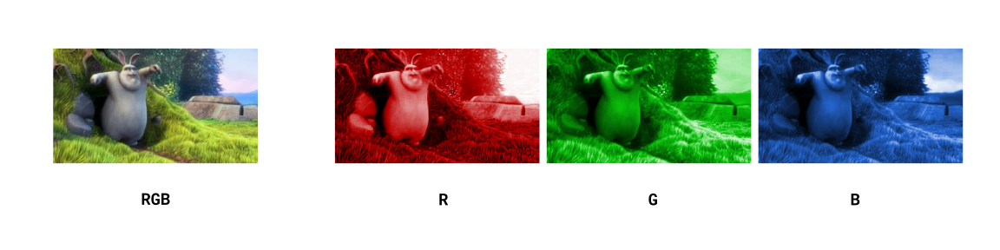

{{DefaultAPISidebar("WebCodecs API")}}

Before working with the WebCodecs API, it is helpful to understand some foundational concepts around how video works, how it is compressed, and how video files are structured.
This guide covers the key concepts: video frames, codecs, encoding and decoding, containers, and muxing and demuxing.

## Video frames

A video is a sequence of images displayed in rapid succession. Each image in the sequence is called a **video frame**, and each frame has an associated timestamp indicating when it should be displayed.


Each pixel in the video frame is composed of 3 components, a Red, Green and Blue value (also called an RGB value). Each color channel is represented by 1 byte (a uint8 representing an integer from 0-255, indicating the insensity of the color channel for that pixel), meaning that each pixel is represented by at least 3 bytes of information.



Uncompressed, a single 4K frame (~8 million pixels at 3 bytes per pixel) is approximately 25 MB. At 30 frames per second, one hour of uncompressed 4K video would be around 750 GB, which is impractically large for storage or streaming.

Codecs were developed in order to compress video, typically by 1-2 orders of magnitude, to be able to practically store and stream video content given typical device network and storage constraints.

## Codecs

A **codec** (short for encode/decode) is an algorithm for compressing and decompressing video data. Codecs reduce file size dramatically — typically by a factor of 100 or more through a variety of different techniques. While there are a number of video codecs used within the browser, such as `vp9`, `av1` and `h264`, they all apply some form of the following techniques:

### Color space transformations

Codecs will transform the original RGB color values into the YUV colorpsace, with the Y channel capturing changes in brightness, and UV channels capturing the other color information. The codecs will then subsample the UV color channels, reducing data use by ~50% for minimal percieved quality loss.


This colorspace transformation shows up within the `format` property of the `VideoFrame` object. The `format` can take the following values:

- `I420` - Normal YUV subsampling, with a Y channel and sub-sampled U and V channels.
- `NV12` - Similar to YUV, but instead of storing data in 3 planes, it interleaves the UV data together into one plane
- `RGBA` - Standard RGB but with an alpha channel
- `BGRA` - Same as RGB, but in reverse order (Blue, Green, Red)

### Spatial Compression

All the major codecs use a technique called the Discrete Cosine Transform, which transforms a standard image into the frequency domain. Codecs then remove high frequency details before trasnforming back into the original colorspace. The effect looks like this:


The amount of detail removed is determined dynamically by the encoding algorithm. This can be adjusted by configuring

-he following shows the tradeoff between quality and bitrate, using baseline `vp9` on a 1080p video:


### Temporal Compression


Codecs will then store the first video frame in a sequence as a key frame, and then storing subsequent frames as just frame differences (called delta frames).


Videos are typically encoded with key frames at regular intervals. To reconstruct a given delta frame, it is necessary to decode the previous key frame, and then all the previous delta frames, in order, up until the current delta frame, in order to properly add up all the frame differences and construct the full current frame for display.
In WebCodecs, the `EncodedVideoChunk` interface has a `type` property which can take the value `"key"` or `"delta"` denoting whether or not the chunk represents a key frame or a delta frame.

When encoding with a `VideoEncoder`, it is possible to determine when to set a video as a key frame or a delta frame by using the `keyFrame` parameter in the encoder method

```js
 encoder.encode(frame, {keyFrame: /* */})
```

## Encoding and decoding

### Codec Compatability

For codecs to be useful, it is necessary to be able to both encode video (turn raw video into compressed binary data) with a codec, and to be able to decode the same video (turn the compressed binary data back into raw video frames) with the same codec. The video industry has therefore coalesced around a handful of standard codecs such as `vp9`, `h264` and `av1`.

Applications which primarily create video content (e.g., video editing tools), and thefore primarily encode video, typically choose a video codec for encoding in order to maximize compatability with video player sofware.

Applications which primarily consume video conent (e.g., video player software) and therefore primarily decode video will typically try to support as many possible codecs as possible.

Applications which control both encoding and decoding (e.g., a video streaming website) have much more flexibility on codec choice, and can therefore choose codecs based on factors such as cost and encoding speed.

### Encoding is Expensive

Encoding is significantly more computationally expensive than decoding, typically by 1-2 orders of magnitude. Video conferencing applications will often use older codecs such as `vp8` because, although it results in lower quality video for the same bitrate, it is also less computationally expensive than newer codecs like `vp9`.

### Hardware Acceleration

Most consumer devices include specialized hardware specifically designed to encode and decode video. Leveraging these specialized chips for encoding and decoding is called hardware acceleration, and can speed up encoding tasks by 2 orders of magnitude compared to standard CPU based encoding.

One of the key advantages of the WebCodecs API is the ability to use hardware accelerated encoding, making applications like video editing and high performance streaming practical on consumer devices.

## Containers

A video file is not just encoded video data.
It also contains encoded audio, metadata (such as duration and dimensions), and timing information.
A **container format** (such as MP4 or WebM) defines how all of this data is organized within a file.

Common container formats include:

- **MP4** (.mp4): Widely supported; typically contains H.264 or H.265 video and AAC audio.
- **WebM** (.webm): An open format; typically contains VP9 or AV1 video and Opus audio.

## Muxing and demuxing

**Muxing** (multiplexing) is the process of combining encoded video, encoded audio, and metadata into a container file.
**Demuxing** (demultiplexing) is the reverse: parsing a container file to extract the encoded video chunks, audio chunks, and metadata.

The WebCodecs API handles encoding and decoding only.
Muxing and demuxing are outside the scope of the API and require a separate library.
See the [Muxing and Demuxing](/en-US/docs/Web/API/WebCodecs_API#muxing_and_demuxing) section on the WebCodecs API overview page for library options.

## See also

- [Video Codec Guide](/en-US/docs/Web/Media/Guides/Formats/Video_codecs)
- [WebCodecs API](/en-US/docs/Web/API/WebCodecs_API)
- [Using the WebCodecs API](/en-US/docs/Web/API/WebCodecs_API/Using_the_WebCodecs_API)
- [Codec selection](/en-US/docs/Web/API/WebCodecs_API/Codec_selection)
