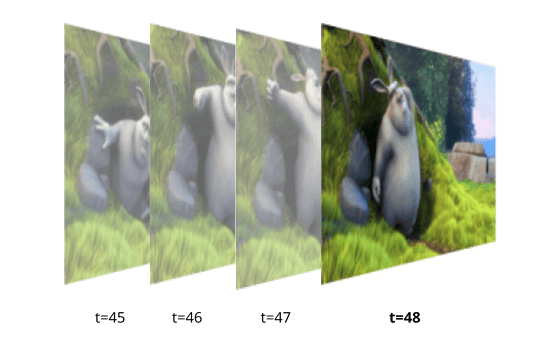
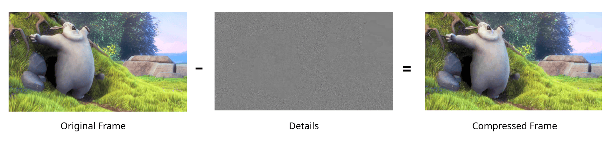
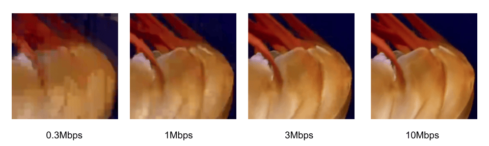
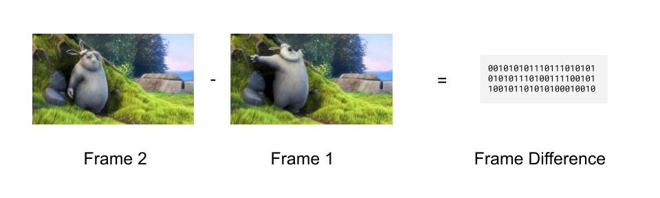
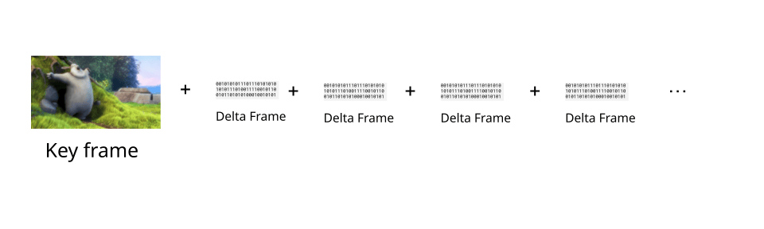
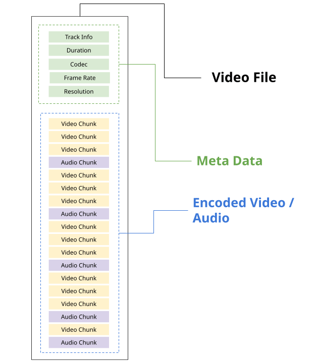
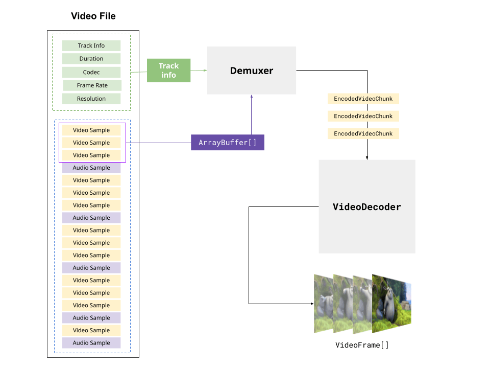

{{DefaultAPISidebar("WebCodecs API")}}

Before working with the WebCodecs API, it is helpful to understand some foundational concepts around how video works, how it is compressed, and how video files are structured.
This guide covers the key concepts: video frames, codecs, encoding and decoding, containers, and muxing and demuxing.

## Video frames

A video is a sequence of images displayed in rapid succession. Each image in the sequence is called a **video frame**, and each frame has an associated timestamp indicating when it should be displayed.



Each pixel in a video frame is represented by multiple bytes of data. Uncompressed, a single 4K frame (~8 million pixels) is approximately 25 MB. At 30 frames per second, one hour of uncompressed 4K video would be around 750 GB, which is impractically large for storage or streaming.

Codecs were developed in order to compress video, typically by 1-2 orders of magnitude, to be able to practically store and stream video content given typical device network and storage constraints.

## Codecs

A **codec** (short for encode/decode) is an algorithm for compressing and decompressing video data. Codecs reduce file size dramatically — typically by a factor of 100 or more through a variety of different techniques. While there are a number of video codecs used within the browser, such as `vp9`, `av1` and `h264`, they all apply some form of the following techniques:

### Spatial Compression

Codecs selectively remove high-frequency detail from each frame — fine textures and sharp edges that are less perceptible to the human eye.



The amount of detail removed is controlled by two things: the **bitrate**, which determines how much data the output stream uses, and the **codec string**, which specifies the profile and level that govern the encoding logic. Higher bitrates and more capable profiles preserve more detail at the cost of larger file sizes. The following shows the tradeoff between quality and bitrate, using baseline `vp9` on a 1080p video:



### Temporal Compression

Successive frames in a video are typically visually similar to one another. Instead of encoding each video frame as an independent image, video codecs calculate the difference between frames, and encode just the frame differences in a compact binary representation. Codecs typically use a number of techniques such as motion compensation to reduce the amount of data required to encode frame differences.


Codecs will then store the first video frame in a sequence as a key frame, and then storing subsequent frames as just frame differences (called delta frames).



Videos are typically encoded with key frames at regular intervals. To reconstruct a given delta frame, it is necessary to decode the previous key frame, and then all the previous delta frames, in order, up until the current delta frame, in order to properly add up all the frame differences and construct the full current frame for display.
In WebCodecs, the `EncodedVideoChunk` interface has a `type` property which can take the value `"key"` or `"delta"` denoting whether or not the chunk represents a key frame or a delta frame.

Because delta frames depend on all previous frames since the last key frame, a decoder cannot start decoding from an arbitrary point in a video — it must always start from a key frame. This has two practical implications: **seeking** to a specific timestamp requires finding the nearest preceding key frame and decoding every frame in order up to the target, and **error recovery** requires skipping forward to the next key frame before resuming decoding.

When encoding with a `VideoEncoder`, it is possible to determine when to set a video as a key frame or a delta frame by using the `keyFrame` parameter in the encoder method

```js
 encoder.encode(frame, {keyFrame: /* */})
```

## Encoding and decoding

### Codec Compatibility

For codecs to be useful, it is necessary to be able to both encode video (turn raw video into compressed binary data) with a codec, and to be able to decode the same video (turn the compressed binary data back into raw video frames) with the same codec. The video industry has therefore coalesced around a handful of standard codecs such as `vp9`, `h264`, `hevc` and `av1`.

Applications which primarily create video content (e.g., video editing tools), and therefore primarily encode video, typically choose a video codec for encoding in order to maximize compatibility with video player software.

Applications which primarily consume video content (e.g., video player software) and therefore primarily decode video will typically try to support as many possible codecs as possible.

Applications which control both encoding and decoding (e.g., a video streaming website) have much more flexibility on codec choice, and can therefore choose codecs based on factors such as cost and encoding speed.

### Encoding is Expensive

Encoding is significantly more computationally expensive than decoding, typically by 1-2 orders of magnitude. Video conferencing applications will often use older codecs such as `vp8` because, although it results in lower quality video for the same bitrate, it is also less computationally expensive than newer codecs like `vp9`.

### Hardware Acceleration

Most consumer devices include specialized hardware specifically designed to encode and decode video. Leveraging these specialized chips for encoding and decoding is called hardware acceleration, and can speed up encoding tasks by 2 orders of magnitude compared to standard CPU based encoding.

H.264 and H.265 encoding are most commonly hardware accelerated, while hardware accelerated encoding of VP9 and AV1 is less common. Hardware accelerated decoding is broadly available for all major codecs, though AV1 decode acceleration is still more limited given its relative newness.

One of the key advantages of the WebCodecs API is the ability to use hardware accelerated encoding, making applications like video editing and high performance streaming practical on consumer devices.

## Containers

Codecs only deal with encoding raw media data into a binary compressed form and vice-versa. A video file, such as a WebM, MP4 or MKV file, contains both metadata such as track information, duration etc.., as well as encoded media data.



Each type of video file has its own container spec, such the [WebM spec](https://www.w3.org/TR/mse-byte-stream-format-webm/) and the [MP4 Spec](https://github.com/alfg/quick-dive-into-mp4), which specifies how metadata and encoded media should be formatted and stored within the file stream.

A given container format can actually support a variety of different codecs. Here are the most common containers and the codecs they support:

| Container     | Video codecs           | Audio codecs         |
| ------------- | ---------------------- | -------------------- |
| MP4 (.mp4)    | H.264, H.265, AV1      | AAC, MP3, Opus       |
| WebM (.webm)  | VP8, VP9, AV1          | Vorbis, Opus         |
| MKV (.mkv)    | H.264, H.265, VP9, AV1 | AAC, MP3, Opus, FLAC |
| MPEG-TS (.ts) | H.264, H.265           | AAC, MP3             |
| OGG (.ogg)    | Theora                 | Vorbis, Opus         |

A video player needs to both follow the container spec to extract metadata and encoded chunks (called demuxing), as well as to decode the encoded video/audio in order to play the video file.

While the {{domxref("HTMLVideoElement")}} handles both demuxing and decoding, and primarily supports MP4 and WebM formats, the WebCodecs API does not deal with container formats.

To play a video with WebCodecs, it is necessary to both demux the file (typically using a demuxing library) and then decode the encoded chunks.



Likewise, to write a video file with WebCodecs it is necessary to also follow the container spec, writing metadata and placing the encoded chunks at the correct position in the output file stream. This is called muxing, and is not handled natively by the WebCodecs API, instead requiring a 3rd party library like [MediaBunny](https://mediabunny.dev/)

See the [Muxing and Demuxing](/en-US/docs/Web/API/WebCodecs_API#muxing_and_demuxing) section on the WebCodecs API overview page for library options for demuxing and muxing.

## See also

- [Video Codec Guide](/en-US/docs/Web/Media/Guides/Formats/Video_codecs)
- [WebCodecs API](/en-US/docs/Web/API/WebCodecs_API)
- [Using the WebCodecs API](/en-US/docs/Web/API/WebCodecs_API/Using_the_WebCodecs_API)
- [Codec selection](/en-US/docs/Web/API/WebCodecs_API/Codec_selection)
