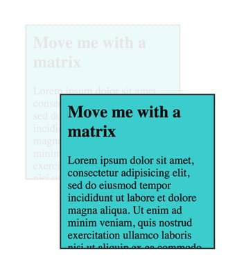
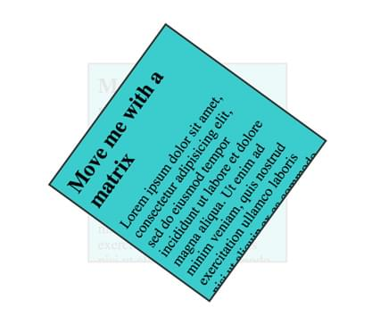
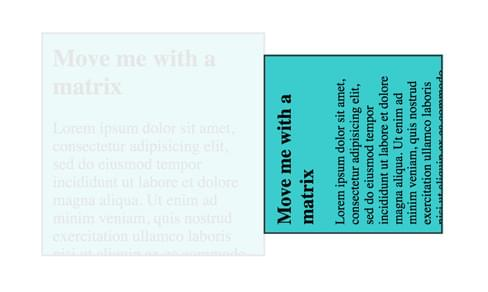

{{WebGLSidebar}}

Matrices can be used to represent transformations of objects in space, and are used for performing many key types of computation when constructing images and visualizing data on the Web. This article explores how to create matrices and how to use them with [CSS transforms](/en-US/docs/Web/CSS/CSS_Transforms/Using_CSS_transforms) and the `matrix3d` transform type.

While this article uses [CSS](/en-US/docs/Web/CSS) to simplify explanations, matrices are a core concept used by many different technologies including [WebGL](/en-US/docs/Web/API/WebGL_API), the [WebXR](/en-US/docs/Web/API/WebXR_Device_API) (VR and AR) API, and [GLSL shaders](/en-US/docs/Games/Techniques/3D_on_the_web/GLSL_Shaders). This article is also available as an [MDN content kit](https://github.com/gregtatum/mdn-matrix-math). The live examples use a collection of [utility functions](https://github.com/gregtatum/mdn-webgl) available under a global object named `MDN`.

## Transformation matrices

There are many types of matrices, but the ones we are interested in are the 3D transformation matrices. These matrices consist of a set of 16 values arranged in a 4x4 grid. In [JavaScript](/en-US/docs/Web/JavaScript), it is easy to represent a matrix as an array.

Let's begin by considering the **identity matrix**. This is a special transformation matrix which functions much like the number 1 does in scalar multiplication; just like n \* 1 = n, multiplying any matrix by the identity matrix gives a resulting matrix whose values match the original matrix.

The identity matrix looks like this in JavaScript:

```js
let identityMatrix = [
  1, 0, 0, 0,
  0, 1, 0, 0,
  0, 0, 1, 0,
  0, 0, 0, 1
];
```

What does multiplying by the identity matrix look like? The easiest example is to multiply a single point by the identity matrix. Since a 3D point only needs three values (x, y, and z), and the transformation matrix is a 4x4 value matrix, we need to add a fourth dimension to the point. By convention, this dimension is called the **perspective**, and is represented by the letter w. For a typical position, setting w to 1 will make the math work out.

After adding the w component to the point, notice how neatly the matrix and the point line up:

```js
[1, 0, 0, 0,
 0, 1, 0, 0,
 0, 0, 1, 0,
 0, 0, 0, 1]

[4, 3, 2, 1]  // Point at [x, y, z, w]
```

The w component has some additional uses that are out of scope for this article. Check out the [WebGL model view projection](/en-US/docs/Web/API/WebGL_API/WebGL_model_view_projection) article for a look into how it comes in handy.

### Multiplying a matrix and a point

In our example code we have defined a function to multiply a matrix and a point — `multiplyMatrixAndPoint()`:

```js
// point • matrix
function multiplyMatrixAndPoint(matrix, point) {
  // Give a simple variable name to each part of the matrix, a column and row number
  let c0r0 = matrix[ 0], c1r0 = matrix[ 1], c2r0 = matrix[ 2], c3r0 = matrix[ 3];
  let c0r1 = matrix[ 4], c1r1 = matrix[ 5], c2r1 = matrix[ 6], c3r1 = matrix[ 7];
  let c0r2 = matrix[ 8], c1r2 = matrix[ 9], c2r2 = matrix[10], c3r2 = matrix[11];
  let c0r3 = matrix[12], c1r3 = matrix[13], c2r3 = matrix[14], c3r3 = matrix[15];

  // Now set some simple names for the point
  let x = point[0];
  let y = point[1];
  let z = point[2];
  let w = point[3];

  // Multiply the point against each part of the 1st column, then add together
  let resultX = (x * c0r0) + (y * c0r1) + (z * c0r2) + (w * c0r3);

  // Multiply the point against each part of the 2nd column, then add together
  let resultY = (x * c1r0) + (y * c1r1) + (z * c1r2) + (w * c1r3);

  // Multiply the point against each part of the 3rd column, then add together
  let resultZ = (x * c2r0) + (y * c2r1) + (z * c2r2) + (w * c2r3);

  // Multiply the point against each part of the 4th column, then add together
  let resultW = (x * c3r0) + (y * c3r1) + (z * c3r2) + (w * c3r3);

  return [resultX, resultY, resultZ, resultW];
}
```

Now using the function above we can multiply a point by the matrix. Using the identity matrix it should return a point identical to the original, since a point (or any other matrix) multiplied by the identity matrix is always equal to itself:

```js
// sets identityResult to [4,3,2,1]
let identityResult = multiplyMatrixAndPoint(identityMatrix, [4, 3, 2, 1]);
```

Returning the same point is not very useful, but there are other types of matrices that can perform helpful operations on points. The next sections will demonstrate some of these matrices.

### Multiplying two matrices

In addition to multiplying a matrix and a point together, you can also multiply two matrices together. The function from above can be re-used to help out in this process:

```js
//matrixB • matrixA
function multiplyMatrices(matrixA, matrixB) {
  // Slice the second matrix up into rows
  let row0 = [matrixB[ 0], matrixB[ 1], matrixB[ 2], matrixB[ 3]];
  let row1 = [matrixB[ 4], matrixB[ 5], matrixB[ 6], matrixB[ 7]];
  let row2 = [matrixB[ 8], matrixB[ 9], matrixB[10], matrixB[11]];
  let row3 = [matrixB[12], matrixB[13], matrixB[14], matrixB[15]];

  // Multiply each row by matrixA
  let result0 = multiplyMatrixAndPoint(matrixA, row0);
  let result1 = multiplyMatrixAndPoint(matrixA, row1);
  let result2 = multiplyMatrixAndPoint(matrixA, row2);
  let result3 = multiplyMatrixAndPoint(matrixA, row3);

  // Turn the result rows back into a single matrix
  return [
    result0[0], result0[1], result0[2], result0[3],
    result1[0], result1[1], result1[2], result1[3],
    result2[0], result2[1], result2[2], result2[3],
    result3[0], result3[1], result3[2], result3[3]
  ];
}
```

Let's look at this function in action:

```js
let someMatrix = [
  4, 0, 0, 0,
  0, 3, 0, 0,
  0, 0, 5, 0,
  4, 8, 4, 1
]

let identityMatrix = [
  1, 0, 0, 0,
  0, 1, 0, 0,
  0, 0, 1, 0,
  0, 0, 0, 1
];

// Returns a new array equivalent to someMatrix
let someMatrixResult = multiplyMatrices(identityMatrix, someMatrix);
```

> **Warning:** These matrix functions are written for clarity of explanation, not for speed or memory management. These functions create a lot of new arrays, which can be particularly expensive for real-time operations due to garbage collection. In real production code it would be best to use optimized functions. [glMatrix](https://glmatrix.net/) is an example of a library that has a focus on speed and performance. The focus in the glMatrix library is to have target arrays that are allocated before the update loop.

## Translation matrix

A **translation matrix** is based upon the identity matrix, and is used in 3D graphics to move a point or object in one or more of the three directions (x, y, and/or z). The easiest way to think of a translation is like picking up a coffee cup. The coffee cup must be kept upright and oriented the same way so that no coffee is spilled. It can move up in the air off the table and around the air in space.

You can't actually drink the coffee using only a translation matrix, because to drink it, you have to be able to tilt or rotate the cup to pour the coffee into your mouth. We'll look at the type of matrix (cleverly called a **[rotation matrix](#rotation_matrix)**) you use to do this later.

```js
let x = 50;
let y = 100;
let z = 0;

let translationMatrix = [
    1,    0,    0,   0,
    0,    1,    0,   0,
    0,    0,    1,   0,
    x,    y,    z,   1
];
```

Place the distances along the three axes in the corresponding positions in the translation matrix, then multiply it by the point or matrix you need to move through 3D space.

## Manipulating the DOM with a matrix

A really easy way to start using a matrix is to use the CSS {{cssxref("transform-function/matrix3d","matrix3d()")}} {{cssxref("transform")}}. First we'll set up a simple {{htmlelement("div")}} with some content. The style is not shown, but it's set to a fixed width and height and is centered on the page. The `<div>` has a transition set for the transform so that matrix is animated in making it easy to see what is being done.

```html
<div id='move-me' class='transformable'>
  <h2>Move me with a matrix</h2>
  <p>Lorem ipsum dolor sit amet, consectetur adipisicing elit…</p>
</div>
```

Finally, for each of the examples we will generate a 4x4 matrix, then update the `<div>`'s style to have a transform applied to it, set to a `matrix3d`. Bear in mind that even though the matrix is made up of 4 rows and 4 columns, it collapses into a single line of 16 values. Matrices are always stored in one-dimensional lists in JavaScript.

```js
// Create the matrix3d style property from a matrix array
function matrixArrayToCssMatrix(array) {
  return `matrix3d(${array.join(',')})`;
}

// Grab the DOM element
let moveMe = document.getElementById('move-me');

// Returns a result like: "matrix3d(1, 0, 0, 0, 0, 1, 0, 0, 0, 0, 1, 0, 50, 100, 0, 1);"
let matrix3dRule = matrixArrayToCssMatrix(translationMatrix);

// Set the transform
moveMe.style.transform = matrix3dRule;
```

[View on JSFiddle](https://jsfiddle.net/tatumcreative/g24mgw6y/)



## Scale matrix

A **scale matrix** makes something larger or smaller in one or more of the three dimensions: width, height, and depth. In typical (cartesian) coordinates. this causes stretching or contracting of the object in the corresponding directions.

The amount of change to apply to each of the width, height, and depth is placed diagonally starting at the top-left corner and making their way down toward the bottom-right.

```js
let w = 1.5; // width  (x)
let h = 0.7; // height (y)
let d = 1;   // depth  (z)

let scaleMatrix = [
    w,    0,    0,   0,
    0,    h,    0,   0,
    0,    0,    d,   0,
    0,    0,    0,   1
];
```

[View on JSFiddle](https://jsfiddle.net/tatumcreative/fndd6e1b/)


## Rotation matrix

A **rotation matrix** is used to rotate a point or object. Rotation matrices look a little bit more complicated than scaling and transform matrices. They use trigonometric functions to perform the rotation. While this section won't break the steps down into exhaustive detail (check out [this article on Wolfram MathWorld](https://mathworld.wolfram.com/RotationMatrix.html) for that), take this example for illustration.

First, here's code that rotates a point around the origin without using matrices.

```js
// Manually rotating a point about the origin without matrices
let point = [10, 2];

// Calculate the distance from the origin
let distance = Math.sqrt(point[0] * point[0] + point[1] * point[1]);

// The equivalent of 60 degrees, in radians
let rotationInRadians = Math.PI / 3;

let transformedPoint = [
  Math.cos(rotationInRadians) * distance,
  Math.sin(rotationInRadians) * distance
];
```

It is possible to encode these type of steps into a matrix, and do it for each of the x, y, and z dimensions. Below is the representation of a counterclockwise rotation about the Z axis in a left-handed coordinate system:

```js
let sin = Math.sin;
let cos = Math.cos;

// NOTE: There is no perspective in these transformations, so a rotation
//       at this point will only appear to only shrink the div

let a = Math.PI * 0.3; //Rotation amount in radians

// Rotate around Z axis
let rotateZMatrix = [
  cos(a), -sin(a),    0,    0,
  sin(a),  cos(a),    0,    0,
       0,       0,    1,    0,
       0,       0,    0,    1
];
```

[View on JSFiddle](https://jsfiddle.net/tatumcreative/9vr2dorz/)



Here are a set of functions that return rotation matrices for rotating around each of the three axes. One big note is that there is no perspective applied, so it might not feel very 3D yet. The flatness is equivalent to when a camera zooms in really close onto an object in the distance — the sense of perspective disappears.

```js
function rotateAroundXAxis(a) {
  return [
       1,       0,        0,     0,
       0,  cos(a),  -sin(a),     0,
       0,  sin(a),   cos(a),     0,
       0,       0,        0,     1
  ];
}

function rotateAroundYAxis(a) {
  return [
     cos(a),   0, sin(a),   0,
          0,   1,      0,   0,
    -sin(a),   0, cos(a),   0,
          0,   0,      0,   1
  ];
}

function rotateAroundZAxis(a) {
  return [
    cos(a), -sin(a),    0,    0,
    sin(a),  cos(a),    0,    0,
         0,       0,    1,    0,
         0,       0,    0,    1
  ];
}
```

[View on JSFiddle](https://jsfiddle.net/tatumcreative/tk072doc/)

## Matrix composition

The real power of matrices comes from **matrix composition**. When matrices of a certain class are multiplied together they preserve the history of the transformations and are reversible. This means that if a translation, rotation, and scale matrix are all combined together, when the order of the matrices is reversed and re-applied then the original points are returned.

The order that matrices are multiplied in matters. When multiplying numbers, a \* b = c, and b \* a = c are both true. For example 3 \* 4 = 12, and 4 \* 3 = 12. In math these numbers would be described as **commutative**. Matrices are _not_ guaranteed to be the same if the order is switched, so matrices are **non-commutative**.

Another mind-bender is that matrix multiplication in WebGL and CSS needs to happen in the reverse order that the operations intuitively happen. For instance, to scale something down by 80%, move it down 200 pixels, and then rotate about the origin 90 degrees would look something like the following in pseudo-code.

```plain
  transformation = rotate * translate * scale
```

### Composing multiple transformations

The function that we will be using to compose our matrices is `multiplyArrayOfMatrices()`, which is part of the set of [utility functions](https://github.com/gregtatum/mdn-webgl) introduced near the top of this article. It takes an array of matrices and multiplies them together, returning the result. In WebGL shader code, this is built into the language and the `*` operator can be used. Additionally this example uses `scale()` and `translate()` functions, which return matrices as defined above.

```js
let transformMatrix = MDN.multiplyArrayOfMatrices([
  rotateAroundZAxis(Math.PI * 0.5),    // Step 3: rotate around 90 degrees
  translate(0, 200, 0),                // Step 2: move down 100 pixels
  scale(0.8, 0.8, 0.8),                // Step 1: scale down
]);
```

[View on JSFiddle](https://jsfiddle.net/tatumcreative/qxxg3yvc/)



Finally, a fun step to show how matrices work is to reverse the steps to bring the matrix back to the original identity matrix.

```js
let transformMatrix = MDN.multiplyArrayOfMatrices([
  scale(1.25, 1.25, 1.25),             // Step 6: scale back up
  translate(0, -200, 0),               // Step 5: move back up
  rotateAroundZAxis(-Math.PI * 0.5),   // Step 4: rotate back
  rotateAroundZAxis(Math.PI * 0.5),    // Step 3: rotate around 90 degrees
  translate(0, 200, 0),                // Step 2: move down 100 pixels
  scale(0.8, 0.8, 0.8),                // Step 1: scale down
]);
```

## Why matrices are important

Matrices are important because they comprise a small set of numbers that can describe a wide range of transformations in space. They can easily be shared around in programs. Different coordinate spaces can be described with matrices, and some matrix multiplication will move one set of data from one coordinate space to another coordinate space. Matrices effectively remember every part of the previous transforms that were used to generate them.

For uses in WebGL, the graphics card is particularly good at multiplying a large number of points in space by matrices. Different operations like positioning points, calculating lighting, and posing animated characters all rely on this fundamental tool.
