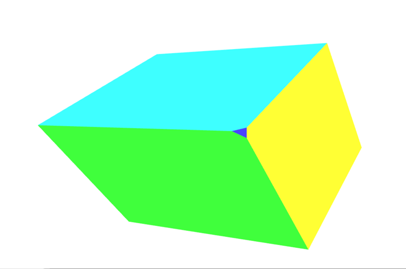

{{DefaultAPISidebar("WebGL")}}

This article explores how to take data within a [WebGL](/en-US/docs/Web/API/WebGL_API) project, and project it into the proper spaces to display it on the screen. It assumes a knowledge of basic matrix math using translation, scale, and rotation matrices. It explains the three core matrices that are typically used when composing a 3D scene: the model, view and projection matrices.

## The model, view, and projection matrices

Individual transformations of points and polygons in space in WebGL are handled by the basic transformation matrices like translation, scale, and rotation. These matrices can be composed together and grouped in special ways to make them useful for rendering complicated 3D scenes. These composed matrices ultimately move the original model data around into a special coordinate space called **clip space**. This is a 2 unit wide cube, centered at (0,0,0), and with corners that range from (-1,-1,-1) to (1,1,1). This clip space is compressed down into a 2D space and rasterized into an image.

The first matrix discussed below is the **model matrix**, which defines how you take your original model data and move it around in 3D world space. The **projection matrix** is used to convert world space coordinates into clip space coordinates. A commonly used projection matrix, the **perspective projection matrix**, is used to mimic the _effects_ of a typical camera serving as the stand-in for the viewer in the 3D virtual world. The **view matrix** is responsible for moving the objects in the scene to simulate the position of the camera being changed, altering what the viewer is currently able to see.

The sections below offer an in-depth look into the ideas behind and implementation of the model, view, and projection matrices. These matrices are core to moving data around on the screen, and are concepts that transcend individual frameworks and engines.

## Clip space

In a WebGL program, data is typically uploaded to the GPU with its own coordinate system and then the vertex shader transforms those points into a special coordinate system known as **clip space**. Any data which extends outside of the clip space is clipped off and not rendered. However, if a triangle straddles the border of this space then it is chopped up into new triangles, and only the parts of the new triangles that are in clip space are kept.


The above graphic is a visualization of the clip space that all of the points must fit into. It is a cube two units on each side, with one corner at (-1,-1,-1) and the opposite corner at (1,1,1). The center of the cube is the point (0,0,0). This 8 cubic meter coordinate system used by clip space is known as normalized device coordinates (NDC). You may encounter that term from time to time while researching and working with WebGL code.

For this section we will put our data into the clip space coordinate system directly. Normally model data is used that is in some arbitrary coordinate system, and is then transformed using a matrix, converting the model coordinates into the clip space coordinate system. For this example, it's easiest to illustrate how clip space works by using model coordinate values ranging from (-1,-1,-1) to (1,1,1). The code below will create 2 triangles that will draw a square on the screen. The Z depth in the squares determines what gets drawn on top when the squares share the same space. The smaller Z values are rendered on top of the larger Z values.

<!-- Shared setup -->

```html hidden live-sample___clip_space_ex live-sample___homogenous_coordinates_ex live-sample___model_transform_ex live-sample___divide_by_w_ex live-sample___simple_projection_ex live-sample___projection_matrix_ex live-sample___view_matrix_ex
<canvas id="canvas" width="1000" height="1000"></canvas>
```

```css hidden live-sample___clip_space_ex live-sample___homogenous_coordinates_ex live-sample___model_transform_ex live-sample___divide_by_w_ex live-sample___simple_projection_ex live-sample___projection_matrix_ex live-sample___view_matrix_ex
html,
body {
  width: 100%;
  height: 100%;
  margin: 0;
  overflow: hidden;
}
canvas {
  width: 100% !important;
  height: 100% !important;
}
svg {
  width: 100%;
  height: 100%;
  position: absolute;
  top: 0;
  left: 0;
}
```

```js hidden live-sample___clip_space_ex live-sample___homogenous_coordinates_ex live-sample___model_transform_ex live-sample___divide_by_w_ex live-sample___simple_projection_ex live-sample___projection_matrix_ex live-sample___view_matrix_ex
function createShader(gl, source, type) {
  // Compiles either a shader of type gl.VERTEX_SHADER or gl.FRAGMENT_SHADER
  const shader = gl.createShader(type);
  gl.shaderSource(shader, source);
  gl.compileShader(shader);

  if (!gl.getShaderParameter(shader, gl.COMPILE_STATUS)) {
    const info = gl.getShaderInfoLog(shader);
    throw new Error(`Could not compile WebGL program.\n\n${info}`);
  }

  return shader;
}

function linkProgram(gl, vertexShader, fragmentShader) {
  const program = gl.createProgram();
  gl.attachShader(program, vertexShader);
  gl.attachShader(program, fragmentShader);
  gl.linkProgram(program);

  if (!gl.getProgramParameter(program, gl.LINK_STATUS)) {
    const info = gl.getProgramInfoLog(program);
    throw new Error(`Could not compile WebGL program.\n\n${info}`);
  }

  return program;
}

function createWebGLProgram(gl, vertexSource, fragmentSource) {
  // Combines createShader() and linkProgram()
  const vertexShader = createShader(gl, vertexSource, gl.VERTEX_SHADER);
  const fragmentShader = createShader(gl, fragmentSource, gl.FRAGMENT_SHADER);
  return linkProgram(gl, vertexShader, fragmentShader);
}

function createWebGLProgramFromIds(gl, vertexSourceId, fragmentSourceId) {
  const vertexSourceEl = document.getElementById(vertexSourceId);
  const fragmentSourceEl = document.getElementById(fragmentSourceId);

  return createWebGLProgram(
    gl,
    vertexSourceEl.innerHTML,
    fragmentSourceEl.innerHTML,
  );
}
```

```js hidden live-sample___model_transform_ex live-sample___divide_by_w_ex live-sample___simple_projection_ex live-sample___projection_matrix_ex live-sample___view_matrix_ex
// Functions below are copied from Matrix_math_for_the_web
// point • matrix
function multiplyMatrixAndPoint(matrix, point) {
  // Give a simple variable name to each part of the matrix, a column and row number
  const c0r0 = matrix[0],
    c1r0 = matrix[1],
    c2r0 = matrix[2],
    c3r0 = matrix[3];
  const c0r1 = matrix[4],
    c1r1 = matrix[5],
    c2r1 = matrix[6],
    c3r1 = matrix[7];
  const c0r2 = matrix[8],
    c1r2 = matrix[9],
    c2r2 = matrix[10],
    c3r2 = matrix[11];
  const c0r3 = matrix[12],
    c1r3 = matrix[13],
    c2r3 = matrix[14],
    c3r3 = matrix[15];

  // Now set some simple names for the point
  const x = point[0];
  const y = point[1];
  const z = point[2];
  const w = point[3];

  // Multiply the point against each part of the 1st column, then add together
  const resultX = x * c0r0 + y * c0r1 + z * c0r2 + w * c0r3;

  // Multiply the point against each part of the 2nd column, then add together
  const resultY = x * c1r0 + y * c1r1 + z * c1r2 + w * c1r3;

  // Multiply the point against each part of the 3rd column, then add together
  const resultZ = x * c2r0 + y * c2r1 + z * c2r2 + w * c2r3;

  // Multiply the point against each part of the 4th column, then add together
  const resultW = x * c3r0 + y * c3r1 + z * c3r2 + w * c3r3;

  return [resultX, resultY, resultZ, resultW];
}

// matrixB • matrixA
function multiplyMatrices(matrixA, matrixB) {
  // Slice the second matrix up into rows
  const row0 = [matrixB[0], matrixB[1], matrixB[2], matrixB[3]];
  const row1 = [matrixB[4], matrixB[5], matrixB[6], matrixB[7]];
  const row2 = [matrixB[8], matrixB[9], matrixB[10], matrixB[11]];
  const row3 = [matrixB[12], matrixB[13], matrixB[14], matrixB[15]];

  // Multiply each row by matrixA
  const result0 = multiplyMatrixAndPoint(matrixA, row0);
  const result1 = multiplyMatrixAndPoint(matrixA, row1);
  const result2 = multiplyMatrixAndPoint(matrixA, row2);
  const result3 = multiplyMatrixAndPoint(matrixA, row3);

  // Turn the result rows back into a single matrix
  // prettier-ignore
  return [
    result0[0], result0[1], result0[2], result0[3],
    result1[0], result1[1], result1[2], result1[3],
    result2[0], result2[1], result2[2], result2[3],
    result3[0], result3[1], result3[2], result3[3],
  ];
}

function multiplyArrayOfMatrices(matrices) {
  if (matrices.length === 1) {
    return matrices[0];
  }
  return matrices.reduce((result, matrix) => multiplyMatrices(result, matrix));
}

function translate(x, y, z) {
  // prettier-ignore
  return [
    1, 0, 0, 0,
    0, 1, 0, 0,
    0, 0, 1, 0,
    x, y, z, 1,
  ];
}

function scale(x, y, z) {
  // prettier-ignore
  return [
    x, 0, 0, 0,
    0, y, 0, 0,
    0, 0, z, 0,
    0, 0, 0, 1,
  ];
}

const sin = Math.sin;
const cos = Math.cos;

function rotateX(a) {
  // prettier-ignore
  return [
    1, 0, 0, 0,
    0, cos(a), -sin(a), 0,
    0, sin(a), cos(a), 0,
    0, 0, 0, 1,
  ];
}

function rotateY(a) {
  // prettier-ignore
  return [
    cos(a), 0, sin(a), 0,
    0, 1, 0, 0,
    -sin(a), 0, cos(a), 0,
    0, 0, 0, 1,
  ];
}

function rotateZ(a) {
  // prettier-ignore
  return [
    cos(a), -sin(a), 0, 0,
    sin(a), cos(a), 0, 0,
    0, 0, 1, 0,
    0, 0, 0, 1,
  ];
}

// Define the data that is needed to make a 3d cube
function createCubeData() {
  // prettier-ignore
  const positions = [
    // Front face
    -1.0, -1.0, 1.0, 1.0, -1.0, 1.0, 1.0, 1.0, 1.0, -1.0, 1.0, 1.0,
    // Back face
    -1.0, -1.0, -1.0, -1.0, 1.0, -1.0, 1.0, 1.0, -1.0, 1.0, -1.0, -1.0,
    // Top face
    -1.0, 1.0, -1.0, -1.0, 1.0, 1.0, 1.0, 1.0, 1.0, 1.0, 1.0, -1.0,
    // Bottom face
    -1.0, -1.0, -1.0, 1.0, -1.0, -1.0, 1.0, -1.0, 1.0, -1.0, -1.0, 1.0,
    // Right face
    1.0, -1.0, -1.0, 1.0, 1.0, -1.0, 1.0, 1.0, 1.0, 1.0, -1.0, 1.0,
    // Left face
    -1.0, -1.0, -1.0, -1.0, -1.0, 1.0, -1.0, 1.0, 1.0, -1.0, 1.0, -1.0,
  ];

  // prettier-ignore
  const colorsOfFaces = [
    [0.3, 1.0, 1.0, 1.0],    // Front face: cyan
    [1.0, 0.3, 0.3, 1.0],    // Back face: red
    [0.3, 1.0, 0.3, 1.0],    // Top face: green
    [0.3, 0.3, 1.0, 1.0],    // Bottom face: blue
    [1.0, 1.0, 0.3, 1.0],    // Right face: yellow
    [1.0, 0.3, 1.0, 1.0]     // Left face: purple
  ];

  let colors = [];

  for (const polygonColor of colorsOfFaces) {
    for (let i = 0; i < 4; i++) {
      colors = colors.concat(polygonColor);
    }
  }

  // prettier-ignore
  const elements = [
    0,  1,  2,   0,  2,  3,    // front
    4,  5,  6,   4,  6,  7,    // back
    8,  9,  10,  8,  10, 11,   // top
    12, 13, 14,  12, 14, 15,   // bottom
    16, 17, 18,  16, 18, 19,   // right
    20, 21, 22,  20, 22, 23,   // left
  ];

  return { positions, elements, colors };
}

// Take the data for a cube and bind the buffers for it.
// Return an object collection of the buffers
function createBuffersForCube(gl, cube) {
  const positions = gl.createBuffer();
  gl.bindBuffer(gl.ARRAY_BUFFER, positions);
  gl.bufferData(
    gl.ARRAY_BUFFER,
    new Float32Array(cube.positions),
    gl.STATIC_DRAW,
  );

  const colors = gl.createBuffer();
  gl.bindBuffer(gl.ARRAY_BUFFER, colors);
  gl.bufferData(gl.ARRAY_BUFFER, new Float32Array(cube.colors), gl.STATIC_DRAW);

  const elements = gl.createBuffer();
  gl.bindBuffer(gl.ELEMENT_ARRAY_BUFFER, elements);
  gl.bufferData(
    gl.ELEMENT_ARRAY_BUFFER,
    new Uint16Array(cube.elements),
    gl.STATIC_DRAW,
  );

  return { positions, elements, colors };
}
```

### WebGLBox example

This example will create a custom `WebGLBox` object that will draw a 2D box on the screen. It is implemented as a class, which contains a constructor and a `draw()` method to draw a box on the screen:

```js live-sample___clip_space_ex
class WebGLBox {
  canvas = document.getElementById("canvas");
  gl = this.canvas.getContext("webgl");
  webglProgram = createWebGLProgramFromIds(
    this.gl,
    "vertex-shader",
    "fragment-shader",
  );
  positionLocation;
  colorLocation;
  constructor() {
    const gl = this.gl;

    // Setup a WebGL program
    gl.useProgram(this.webglProgram);

    // Save the attribute and uniform locations
    this.positionLocation = gl.getAttribLocation(this.webglProgram, "position");
    this.colorLocation = gl.getUniformLocation(this.webglProgram, "vColor");

    // Tell WebGL to test the depth when drawing, so if a square is behind
    // another square it won't be drawn
    gl.enable(gl.DEPTH_TEST);
  }
  draw(settings) {
    // Create some attribute data; these are the triangles that will end being
    // drawn to the screen. There are two that form a square.

    // prettier-ignore
    const data = new Float32Array([
      // Triangle 1
      settings.left, settings.bottom, settings.depth,
      settings.right, settings.bottom, settings.depth,
      settings.left, settings.top, settings.depth,

      // Triangle 2
      settings.left, settings.top, settings.depth,
      settings.right, settings.bottom, settings.depth,
      settings.right, settings.top, settings.depth,
    ]);

    // Use WebGL to draw this onto the screen.

    // Performance Note: Creating a new array buffer for every draw call is slow.
    // This function is for illustration purposes only.

    const gl = this.gl;

    // Create a buffer and bind the data
    const buffer = gl.createBuffer();
    gl.bindBuffer(gl.ARRAY_BUFFER, buffer);
    gl.bufferData(gl.ARRAY_BUFFER, data, gl.STATIC_DRAW);

    // Setup the pointer to our attribute data (the triangles)
    gl.enableVertexAttribArray(this.positionLocation);
    gl.vertexAttribPointer(this.positionLocation, 3, gl.FLOAT, false, 0, 0);

    // Setup the color uniform that will be shared across all triangles
    gl.uniform4fv(this.colorLocation, settings.color);

    // Draw the triangles to the screen
    gl.drawArrays(gl.TRIANGLES, 0, 6);
  }
}
```

The shaders are the bits of code written in GLSL that take our data points and ultimately render them to the screen. For convenience, these shaders are stored in a {{htmlelement("script")}} element that is brought into the program through the custom function `createWebGLProgramFromIds()`. This function handles the basics of taking some GLSL source code and compiling it into a WebGL program. It takes three parameters — the context to render the program in, the ID of the {{htmlelement("script")}} element containing the vertex shader, and the ID of the {{htmlelement("script")}} element containing the fragment shader. This function is not explained in depth here; if you want to see its implementation, click "Play" on the code block. The vertex shader positions the vertices, and the fragment shader colors each pixel.

First take a look at the vertex shader that will move the vertices on the screen:

```glsl
// The individual position vertex
attribute vec3 position;

void main() {
  // the gl_Position is the final position in clip space after the vertex shader modifies it
  gl_Position = vec4(position, 1.0);
}
```

```html hidden live-sample___clip_space_ex
<script id="vertex-shader" type="x-shader/x-vertex">
  // The individual position vertex
  attribute vec3 position;

  void main() {
    // the gl_Position is the final position in clip space after the vertex shader modifies it
    gl_Position = vec4(position, 1.0);
  }
</script>
```

Next, to actually rasterize the data into pixels, the fragment shader evaluates everything on a per pixel basis, setting a single color. The GPU calls the shader function for each pixel it needs to render; the shader's job is to return the color to use for that pixel.

```glsl
precision mediump float;
uniform vec4 vColor;

void main() {
  gl_FragColor = vColor;
}
```

```html hidden live-sample___clip_space_ex live-sample___homogenous_coordinates_ex
<script id="fragment-shader" type="x-shader/x-fragment">
  precision mediump float;
  uniform vec4 vColor;

  void main() {
    gl_FragColor = vColor;
  }
</script>
```

With those settings included, it's time to directly draw to the screen using clip space coordinates.

```js live-sample___clip_space_ex
const box = new WebGLBox();
```

First draw a red box in the middle.

```js live-sample___clip_space_ex
box.draw({
  top: 0.5, // x
  bottom: -0.5, // x
  left: -0.5, // y
  right: 0.5, // y

  depth: 0, // z
  color: [1, 0.4, 0.4, 1], // red
});
```

Next, draw a green box up top and behind the red box.

```js live-sample___clip_space_ex
box.draw({
  top: 0.9, // x
  bottom: 0, // x
  left: -0.9, // y
  right: 0.9, // y

  depth: 0.5, // z
  color: [0.4, 1, 0.4, 1], // green
});
```

Finally, for demonstration that clipping is actually going on, this box doesn't get drawn because it's entirely outside of clip space. The depth is outside of the -1.0 to 1.0 range.

```js live-sample___clip_space_ex
box.draw({
  top: 1, // x
  bottom: -1, // x
  left: -1, // y
  right: 1, // y

  depth: -1.5, // z
  color: [0.4, 0.4, 1, 1], // blue
});
```

#### The results

```html hidden live-sample___clip_space_ex live-sample___homogenous_coordinates_ex
<!-- The SVG overlay showing clip space -->
<svg
  id="clip-space-axis"
  xmlns="http://www.w3.org/2000/svg"
  viewBox="0 0 500 500"
  preserveAspectRatio="none"></svg>

<!-- Use a separate SVG for text to avoid scaling -->
<svg id="clip-space-text" xmlns="http://www.w3.org/2000/svg"></svg>
```

```js hidden live-sample___clip_space_ex live-sample___homogenous_coordinates_ex
const axisOverlay = document.getElementById("clip-space-axis");
const xAxis = document.createElementNS("http://www.w3.org/2000/svg", "path");
const yAxis = document.createElementNS("http://www.w3.org/2000/svg", "path");
yAxis.setAttribute("fill", "none");
yAxis.setAttribute("stroke", "black");
xAxis.setAttribute("fill", "none");
xAxis.setAttribute("stroke", "black");
let yAxisPath = "M 249.5 0 L 249.5 500";
let xAxisPath = "M 0 250.5 L 500 250.5";
for (let i = -10; i <= 10; i++) {
  if (i === 0) continue;
  const length = i % 5 === 0 ? 24 : 12;
  const loc = 250 + i * 25 - 0.5;
  yAxisPath += ` M 249.5 ${loc} L ${249.5 + length} ${loc}`;
  xAxisPath += ` M ${loc} 250.5 L ${loc} ${250.5 - length}`;
}
xAxis.setAttribute("d", xAxisPath);
yAxis.setAttribute("d", yAxisPath);
axisOverlay.appendChild(xAxis);
axisOverlay.appendChild(yAxis);

const textOverlay = document.getElementById("clip-space-text");
for (const label of ["+X", "-X", "+Y", "-Y"]) {
  const textEl = document.createElementNS("http://www.w3.org/2000/svg", "text");
  let x, y;
  if (label === "+X") {
    [x, y] = ["97.5%", "53%"];
  } else if (label === "-X") {
    [x, y] = ["2.5%", "53%"];
  } else if (label === "+Y") {
    [x, y] = ["47%", "2.5%"];
  } else if (label === "-Y") {
    [x, y] = ["47%", "97.5%"];
  }
  textEl.setAttribute("x", x);
  textEl.setAttribute("y", y);
  textEl.setAttribute("text-anchor", "middle");
  textEl.setAttribute("font-family", "'Courier New'");
  textEl.setAttribute("font-size", "16");
  textEl.setAttribute("font-weight", "bold");
  textEl.textContent = label;
  textOverlay.appendChild(textEl);
}
for (let i = -1; i <= 1; i += 0.5) {
  if (i === 0) continue;
  const textEl = document.createElementNS("http://www.w3.org/2000/svg", "text");
  textEl.setAttribute("x", "58%");
  textEl.setAttribute("y", `${50 - i * 48}%`);
  textEl.setAttribute("text-anchor", "end");
  textEl.setAttribute("font-family", "'Courier New'");
  textEl.setAttribute("font-size", "11");
  textEl.textContent = i.toFixed(1);
  textOverlay.appendChild(textEl);
  const textEl2 = document.createElementNS(
    "http://www.w3.org/2000/svg",
    "text",
  );
  textEl2.setAttribute("x", `${50 + i * 50}%`);
  textEl2.setAttribute("y", "45%");
  textEl2.setAttribute("text-anchor", i > 0 ? "end" : "start");
  textEl2.setAttribute("font-family", "'Courier New'");
  textEl2.setAttribute("font-size", "11");
  textEl2.textContent = i.toFixed(1);
  textOverlay.appendChild(textEl2);
}
```

{{EmbedLiveSample("clip_space_ex", "", 600)}}

#### Exercise

A helpful exercise at this point is to move the boxes around the clip space by varying the code to get a feel for how points get clipped and moved around in clip space. Try drawing a picture like a boxy smiley face with a background.

## Homogeneous coordinates

The main line of the previous clip space vertex shader contained this code:

```glsl
gl_Position = vec4(position, 1.0);
```

The `position` variable was defined in the `draw()` method and passed in as an attribute to the shader. This is a three dimensional point, but the `gl_Position` variable that ends up getting passed down through the pipeline is actually 4 dimensional — instead of `(x, y, z)` it is `(x, y, z, w)`. There is no letter after `z`, so by convention this fourth dimension is labeled `w`. In the above example the `w` coordinate is set to 1.0.

The obvious question is "why the extra dimension?" It turns out that this addition allows for lots of nice techniques for manipulating 3D data. This added dimension introduces the notion of perspective into the coordinate system; with it in place, we can map 3D coordinates into 2D space—thereby allowing two parallel lines to intersect as they recede into the distance. The value of `w` is used as a divisor for the other components of the coordinate, so that the true values of `x`, `y`, and `z` are computed as `x/w`, `y/w`, and `z/w` (and `w` is then also `w/w`, becoming 1).

A three dimensional point is defined in a typical Cartesian coordinate system. The added fourth dimension changes this point into a [homogeneous coordinate](https://en.wikipedia.org/wiki/Homogeneous_coordinates). It still represents a point in 3D space and it can easily be demonstrated how to construct this type of coordinate through a pair of simple functions.

```js
function cartesianToHomogeneous(point) {
  let x = point[0];
  let y = point[1];
  let z = point[2];

  return [x, y, z, 1];
}

function homogeneousToCartesian(point) {
  let x = point[0];
  let y = point[1];
  let z = point[2];
  let w = point[3];

  return [x / w, y / w, z / w];
}
```

As previously mentioned and shown in the functions above, the w component divides the x, y, and z components. When the w component is a non-zero real number then homogeneous coordinate easily translates back into a normal point in Cartesian space. Now what happens if the w component is zero? In JavaScript the value returned would be as follows.

```js
homogeneousToCartesian([10, 4, 5, 0]);
```

This evaluates to: `[Infinity, Infinity, Infinity]`.

This homogeneous coordinate represents some point at infinity. This is a handy way to represent a ray shooting off from the origin in a specific direction. In addition to a ray, it could also be thought of as a representation of a directional vector. If this homogeneous coordinate is multiplied against a matrix with a translation then the translation is effectively stripped out.

When numbers are extremely large (or extremely small) on computers they begin to become less and less precise because there are only so many ones and zeros that are used to represent them. The more operations that are done on larger numbers, the more and more errors accumulate into the result. When dividing by w, this can effectively increase the precision of very large numbers by operating on two potentially smaller, less error-prone numbers.

The final benefit of using homogeneous coordinates is that they fit very nicely for multiplying against 4x4 matrices. A vertex must match at least one of the dimensions of a matrix in order to be multiplied against it. The 4x4 matrix can be used to encode a variety of useful transformations. In fact, the typical perspective projection matrix uses the division by the w component to achieve its transformation.

The clipping of points and polygons from clip space happens before the homogeneous coordinates have been transformed back into Cartesian coordinates (by dividing by w). This final space is known as **normalized device coordinates** or NDC.

To start playing with this idea the previous example can be modified to allow for the use of the `w` component. Apart from modifying `data`, also remember to change `vertexAttribPointer()` to use 4 components (the second `size` parameter) instead of 3.

```js
// Redefine the triangles to use the W component
// prettier-ignore
const data = new Float32Array([
  // Triangle 1
  settings.left, settings.bottom, settings.depth, settings.w,
  settings.right, settings.bottom, settings.depth, settings.w,
  settings.left, settings.top, settings.depth, settings.w,

  // Triangle 2
  settings.left, settings.top, settings.depth, settings.w,
  settings.right, settings.bottom, settings.depth, settings.w,
  settings.right, settings.top, settings.depth, settings.w,
]);
```

```js hidden live-sample___homogenous_coordinates_ex
class WebGLBox {
  canvas = document.getElementById("canvas");
  gl = this.canvas.getContext("webgl");
  webglProgram = createWebGLProgramFromIds(
    this.gl,
    "vertex-shader",
    "fragment-shader",
  );
  positionLocation;
  colorLocation;
  constructor() {
    const gl = this.gl;

    // Setup a WebGL program
    gl.useProgram(this.webglProgram);

    // Save the attribute and uniform locations
    this.positionLocation = gl.getAttribLocation(this.webglProgram, "position");
    this.colorLocation = gl.getUniformLocation(this.webglProgram, "vColor");

    // Tell WebGL to test the depth when drawing, so if a square is behind
    // another square it won't be drawn
    gl.enable(gl.DEPTH_TEST);
  }
  draw(settings) {
    // Create some attribute data; these are the triangles that will end being
    // drawn to the screen. There are two that form a square.

    // prettier-ignore
    const data = new Float32Array([
      // Triangle 1
      settings.left, settings.bottom, settings.depth, settings.w,
      settings.right, settings.bottom, settings.depth, settings.w,
      settings.left, settings.top, settings.depth, settings.w,

      // Triangle 2
      settings.left, settings.top, settings.depth, settings.w,
      settings.right, settings.bottom, settings.depth, settings.w,
      settings.right, settings.top, settings.depth, settings.w,
    ]);

    // Use WebGL to draw this onto the screen.

    // Performance Note: Creating a new array buffer for every draw call is slow.
    // This function is for illustration purposes only.

    const gl = this.gl;

    // Create a buffer and bind the data
    const buffer = gl.createBuffer();
    gl.bindBuffer(gl.ARRAY_BUFFER, buffer);
    gl.bufferData(gl.ARRAY_BUFFER, data, gl.STATIC_DRAW);

    // Setup the pointer to our attribute data (the triangles)
    gl.enableVertexAttribArray(this.positionLocation);
    gl.vertexAttribPointer(this.positionLocation, 4, gl.FLOAT, false, 0, 0);

    // Setup the color uniform that will be shared across all triangles
    gl.uniform4fv(this.colorLocation, settings.color);

    // Draw the triangles to the screen
    gl.drawArrays(gl.TRIANGLES, 0, 6);
  }
}

const box = new WebGLBox();
```

Then the vertex shader uses the 4 dimensional point passed in.

```glsl
attribute vec4 position;

void main() {
  gl_Position = position;
}
```

```html hidden live-sample___homogenous_coordinates_ex
<script id="vertex-shader" type="x-shader/x-vertex">
  attribute vec4 position;

  void main() {
    gl_Position = position;
  }
</script>
```

First, we draw a red box in the middle, but set W to 0.7. As the coordinates get divided by 0.7 they will all be enlarged.

```js live-sample___homogenous_coordinates_ex
box.draw({
  top: 0.5, // y
  bottom: -0.5, // y
  left: -0.5, // x
  right: 0.5, // x
  w: 0.7, // w - enlarge this box

  depth: 0, // z
  color: [1, 0.4, 0.4, 1], // red
});
```

Now, we draw a green box up top, but shrink it by setting the w component to 1.1

```js live-sample___homogenous_coordinates_ex
box.draw({
  top: 0.9, // y
  bottom: 0, // y
  left: -0.9, // x
  right: 0.9, // x
  w: 1.1, // w - shrink this box

  depth: 0.5, // z
  color: [0.4, 1, 0.4, 1], // green
});
```

This last box doesn't get drawn because it's outside of clip space. The depth is outside of the -1.0 to 1.0 range.

```js live-sample___homogenous_coordinates_ex
box.draw({
  top: 1, // y
  bottom: -1, // y
  left: -1, // x
  right: 1, // x
  w: 1.5, // w - Bring this box into range

  depth: -1.5, // z
  color: [0.4, 0.4, 1, 1], // blue
});
```

### The results

{{EmbedLiveSample("homogenous_coordinates_ex", "", 600)}}

### Exercises

- Play around with these values to see how it affects what is rendered on the screen. Note how the previously clipped blue box is brought back into range by setting its w component.
- Try creating a new box that is outside of clip space and bring it back in by dividing by w.

## Model transform

Placing points directly into clip space is of limited use. In real-world applications, you don't have all your source coordinates already in clip space coordinates. So most of the time, you need to transform the model data and other coordinates into clip space. The humble cube is an easy example of how to do this. Cube data consists of vertex positions, the colors of the faces of the cube, and the order of the vertex positions that make up the individual polygons (in groups of 3 vertices to construct the triangles composing the cube's faces). The positions and colors are stored in GL buffers, sent to the shader as attributes, and then operated upon individually.

Finally a single model matrix is computed and set. This matrix represents the transformations to be performed on every point making up the model in order to move it into the correct space, and to perform any other needed transforms on each point in the model. This applies not just to each vertex, but to every single point on every surface of the model as well.

In this case, for every frame of the animation a series of scale, rotation, and translation matrices move the data into the desired spot in clip space. The cube is the size of clip space (-1,-1,-1) to (1,1,1) so it will need to be shrunk down in order to not fill the entirety of clip space. This matrix is sent directly to the shader, having been multiplied in JavaScript beforehand.

The following code sample defines a method on the `CubeDemo` object that will create the model matrix. The new function looks like this (the utility functions are introduced in the [Matrix math for the web](/en-US/docs/Web/API/WebGL_API/Matrix_math_for_the_web) chapter):

```js
function computeModelMatrix(now) {
  // Scale down by 20%
  const scaleMatrix = scale(0.2, 0.2, 0.2);
  // Rotate a slight tilt
  const rotateXMatrix = rotateX(now * 0.0003);
  // Rotate according to time
  const rotateYMatrix = rotateY(now * 0.0005);
  // Move slightly down
  const translateMatrix = translate(0, -0.1, 0);
  // Multiply together, make sure and read them in opposite order
  this.transforms.model = multiplyArrayOfMatrices([
    translateMatrix, // step 4
    rotateYMatrix, // step 3
    rotateXMatrix, // step 2
    scaleMatrix, // step 1
  ]);
}
```

In order to use this in the shader it must be set to a uniform location. The locations for the uniforms are saved in the `locations` object shown below:

```js
this.locations.model = gl.getUniformLocation(webglProgram, "model");
```

And finally the uniform is set to that location. This hands off the matrix to the GPU.

```js
gl.uniformMatrix4fv(
  this.locations.model,
  false,
  new Float32Array(this.transforms.model),
);
```

```js hidden live-sample___model_transform_ex live-sample___divide_by_w_ex
class CubeDemo {
  canvas = document.getElementById("canvas");
  gl = this.canvas.getContext("webgl");
  webglProgram = createWebGLProgramFromIds(
    this.gl,
    "vertex-shader",
    "fragment-shader",
  );
  transforms = {}; // All of the matrix transforms
  locations = {}; // All of the shader locations
  buffers;

  constructor() {
    const gl = this.gl;
    gl.useProgram(this.webglProgram);
    this.buffers = createBuffersForCube(gl, createCubeData());

    // Save the attribute and uniform locations
    this.locations.model = gl.getUniformLocation(this.webglProgram, "model");
    this.locations.position = gl.getAttribLocation(
      this.webglProgram,
      "position",
    );
    this.locations.color = gl.getAttribLocation(this.webglProgram, "color");

    // Tell WebGL to test the depth when drawing
    gl.enable(gl.DEPTH_TEST);
  }

  computeModelMatrix(now) {
    // Scale down by 20%
    const scaleMatrix = scale(0.2, 0.2, 0.2);
    // Rotate a slight tilt
    const rotateXMatrix = rotateX(now * 0.0003);
    // Rotate according to time
    const rotateYMatrix = rotateY(now * 0.0005);
    // Move slightly down
    const translateMatrix = translate(0, -0.1, 0);
    // Multiply together, make sure and read them in opposite order
    this.transforms.model = multiplyArrayOfMatrices([
      translateMatrix, // step 4
      rotateYMatrix, // step 3
      rotateXMatrix, // step 2
      scaleMatrix, // step 1
    ]);

    // Performance caveat: in real production code it's best not to create
    // new arrays and objects in a loop. This example chooses code clarity
    // over performance.
  }

  draw() {
    const gl = this.gl;
    const now = Date.now();
    // Compute our matrices
    this.computeModelMatrix(now);
    // Update the data going to the GPU
    // Setup the color uniform that will be shared across all triangles
    gl.uniformMatrix4fv(
      this.locations.model,
      false,
      new Float32Array(this.transforms.model),
    );

    // Set the positions attribute
    gl.enableVertexAttribArray(this.locations.position);
    gl.bindBuffer(gl.ARRAY_BUFFER, this.buffers.positions);
    gl.vertexAttribPointer(this.locations.position, 3, gl.FLOAT, false, 0, 0);

    // Set the colors attribute
    gl.enableVertexAttribArray(this.locations.color);
    gl.bindBuffer(gl.ARRAY_BUFFER, this.buffers.colors);
    gl.vertexAttribPointer(this.locations.color, 4, gl.FLOAT, false, 0, 0);

    gl.bindBuffer(gl.ELEMENT_ARRAY_BUFFER, this.buffers.elements);
    // Perform the actual draw
    gl.drawElements(gl.TRIANGLES, 36, gl.UNSIGNED_SHORT, 0);
    // Run the draw as a loop
    requestAnimationFrame(() => this.draw());
  }
}

const cube = new CubeDemo();
cube.draw();
```

In the shader, each position vertex is first transformed into a homogeneous coordinate (a `vec4` object), and then multiplied against the model matrix.

```glsl
gl_Position = model * vec4(position, 1.0);
```

> [!NOTE]
> In JavaScript, matrix multiplication requires a custom function, while in the shader it is built into the language with the simple `*` operator.

The complete orchestration code is hidden. Again, if you are interested, click "Play" on a code block in this section to check it out.

```html hidden live-sample___model_transform_ex
<!-- The vertex shader operates on individual vertices in our model data by setting gl_Position -->
<script id="vertex-shader" type="x-shader/x-vertex">
  // Each point has a position and color
  attribute vec3 position;
  attribute vec4 color;

  // The transformation matrix
  uniform mat4 model;

  // Pass the color attribute down to the fragment shader
  varying vec4 vColor;

  void main() {
    // Pass the color down to the fragment shader
    vColor = color;
    gl_Position = model * vec4(position, 1.0);
  }
</script>
```

```html hidden live-sample___model_transform_ex live-sample___divide_by_w_ex live-sample___simple_projection_ex live-sample___projection_matrix_ex live-sample___view_matrix_ex
<!-- The fragment shader determines the color of the final pixel by setting gl_FragColor -->
<script id="fragment-shader" type="x-shader/x-fragment">
  precision mediump float;
  varying vec4 vColor;

  void main() {
    gl_FragColor = vColor;
  }
</script>
```

### The results

{{EmbedLiveSample("model_transform_ex", "", 600)}}

At this point the w value of the transformed point is still 1.0. The cube still doesn't have any perspective. The next section will take this setup and modify the w values to provide some perspective.

### Exercises

- Shrink down the box using the scale matrix and position it in different places within clip space.
- Try moving it outside of clip space.
- Resize the window and watch as the box skews out of shape.
- Add a `rotateZ` matrix.

## Divide by W

An easy way to start getting some perspective on our model of the cube is to take the Z coordinate and copy it over to the w coordinate. Normally when converting a cartesian point to homogeneous it becomes `(x,y,z,1)`, but we're going to set it to something like `(x,y,z,z)`. In reality we want to make sure that z is greater than 0 for points in view, so we'll modify it slightly by changing the value to `((1.0 + z) * scaleFactor)`. This will take a point that is normally in clip space (-1 to 1) and move it into a space more like (0 to 1) depending on what the scale factor is set to. The scale factor changes the final w value to be either higher or lower overall.

The shader code looks like this.

```glsl
// First transform the point
vec4 transformedPosition = model * vec4(position, 1.0);

// How much effect does the perspective have?
float scaleFactor = 0.5;

// Set w by taking the z value which is typically ranged -1 to 1, then scale
// it to be from 0 to some number, in this case 0-1.
float w = (1.0 + transformedPosition.z) * scaleFactor;

// Save the new gl_Position with the custom w component
gl_Position = vec4(transformedPosition.xyz, w);
```

```html hidden live-sample___divide_by_w_ex
<script id="vertex-shader" type="x-shader/x-vertex">
  // Each point has a position and color
  attribute vec3 position;
  attribute vec4 color;

  // The projection matrix
  uniform mat4 model;

  // Pass the color attribute down to the fragment shader
  varying vec4 vColor;

  void main() {
    // Pass the color down to the fragment shader
    vColor = color;

    // First transform the point
    vec4 transformedPosition = model * vec4(position, 1.0);

    // How much affect does the perspective have?
    float scaleFactor = 0.5;

    // Set w by taking the Z value which is typically ranged -1 to 1, then scale
    // it to be from 0 to some number, in this case 0-1.
    float w = (1.0 + transformedPosition.z) * scaleFactor;

    // Save the new gl_Position with the custom w component
    gl_Position = vec4(transformedPosition.xyz, w);
  }
</script>
```

### The results

{{EmbedLiveSample("divide_by_w_ex", "", 600)}}

See that little triangle on the corner facing the camera? Here's a screenshot of when it shows up:



That's an additional face added to our object because the rotation of our shape has caused that corner to extend outside clip space, thus causing the corner to be clipped away. See [Perspective projection matrix](#perspective_projection_matrix) below for an introduction to how to use more complex matrices to help control and prevent clipping.

### Exercise

If that sounds a little abstract, open up the vertex shader and play around with the scale factor and watch how it shrinks vertices more towards the surface. Completely change the w component values for really trippy representations of space.

In the next section we'll take this step of copying Z into the w slot and turn it into a matrix.

## Simple projection

The last step of filling in the w component can actually be accomplished with a simple matrix. Start with the identity matrix:

```js
// prettier-ignore
const identity = [
  1, 0, 0, 0,
  0, 1, 0, 0,
  0, 0, 1, 0,
  0, 0, 0, 1,
];

multiplyPoint(identity, [2, 3, 4, 1]);
// [2, 3, 4, 1]
```

Then move the last column's 1 up one space.

```js
// prettier-ignore
const copyZ = [
  1, 0, 0, 0,
  0, 1, 0, 0,
  0, 0, 1, 1,
  0, 0, 0, 0,
];

multiplyPoint(copyZ, [2, 3, 4, 1]);
// [2, 3, 4, 4]
```

However in the last example we performed `(z + 1) * scaleFactor`:

```js
const scaleFactor = 0.5;

// prettier-ignore
const simpleProjection = [
  1, 0, 0, 0,
  0, 1, 0, 0,
  0, 0, 1, scaleFactor,
  0, 0, 0, scaleFactor,
];

multiplyPoint(simpleProjection, [2, 3, 4, 1]);
// [2, 3, 4, 2.5]
```

Breaking it out a little further we can see how this works:

```js
const x = 2 * 1 + 3 * 0 + 4 * 0 + 1 * 0;
const y = 2 * 0 + 3 * 1 + 4 * 0 + 1 * 0;
const z = 2 * 0 + 3 * 0 + 4 * 1 + 1 * 0;
const w = 2 * 0 + 3 * 0 + 4 * scaleFactor + 1 * scaleFactor;
```

The last line could be simplified to:

```js
const w = 4 * scaleFactor + 1 * scaleFactor;
```

Then factoring out the scaleFactor, we get this:

```js
const w = (4 + 1) * scaleFactor;
```

Which is exactly the same as the `(z + 1) * scaleFactor` that we used in the previous example.

In the box demo, an additional `computeSimpleProjectionMatrix()` method is added. This is called in the `draw()` method and has the scale factor passed to it. The result should be identical to the last example:

```js
function computeSimpleProjectionMatrix(scaleFactor) {
  // prettier-ignore
  this.transforms.projection = [
    1, 0, 0, 0,
    0, 1, 0, 0,
    0, 0, 1, scaleFactor,
    0, 0, 0, scaleFactor,
  ];
}
```

```js hidden live-sample___simple_projection_ex
class CubeDemo {
  canvas = document.getElementById("canvas");
  gl = this.canvas.getContext("webgl");
  webglProgram = createWebGLProgramFromIds(
    this.gl,
    "vertex-shader",
    "fragment-shader",
  );
  transforms = {}; // All of the matrix transforms
  locations = {}; // All of the shader locations
  buffers;

  constructor() {
    const gl = this.gl;
    gl.useProgram(this.webglProgram);
    this.buffers = createBuffersForCube(gl, createCubeData());

    // Save the attribute and uniform locations
    this.locations.model = gl.getUniformLocation(this.webglProgram, "model");
    this.locations.projection = gl.getUniformLocation(
      this.webglProgram,
      "projection",
    );
    this.locations.position = gl.getAttribLocation(
      this.webglProgram,
      "position",
    );
    this.locations.color = gl.getAttribLocation(this.webglProgram, "color");

    // Tell WebGL to test the depth when drawing
    gl.enable(gl.DEPTH_TEST);
  }

  computeModelMatrix(now) {
    // Scale down by 20%
    const scaleMatrix = scale(0.2, 0.2, 0.2);
    // Rotate a slight tilt
    const rotateXMatrix = rotateX(now * 0.0003);
    // Rotate according to time
    const rotateYMatrix = rotateY(now * 0.0005);
    // Move slightly down
    const translateMatrix = translate(0, -0.1, 0);
    // Multiply together, make sure and read them in opposite order
    this.transforms.model = multiplyArrayOfMatrices([
      translateMatrix, // step 4
      rotateYMatrix, // step 3
      rotateXMatrix, // step 2
      scaleMatrix, // step 1
    ]);

    // Performance caveat: in real production code it's best not to create
    // new arrays and objects in a loop. This example chooses code clarity
    // over performance.
  }

  computeSimpleProjectionMatrix(scaleFactor) {
    // prettier-ignore
    this.transforms.projection = [
      1, 0, 0, 0,
      0, 1, 0, 0,
      0, 0, 1, scaleFactor, // Note the extra scale factor here
      0, 0, 0, scaleFactor,
    ];

    // This matrix copies the point and sets the W component to 1 + (z * scaleFactor)
  }

  draw() {
    const gl = this.gl;
    const now = Date.now();
    // Compute our matrices
    this.computeModelMatrix(now);
    this.computeSimpleProjectionMatrix(0.5);
    // Update the data going to the GPU
    // Setup the color uniform that will be shared across all triangles
    gl.uniformMatrix4fv(
      this.locations.model,
      false,
      new Float32Array(this.transforms.model),
    );
    gl.uniformMatrix4fv(
      this.locations.projection,
      false,
      new Float32Array(this.transforms.projection),
    );

    // Set the positions attribute
    gl.enableVertexAttribArray(this.locations.position);
    gl.bindBuffer(gl.ARRAY_BUFFER, this.buffers.positions);
    gl.vertexAttribPointer(this.locations.position, 3, gl.FLOAT, false, 0, 0);

    // Set the colors attribute
    gl.enableVertexAttribArray(this.locations.color);
    gl.bindBuffer(gl.ARRAY_BUFFER, this.buffers.colors);
    gl.vertexAttribPointer(this.locations.color, 4, gl.FLOAT, false, 0, 0);

    gl.bindBuffer(gl.ELEMENT_ARRAY_BUFFER, this.buffers.elements);
    // Perform the actual draw
    gl.drawElements(gl.TRIANGLES, 36, gl.UNSIGNED_SHORT, 0);
    // Run the draw as a loop
    requestAnimationFrame(() => this.draw());
  }
}

const cube = new CubeDemo();
cube.draw();
```

Although the result is identical, the important step here is in the vertex shader. Rather than modifying the vertex directly, it gets multiplied by an additional **[projection matrix](#the_model_view_and_projection_matrices)**, which (as the name suggests) projects 3D points onto a 2D drawing surface:

```glsl
// Make sure to read the transformations in reverse order
gl_Position = projection * model * vec4(position, 1.0);
```

```html hidden live-sample___simple_projection_ex live-sample___projection_matrix_ex
<!-- The vertex shader operates on individual vertices in our model data by setting gl_Position -->
<script id="vertex-shader" type="x-shader/x-vertex">
  // Each point has a position and color
  attribute vec3 position;
  attribute vec4 color;

  // The transformation matrices
  uniform mat4 model;
  uniform mat4 projection;

  // Pass the color attribute down to the fragment shader
  varying vec4 vColor;

  void main() {
    // Pass the color down to the fragment shader
    vColor = color;

    // Read the multiplication in reverse order, the original point is moved
    // into clip space, and then projected into a perspective view by filling
    // in the W component
    gl_Position = projection * model * vec4(position, 1.0);
  }
</script>
```

### The results

{{EmbedLiveSample("simple_projection_ex", "", 600)}}

## The viewing frustum

Before we move on to covering how to compute a perspective projection matrix, we need to introduce the concept of the **[viewing frustum](https://en.wikipedia.org/wiki/Viewing_frustum)** (also known as the **view frustum**). This is the region of space whose contents are visible to the user at the current time. It's the 3D region of space defined by the field of view and the distances specified as the nearest and farthest content that should be rendered.

While rendering, we need to determine which polygons need to be rendered in order to represent the scene. This is what the viewing frustum defines. But what's a frustum in the first place?

A [frustum](https://en.wikipedia.org/wiki/Frustum) is the 3D solid that results from taking any solid and slicing off two sections of it using two parallel planes. Consider our camera, which is viewing an area that starts immediately in front of its lens and extends off into the distance. The viewable area is a four-sided pyramid with its peak at the lens, its four sides corresponding to the extents of its peripheral vision range, and its base at the farthest distance it can see, like this:


If we used this to determine the polygons to be rendered each frame, our renderer would need to render every polygon within this pyramid, all the way off into infinity, including also polygons that are very close to the lens—likely too close to be useful (and certainly including things that are so close that a real human wouldn't be able to focus on them in the same setting).

So the first step in reducing the number of polygons we need to compute and render, we turn this pyramid into the viewing frustum. The two planes we'll use to chop away vertices in order to reduce the polygon count are the **near clipping plane** and the **far clipping plane**.

In WebGL, the near and far clipping planes are defined by specifying the distance from the lens to the closest point on a plane which is perpendicular to the viewing direction. Anything closer to the lens than the near clipping plane or farther from it than the far clipping plane is removed. This results in the viewing frustum, which looks like this:


The set of objects to be rendered for each frame is essentially created by starting with the set of all objects in the scene. Then any objects which are _entirely_ outside the viewing frustum are removed from the set. Next, objects which partially extrude outside the viewing frustum are clipped by dropping any polygons which are entirely outside the frustum, and by clipping the polygons which cross outside the frustum so that they no longer exit it.

Once that's been done, we have the largest set of polygons which are entirely within the viewing frustum. This list is usually further reduced using processes like [back-face culling](https://en.wikipedia.org/wiki/Back-face_culling) (removing polygons whose back side is facing the camera) and occlusion culling using [hidden-surface determination](https://en.wikipedia.org/wiki/Hidden-surface_determination) (removing polygons which can't be seen because they're entirely blocked by polygons that are closer to the lens).

## Perspective projection matrix

Up to this point, we've built up our own 3D rendering setup, step by step. However the current code as we've built it has some issues. For one, it gets skewed whenever we resize our window. Another is that our simple projection doesn't handle a wide range of values for the scene data. Most scenes don't work in clip space. It would be helpful to define what distance is relevant to the scene so that precision isn't lost in converting the numbers. Finally it's very helpful to have a fine-tuned control over what points get placed inside and outside of clip space. In the previous examples the corners of the cube occasionally get clipped.

The **perspective projection matrix** is a type of projection matrix that accomplishes all of these requirements. The math also starts to get a bit more involved and won't be fully explained in these examples. In short, it combines dividing by w (as done with the previous examples) with some ingenious manipulations based on [similar triangles](https://en.wikipedia.org/wiki/Similarity_%28geometry%29). If you want to read a full explanation of the math behind it check out some of the following links:

- [OpenGL Projection Matrix](https://www.songho.ca/opengl/gl_projectionmatrix.html)
- [Perspective Projection](https://ogldev.org/)
- [Trying to understand the math behind the perspective projection matrix in WebGL](https://stackoverflow.com/questions/28286057/trying-to-understand-the-math-behind-the-perspective-matrix-in-webgl/28301213#28301213)

One important thing to note about the perspective projection matrix used below is that it flips the z axis. In clip space the z+ goes away from the viewer, while with this matrix it comes towards the viewer.

The reason to flip the z axis is that the clip space coordinate system is a left-handed coordinate system (wherein the z-axis points away from the viewer and into the screen), while the convention in mathematics, physics and 3D modeling, as well as for the view/eye coordinate system in OpenGL, is to use a right-handed coordinate system (z-axis points out of the screen towards the viewer). More on that in the relevant Wikipedia articles: [Cartesian coordinate system](https://en.wikipedia.org/wiki/Cartesian_coordinate_system#Orientation_and_handedness), [Right-hand rule](https://en.wikipedia.org/wiki/Right-hand_rule).

Let's take a look at a `perspective()` function, which computes the perspective projection matrix.

```js live-sample___projection_matrix_ex live-sample___view_matrix_ex
function perspective(fieldOfViewInRadians, aspectRatio, near, far) {
  const f = 1.0 / Math.tan(fieldOfViewInRadians / 2);
  const rangeInv = 1 / (near - far);

  // prettier-ignore
  return [
    f / aspectRatio, 0, 0, 0,
    0, f, 0, 0,
    0, 0, (near + far) * rangeInv, -1,
    0, 0, near * far * rangeInv * 2, 0,
  ];
}
```

The four parameters into this function are:

- `fieldOfViewInRadians`
  - : An angle, given in radians, indicating how much of the scene is visible to the viewer at once. The larger the number is, the more is visible by the camera. The geometry at the edges becomes more and more distorted, equivalent to a wide angle lens. When the field of view is larger, the objects typically get smaller. When the field of view is smaller, then the camera can see less and less in the scene. The objects are distorted much less by perspective and objects seem much closer to the camera
- `aspectRatio`
  - : The scene's aspect ratio, which is equivalent to its width divided by its height. In these examples, that's the window's width divided by the window height. The introduction of this parameter finally solves the problem wherein the model gets warped as the canvas is resized and reshaped.
- `nearClippingPlaneDistance`
  - : A positive number indicating the distance into the screen to a plane which is perpendicular to the floor, nearer than which everything gets clipped away. This is mapped to -1 in clip space, and should not be set to 0.
- `farClippingPlaneDistance`
  - : A positive number indicating the distance to the plane beyond which geometry is clipped away. This is mapped to 1 in clip space. This value should be kept reasonably close to the distance of the geometry in order to avoid precision errors creeping in while rendering.

In the latest version of the box demo, the `computeSimpleProjectionMatrix()` method has been replaced with the `computePerspectiveMatrix()` method.

```js
function computePerspectiveMatrix() {
  const fieldOfViewInRadians = Math.PI * 0.5;
  const aspectRatio = window.innerWidth / window.innerHeight;
  const nearClippingPlaneDistance = 1;
  const farClippingPlaneDistance = 50;

  this.transforms.projection = perspective(
    fieldOfViewInRadians,
    aspectRatio,
    nearClippingPlaneDistance,
    farClippingPlaneDistance,
  );
}
```

```js hidden live-sample___projection_matrix_ex
class CubeDemo {
  canvas = document.getElementById("canvas");
  gl = this.canvas.getContext("webgl");
  webglProgram = createWebGLProgramFromIds(
    this.gl,
    "vertex-shader",
    "fragment-shader",
  );
  transforms = {}; // All of the matrix transforms
  locations = {}; // All of the shader locations
  buffers;

  constructor() {
    const gl = this.gl;
    gl.useProgram(this.webglProgram);
    this.buffers = createBuffersForCube(gl, createCubeData());

    // Save the attribute and uniform locations
    this.locations.model = gl.getUniformLocation(this.webglProgram, "model");
    this.locations.projection = gl.getUniformLocation(
      this.webglProgram,
      "projection",
    );
    this.locations.position = gl.getAttribLocation(
      this.webglProgram,
      "position",
    );
    this.locations.color = gl.getAttribLocation(this.webglProgram, "color");

    // Tell WebGL to test the depth when drawing
    gl.enable(gl.DEPTH_TEST);
  }

  computeModelMatrix(now) {
    // Scale up
    const scaleMatrix = scale(5, 5, 5);
    // Rotate a slight tilt
    const rotateXMatrix = rotateX(now * 0.0003);
    // Rotate according to time
    const rotateYMatrix = rotateY(now * 0.0005);
    // Move slightly down
    const translateMatrix = translate(0, 0, -20);
    // Multiply together, make sure and read them in opposite order
    this.transforms.model = multiplyArrayOfMatrices([
      translateMatrix, // step 4
      rotateYMatrix, // step 3
      rotateXMatrix, // step 2
      scaleMatrix, // step 1
    ]);

    // Performance caveat: in real production code it's best not to create
    // new arrays and objects in a loop. This example chooses code clarity
    // over performance.
  }

  computePerspectiveMatrix(scaleFactor) {
    const fieldOfViewInRadians = Math.PI * 0.5;
    const aspectRatio = window.innerWidth / window.innerHeight;
    const nearClippingPlaneDistance = 1;
    const farClippingPlaneDistance = 50;

    this.transforms.projection = perspective(
      fieldOfViewInRadians,
      aspectRatio,
      nearClippingPlaneDistance,
      farClippingPlaneDistance,
    );
  }

  draw() {
    const gl = this.gl;
    const now = Date.now();
    // Compute our matrices
    this.computeModelMatrix(now);
    this.computePerspectiveMatrix(0.5);
    // Update the data going to the GPU
    // Setup the color uniform that will be shared across all triangles
    gl.uniformMatrix4fv(
      this.locations.model,
      false,
      new Float32Array(this.transforms.model),
    );
    gl.uniformMatrix4fv(
      this.locations.projection,
      false,
      new Float32Array(this.transforms.projection),
    );

    // Set the positions attribute
    gl.enableVertexAttribArray(this.locations.position);
    gl.bindBuffer(gl.ARRAY_BUFFER, this.buffers.positions);
    gl.vertexAttribPointer(this.locations.position, 3, gl.FLOAT, false, 0, 0);

    // Set the colors attribute
    gl.enableVertexAttribArray(this.locations.color);
    gl.bindBuffer(gl.ARRAY_BUFFER, this.buffers.colors);
    gl.vertexAttribPointer(this.locations.color, 4, gl.FLOAT, false, 0, 0);

    gl.bindBuffer(gl.ELEMENT_ARRAY_BUFFER, this.buffers.elements);
    // Perform the actual draw
    gl.drawElements(gl.TRIANGLES, 36, gl.UNSIGNED_SHORT, 0);
    // Run the draw as a loop
    requestAnimationFrame(() => this.draw());
  }
}

const cube = new CubeDemo();
cube.draw();
```

The shader code is identical to the previous example:

```glsl
gl_Position = projection * model * vec4(position, 1.0);
```

Additionally (not shown), the position and scale matrices of the model have been changed to take it out of clip space and into the larger coordinate system.

### The results

{{EmbedLiveSample("projection_matrix_ex", "", 600)}}

### Exercises

- Experiment with the parameters of the perspective projection matrix and the model matrix.
- Swap out the perspective projection matrix to use [orthographic projection](https://en.wikipedia.org/wiki/Orthographic_projection). In the MDN WebGL shared code you'll find the `MDN.orthographicMatrix()`. This can replace the `MDN.perspectiveMatrix()` function in `CubeDemo.prototype.computePerspectiveMatrix()`.

## View matrix

While some graphics libraries have a virtual camera that can be positioned and pointed while composing a scene, OpenGL (and by extension WebGL) does not. This is where the **view matrix** comes in. Its job is to translate, rotate, and scale the objects in the scene so that they are located in the right place relative to the viewer given the viewer's position and orientation.

### Simulating a camera

This makes use of one of the fundamental facets of Einstein's special relativity theory: the principle of reference frames and relative motion says that, from the perspective of a viewer, you can simulate changing the position and orientation of the viewer by applying the opposite change to the objects in the scene. Either way, the result appears to be identical to the viewer.

Consider a box sitting on a table and a camera resting on the table one meter away, pointed at the box, the front of which is pointed toward the camera. Then consider moving the camera away from the box until it's two meters away (by adding a meter to the camera's Z position), then sliding it 10 centimeters to the its left. The box recedes from the camera by that amount and slides to the right slightly, thereby appearing smaller to the camera and exposing a small amount of its left side to the camera.

Now let's reset the scene, placing the box back in its starting point, with the camera two meters from, and directly facing, the box. This time, however, the camera is locked down on the table and cannot be moved or turned. This is what working in WebGL is like. So how do we simulate moving the camera through space?

Instead of moving the camera backward and to the left, we apply the inverse transform to the box: we move the _box_ backward one meter, and then 10 centimeters to its right. The result, from the perspective of each of the two objects, is identical.

The final step in all of this is to create the **view matrix**, which transforms the objects in the scene so they're positioned to simulate the camera's current location and orientation. Our code as it stands can move the cube around in world space and project everything to have perspective, but we still can't move the camera.

Imagine shooting a movie with a physical camera. You have the freedom to place the camera essentially anywhere you wish, and to aim the camera in whichever direction you choose. To simulate this in 3D graphics, we use a view matrix to simulate the position and rotation of that physical camera.

Unlike the model matrix, which directly transforms the model vertices, the view matrix moves an abstract camera around. In reality, the vertex shader is still only moving the models while the "camera" stays in place. In order for this to work out correctly, the inverse of the transform matrix must be used. The inverse matrix essentially reverses a transformation, so if we move the camera view forward, the inverse matrix causes the objects in the scene to move back.

The following `computeViewMatrix()` method animates the view matrix by moving it in and out, and left and right.

```js
function computeViewMatrix(now) {
  const moveInAndOut = 20 * Math.sin(now * 0.002);
  const moveLeftAndRight = 15 * Math.sin(now * 0.0017);

  // Move the camera around
  const position = translate(moveLeftAndRight, 0, 50 + moveInAndOut);

  // Multiply together, make sure and read them in opposite order
  this.transforms.view = multiplyArrayOfMatrices([
    // Exercise: rotate the camera view
    position,
  ]);
}
```

```js hidden live-sample___view_matrix_ex
class CubeDemo {
  canvas = document.getElementById("canvas");
  gl = this.canvas.getContext("webgl");
  webglProgram = createWebGLProgramFromIds(
    this.gl,
    "vertex-shader",
    "fragment-shader",
  );
  transforms = {}; // All of the matrix transforms
  locations = {}; // All of the shader locations
  buffers;

  constructor() {
    const gl = this.gl;
    gl.useProgram(this.webglProgram);
    this.buffers = createBuffersForCube(gl, createCubeData());

    // Save the attribute and uniform locations
    this.locations.model = gl.getUniformLocation(this.webglProgram, "model");
    this.locations.view = gl.getUniformLocation(this.webglProgram, "view");
    this.locations.projection = gl.getUniformLocation(
      this.webglProgram,
      "projection",
    );
    this.locations.position = gl.getAttribLocation(
      this.webglProgram,
      "position",
    );
    this.locations.color = gl.getAttribLocation(this.webglProgram, "color");

    // Tell WebGL to test the depth when drawing
    gl.enable(gl.DEPTH_TEST);
  }

  computeModelMatrix(now) {
    // Scale up
    const scaleMatrix = scale(5, 5, 5);
    // Fixed rotation
    const rotateXMatrix = rotateX(Math.PI * 0.2);
    // Fixed rotation
    const rotateYMatrix = rotateY(Math.PI * 0.2);
    // Multiply together, make sure and read them in opposite order
    this.transforms.model = multiplyArrayOfMatrices([
      rotateYMatrix, // step 3
      rotateXMatrix, // step 2
      scaleMatrix, // step 1
    ]);

    // Performance caveat: in real production code it's best not to create
    // new arrays and objects in a loop. This example chooses code clarity
    // over performance.
  }

  computeViewMatrix(now) {
    const zoomInAndOut = 5 * Math.sin(now * 0.002);

    // Move slightly down
    const position = translate(0, 0, -20 + zoomInAndOut);

    // Multiply together, make sure and read them in opposite order
    this.transforms.view = multiplyArrayOfMatrices([
      // Exercise: rotate the camera view
      position,
    ]);
  }

  computePerspectiveMatrix(scaleFactor) {
    const fieldOfViewInRadians = Math.PI * 0.5;
    const aspectRatio = window.innerWidth / window.innerHeight;
    const nearClippingPlaneDistance = 1;
    const farClippingPlaneDistance = 50;

    this.transforms.projection = perspective(
      fieldOfViewInRadians,
      aspectRatio,
      nearClippingPlaneDistance,
      farClippingPlaneDistance,
    );
  }

  draw() {
    const gl = this.gl;
    const now = Date.now();
    // Compute our matrices
    this.computeModelMatrix(now);
    this.computeViewMatrix(now);
    this.computePerspectiveMatrix(0.5);
    // Update the data going to the GPU
    // Setup the color uniform that will be shared across all triangles
    gl.uniformMatrix4fv(
      this.locations.model,
      false,
      new Float32Array(this.transforms.model),
    );
    gl.uniformMatrix4fv(
      this.locations.projection,
      false,
      new Float32Array(this.transforms.projection),
    );
    gl.uniformMatrix4fv(
      this.locations.view,
      false,
      new Float32Array(this.transforms.view),
    );

    // Set the positions attribute
    gl.enableVertexAttribArray(this.locations.position);
    gl.bindBuffer(gl.ARRAY_BUFFER, this.buffers.positions);
    gl.vertexAttribPointer(this.locations.position, 3, gl.FLOAT, false, 0, 0);

    // Set the colors attribute
    gl.enableVertexAttribArray(this.locations.color);
    gl.bindBuffer(gl.ARRAY_BUFFER, this.buffers.colors);
    gl.vertexAttribPointer(this.locations.color, 4, gl.FLOAT, false, 0, 0);

    gl.bindBuffer(gl.ELEMENT_ARRAY_BUFFER, this.buffers.elements);
    // Perform the actual draw
    gl.drawElements(gl.TRIANGLES, 36, gl.UNSIGNED_SHORT, 0);
    // Run the draw as a loop
    requestAnimationFrame(() => this.draw());
  }
}

const cube = new CubeDemo();
cube.draw();
```

The shader now uses three matrices.

```glsl
gl_Position = projection * view * model * vec4(position, 1.0);
```

```html hidden live-sample___view_matrix_ex
<!-- The vertex shader operates on individual vertices in our model data by setting gl_Position -->
<script id="vertex-shader" type="x-shader/x-vertex">
  // Each point has a position and color
  attribute vec3 position;
  attribute vec4 color;

  // The transformation matrices
  uniform mat4 model;
  uniform mat4 view;
  uniform mat4 projection;

  // Pass the color attribute down to the fragment shader
  varying vec4 vColor;

  void main() {
    // Pass the color down to the fragment shader
    vColor = color;

    // Read the multiplication in reverse order, the point is taken from
    // the original model space and moved into world space. It is then
    // projected into clip space as a homogeneous point. Generally the
    // W value will be something other than 1 at the end of it.
    gl_Position = projection * view * model * vec4(position, 1.0);
  }
</script>
```

After this step, the GPU pipeline will clip the out of range vertices, and send the model down to the fragment shader for rasterization.

### The results

{{EmbedLiveSample("view_matrix_ex", "", 600)}}

### Relating the coordinate systems

At this point it would be beneficial to take a step back and look at and label the various coordinate systems we use. First off, the cube's vertices are defined in **model space**. To move the model around the scene. These vertices need to be converted into **world space** by applying the model matrix.

model space → model matrix → world space

The camera hasn't done anything yet, and the points need to be moved again. Currently they are in world space, but they need to be moved to **view space** (using the view matrix) in order to represent the camera placement.

world space → view matrix → view space

Finally a **projection** (in our case the perspective projection matrix) needs to be added in order to map the world coordinates into clip space coordinates.

view space → projection matrix → clip space

### Exercise

- Move the camera around the scene.
- Add some rotation matrices to the view matrix to look around.
- Finally, track the mouse's position. Use 2 rotation matrices to have the camera look up and down based on where the user's mouse is on the screen.

## See also

- [WebGL](/en-US/docs/Web/API/WebGL_API)
- [3D projection](https://en.wikipedia.org/wiki/3D_projection)
