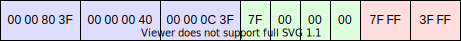

{{APIRef("WebGL")}}{{AvailableInWorkers}}

The
**`WebGLRenderingContext.vertexAttribPointer()`** method of the
[WebGL API](/en-US/docs/Web/API/WebGL_API) binds the buffer currently bound
to `gl.ARRAY_BUFFER` to a generic vertex attribute of the current vertex
buffer object and specifies its layout.

## Syntax

```js-nolint
vertexAttribPointer(index, size, type, normalized, stride, offset)
```

### Parameters

- `index`
  - : A {{domxref("WebGL_API/Types", "GLuint")}} specifying the index of the vertex attribute that is to be
    modified.
- `size`
  - : A {{domxref("WebGL_API/Types", "GLint")}} specifying the number of components per vertex attribute.
    Must be 1, 2, 3, or 4.
- `type`

  - : A {{domxref("WebGL_API/Types", "GLenum")}} specifying the data type of each component in the array.
    Possible values:

    - `gl.BYTE`: signed 8-bit integer, with values in \[-128, 127]
    - `gl.SHORT`: signed 16-bit integer, with values in \[-32768, 32767]
    - `gl.UNSIGNED_BYTE`: unsigned 8-bit integer, with values in \[0, 255]
    - `gl.UNSIGNED_SHORT`: unsigned 16-bit integer, with values in \[0,65535]
    - `gl.FLOAT`: 32-bit IEEE floating point number

    When using a {{domxref("WebGL2RenderingContext", "WebGL 2 context", "", 1)}},
    the following values are available additionally:

    - `gl.HALF_FLOAT`: 16-bit IEEE floating point number
    - `gl.INT`: 32-bit signed binary integer
    - `gl.UNSIGNED_INT`: 32-bit unsigned binary integer
    - `gl.INT_2_10_10_10_REV`: 32-bit signed integer with values in \[-512, 511]
    - `gl.UNSIGNED_INT_2_10_10_10_REV`: 32-bit unsigned integer with values in \[0, 1023]

- `normalized`

  - : A {{domxref("WebGL_API/Types", "GLboolean")}} specifying whether integer data values should be
    normalized into a certain range when being cast to a float.

    - For types `gl.BYTE` and `gl.SHORT`, normalizes the values
      to \[-1, 1] if true.
    - For types `gl.UNSIGNED_BYTE` and `gl.UNSIGNED_SHORT`,
      normalizes the values to \[0, 1] if true.
    - For types `gl.FLOAT` and `gl.HALF_FLOAT`, this parameter
      has no effect.

- `stride`
  - : A {{domxref("WebGL_API/Types", "GLsizei")}} specifying the offset in bytes between the beginning of
    consecutive vertex attributes. Cannot be negative or larger than 255. If stride is 0, the
    attribute is assumed to be tightly packed, that is, the attributes are not interleaved
    but each attribute is in a separate block, and the next vertex' attribute follows
    immediately after the current vertex.
- `offset`
  - : A {{domxref("WebGL_API/Types", "GLintptr")}} specifying an offset in bytes of the first component in
    the vertex attribute array. Must be a multiple of the byte length
    of `type`.

### Return value

None ({{jsxref("undefined")}}).

### Exceptions

- A `gl.INVALID_VALUE` error is thrown if `stride` or `offset` are negative.
- A `gl.INVALID_OPERATION` error is thrown if `stride` and
  `offset` are not multiples of the size of the data type.
- A `gl.INVALID_OPERATION` error is thrown if no WebGLBuffer is bound to
  the ARRAY_BUFFER target.
- When using a {{domxref("WebGL2RenderingContext", "WebGL 2 context", "", 1)}}, a
  `gl.INVALID_OPERATION` error is thrown if this vertex attribute is defined
  as an integer in the vertex shader (e.g. `uvec4` or `ivec4`,
  instead of `vec4`).

## Description

Let's assume we want to render some 3D geometry, and for that we will need to supply
our vertices to the Vertex Shader. Each vertex has a few attributes, like position,
normal vector, or texture coordinate, that are defined in an {{jsxref("ArrayBuffer")}}
and will be supplied to the Vertex Buffer Object (VBO). First, we need to bind the
{{domxref("WebGLBuffer")}} we want to use to `gl.ARRAY_BUFFER`, then, with
this method, `gl.vertexAttribPointer()`, we specify in what order the
attributes are stored, and what data type they are in. In addition, we need to include
the stride, which is the total byte length of all attributes for one vertex. Also, we
have to call {{domxref("WebGLRenderingContext/enableVertexAttribArray", "gl.enableVertexAttribArray()")}} to tell WebGL that this attribute should be filled
with data from our array buffer.

Usually, your 3D geometry is already in a certain binary format, so you need to read
the specification of that specific format to figure out the memory layout. However, if
you are designing the format yourself, or your geometry is in text files (like [Wavefront .obj files](https://en.wikipedia.org/wiki/Wavefront_.obj_file)) and
must be converted into an `ArrayBuffer` at runtime, you have free choice on
how to structure the memory. For highest performance, [interleave](https://en.wikipedia.org/wiki/Interleaved_memory) the attributes
and use the smallest data type that still accurately represents your geometry.

The maximum number of vertex attributes depends on the graphics card, and you can call
`gl.getParameter(gl.MAX_VERTEX_ATTRIBS)` to get this value. On high-end
graphics cards, the maximum is 16, on lower-end graphics cards, the value will be lower.

### Attribute index

For each attribute, you must specify its index. This is independent from the location
inside the array buffer, so your attributes can be sent in a different order than how
they are stored in the array buffer. You have two options:

- Either you specify the index yourself. In this case, you call
  {{domxref("WebGLRenderingContext.bindAttribLocation()", "gl.bindAttribLocation()")}}
  to connect a named attribute from the vertex shader to the index you want to use. This
  must be done before calling {{domxref("WebGLRenderingContext.linkProgram()", "gl.linkProgram()")}}. You can then provide this same index to
  `gl.vertexAttribPointer()`.
- Alternatively, you use the index that is assigned by the graphics card when
  compiling the vertex shader. Depending on the graphics card, the index will vary, so
  you must call {{domxref("WebGLRenderingContext.getAttribLocation()", "gl.getAttribLocation()")}} to find out the index, and then provide this index to
  `gl.vertexAttribPointer()`.
  If you are using WebGL 2, you can specify the index yourself in the vertex shader code
  and override the default used by the graphics card, e.g.
  `layout(location = 3) in vec4 position;` would set the
  `"position"` attribute to index 3.

### Integer attributes

While the `ArrayBuffer` can be filled with both integers and floats, the
attributes will always be converted to a float when they are sent to the vertex shader.
If you need to use integers in your vertex shader code, you can either cast the float
back to an integer in the vertex shader (e.g. `(int) floatNumber`), or use
{{domxref("WebGL2RenderingContext.vertexAttribIPointer()", "gl.vertexAttribIPointer()")}} from WebGL2.

### Default attribute values

The vertex shader code may include a number of attributes, but we don't need to specify
the values for each attribute. Instead, we can supply a default value that will be
identical for all vertices. We can call
{{domxref("WebGLRenderingContext.disableVertexAttribArray()", "gl.disableVertexAttribArray()")}}
to tell WebGL to use the default value, while calling
{{domxref("WebGLRenderingContext.enableVertexAttribArray()", "gl.enableVertexAttribArray()")}}
will read the values from the array buffer as specified with `gl.vertexAttribPointer()`.

Similarly, if our vertex shader expects e.g. a 4-component attribute with
`vec4` but in our `gl.vertexAttribPointer()` call we set the
`size` to `2`, then WebGL will set the first two components based
on the array buffer, while the third and fourth components are taken from the default
value.

The default value is `vec4(0.0, 0.0, 0.0, 1.0)` by default but we can
specify a different default value with
{{domxref("WebGLRenderingContext.vertexAttrib()", "gl.vertexAttrib[1234]f[v]()")}}.

For example, your vertex shader may be using a position and a color attribute. Most
meshes have the color specified at a per-vertex level, but some meshes are of a uniform
shade. For those meshes, it is not necessary to place the same color for each vertex
into the array buffer, so you use `gl.vertexAttrib4fv()` to set a constant
color.

### Querying current settings

You can call {{domxref("WebGLRenderingContext.getVertexAttrib()", "gl.getVertexAttrib()")}} and
{{domxref("WebGLRenderingContext.getVertexAttribOffset()", "gl.getVertexAttribOffset()")}} to
get the current parameters for an attribute, e.g. the
data type or whether the attribute should be normalized. Keep in mind that these WebGL
functions have a slow performance and it is better to store the state inside your
JavaScript application. However, these functions are great for debugging a WebGL context
without touching the application code.

## Examples

This example shows how to send your vertex attributes to the shader program. We use an
imaginary data structure where the attributes of each vertex are stored interleaved with
a length of 20 bytes per vertex:

1. **position:** We need to store the X, Y and Z coordinates. For highest
   precision, we use 32-bit floats; in total this uses 12 bytes.
2. **normal vector:** We need to store the X, Y and Z components of the
   normal vector, but since precision is not that important, we use 8-bit signed
   integers. For better performance, we align the data to 32 bits by also storing a
   fourth zero-valued component, bringing the total size to 4 bytes. Also, we tell WebGL
   to normalize the values because our normals are always in range \[-1, 1].
3. **texture coordinate:** We need to store the U and V coordinates; for
   this 16-bit unsigned integers offer enough precision, the total size is 4 bytes. We
   also tell WebGL to normalize the values to \[0, 1].

For example, the following vertex:

```json
{
  "position": [1.0, 2.0, 1.5],
  "normal": [1.0, 0.0, 0.0],
  "texCoord": [0.5, 0.25]
}
```

Will be stored in the array buffer as follows:



### Creating the array buffer

First, we dynamically create the array buffer from JSON data using a
{{jsxref("DataView")}}. Note the use of `true` because WebGL expects our
data to be in little-endian.

```js
// Load geometry with fetch() and Response.json()
const response = await fetch("assets/geometry.json");
const vertices = await response.json();

// Create array buffer
const buffer = new ArrayBuffer(20 * vertices.length);
// Fill array buffer
const dv = new DataView(buffer);
vertices.forEach((vertex, i) => {
  dv.setFloat32(20 * i, vertex.position[0], true);
  dv.setFloat32(20 * i + 4, vertex.position[1], true);
  dv.setFloat32(20 * i + 8, vertex.position[2], true);
  dv.setInt8(20 * i + 12, vertex.normal[0] * 0x7f);
  dv.setInt8(20 * i + 13, vertex.normal[1] * 0x7f);
  dv.setInt8(20 * i + 14, vertex.normal[2] * 0x7f);
  dv.setInt8(20 * i + 15, 0);
  dv.setUint16(20 * i + 16, vertex.texCoord[0] * 0xffff, true);
  dv.setUint16(20 * i + 18, vertex.texCoord[1] * 0xffff, true);
});
```

For higher performance, we could also do the previous JSON to ArrayBuffer conversion on
the server-side, e.g. with Node.js. Then we could load the binary file and interpret it
as an array buffer:

```js
const response = await fetch("assets/geometry.bin");
const buffer = await response.arrayBuffer();
```

### Consume array buffer with WebGL

First, we create a new Vertex Buffer Object (VBO) and supply it with our array buffer:

```js
//Bind array buffer to a Vertex Buffer Object
const vbo = gl.createBuffer();
gl.bindBuffer(gl.ARRAY_BUFFER, vbo);
gl.bufferData(gl.ARRAY_BUFFER, buffer, gl.STATIC_DRAW);
```

Then, we specify the memory layout of the array buffer, either by setting the index
ourselves:

```js
//Describe the layout of the buffer:
//1. position, not normalized
gl.vertexAttribPointer(0, 3, gl.FLOAT, false, 20, 0);
gl.enableVertexAttribArray(0);
//2. normal vector, normalized to [-1, 1]
gl.vertexAttribPointer(1, 4, gl.BYTE, true, 20, 12);
gl.enableVertexAttribArray(1);
//3. texture coordinates, normalized to [0, 1]
gl.vertexAttribPointer(2, 2, gl.UNSIGNED_SHORT, true, 20, 16);
gl.enableVertexAttribArray(2);

//Set the attributes in the vertex shader to the same indices
gl.bindAttribLocation(shaderProgram, 0, "position");
gl.bindAttribLocation(shaderProgram, 1, "normal");
gl.bindAttribLocation(shaderProgram, 2, "texUV");
//Since the attribute indices have changed, we must re-link the shader
//Note that this will reset all uniforms that were previously set.
gl.linkProgram(shaderProgram);
```

Or we can use the index provided by the graphics card instead of setting the index
ourselves; this avoids the re-linking of the shader program.

```js
const locPosition = gl.getAttribLocation(shaderProgram, "position");
gl.vertexAttribPointer(locPosition, 3, gl.FLOAT, false, 20, 0);
gl.enableVertexAttribArray(locPosition);

const locNormal = gl.getAttribLocation(shaderProgram, "normal");
gl.vertexAttribPointer(locNormal, 4, gl.BYTE, true, 20, 12);
gl.enableVertexAttribArray(locNormal);

const locTexUV = gl.getAttribLocation(shaderProgram, "texUV");
gl.vertexAttribPointer(locTexUV, 2, gl.UNSIGNED_SHORT, true, 20, 16);
gl.enableVertexAttribArray(locTexUV);
```

## Specifications

{{Specifications}}

## Browser compatibility

{{Compat}}

## See also

- [Vertex Specification](https://www.khronos.org/opengl/wiki/Vertex_Specification) on the OpenGL wiki
- {{domxref("WebGL2RenderingContext.vertexAttribIPointer()")}}
