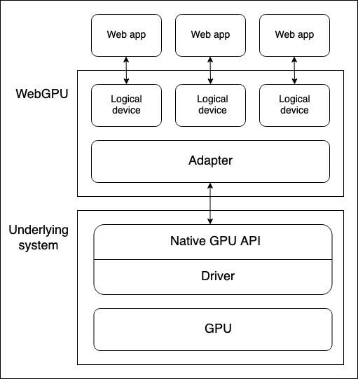

{{DefaultAPISidebar("WebGPU API")}}{{SeeCompatTable}}{{securecontext_header}}

The **WebGPU API** enables web developers to use the underlying system's GPU (Graphics Processing Unit) to carry out high-performance computations and draw complex images that can be rendered in the browser.

WebGPU is the successor to {{domxref("WebGL_API", "WebGL", "", "nocode")}}, providing better compatibility with modern GPUs, support for general-purpose GPU computations, faster operations, and access to more advanced GPU features.

## Concepts and usage

It is fair to say that {{domxref("WebGL_API", "WebGL", "", "nocode")}} revolutionized the web in terms of graphical capabilities after it first appeared around 2011. WebGL is a JavaScript port of the [OpenGL ES 2.0](https://registry.khronos.org/OpenGL-Refpages/es2.0/) graphics library, allowing web pages to pass rendering computations directly to the device's GPU to be processed at very high speeds, and render the result inside a {{htmlelement("canvas")}} element.

WebGL and the [GLSL](<https://www.khronos.org/opengl/wiki/Core_Language_(GLSL)>) language used to write WebGL shader code are complex, so several WebGL libraries have been created to make WebGL apps easier to write: Popular examples include [Three.js](https://threejs.org/), [Babylon.js](https://www.babylonjs.com/), and [PlayCanvas](https://playcanvas.com/). Developers have used these tools to build immersive web-based 3D games, music videos, training and modeling tools, VR and AR experiences, and more.

However, WebGL has some fundamental issues that needed addressing:

- Since WebGL's release, a new generation of native GPU APIs have appeared — the most popular being [Microsoft's Direct3D 12](https://learn.microsoft.com/en-us/windows/win32/direct3d12/direct3d-12-graphics), [Apple's Metal](https://developer.apple.com/metal/), and [The Khronos Group's Vulkan](https://www.vulkan.org/) — which provide a multitude of new features. There are no more updates planned to OpenGL (and therefore WebGL), so it won't get any of these new features. WebGPU on the other hand will have new features added to it going forwards.
- WebGL is based wholly around the use case of drawing graphics and rendering them to a canvas. It does not handle general-purpose GPU (GPGPU) computations very well. GPGPU computations are becoming more and more important for many different use cases, for example those based on machine learning models.
- 3D graphics apps are becoming increasingly demanding, both in terms of the number of objects to be rendered simultaneously, and usage of new rendering features.

WebGPU addresses these issues, providing an updated general-purpose architecture compatible with modern GPU APIs, which feels more "webby". It supports graphic rendering, but also has first-class support for GPGPU computations. Rendering of individual objects is significantly cheaper on the CPU side, and it supports modern GPU rendering features such as compute-based particles and post-processing filters like color effects, sharpening, and depth-of-field simulation. In addition, it can handle expensive computations such as culling and skinned model transformation directly on the GPU.

## General model

There are several layers of abstraction between a device GPU and a web browser running the WebGPU API. It is useful to understand these as you begin to learn WebGPU:



- Physical devices have GPUs. Most devices only have one GPU, but some have more than one. Different GPU types are available:

  - Integrated GPUs, which live on the same board as the CPU and share its memory.
  - Discrete GPUs, which live on their own board, separate from the CPU.
  - Software "GPUs", implemented on the CPU.

  > [!NOTE]
  > The above diagram assumes a device with only one GPU.

- A native GPU API, which is part of the OS (e.g., Metal on macOS), is a programming interface allowing native applications to use the capabilities of the GPU. API instructions are sent to the GPU (and responses received) via a driver. It is possible for a system to have multiple native OS APIs and drivers available to communicate with the GPU, although the above diagram assumes a device with only one native API/driver.
- A browser's WebGPU implementation handles communicating with the GPU via a native GPU API driver. A WebGPU adapter effectively represents a physical GPU and driver available on the underlying system, in your code.
- A logical device is an abstraction via which a single web app can access GPU capabilities in a compartmentalized way. Logical devices are required to provide multiplexing capabilities. A physical device's GPU is used by many applications and processes concurrently, including potentially many web apps. Each web app needs to be able to access WebGPU in isolation for security and logic reasons.

## Accessing a device

A logical device — represented by a {{domxref("GPUDevice")}} object instance — is the basis from which a web app accesses all WebGPU functionality. Accessing a device is done as follows:

1. The {{domxref("Navigator.gpu")}} property (or {{domxref("WorkerNavigator.gpu")}} if you are using WebGPU functionality from inside a worker) returns the {{domxref("GPU")}} object for the current context.
2. You access an adapter via the {{domxref("GPU.requestAdapter", "GPU.requestAdapter()")}} method. This method accepts an optional settings object allowing you to request for example a high-performance or low-energy adapter. If this is not included, the device will provide access to the default adapter, which is good enough for most purposes.
3. A device can be requested via {{domxref("GPUAdapter.requestDevice()")}}. This method also accepts an options object (referred to as a descriptor), which can be used to specify the exact features and limits you want the logical device to have. If this is not included, the supplied device will have a reasonable general-purpose spec that is good enough for most purposes.

Putting this together with some feature detection checks, the above process could be achieved as follows:

```js
async function init() {
  if (!navigator.gpu) {
    throw Error("WebGPU not supported.");
  }

  const adapter = await navigator.gpu.requestAdapter();
  if (!adapter) {
    throw Error("Couldn't request WebGPU adapter.");
  }

  const device = await adapter.requestDevice();

  // …
}
```

## Pipelines and shaders: WebGPU app structure

A pipeline is a logical structure containing programmable stages that are completed to get your program's work done. WebGPU is currently able to handle two types of pipeline:

- A render pipeline renders graphics, typically into a {{htmlelement("canvas")}} element, but it could also render graphics offscreen. It has two main stages:

  - A vertex stage, in which a vertex shader takes positioning data fed into the GPU and uses it to position a series of vertices in 3D space by applying specified effects like rotation, translation, or perspective. The vertices are then assembled into primitives such as triangles (the basic building block of rendered graphics) and rasterized by the GPU to figure out what pixels each one should cover on the drawing canvas.

  - A fragment stage, in which a fragment shader computes the color for each pixel covered by the primitives produced by the vertex shader. These computations frequently use inputs such as images (in the form of textures) that provide surface details and the position and color of virtual lights.

- A compute pipeline is for general computation. A compute pipeline contains a single compute stage in which a compute shader takes general data, processes it in parallel across a specified number of workgroups, then returns the result in one or more buffers. The buffers can contain any kind of data.

The shaders mentioned above are sets of instructions processed by the GPU. WebGPU shaders are written in a low-level Rust-like language called [WebGPU Shader Language](https://gpuweb.github.io/gpuweb/wgsl/) (WGSL).

There are several different ways in which you could architect a WebGPU app, but the process will likely contain the following steps:

1. [Create shader modules](#create_shader_modules): Write your shader code in WGSL and package it into one or more shader modules.
2. [Get and configure the canvas context](#get_and_configure_the_canvas_context): Get the `webgpu` context of a `<canvas>` element and configure it to receive information on what graphics to render from your GPU logical device. This step is not necessary if your app has no graphical output, such as one that only uses compute pipelines.
3. [Create resources containing your data](#create_a_buffer_and_write_our_triangle_data_into_it): The data that you want processed by your pipelines needs to be stored in GPU buffers or textures to be accessed by your app.
4. [Create pipelines](#define_and_create_the_render_pipeline): Define pipeline descriptors that describe the desired pipelines in detail, including the required data structure, bindings, shaders, and resource layouts, then create pipelines from them. Our basic demos only contain a single pipeline, but non-trivial apps will usually contain multiple pipelines for different purposes.
5. [Run a compute/rendering pass](#running_a_rendering_pass): This involves a number of substeps:
   1. Create a command encoder that can encode a set of commands to be passed to the GPU to execute.
   2. Create a pass encoder object on which compute/render commands are issued.
   3. Run commands to specify which pipelines to use, what buffer(s) to get the required data from, how many drawing operations to run (in the case of render pipelines), etc.
   4. Finalize the command list and encapsulate it in a command buffer.
   5. Submit the command buffer to the GPU via the logical device's command queue.

In the sections below, we will examine a basic render pipeline demo, to allow you to explore what it requires. Later on, we'll also examine a [basic compute pipeline](#basic_compute_pipeline) example, looking at how it differs from the render pipeline.

## Basic render pipeline

In our [basic render demo](https://mdn.github.io/dom-examples/webgpu-render-demo/) we give a `<canvas>` element a solid blue background and draw a triangle onto it.

### Create shader modules

We are using the following shader code. The vertex shader stage (`@vertex` block) accepts a chunk of data containing a position and a color, positions the vertex according to the given position, interpolates the color, then passes the data along to the fragment shader stage. The fragment shader stage (`@fragment` block) accepts the data from the vertex shader stage and colors the vertex according to the given color.

```js
const shaders = `
struct VertexOut {
  @builtin(position) position : vec4f,
  @location(0) color : vec4f
}

@vertex
fn vertex_main(@location(0) position: vec4f,
               @location(1) color: vec4f) -> VertexOut
{
  var output : VertexOut;
  output.position = position;
  output.color = color;
  return output;
}

@fragment
fn fragment_main(fragData: VertexOut) -> @location(0) vec4f
{
  return fragData.color;
}
`;
```

> [!NOTE]
> In our demos we are storing our shader code inside a template literal, but you can store it anywhere from which it can easily be retrieved as text to be fed into your WebGPU program. For example, another common practice is to store shaders inside a {{htmlelement("script")}} element and retrieve the contents using {{domxref("Node.textContent")}}. The correct mime type to use for WGSL is `text/wgsl`.

To make your shader code available to WebGPU, you have to put it inside a {{domxref("GPUShaderModule")}} via a {{domxref("GPUDevice.createShaderModule()")}} call, passing your shader code as a property inside a descriptor object. For example:

```js
const shaderModule = device.createShaderModule({
  code: shaders,
});
```

### Get and configure the canvas context

In a render pipeline, we need to specify somewhere to render the graphics to. In this case we are getting a reference to an onscreen `<canvas>` element then calling {{domxref("HTMLCanvasElement.getContext()")}} with a parameter of `webgpu` to return its GPU context (a {{domxref("GPUCanvasContext")}} instance).

From there, we configure the context with a call to {{domxref("GPUCanvasContext.configure()")}}, passing it an options object containing the {{domxref("GPUDevice")}} that the rendering information will come from, the format the textures will have, and the alpha mode to use when rendering semi-transparent textures.

```js
const canvas = document.querySelector("#gpuCanvas");
const context = canvas.getContext("webgpu");

context.configure({
  device: device,
  format: navigator.gpu.getPreferredCanvasFormat(),
  alphaMode: "premultiplied",
});
```

> [!NOTE]
> The best practice for determining the texture format is to use the {{domxref("GPU.getPreferredCanvasFormat()")}} method; this selects the most efficient format (either `bgra8unorm` or `rgba8unorm`) for the user's device.

### Create a buffer and write our triangle data into it

Next we will provide our WebGPU program with our data, in a form it can use. Our data is initially provided in a {{jsxref("Float32Array")}}, which contains 8 data points for each triangle vertex — X, Y, Z, W for position, and R, G, B, A for color.

```js
const vertices = new Float32Array([
  0.0, 0.6, 0, 1, 1, 0, 0, 1, -0.5, -0.6, 0, 1, 0, 1, 0, 1, 0.5, -0.6, 0, 1, 0,
  0, 1, 1,
]);
```

However, we've got an issue here. We need to get our data into a {{domxref("GPUBuffer")}}. Behind the scenes, this type of buffer is stored in memory very tightly integrated with the GPU's cores to allow for the desired high performance processing. As a side effect, this memory can't be accessed by processes running on the host system, like the browser.

The {{domxref("GPUBuffer")}} is created via a call to {{domxref("GPUDevice.createBuffer()")}}. We give it a size equal to the length of the `vertices` array so it can contain all the data, and `VERTEX` and `COPY_DST` usage flags to indicate that the buffer will be used as a vertex buffer and the destination of copy operations.

```js
const vertexBuffer = device.createBuffer({
  size: vertices.byteLength, // make it big enough to store vertices in
  usage: GPUBufferUsage.VERTEX | GPUBufferUsage.COPY_DST,
});
```

We could handle getting our data into the `GPUBuffer` using a mapping operation, like we use in the [compute pipeline example](#basic_compute_pipeline) to read data from the GPU back to JavaScript. However, in this case we are going to use the handy {{domxref("GPUQueue.writeBuffer()")}} convenience method, which takes as its parameters the buffer to write to, the data source to write from, an offset value for each, and the size of data to write (we've specified the whole length of the array). The browser then works out the most efficient way to handle writing the data.

```js
device.queue.writeBuffer(vertexBuffer, 0, vertices, 0, vertices.length);
```

### Define and create the render pipeline

Now we've got our data into a buffer, the next part of the setup is to actually create our pipeline, ready to be used for rendering.

First of all, we create an object that describes the required layout of our vertex data. This perfectly describes what we saw earlier on in our `vertices` array and vertex shader stage — each vertex has position and color data. Both are formatted in `float32x4` format (which maps to the WGSL `vec4<f32>` type), and the color data starts at an offset of 16 bytes into each vertex. `arrayStride` specifies the stride, meaning the number of bytes making up each vertex, and `stepMode` specifies that the data should be fetched per-vertex.

```js
const vertexBuffers = [
  {
    attributes: [
      {
        shaderLocation: 0, // position
        offset: 0,
        format: "float32x4",
      },
      {
        shaderLocation: 1, // color
        offset: 16,
        format: "float32x4",
      },
    ],
    arrayStride: 32,
    stepMode: "vertex",
  },
];
```

Next, we create a descriptor object that specifies the configuration of our render pipeline stages. For both the shader stages, we specify the {{domxref("GPUShaderModule")}} that the relevant code can be found in (`shaderModule`), and the name of the function that acts as the entry point for each stage.

In addition, in the case of the vertex shader stage we provide our `vertexBuffers` object to provide the expected state of our vertex data. And in the case of our fragment shader stage, we provide an array of color target states that indicate the specified rendering format (this matches the format specified in our canvas context config earlier).

We also specify a `primitive` object, which in this case just states the type of primitive we will be drawing, and a `layout` of `auto`. The `layout` property defines the layout (structure, purpose, and type) of all the GPU resources (buffers, textures, etc.) used during the execution of the pipeline. In more complex apps, this would take the form of a {{domxref("GPUPipelineLayout")}} object, created using {{domxref("GPUDevice.createPipelineLayout()")}} (you can see an example in our [Basic compute pipeline](#basic_compute_pipeline)), which allows the GPU to figure out how to run the pipeline most efficiently ahead of time. However, we are specifying the `auto` value, which will cause the pipeline to generate an implicit bind group layout based on any bindings defined in the shader code.

```js
const pipelineDescriptor = {
  vertex: {
    module: shaderModule,
    entryPoint: "vertex_main",
    buffers: vertexBuffers,
  },
  fragment: {
    module: shaderModule,
    entryPoint: "fragment_main",
    targets: [
      {
        format: navigator.gpu.getPreferredCanvasFormat(),
      },
    ],
  },
  primitive: {
    topology: "triangle-list",
  },
  layout: "auto",
};
```

Finally, we can create a {{domxref("GPURenderPipeline")}} based on our `pipelineDescriptor` object, by passing it in as a parameter to a {{domxref("GPUDevice.createRenderPipeline()")}} method call.

```js
const renderPipeline = device.createRenderPipeline(pipelineDescriptor);
```

### Running a rendering pass

Now that all the setup is done, we can actually run a rendering pass and draw something onto our `<canvas>`. To encode any commands to be later issued to the GPU, you need to create a {{domxref("GPUCommandEncoder")}} instance, which is done using a {{domxref("GPUDevice.createCommandEncoder()")}} call.

```js
const commandEncoder = device.createCommandEncoder();
```

Next up we start the rendering pass running by creating a {{domxref("GPURenderPassEncoder")}} instance with a {{domxref("GPUCommandEncoder.beginRenderPass()")}} call. This method takes a descriptor object as a parameter, the only mandatory property of which is a `colorAttachments` array. In this case, we specify:

1. A texture view to render into; we create a new view from the `<canvas>` via {{domxref("GPUTexture.createView", "context.getCurrentTexture().createView()")}}.
2. That the view should be "cleared" to a specified color once loaded and before any drawing takes place. This is what causes the blue background behind the triangle.
3. That the value of the current rendering pass should be stored for this color attachment.

```js
const clearColor = { r: 0.0, g: 0.5, b: 1.0, a: 1.0 };

const renderPassDescriptor = {
  colorAttachments: [
    {
      clearValue: clearColor,
      loadOp: "clear",
      storeOp: "store",
      view: context.getCurrentTexture().createView(),
    },
  ],
};

const passEncoder = commandEncoder.beginRenderPass(renderPassDescriptor);
```

Now we can invoke methods of the rendering pass encoder to draw our triangle:

1. {{domxref("GPURenderPassEncoder.setPipeline()")}} is called with our `renderPipeline` object as a parameter to specify the pipeline to use for the rendering pass.
2. {{domxref("GPURenderPassEncoder.setVertexBuffer()")}} is called with our `vertexBuffer` object as a parameter to act as the data source to pass to the pipeline to render. The first parameter is the slot to set the vertex buffer for, and is a reference to the index of the element in the `vertexBuffers` array which describes this buffer's layout.
3. {{domxref("GPURenderPassEncoder.draw()")}} sets the drawing in motion. There is data for three vertices inside our `vertexBuffer`, so we set a vertex count value of `3` to draw them all.

```js
passEncoder.setPipeline(renderPipeline);
passEncoder.setVertexBuffer(0, vertexBuffer);
passEncoder.draw(3);
```

To finish encoding the sequence of commands and issue them to the GPU, three more steps are needed.

1. We invoke the {{domxref("GPURenderPassEncoder.end()")}} method to signal the end of the render pass command list.
2. We invoke the {{domxref("GPUCommandEncoder.finish()")}} method to complete recording of the issued command sequence and encapsulate it into a {{domxref("GPUCommandBuffer")}} object instance.
3. We submit the {{domxref("GPUCommandBuffer")}} to the device's command queue (represented by a {{domxref("GPUQueue")}} instance) to be sent to the GPU. The device's queue is available via the {{domxref("GPUDevice.queue")}} property, and an array of {{domxref("GPUCommandBuffer")}} instances can be added to the queue via a {{domxref("GPUQueue.submit()")}} call.

These three steps can be achieved via the following two lines:

```js
passEncoder.end();

device.queue.submit([commandEncoder.finish()]);
```

## Basic compute pipeline

In our [basic compute demo](https://mdn.github.io/dom-examples/webgpu-compute-demo/), we get the GPU to calculate some values, store them in an output buffer, copy the data across to a staging buffer, then map that staging buffer so that the data can be read out to JavaScript and logged to the console.

The app follows a similar structure to the basic rendering demo. We create a {{domxref("GPUDevice")}} reference in the same way as before, and encapsulate our shader code into a {{domxref("GPUShaderModule")}} via a {{domxref("GPUDevice.createShaderModule()")}} call. The difference here is that our shader code only has one shader stage, a `@compute` stage:

```js
// Define global buffer size
const NUM_ELEMENTS = 1000;
const BUFFER_SIZE = NUM_ELEMENTS * 4; // Buffer size, in bytes

const shader = `
@group(0) @binding(0)
var<storage, read_write> output: array<f32>;

@compute @workgroup_size(64)
fn main(
  @builtin(global_invocation_id)
  global_id : vec3u,

  @builtin(local_invocation_id)
  local_id : vec3u,
) {
  // Avoid accessing the buffer out of bounds
  if (global_id.x >= ${NUM_ELEMENTS}) {
    return;
  }

  output[global_id.x] =
    f32(global_id.x) * 1000. + f32(local_id.x);
}
`;
```

### Create buffers to handle our data

In this example we create two {{domxref("GPUBuffer")}} instances to handle our data, an `output` buffer to write the GPU calculation results to at high speed, and a `stagingBuffer` that we'll copy the `output` contents to, which can be mapped to allow JavaScript to access the values.

- `output` is specified as a storage buffer that will be the source of a copy operation.
- `stagingBuffer` is specified as a buffer that can be mapped for reading by JavaScript, and will be the destination of a copy operation.

```js
const output = device.createBuffer({
  size: BUFFER_SIZE,
  usage: GPUBufferUsage.STORAGE | GPUBufferUsage.COPY_SRC,
});

const stagingBuffer = device.createBuffer({
  size: BUFFER_SIZE,
  usage: GPUBufferUsage.MAP_READ | GPUBufferUsage.COPY_DST,
});
```

### Create a bind group layout

When the pipeline is created, we specify a bind group to use for the pipeline. This involves first creating a {{domxref("GPUBindGroupLayout")}} (via a call to {{domxref("GPUDevice.createBindGroupLayout()")}}) that defines the structure and purpose of GPU resources such as buffers that will be used in this pipeline. This layout is used as a template for bind groups to adhere to. In this case we give the pipeline access to a single memory buffer, tied to binding slot 0 (this matches the relevant binding number in our shader code — `@binding(0)`), usable in the compute stage of the pipeline, and with the buffer's purpose defined as `storage`.

```js
const bindGroupLayout = device.createBindGroupLayout({
  entries: [
    {
      binding: 0,
      visibility: GPUShaderStage.COMPUTE,
      buffer: {
        type: "storage",
      },
    },
  ],
});
```

Next we create a {{domxref("GPUBindGroup")}} by calling {{domxref("GPUDevice.createBindGroup()")}}. We pass this method call a descriptor object that specifies the bind group layout to base this bind group on, and the details of the variable to bind to the slot defined in the layout. In this case, we are declaring binding 0, and specifying that the `output` buffer we defined earlier should be bound to it.

```js
const bindGroup = device.createBindGroup({
  layout: bindGroupLayout,
  entries: [
    {
      binding: 0,
      resource: {
        buffer: output,
      },
    },
  ],
});
```

> [!NOTE]
> You could retrieve an implicit layout to use when creating a bind group by calling the {{domxref("GPUComputePipeline.getBindGroupLayout()")}} method. There is also a version available for render pipelines: see {{domxref("GPURenderPipeline.getBindGroupLayout()")}}.

### Create a compute pipeline

With the above all in place, we can now create a compute pipeline by calling {{domxref("GPUDevice.createComputePipeline()")}}, passing it a pipeline descriptor object. This works in a similar way to creating a render pipeline. We describe the compute shader, specifying what module to find the code in and what the entry point is. We also specify a `layout` for the pipeline, in this case creating a layout based on the `bindGroupLayout` we defined earlier via a {{domxref("GPUDevice.createPipelineLayout()")}} call.

```js
const computePipeline = device.createComputePipeline({
  layout: device.createPipelineLayout({
    bindGroupLayouts: [bindGroupLayout],
  }),
  compute: {
    module: shaderModule,
    entryPoint: "main",
  },
});
```

One difference here from the render pipeline layout is that we are not specifying a primitive type, as we are not drawing anything.

### Running a compute pass

Running a compute pass is similar in structure to running a rendering pass, with some different commands. For a start, the pass encoder is created using {{domxref("GPUCommandEncoder.beginComputePass()")}}.

When issuing the commands, we specify the pipeline to use in the same way as before, using {{domxref("GPUComputePassEncoder.setPipeline()")}}. We then however use {{domxref("GPUComputePassEncoder.setBindGroup()")}} to specify that we want to use our `bindGroup` to specify the data to use in the calculation, and {{domxref("GPUComputePassEncoder.dispatchWorkgroups()")}} to specify the number of GPU workgroups to use to run the calculations.

We then signal the end of the render pass command list using {{domxref("GPURenderPassEncoder.end()")}}.

```js
passEncoder.setPipeline(computePipeline);
passEncoder.setBindGroup(0, bindGroup);
passEncoder.dispatchWorkgroups(Math.ceil(NUM_ELEMENTS / 64));

passEncoder.end();
```

### Reading the results back to JavaScript

Before submitting the encoded commands to the GPU for execution using {{domxref("GPUQueue.submit()")}}, we copy the contents of the `output` buffer to the `stagingBuffer` buffer using {{domxref("GPUCommandEncoder.copyBufferToBuffer()")}}.

```js
// Copy output buffer to staging buffer
commandEncoder.copyBufferToBuffer(
  output,
  0, // Source offset
  stagingBuffer,
  0, // Destination offset
  BUFFER_SIZE, // Length, in bytes
);

// End frame by passing array of command buffers to command queue for execution
device.queue.submit([commandEncoder.finish()]);
```

Once the output data is available in the `stagingBuffer`, we use the {{domxref("GPUBuffer.mapAsync()")}} method to map the data to intermediate memory, grab a reference to the mapped range using {{domxref("GPUBuffer.getMappedRange()")}}, copy the data into JavaScript, and then log it to the console. We also unmap the `stagingBuffer` once we are finished with it.

```js
// map staging buffer to read results back to JS
await stagingBuffer.mapAsync(
  GPUMapMode.READ,
  0, // Offset
  BUFFER_SIZE, // Length, in bytes
);

const copyArrayBuffer = stagingBuffer.getMappedRange(0, BUFFER_SIZE);
const data = copyArrayBuffer.slice();
stagingBuffer.unmap();
console.log(new Float32Array(data));
```

## GPU error handling

WebGPU calls are validated asynchronously in the GPU process. If errors are found, the problem call is marked as invalid on the GPU side. If another call is made that relies on the return value of an invalidated call, that object will also be marked as invalid, and so on. For this reason, errors in WebGPU are referred to as "contagious".

Each {{domxref("GPUDevice")}} instance maintains its own error scope stack. This stack is initially empty, but you can start pushing an error scope to the stack by invoking {{domxref("GPUDevice.pushErrorScope()")}} to capture errors of a particular type.

Once you are done capturing errors, you can end capture by invoking {{domxref("GPUDevice.popErrorScope()")}}. This pops the scope from the stack and returns a {{jsxref("Promise")}} that resolves to an object ({{domxref("GPUInternalError")}}, {{domxref("GPUOutOfMemoryError")}}, or {{domxref("GPUValidationError")}}) describing the first error captured in the scope, or `null` if no errors were captured.

We have attempted to provide useful information to help you understand why errors are occurring in your WebGPU code in "Validation" sections where appropriate, which list criteria to meet to avoid errors. See for example the [`GPUDevice.createBindGroup()` Validation section](/en-US/docs/Web/API/GPUDevice/createBindGroup#validation). Some of this information is complex; rather than repeat the spec, we have decided to just list error criteria that are:

- Non-obvious, for example combinations of descriptor properties that produce validation errors. There is no point telling you to make sure you use the correct descriptor object structure. That is both obvious and vague.
- Developer-controlled. Some of the error criteria are purely based on internals and not really relevant to web developers.

You can find more information about WebGPU error handling in the explainer — see [Object validity and destroyed-ness](https://gpuweb.github.io/gpuweb/explainer/#invalid-and-destroyed) and [Errors](https://gpuweb.github.io/gpuweb/explainer/#errors). [WebGPU Error Handling best practices](https://toji.dev/webgpu-best-practices/error-handling) provides useful real-world examples and advice.

> [!NOTE]
> The historic way of handling errors in WebGL is to provide a {{domxref("WebGLRenderingContext.getError", "getError()")}} method to return error information. This is problematic in that it returns errors synchronously, which is bad for performance — each call requires a round-trip to the GPU and requires all previously issued operations to be finished. Its state model is also flat, meaning that errors can leak between unrelated code. The creators of WebGPU were determined to improve on this.

## Interfaces

### Entry point for the API

- {{domxref("Navigator.gpu")}} / {{domxref("WorkerNavigator.gpu")}}
  - : The entry point for the API — returns the {{domxref("GPU")}} object for the current context.
- {{domxref("GPU")}}
  - : The starting point for using WebGPU. It can be used to return a {{domxref("GPUAdapter")}}.
- {{domxref("GPUAdapter")}}
  - : Represents a GPU adapter. From this you can request a {{domxref("GPUDevice")}}, adapter info, features, and limits.
- {{domxref("GPUAdapterInfo")}}
  - : Contains identifying information about an adapter.

### Configuring GPUDevices

- {{domxref("GPUDevice")}}
  - : Represents a logical GPU device. This is the main interface through which the majority of WebGPU functionality is accessed.
- {{domxref("GPUSupportedFeatures")}}
  - : A [setlike](/en-US/docs/Web/JavaScript/Reference/Global_Objects/Set) object that describes additional functionality supported by a {{domxref("GPUAdapter")}} or {{domxref("GPUDevice")}}.
- {{domxref("GPUSupportedLimits")}}
  - : Describes the limits supported by a {{domxref("GPUAdapter")}} or {{domxref("GPUDevice")}}.

### Configuring a rendering `<canvas>`

- {{domxref("HTMLCanvasElement.getContext()")}} — the `"webgpu"` `contextType`
  - : Invoking `getContext()` with the `"webgpu"` `contextType` returns a {{domxref("GPUCanvasContext")}} object instance, which can then be configured with {{domxref("GPUCanvasContext.configure()")}}.
- {{domxref("GPUCanvasContext")}}
  - : Represents the WebGPU rendering context of an {{htmlelement("canvas")}} element.

### Representing pipeline resources

- {{domxref("GPUBuffer")}}
  - : Represents a block of memory that can be used to store raw data to use in GPU operations.
- {{domxref("GPUExternalTexture")}}
  - : A wrapper object containing an {{domxref("HTMLVideoElement")}} snapshot that can be used as a texture in GPU rendering operations.
- {{domxref("GPUSampler")}}
  - : Controls how shaders transform and filter texture resource data.
- {{domxref("GPUShaderModule")}}
  - : A reference to an internal shader module object, a container for WGSL shader code that can be submitted to the GPU to execution by a pipeline.
- {{domxref("GPUTexture")}}
  - : A container used to store 1D, 2D, or 3D arrays of data, such as images, to use in GPU rendering operations.
- {{domxref("GPUTextureView")}}
  - : A view onto some subset of the texture subresources defined by a particular {{domxref("GPUTexture")}}.

### Representing pipelines

- {{domxref("GPUBindGroup")}}
  - : Based on a {{domxref("GPUBindGroupLayout")}}, a `GPUBindGroup` defines a set of resources to be bound together in a group and how those resources are used in shader stages.
- {{domxref("GPUBindGroupLayout")}}
  - : Defines the structure and purpose of related GPU resources such as buffers that will be used in a pipeline, and is used as a template when creating {{domxref("GPUBindGroup")}}s.
- {{domxref("GPUComputePipeline")}}
  - : Controls the compute shader stage and can be used in a {{domxref("GPUComputePassEncoder")}}.
- {{domxref("GPUPipelineLayout")}}
  - : Defines the {{domxref("GPUBindGroupLayout")}}s used by a pipeline. {{domxref("GPUBindGroup")}}s used with the pipeline during command encoding must have compatible {{domxref("GPUBindGroupLayout")}}s.
- {{domxref("GPURenderPipeline")}}
  - : Controls the vertex and fragment shader stages and can be used in a {{domxref("GPURenderPassEncoder")}} or {{domxref("GPURenderBundleEncoder")}}.

### Encoding and submitting commands to the GPU

- {{domxref("GPUCommandBuffer")}}
  - : Represents a recorded list of GPU commands that can be submitted to a {{domxref("GPUQueue")}} for execution.
- {{domxref("GPUCommandEncoder")}}
  - : Represents a command encoder, used to encode commands to be issued to the GPU.
- {{domxref("GPUComputePassEncoder")}}
  - : Encodes commands related to controlling the compute shader stage, as issued by a {{domxref("GPUComputePipeline")}}. Part of the overall encoding activity of a {{domxref("GPUCommandEncoder")}}.
- {{domxref("GPUQueue")}}
  - : controls execution of encoded commands on the GPU.
- {{domxref("GPURenderBundle")}}
  - : A container for pre-recorded bundles of commands (see {{domxref("GPURenderBundleEncoder")}}).
- {{domxref("GPURenderBundleEncoder")}}
  - : Used to pre-record bundles of commands. These can be reused in {{domxref("GPURenderPassEncoder")}}s via the {{domxref("GPURenderPassEncoder.executeBundles", "executeBundles()")}} method, as many times as required.
- {{domxref("GPURenderPassEncoder")}}
  - : Encodes commands related to controlling the vertex and fragment shader stages, as issued by a {{domxref("GPURenderPipeline")}}. Part of the overall encoding activity of a {{domxref("GPUCommandEncoder")}}.

### Running queries on rendering passes

- {{domxref("GPUQuerySet")}}
  - : Used to record the results of queries on passes, such as occlusion or timestamp queries.

### Debugging errors

- {{domxref("GPUCompilationInfo")}}
  - : An array of {{domxref("GPUCompilationMessage")}} objects, generated by the GPU shader module compiler to help diagnose problems with shader code.
- {{domxref("GPUCompilationMessage")}}
  - : Represents a single informational, warning, or error message generated by the GPU shader module compiler.
- {{domxref("GPUDeviceLostInfo")}}
  - : Returned when the {{domxref("GPUDevice.lost")}} {{jsxref("Promise")}} resolves, providing information as to why the device was lost.
- {{domxref("GPUError")}}
  - : The base interface for errors surfaced by {{domxref("GPUDevice.popErrorScope")}} and the {{domxref("GPUDevice.uncapturederror_event", "uncapturederror")}} event.
- {{domxref("GPUInternalError")}}
  - : One of the types of errors surfaced by {{domxref("GPUDevice.popErrorScope")}} and the {{domxref("GPUDevice")}} {{domxref("GPUDevice.uncapturederror_event", "uncapturederror")}} event. Indicates that an operation failed for a system or implementation-specific reason, even when all validation requirements were satisfied.
- {{domxref("GPUOutOfMemoryError")}}
  - : One of the types of errors surfaced by {{domxref("GPUDevice.popErrorScope")}} and the {{domxref("GPUDevice")}} {{domxref("GPUDevice.uncapturederror_event", "uncapturederror")}} event. Indicates that there was not enough free memory to complete the requested operation.
- {{domxref("GPUPipelineError")}}
  - : Describes a pipeline failure. The value received when a {{jsxref("Promise")}} returned by a {{domxref("GPUDevice.createComputePipelineAsync()")}} or {{domxref("GPUDevice.createRenderPipelineAsync()")}} call rejects.
- {{domxref("GPUUncapturedErrorEvent")}}
  - : The event object type for the {{domxref("GPUDevice")}} {{domxref("GPUDevice.uncapturederror_event", "uncapturederror")}} event.
- {{domxref("GPUValidationError")}}
  - : One of the types of errors surfaced by {{domxref("GPUDevice.popErrorScope")}} and the {{domxref("GPUDevice")}} {{domxref("GPUDevice.uncapturederror_event", "uncapturederror")}} event. Describes an application error indicating that an operation did not pass the WebGPU API's validation constraints.

## Security requirements

The whole API is available only in a [secure context](/en-US/docs/Web/Security/Secure_Contexts).

## Examples

- [Basic compute demo](https://mdn.github.io/dom-examples/webgpu-compute-demo/)
- [Basic render demo](https://mdn.github.io/dom-examples/webgpu-render-demo/)
- [WebGPU samples](https://webgpu.github.io/webgpu-samples/)

## Specifications

{{Specifications}}

## Browser compatibility

{{Compat}}

## See also

- [WebGPU best practices](https://toji.dev/webgpu-best-practices/)
- [WebGPU explainer](https://gpuweb.github.io/gpuweb/explainer/)
- [WebGPU — All of the cores, none of the canvas](https://surma.dev/things/webgpu/)
