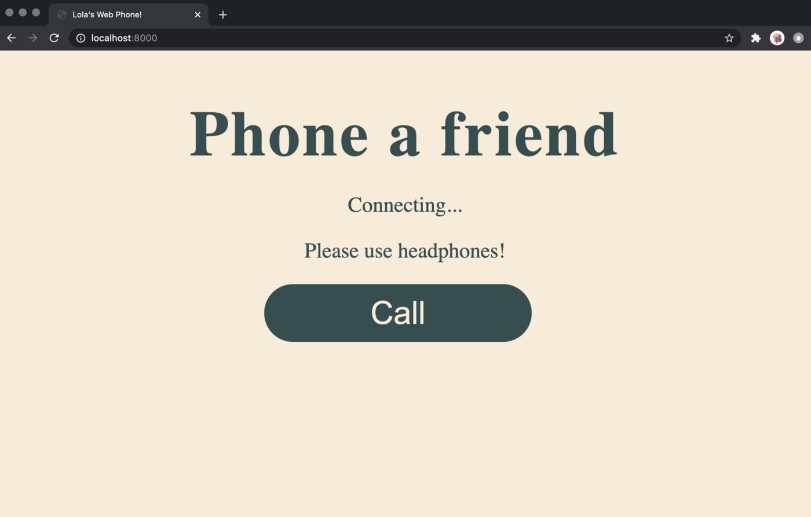

{{WebRTCSidebar}}

{{PreviousMenuNext("Web/API/WebRTC_API/Build_a_phone_with_peerjs/Setup", "Web/API/WebRTC_API/Build_a_phone_with_peerjs/Connect_peers")}}

In this article we'll set up the server for our phone app. The server file will look like a regular Express server file with one difference, the Peer server.

<ol>
  <li>
    
First of all, create a file called <code>server.js</code> in the same location as the HTML and CSS files you created previously. This is the entry point of our app, as defined in our <code>package.json</code> file.

  </li>
  <li>
    
You'll need to start your code by requiring the peer server at the top of the <code>server.js</code> file, to ensure that we have access to the peer server:

<pre class="brush: js">const {ExpressPeerServer} = require('peer');</pre>
  </li>
  <li>
    
You then need to actually create the peer server. Add the following code below your previous line:

<pre class="brush: js">const peerServer = ExpressPeerServer(server, {
    proxied: true,
    debug: true,
    path: '/myapp',
    ssl: {}
});</pre>

    
We use the <code>ExpressPeerServer</code> object to create the peer server, passing it some options in the process. The peer server will handle the signalling required for WebRTC for us, so we don't have to worry about STUN/TURN servers or other protocols.

  </li>
  <li>
    
Finally, you'll need to tell your app to use the <code>peerServer</code> by calling <code>app.use(peerServer)</code>. Your finished <code>server.js</code> should include the other necessary dependencies you’d include in a server file, as well as serving the <code>index.html</code> file to the root path.

    
Update <code>server.js</code> so that it looks like this:

<pre class="brush: js">const express = require("express");
const http = require('http');
const path = require('path');
const app = express();
const server = http.createServer(app);
const { ExpressPeerServer } = require('peer');
const port = process.env.PORT || "8000";

const peerServer = ExpressPeerServer(server, {
    proxied: true,
    debug: true,
    path: '/myapp',
    ssl: {}
});

app.use(peerServer);

app.use(express.static(path.join(__dirname)));

app.get("/", (request, response) =&gt; {
    response.sendFile(__dirname + "/index.html");
});

server.listen(port);
console.log('Listening on: ' + port);</pre>
  </li>
  <li>
    
You should be able to connect to your app via <code>localhost</code> (in our <code>server.js</code> we're using port 8000 (defined on line 7) but you may be using another port number). Run <code>node .</code> in your terminal and visit <code>localhost:8000</code> in your browser and you should see a page that looks like this:

    

  </li>
</ol>

 If you want to learn more about Peer.js, check out the <a href="https://github.com/peers/peerjs-server">Peer.js Server repo on GitHub</a>.

{{PreviousMenuNext("Web/API/WebRTC_API/Build_a_phone_with_peerjs/Setup", "Web/API/WebRTC_API/Build_a_phone_with_peerjs/Connect_peers")}}

