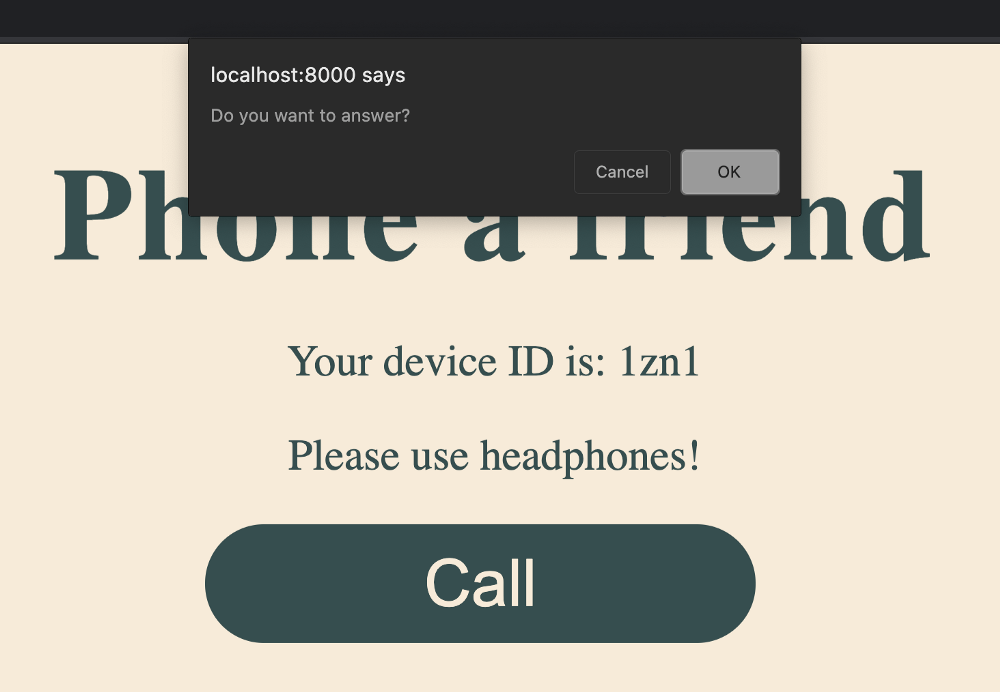

{{DefaultAPISidebar("WebRTC")}}

{{PreviousMenuNext("Web/API/WebRTC_API/Build_a_phone_with_peerjs/Connect_peers/Creating_a_call", "Web/API/WebRTC_API/Build_a_phone_with_peerjs/Connect_peers/End_a_call")}}

Now our users can make a call, but they can't answer one. Let's add the next piece of the puzzle so that users can answer calls made to them.

1. The peerJS framework makes the `.on('call')` event available to use so let's use it here. Add this to the bottom of `script.js`:

   ```js
   peer.on("call", (call) => {
     const answerCall = confirm("Do you want to answer?");
   });
   ```

   First, we prompt the user to answer with a confirm prompt. This will show a window on the screen (as shown in the image) from which the user can select "OK" or "Cancel" — this maps to a returned boolean value. When you press "Call" in your browser, the following prompt should appear:

   

   > [!WARNING]
   > Since we're using a `confirm` prompt to ask the user if they want to answer the call, it's important that the browser and tab that's being called is "active", which means the window shouldn't be minimized, and the tab should be on screen and have the mouse's focus somewhere inside it. Ideally, in a production version of this app you'd create your own modal window in HTML which wouldn't have these limitations.

2. Let's flesh out this event listener. Update it as follows:

   ```js
   peer.on("call", (call) => {
     const answerCall = confirm("Do you want to answer?");

     if (answerCall) {
       call.answer(window.localStream); // A
       showConnectedContent(); // B
       call.on("stream", (stream) => {
         // C
         window.remoteAudio.srcObject = stream;
         window.remoteAudio.autoplay = true;
         window.peerStream = stream;
       });
     } else {
       console.log("call denied"); // D
     }
   });
   ```

   Let's walk through the most important parts of this code:

   - `call.answer(window.localStream)`: if `answerCall` is `true`, you'll want to call peerJS's `answer()` function on the call to create an answer, passing it the local stream.
   - `showCallContent`: Similar to what you did in the call button event listener, you want to ensure the person being called sees the correct HTML content.
   - Everything in the `call.on('stream', () => { }` block is exactly the same as it is in call button's event listener. The reason you need to add it here too is so that the browser is also updated for the person answering the call.
   - If the person denies the call, we're just going to log a message to the console.

3. The code you have now is enough for you to create a call and answer it. Refresh your browsers and test it out. You'll want to make sure that both browsers have the console open or else you won't get the prompt to answer the call. Click call, submit the peer ID for the other browser and then answer the call. The final page should look like this:

   

{{PreviousMenuNext("Web/API/WebRTC_API/Build_a_phone_with_peerjs/Connect_peers/Creating_a_call", "Web/API/WebRTC_API/Build_a_phone_with_peerjs/Connect_peers/End_a_call")}}
