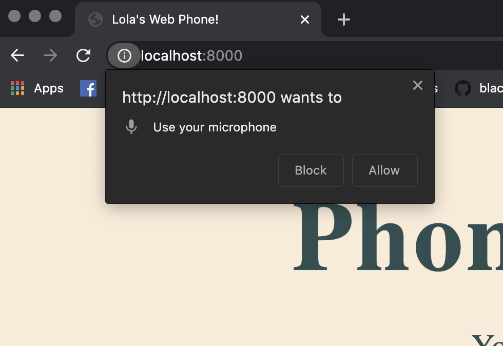

{{DefaultAPISidebar("WebRTC")}}

{{PreviousMenuNext("Web/API/WebRTC_API/build_a_phone_with_peerjs/connect_peers", "Web/API/WebRTC_API/Build_a_phone_with_peerjs/Connect_peers/Show_hide_html")}}

After you've created the peer, you'll want to get the browser's permission to access the microphone. We'll be using the [`getUserMedia()`](/en-US/docs/Web/API/MediaDevices/getUserMedia) method on the [`navigator.mediaDevices`](/en-US/docs/Web/API/Navigator/mediaDevices) object.
The `getUserMedia()` endpoint takes a `constraints` object that specifies which permissions are needed. `getUserMedia()` is a promise which, when successfully resolved, returns a [`MediaStream`](/en-US/docs/Web/API/MediaStream) object. In our case this is going to contain the audio from our stream. If the promise isn't successfully resolved, you'll want to catch and display the error.

1. Add the following code to the bottom of your `script.js` file:

   ```js
   function getLocalStream() {
     navigator.mediaDevices
       .getUserMedia({ video: false, audio: true })
       .then((stream) => {
         window.localStream = stream; // A
         window.localAudio.srcObject = stream; // B
         window.localAudio.autoplay = true; // C
       })
       .catch((err) => {
         console.error(`you got an error: ${err}`);
       });
   }
   ```

   Let's explain the most important lines:

   - `window.localStream = stream` attaches the `MediaStream` object (which we have assigned to `stream` on the previous line) to the window as the `localStream`.
   - `window.localAudio.srcObject = stream` sets the [`<audio>` element](/en-US/docs/Web/HTML/Element/audio) with the ID of `localAudio`'s `src` attribute to be the `MediaStream` returned by the promise so that it will play our stream.
   - `window.localAudio.autoplay = true` sets the `autoplay` attribute of the `<audio>` element to true, so that the audio plays automatically.

   > **Warning:** If you've done some sleuthing online, you may have come across [`navigator.getUserMedia`](/en-US/docs/Web/API/Navigator/getUserMedia) and assumed you can use that instead of `navigator.mediaDevices.getUserMedia`. You'd be wrong. The former is a deprecated method, which requires callbacks as well as constraints as arguments. The latter uses a promise so you don't need to use callbacks.

2. Try calling your `getLocalStream` function by adding the following line at the bottom of your code:

   ```js
   getLocalStream();
   ```

3. Refresh your app, which should still be running at `localhost:8000`; you should see the following permission pop up:

   

4. Plugin in some headphones before you allow the microphone usage so that when you unmute yourself later, you don't get any feedback. If you didn't see the permission prompt, open the inspector to see if you have any errors. Make sure your JavaScript file is correctly linked to your `index.html` too.

This what it should all look like together:

```js
/* global Peer */

/**
 * Gets the local audio stream of the current caller
 * @param callbacks - an object to set the success/error behavior
 * @returns {void}
 */

function getLocalStream() {
  navigator.mediaDevices
    .getUserMedia({ video: false, audio: true })
    .then((stream) => {
      window.localStream = stream;
      window.localAudio.srcObject = stream;
      window.localAudio.autoplay = true;
    })
    .catch((err) => {
      console.error(`you got an error: ${err}`);
    });
}

getLocalStream();
```

{{PreviousMenuNext("Web/API/WebRTC_API/Build_a_phone_with_peerjs/Connect_peers", "Web/API/WebRTC_API/Build_a_phone_with_peerjs/Connect_peers/Show_hide_html")}}
